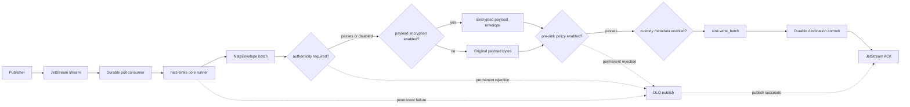
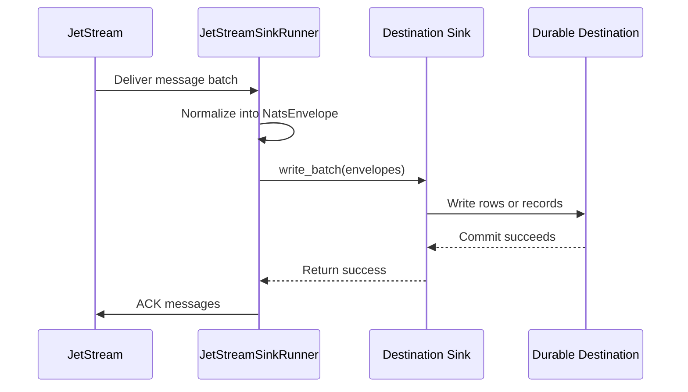
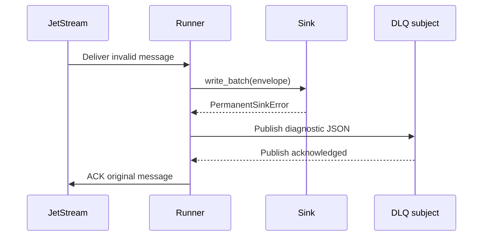

# nats-sinks

[](https://pypi.org/project/nats-sinks/)
[](https://pypi.org/project/nats-sinks/)
[](https://nats-sinks.readthedocs.io/en/latest/?badge=latest)
[](https://projectcuillin.github.io/nats-sinks/)

`nats-sinks` provides at-least-once delivery from JetStream to external destinations with commit-then-acknowledge processing and idempotent sink support.

The project repository is [ProjectCuillin/nats-sinks](https://github.com/ProjectCuillin/nats-sinks/). The current named contributor is Johan Louwers, reachable at [louwersj@gmail.com](mailto:louwersj@gmail.com).

## Overview

NATS is a lightweight messaging system used to move events between services.
JetStream is the persistence layer in NATS: it stores messages in streams and
delivers them to consumers. A sink is a consumer whose main job is to copy those
messages into another durable system, such as Oracle Database, Oracle
Autonomous Database on Oracle Cloud Infrastructure (OCI), or another approved
storage backend.

`nats-sinks` is a Python package for building outbound NATS JetStream sink consumers. It provides a reusable runtime that owns JetStream delivery semantics and delegates destination writes to sink implementations. The current production sinks are Oracle Database, including OCI-hosted Oracle Autonomous Database deployments, Oracle MySQL, local files, encrypted edge spool files, fixed HTTP endpoints, and S3-compatible object storage.

The project is intentionally suitable for mission-oriented environments such as
defence logistics, operational reporting, secure platform telemetry, and
sensor-driven operational data flows where event loss, premature
acknowledgement, and unclear audit trails are unacceptable. In defence and
national-security settings, `nats-sinks` can be used as the durable event
custody layer around command-and-control data fabrics, sensor-fusion pipelines,
platform telemetry, weapon-system status events, sensor-to-shooter workflows,
and kill-chain or kill-mesh style coordination messages. Its role is to
preserve and persist operational events safely. It is not a targeting system,
fire-control system, weapons-release mechanism, rules-of-engagement engine, or
automation layer for lethal decision-making. The language throughout the
documentation uses examples such as priority, classification, labels, DLQs, and
encrypted payloads because those concepts map naturally to environments that
must handle sensitive operational information with discipline.

The package is designed as a production-ready foundation rather than a demo script. It includes a typed public API, JSON configuration, a CLI, security-conscious defaults, tests, documentation, CI configuration, and packaging metadata suitable for publishing to PyPI.

The public documentation is prepared for Read the Docs at
[nats-sinks.readthedocs.io](https://nats-sinks.readthedocs.io/en/latest/) and a
GitHub Pages mirror at
[projectcuillin.github.io/nats-sinks](https://projectcuillin.github.io/nats-sinks/).
Read the Docs is the preferred versioned documentation site for package users.
GitHub Pages publishes the current `main` branch documentation after the
repository Pages source is set to `GitHub Actions`.

## Available Sinks

The production sink surface is intentionally small and explicit:

- [Oracle Database](https://nats-sinks.readthedocs.io/en/latest/oracle-sink/), including Oracle Autonomous Database on Oracle Cloud Infrastructure (OCI).
- [Oracle MySQL](https://nats-sinks.readthedocs.io/en/latest/mysql-sink/).
- [File](https://nats-sinks.readthedocs.io/en/latest/file-sink/) for local JSON records.
- [Edge Spool](https://nats-sinks.readthedocs.io/en/latest/spool-sink/) for encrypted disconnected custody and replay.
- [HTTP](https://nats-sinks.readthedocs.io/en/latest/http-sink/) for fixed, idempotent endpoints.
- [S3-Compatible Object Storage](https://nats-sinks.readthedocs.io/en/latest/s3-sink/).

Experimental and certification-stage sinks are available for evaluation, but
they should not be treated as production-certified until their documentation
says so:

- [Oracle NoSQL Database](https://nats-sinks.readthedocs.io/en/latest/oracle-nosql-sink/).
- [Oracle Coherence Community Edition](https://nats-sinks.readthedocs.io/en/latest/coherence-sink/).
- [Palantir Foundry](https://nats-sinks.readthedocs.io/en/latest/foundry-sink/) experimental sink.
- [Palantir Gotham](https://nats-sinks.readthedocs.io/en/latest/gotham-sink/) experimental sink.

See [Available Today](https://nats-sinks.readthedocs.io/en/latest/available-today/)
for the detailed capability inventory and maturity notes.

## Five-Minute Local MVP Demo

The quickest local demo uses Docker, NATS JetStream, and the file sink. It does
not require Oracle Database, a cloud account, a wallet, or secrets.

For a disposable developer demo on Debian, Ubuntu, or Oracle Linux with Docker,
Git, and Python `>=3.11` already installed:

```bash
curl -fsSL https://raw.githubusercontent.com/ProjectCuillin/nats-sinks/main/scripts/run-local-mvp-demo.sh | sh
```

For review-first environments, download and inspect the helper before running
it:

```bash
curl -fsSLO https://raw.githubusercontent.com/ProjectCuillin/nats-sinks/main/scripts/run-local-mvp-demo.sh
sh run-local-mvp-demo.sh
```

The helper clones the public repository into a temporary local demo directory,
creates an isolated Python environment, builds the Oracle Linux slim based
local image, starts a temporary NATS JetStream container, publishes demo
messages, runs `nats-sink`, and leaves the demo stack running by default so you
can inspect the generated file-sink output.

Manual host-only steps, expected output, cleanup commands, and troubleshooting
are documented in [Getting Started](https://nats-sinks.readthedocs.io/en/latest/getting-started/).

## Architecture



The core rule is:

> Core owns delivery semantics. Sinks own destination writes.

Sinks never receive raw NATS messages. Sinks never ACK messages. The core runtime converts raw messages into `NatsEnvelope` instances, calls the sink, and ACKs only after durable success.

## Commit-Then-Acknowledge

The project invariant is:

> A JetStream message must only be acknowledged after all required durable side effects have completed successfully. ACK is the final confirmation of successful processing, never a prerequisite for processing.

Short slogan:

> Commit first. ACK last. Design for redelivery.

The normal processing sequence is:



If the sink fails before durable commit, the core does not ACK. If commit succeeds but the process exits before ACK, JetStream may redeliver the message. That is expected and must be handled by idempotency.

## Status

The current release is `0.4.2`. Active development is staged for `v0.4.3` on
the release branch. See
[Project Status](https://nats-sinks.readthedocs.io/en/latest/project-status/)
for maturity, release, and certification notes.

## Available Today

The detailed runtime, CLI, sink, observability, security, deployment, and test
capability inventory lives in
[Available Today](https://nats-sinks.readthedocs.io/en/latest/available-today/).
The short version: `nats-sinks` provides at-least-once JetStream delivery,
commit-then-ACK processing, idempotent sink support, JSON configuration, CLI
validation, metrics snapshots, and a small set of first-party sinks.
Mission-support operational examples remain directly available through
[Mission-Support Operational Examples](https://github.com/ProjectCuillin/nats-sinks/blob/main/docs/use-cases/mission-support/index.md).

## Installation

```bash
pip install nats-sinks
pip install "nats-sinks[oracle]"
pip install "nats-sinks[crypto]"
pip install "nats-sinks[dev]"
pip install "nats-sinks[docs]"
pip install "nats-sinks[all]"
```

Python `>=3.11` is required.

## JSON Configuration

Runtime configuration is JSON-only. The package uses the standard-library JSON parser for application configuration.
The generic `nats`, `delivery`, `dead_letter`, `logging`, and `metrics`
sections are shared by all sinks. The `sink` object selects the destination and
contains destination-specific fields documented on each sink page. The optional
`sinks` object declares additional named destination instances, such as
`oracle_secret`, `oracle_unclass`, or `file_audit`, so route policy can refer to
stable names while Oracle connection details and file paths stay in sink
definitions.

```json
{
  "nats": {
    "url": "nats://localhost:4222",
    "urls": [],
    "stream": "ORDERS",
    "consumer": "file-orders-sink",
    "subject": "orders.*",
    "durable": true,
    "no_echo": false,
    "allow_reconnect": true,
    "reconnect_time_wait_seconds": 2,
    "max_reconnect_attempts": 60
  },
  "delivery": {
    "batch_size": 100,
    "batch_timeout_ms": 1000,
    "max_in_flight_batches": 1,
    "ack_policy": "after_sink_commit",
    "max_retries": 5,
    "retry_backoff_ms": 1000,
    "retry_backoff_max_ms": 60000,
    "retry_backoff_mode": "exponential",
    "retry_backoff_multiplier": 2.0,
    "retry_jitter": "full",
    "prefer_safe_duplication": true,
    "in_progress": {
      "enabled": false,
      "interval_ms": 5000,
      "max_heartbeats": 12,
      "shutdown_timeout_ms": 5000
    }
  },
  "dead_letter": {
    "enabled": true,
    "subject": "orders.dlq",
    "include_payload": true,
    "include_headers": true,
    "include_error": true,
    "ack_term_after_publish": false
  },
  "logging": {
    "level": "INFO",
    "payload_logging": false
  },
  "metrics": {
    "enabled": false,
    "namespace": "nats_sinks",
    "snapshot_file": null,
    "event_freshness_enabled": true,
    "event_stale_after_seconds": 300,
    "event_future_skew_tolerance_seconds": 5
  },
  "message_metadata": {
    "priority": {
      "header": "Nats-Sinks-Priority",
      "default": "normal"
    },
    "classification": {
      "header": "Nats-Sinks-Classification",
      "default": null
    }
  },
  "encryption": {
    "enabled": false,
    "algorithm": "aes-256-gcm",
    "key_id": "orders-runtime-key",
    "key_b64_env": "NATS_SINKS_PAYLOAD_KEY_B64"
  },
  "sink": {
    "type": "file",
    "directory": ".local/file-sink/events",
    "filename_strategy": "stream_sequence",
    "duplicate_policy": "skip_existing",
    "payload_mode": "json_or_envelope",
    "fsync": true
  }
}
```

Secret values should come from the environment or a secret manager. Use
environment-backed fields such as `password_env` and `token_env` rather than
storing credentials in config files.

To write a local dependency-free metrics snapshot, enable metrics and set a
snapshot path:

```json
{
  "metrics": {
    "enabled": true,
    "namespace": "nats_sinks",
    "snapshot_file": ".local/nats-sinks/metrics.json",
    "event_freshness_enabled": true,
    "event_stale_after_seconds": 300,
    "event_future_skew_tolerance_seconds": 5
  }
}
```

Inspect the snapshot from another terminal:

```bash
nats-sink-metrics show .local/nats-sinks/metrics.json --format table
nats-sink-metrics show .local/nats-sinks/metrics.json --format shell --kind counter
nats-sink-metrics show .local/nats-sinks/metrics.json --metric "oracle_*"
nats-sink-metrics show .local/nats-sinks/metrics.json --metric "mysql_*"
nats-sink-metrics show .local/nats-sinks/metrics.json --metric "event_*" --metric "events_*"
nats-sink-metrics get .local/nats-sinks/metrics.json messages_failed_total --default 0
```

The metrics CLI is documented in
[Metrics](https://nats-sinks.readthedocs.io/en/latest/metrics/).
Policy-controlled Prometheus and OpenTelemetry export are part of the
observability documentation, including the Elastic Observability and Grafana
Alloy profiles, Splunk HEC connector, OCI Monitoring connector, StatsD
connector, Datadog connector, Amazon CloudWatch connector, Azure Monitor
connector, and syslog bridge.
Start with
[Observability](https://nats-sinks.readthedocs.io/en/latest/observability/),
then use
[Prometheus Integration](https://nats-sinks.readthedocs.io/en/latest/prometheus/),
[OpenTelemetry OTLP Integration](https://nats-sinks.readthedocs.io/en/latest/otlp/),
[Elastic Observability Profile](https://nats-sinks.readthedocs.io/en/latest/elastic-observability/),
or
[Grafana Alloy Profile](https://nats-sinks.readthedocs.io/en/latest/grafana-alloy/),
or
[Splunk HEC Integration](https://nats-sinks.readthedocs.io/en/latest/splunk-hec/),
or
[OCI Monitoring Integration](https://nats-sinks.readthedocs.io/en/latest/oci-monitoring/),
or
[StatsD Integration](https://nats-sinks.readthedocs.io/en/latest/statsd/),
or
[Datadog Integration](https://nats-sinks.readthedocs.io/en/latest/datadog/),
or
[Amazon CloudWatch Integration](https://nats-sinks.readthedocs.io/en/latest/cloudwatch/),
or
[Azure Monitor Integration](https://nats-sinks.readthedocs.io/en/latest/azure-monitor/),
or
[Syslog Bridge](https://nats-sinks.readthedocs.io/en/latest/syslog/)
for connector details.
The NATS server monitoring connector and delivery-boundary decision for
endpoints such as `/jsz` and `/healthz` are documented in
[NATS Server Monitoring](https://nats-sinks.readthedocs.io/en/latest/nats-server-monitoring/).
Optional JetStream advisory counters are configured through
[Configuration](https://nats-sinks.readthedocs.io/en/latest/configuration/#advisories)
and documented in
[Metrics](https://nats-sinks.readthedocs.io/en/latest/metrics/#jetstream-advisory-metrics).
Durable consumer startup behavior is documented under
[consumer_management](https://nats-sinks.readthedocs.io/en/latest/configuration/#consumer_management).

## Payload Bodies

NATS message bodies are bytes. The generic framework accepts bytes and does not
require JSON at the core boundary. Sinks that store data in JSON-capable
destinations can use the shared payload normalization contract for JSON,
encrypted text, plain text, and opaque bytes.

The default `payload_mode` is `json_or_envelope`:

- standards-compliant JSON is stored unchanged,
- non-JSON UTF-8 text is wrapped in a JSON envelope,
- non-text bytes are wrapped as base64 in the same JSON envelope.

Python-only JSON constants such as `NaN`, `Infinity`, and `-Infinity` are not
treated as valid JSON. In `json_or_envelope` mode they are preserved as text in
the payload envelope; in `json_only` mode they are permanent serialization
failures that can follow the configured DLQ path.

For encrypted text streams where the ciphertext may or may not decrypt to JSON
later, use `payload_mode: "text_envelope"` to wrap every body as text and avoid
unnecessary JSON parse attempts.

```json
{
  "sink": {
    "type": "file",
    "directory": ".local/file-sink/events",
    "payload_mode": "text_envelope"
  }
}
```

See [Sink Framework](https://nats-sinks.readthedocs.io/en/latest/sink-framework/) and
[File Sink](https://nats-sinks.readthedocs.io/en/latest/file-sink/) for the JSON envelope shape and operational
guidance. Oracle-specific payload storage is documented in
[Oracle Sink](https://nats-sinks.readthedocs.io/en/latest/oracle-sink/).

## Message Authenticity

The core runner can verify producer-level message signatures before the
envelope reaches any sink. This is different from NATS authentication and TLS:
those controls protect broker access and network transport, while message
authenticity proves that the message body and selected metadata were signed by
an approved producer key.

Supported algorithms are HMAC-SHA256 and Ed25519. Rules can apply to every
subject or to selected NATS wildcard subject families:

```json
{
  "message_authenticity": {
    "enabled": true,
    "unmatched_subject_action": "reject",
    "rules": [
      {
        "subject": "mission.>",
        "algorithm": "hmac-sha256",
        "key_id": "producer-key-2026-05",
        "key_b64_env": "NATS_SINKS_AUTHENTICITY_KEY_B64",
        "signed_fields": ["subject", "message_id"]
      }
    ]
  }
}
```

Verification failures are permanent pre-sink failures. The message never
reaches Oracle, file, spool, or future sinks. If DLQ is configured, the
original JetStream message is ACKed only after the DLQ publish succeeds.

See [Message Authenticity](https://nats-sinks.readthedocs.io/en/latest/message-authenticity/)
for the canonical signed document, producer examples, Ed25519 guidance, metrics,
and DLQ behavior.

## Payload Encryption

The core runner can encrypt the message body before sending an envelope to any
sink. This protects the actual payload stored by Oracle, file, and future
sinks, while leaving operational metadata such as subject, headers, stream
sequence, message IDs, and timestamps readable for routing and idempotency.

Supported algorithms are AES-256-GCM and AES-256-CCM through the optional
`nats-sinks[crypto]` extra. Encryption can apply to every subject consumed by
the runner or to selected subjects through ordered NATS wildcard rules:

```json
{
  "encryption": {
    "enabled": true,
    "algorithm": "aes-256-gcm",
    "key_id": "orders-prod-2026-05",
    "key_b64_env": "NATS_SINKS_PAYLOAD_KEY_B64"
  }
}
```

For subject-specific encryption, leave the global policy disabled and add
rules. The first matching rule wins; subjects with no matching rule remain
unchanged in this example:

```json
{
  "encryption": {
    "enabled": false,
    "rules": [
      {
        "subject": "secure.>",
        "enabled": true,
        "algorithm": "aes-256-gcm",
        "key_id": "secure-prod-2026-05",
        "key_b64_env": "NATS_SINKS_SECURE_PAYLOAD_KEY_B64"
      }
    ]
  }
}
```

Use stable metadata-based idempotency such as stream sequence or message ID
when encryption is enabled. Ciphertext is intentionally non-deterministic
because each encryption uses a fresh nonce.

See [Payload Encryption](https://nats-sinks.readthedocs.io/en/latest/payload-encryption/)
for the full configuration reference, encrypted JSON envelope shape, testing
script, and decryption helper.

## Metadata Capture

`nats-sinks` captures a generic metadata JSON document for every message. This
is available to all current and future sinks through `NatsEnvelope`.

The metadata document preserves all message headers, known NATS-reserved
headers when present, unknown future `Nats-` headers, JetStream stream and
sequence metadata, optional reply subject, and timing fields. Optional headers
such as `Nats-Msg-Id` or `Nats-Expected-Stream` may be absent; that is normal
and does not cause a crash. Destination sinks can store this document directly
or map selected fields into destination-specific columns.

The core also normalizes three application-level metadata fields on every
message: `priority`, `classification`, and `labels`. They can be supplied by
NATS headers such as `Nats-Sinks-Priority`, `Nats-Sinks-Classification`, and
`Nats-Sinks-Labels`, configured with deployment defaults, configured with
ordered subject-specific defaults, or left unset. Headers always win when
present; subject defaults are used only when the corresponding header is
absent. Missing priority and classification values are stored as JSON `null` or
SQL `NULL`, not as the literal string `"null"`. Labels are normalized as a list
and are stored in scalar sink fields as semicolon-separated text.

Classification and priority values are operator-defined strings. The
documentation uses NATO-style examples such as `NATO UNCLASSIFIED`,
`NATO RESTRICTED`, `NATO CONFIDENTIAL`, `NATO SECRET`, and
`COSMIC TOP SECRET`; use the exact vocabulary required by your environment.

```json
{
  "message_metadata": {
    "priority": {
      "header": "Nats-Sinks-Priority",
      "default": "routine"
    },
    "classification": {
      "header": "Nats-Sinks-Classification",
      "default": "NATO UNCLASSIFIED"
    },
    "labels": {
      "header": "Nats-Sinks-Labels",
      "default": "logistics;default"
    },
    "rules": [
      {
        "subject": "mission.reports.>",
        "priority": "immediate",
        "classification": "NATO SECRET",
        "labels": "mission-report;coalition;watch-floor"
      }
    ]
  }
}
```

With the file sink, these values appear as top-level JSON fields such as
`"priority": "immediate"`, `"classification": "NATO SECRET"`, `"labels":
"mission-report;coalition;watch-floor"`, and `"labels_list":
["mission-report", "coalition", "watch-floor"]`. With Oracle, the same values
are stored in `PRIORITY`, `CLASSIFICATION`, and `LABELS` columns and repeated
inside `METADATA_JSON.message_metadata`.

For richer data-centric policy context, enable `security_labels`. The profile
is optional and metadata-only. It can help downstream systems reason about
releasability, handling caveats, owner, originator, policy identifiers, and
retention categories, but it does not replace authorization in Oracle, IAM, or
the destination platform.

```json
{
  "security_labels": {
    "enabled": true,
    "allowed_classifications": [
      "NATO UNCLASSIFIED",
      "NATO RESTRICTED",
      "NATO CONFIDENTIAL",
      "NATO SECRET"
    ],
    "default": {
      "profile": "nats-sinks.security-label.v1",
      "classification": "NATO RESTRICTED",
      "releasability": ["NATO"],
      "handling_caveats": ["MISSION"],
      "owner": "example-owner",
      "originator": "example-originator",
      "policy_id": "example-policy",
      "retention_category": "mission-log-30d"
    }
  }
}
```

With the file sink, the profile appears as top-level `security_labels` and
inside `metadata.security_labels`. With Oracle, the profile is stored in
`SECURITY_LABELS_JSON` and repeated inside `METADATA_JSON.security_labels`.

## NATS Connections

`nats-sinks` supports common NATS client authentication options through the
`nats` JSON section:

- token authentication with `token_env` or `token`,
- username/password authentication with `user` and `password_env` or `password`,
- server-side bcrypted username/password credentials using the same client-side
  `user` and `password_env` settings,
- NATS credentials-file and decentralized JWT user workflows through
  `creds_file`,
- NKEY challenge authentication through `nkey_seed_file`,
- TLS server verification with `tls_ca_file`, including private or self-signed
  NATS server CAs,
- TLS client certificate/key transport settings for mutual TLS deployments,
- optional `no_echo` connection behavior for reviewed same-connection
  publish/subscribe policies.

Do not embed credentials in `nats.url`; use environment-backed fields instead.
See [NATS Connections And Authentication](https://nats-sinks.readthedocs.io/en/latest/nats-connections/) for
configuration examples and secure deployment notes.

Authentication is only half of the production story. The NATS runtime account
should also have least-privilege subject permissions: fetch from the configured
pull consumer, receive inbox replies, ACK received messages after durable sink
success, and publish to the configured DLQ subject only when DLQ is enabled.
See [NATS Least-Privilege Permissions](https://nats-sinks.readthedocs.io/en/latest/nats-permissions/) for
templates and validation checklists.

For stream setup review, `nats-sink stream-plan` can generate an offline
JetStream planning report for retention, discard policy, storage, replicas,
duplicate-window settings, and runtime versus administration permissions. It
does not connect to NATS or modify stream state. See
[JetStream Stream Management Planning](https://nats-sinks.readthedocs.io/en/latest/stream-management/).

## CLI

```bash
nats-sink --help
nats-sink validate examples/file-basic/config.json
nats-sink test-sink examples/file-basic/config.json
nats-sink validate examples/routing-match-policy/config.json
nats-sink validate examples/named-multi-sink/config.json
nats-sink test-sink examples/named-multi-sink/config.json --sink-name file_audit
nats-sink validate examples/oracle-jetstream/config.json
nats-sink show-effective-config examples/oracle-jetstream/config.json
nats-sink stream-plan examples/oracle-jetstream/config.json
nats-sink inspect-ordered examples/file-basic/config.json --max-messages 5 --format jsonl
nats-sink query-lineage examples/oracle-jetstream/config.json --field mission_id --value MISSION-ALPHA --dry-run
nats-sink test-sink examples/oracle-jetstream/config.json
nats-sink run examples/oracle-jetstream/config.json
nats-sink-metrics show .local/nats-sinks/metrics.json --format table
nats-sink-metrics show .local/nats-sinks/metrics.json --metric "oracle_*"
nats-sink-metrics show .local/nats-sinks/metrics.json --metric "event_*" --metric "events_*"
nats-sink-metrics get .local/nats-sinks/metrics.json messages_failed_total --default 0
nats-sink-observe init-prometheus-policy examples/file-basic/config.json .local/observability.prometheus.json
nats-sink-observe validate-policy .local/observability.prometheus.json
```

The CLI:

- returns non-zero on validation or runtime errors,
- prints the active sink type,
- prints the commit-then-acknowledge ACK policy,
- renders effective configuration as redacted JSON,
- never prints resolved passwords.

Read-only Oracle lineage query helpers are documented in
[Lineage Query Helpers](https://nats-sinks.readthedocs.io/en/latest/lineage-query-helpers/).

The metrics CLI reads only a local JSON snapshot written by the runner when
`metrics.enabled` and `metrics.snapshot_file` are configured. It supports
table, JSON, JSONL, shell, names, and Prometheus text output so developers can
pipe results into service checks and scripts. Oracle Database
duplicate/conflict counters are visible through the same command with
`--metric "oracle_*"`, and Oracle MySQL duplicate/upsert counters are visible
with `--metric "mysql_*"`.
Event freshness and staleness metrics are visible with `--metric "event_*"`
and `--metric "events_*"` when metrics are enabled. See
[Metrics](https://nats-sinks.readthedocs.io/en/latest/metrics/) for examples.

The observability CLI manages external sharing policy. It can generate a
disabled Prometheus policy from runtime config, list known metric names and
subject hints, validate the policy, write policy-filtered Prometheus textfile
output, run a disabled-by-default native Prometheus HTTP endpoint, and export
approved metrics to an OpenTelemetry Collector through OTLP/HTTP JSON,
including Elastic Observability and Grafana Alloy profiles that reuse the shared
OTLP core, approved aggregate metric export to Splunk HEC, OCI Monitoring
custom metric export, and best-effort StatsD, Datadog DogStatsD, Amazon
CloudWatch, Azure Monitor, and syslog export.
Metrics sharing remains off until the global policy and the selected connector
are explicitly enabled. See
[Observability](https://nats-sinks.readthedocs.io/en/latest/observability/),
[Prometheus Integration](https://nats-sinks.readthedocs.io/en/latest/prometheus/),
[OpenTelemetry OTLP Integration](https://nats-sinks.readthedocs.io/en/latest/otlp/),
and the
[Elastic Observability Profile](https://nats-sinks.readthedocs.io/en/latest/elastic-observability/)
or
[Grafana Alloy Profile](https://nats-sinks.readthedocs.io/en/latest/grafana-alloy/)
or
[Splunk HEC Integration](https://nats-sinks.readthedocs.io/en/latest/splunk-hec/)
or
[OCI Monitoring Integration](https://nats-sinks.readthedocs.io/en/latest/oci-monitoring/)
or
[StatsD Integration](https://nats-sinks.readthedocs.io/en/latest/statsd/)
or
[Datadog Integration](https://nats-sinks.readthedocs.io/en/latest/datadog/)
or
[Amazon CloudWatch Integration](https://nats-sinks.readthedocs.io/en/latest/cloudwatch/)
or
[Azure Monitor Integration](https://nats-sinks.readthedocs.io/en/latest/azure-monitor/)
or
[Syslog Bridge](https://nats-sinks.readthedocs.io/en/latest/syslog/)
for connector guidance.

## Python API

You can use `nats-sinks` directly from another Python project without shelling
out to the CLI. The recommended integration point is the public framework API:

```python
from nats_sinks import JetStreamSinkRunner
from nats_sinks.file import FileSink

sink = FileSink(
    directory="/var/lib/nats-sinks/events",
    filename_strategy="stream_sequence",
    duplicate_policy="skip_existing",
)

runner = JetStreamSinkRunner(
    nats_url="nats://localhost:4222",
    stream="ORDERS",
    consumer="orders-file-sink",
    subject="orders.*",
    sink=sink,
)

await runner.run()
```

You can also mount the Typer CLI into another Typer application:

```python
import typer
from nats_sinks.cli.main import app as nats_sink_cli

app = typer.Typer()
app.add_typer(nats_sink_cli, name="nats-sink")
```

See [Python Usage](https://nats-sinks.readthedocs.io/en/latest/python-usage/) for embedded application patterns and
the tradeoff between using the public runtime API and importing CLI internals.

Documented imports and CLI entry points are protected by public API
compatibility tests. See
[Public API Compatibility](https://nats-sinks.readthedocs.io/en/latest/public-api/)
for the supported import contract and release guard.

## Production Sinks

Destination-specific details are split into dedicated pages:

- [Oracle Sink](https://nats-sinks.readthedocs.io/en/latest/oracle-sink/)
  covers Oracle connection types, Autonomous Database, table DDL,
  least-privilege users, idempotent write modes, subject-to-table routing,
  payload storage, metadata columns, and Oracle-specific performance guidance.
- [Oracle MySQL Sink](https://nats-sinks.readthedocs.io/en/latest/mysql-sink/)
  covers Oracle MySQL connection settings, TLS CA files, recommended table
  DDL, least-privilege users, idempotent `upsert` and `insert_ignore` modes,
  subject-to-table routing, payload storage, metadata columns, and the local
  container-backed e2e test.
- [Oracle NoSQL Database Sink](https://nats-sinks.readthedocs.io/en/latest/oracle-nosql-sink/)
  covers Oracle NoSQL Database SDK modes, K/V-style table shape, deterministic
  keys, conditional duplicate policies, generated safe DDL, JSON value storage,
  and live test gating.
- [Oracle Coherence Community Edition Sink](https://nats-sinks.readthedocs.io/en/latest/coherence-sink/)
  covers Coherence cache and map configuration, deterministic key strategies,
  duplicate policies, JSON value storage, value limits, and local
  container-backed e2e testing.
- [File Sink](https://nats-sinks.readthedocs.io/en/latest/file-sink/) covers
  local file output, atomic write behavior, deterministic file names, duplicate
  policies, gzip compression, filesystem safety, and file-specific performance
  guidance.
- [HTTP Sink](https://nats-sinks.readthedocs.io/en/latest/http-sink/) covers
  fixed endpoint forwarding, HTTPS validation, safe headers, idempotency-key
  propagation, bounded responses, and retry guidance.
- [S3-Compatible Object Sink](https://nats-sinks.readthedocs.io/en/latest/s3-sink/)
  covers bucket and prefix validation, deterministic object-key strategies,
  conditional duplicate handling, metadata sidecars, optional gzip
  compression, credential modes, and least-privilege object-storage guidance.
- [Named Sinks And Routing](https://nats-sinks.readthedocs.io/en/latest/named-sinks/)
  covers declaring several destination instances in one configuration file,
  validating route target references, redacted review output, and named sink
  health checks.
- [Edge Spool Sink](https://nats-sinks.readthedocs.io/en/latest/spool-sink/)
  covers encrypted local custody for disconnected operation, bounded spool
  directories, deterministic duplicate handling, priority-aware replay, and
  forwarding into a final destination sink.

The generic sink framework is documented separately in
[Sink Framework](https://nats-sinks.readthedocs.io/en/latest/sink-framework/)
and the reusable release gate is documented in
[Sink Certification](https://nats-sinks.readthedocs.io/en/latest/sink-certification/).
That boundary is deliberate: Oracle Database, Oracle MySQL, Oracle Coherence
Community Edition, file, spool, HTTP, and S3 sinks use the same core delivery
semantics, the same envelope contract, and the same commit-then-acknowledge
rule. Future sinks must provide comparable certification evidence before they
are described as production-ready.

Generic data-handling features such as
[payload encryption](https://nats-sinks.readthedocs.io/en/latest/payload-encryption/),
[tamper-evident custody metadata](https://nats-sinks.readthedocs.io/en/latest/tamper-evident-custody/),
[mission metadata](https://nats-sinks.readthedocs.io/en/latest/mission-metadata/),
and [priority lanes](https://nats-sinks.readthedocs.io/en/latest/priority-lanes/)
are documented separately from sink-specific pages so new sinks can adopt them
without changing the public delivery contract.

## Failure Behavior



Important failure cases:

- destination write or commit fails: no ACK, message redelivers according to
  the JetStream consumer policy,
- destination commit succeeds and the process crashes before ACK: message may
  redeliver, so sink idempotency must handle the duplicate,
- payload is permanently invalid for the selected sink: message is published to
  DLQ when configured, then the original is ACKed only after DLQ publish
  succeeds,
- message authenticity verification rejects a missing, malformed, mismatched,
  or invalid signature: the message does not reach a sink, and the original is
  ACKed only after DLQ publish succeeds when DLQ is configured,
- DLQ publish fails: original message is not ACKed.

## Security Notes

- Do not store secrets in repository files.
- Do not log payloads by default.
- Do not log passwords, tokens, private keys, NATS credentials, Oracle credentials, or full connection strings.
- SQL identifiers are allow-list validated.
- SQL values use bind variables.
- Unit tests must not make network calls.
- Integration tests are isolated behind markers.
- Use TLS and authenticated NATS connections in production.
- Use least-privilege NATS permissions for the sink runtime account; avoid
  broad publish, broad subscribe, stream administration, and source-subject
  publish rights for ordinary workers.
- Use core payload encryption when destination storage should retain encrypted
  message bodies while keeping routing metadata available.
- Use message authenticity verification when broker authentication and TLS are
  not enough to prove producer-level event provenance.
- Use tamper-evident custody metadata when operators need deterministic hashes
  for later verification, and remember that hashes are not encryption.
- Use least-privilege destination credentials with access only to the required
  destination resources.

## Development

```bash
python -m pip install -e ".[dev,oracle,mysql,crypto,docs]"
ruff format --check .
ruff check .
mypy src
pytest
python -m build
python scripts/update-dependency-manifests.py --check
scripts/sbom.sh
twine check dist/*.whl dist/*.tar.gz
```

Run only unit tests:

```bash
pytest -m "not integration"
```

Build documentation:

```bash
scripts/check-docs.sh
```

The docs helper builds the Read the Docs and GitHub Pages variants in isolated
temporary directories. That prevents overlapping MkDocs runs from cleaning the
same `site/` directory.

The local sink certification suite remains Docker-free by default:

```bash
scripts/check-sinks.sh
```

To include the container-backed Oracle NoSQL Database and Oracle Coherence
Community Edition sink e2e flows in the same local check pass, install the
optional backend clients and enable the explicit container gate:

```bash
python -m pip install -e ".[coherence,oracle-nosql]"
NATS_SINKS_RUN_CONTAINER_E2E=1 scripts/check-sinks.sh
```

Manual live NATS connection testing is documented in
[NATS Connections And Authentication](https://nats-sinks.readthedocs.io/en/latest/nats-connections/) and
[Testing](https://nats-sinks.readthedocs.io/en/latest/testing/). The tracked helper script is
`scripts/nats-live-probe.py`; real CA files and credentials should stay under
ignored `.local/` paths.

The latest sanitized validation summary is maintained in
[Latest Test Report](https://nats-sinks.readthedocs.io/en/latest/test-report/). That report is overwritten in place
for each new validation run and must not contain server addresses, usernames,
passwords, tokens, certificate contents, wallet material, connection strings,
or sensitive payloads.

To run `nats-sink` as a systemd service on Oracle Linux or Debian, see
[Service Deployment](https://nats-sinks.readthedocs.io/en/latest/service-deployment/). The repository includes
example service files under `examples/systemd/` and a unified OS-detecting
installer at `scripts/install-systemd.sh`. The documented one-command
installer downloads the script from
[ProjectCuillin/nats-sinks](https://github.com/ProjectCuillin/nats-sinks/) and
runs it with `sudo`. When the script is not running inside a checkout, it
fetches the required example configuration files and systemd unit files from
the selected GitHub ref. Production operators should pin a release tag and
inspect the script first when policy requires reviewed installation steps.

Kubernetes deployment guidance is documented in
[Kubernetes Deployment](https://nats-sinks.readthedocs.io/en/latest/kubernetes/).
The tracked examples under `examples/kubernetes/` are public-safe starting
points that operators must customize before use.

Release and PyPI publishing instructions are documented in
[Publishing Releases](https://nats-sinks.readthedocs.io/en/latest/publishing/). That guide covers version updates,
tag pushes, GitHub release workflows, TestPyPI, PyPI trusted publishing, and
manual fallback commands.

Development now follows a branch-first release workflow. Maintainers should
create `release-*`, `feature-*`, `bugfix-*`, or `hotfix-*` branches, push
small changes to those branches, and merge to `main` only through reviewed
pull requests. See
[Branch-First Development And Release Workflow](https://nats-sinks.readthedocs.io/en/latest/branch-workflow/)
for the quiet-branch policy, manual release validation, branch protection,
pull request, and release-tag rules.

Backlog and feature-request workflow is documented in
[Backlog Management](https://nats-sinks.readthedocs.io/en/latest/backlog-management/).
GitHub Issues are the live backlog; `CHANGELOG.md` records work that has
shipped or is staged for the next release. Maintainers can define local
backlog items as JSON files under `backlog/items/` and sync them to GitHub
Issues with `scripts/sync-backlog-issues.py` or the `Backlog Sync` GitHub
Actions workflow. The backlog tooling also validates target-release labels and
rejects common public-leak patterns such as network locators, IP literals,
credential assignments, token-like values, and certificate blocks before
content is posted to GitHub Issues. Issue lifecycle tooling supports the
standard maintainer flow: assign the issue, post a sanitized implementation
plan, apply the release label, post sanitized test-plan and close-out evidence,
tick acceptance criteria, and leave the issue open until release automation
closes it after the associated GitHub Release exists.

Dependency inventory guidance is documented in
[Dependency Management](https://nats-sinks.readthedocs.io/en/latest/dependency-management/).
`pyproject.toml` is the authoritative package metadata, and generated
`requirements*.txt` manifests are kept in sync for GitHub Dependency Graph,
Dependabot, and dependency review workflows.

Hash-verified installation guidance for controlled deployment environments is
documented in
[Hash-Verified Installs](https://nats-sinks.readthedocs.io/en/latest/hash-verified-installs/).

## Repository Layout

```text
src/nats_sinks/core      Core runtime, config, envelope, runner, DLQ
src/nats_sinks/sinks     Sink protocols and registry
src/nats_sinks/oracle    Oracle sink implementation
src/nats_sinks/mysql     Oracle MySQL sink implementation
src/nats_sinks/http      HTTP sink implementation
src/nats_sinks/s3        S3-compatible object sink implementation
src/nats_sinks/file      Local file sink implementation
src/nats_sinks/cli       CLI entry point
tests/unit               Deterministic unit tests
tests/integration        External-service and local end-to-end tests
docs                     MkDocs documentation
examples                 Local development examples
```

## Roadmap

Future work is intentionally listed near the end of the README so new readers
first see what the package can do today. Planned items are not production
features until they are implemented, tested, documented, and released.

Phase 1:

- Core runtime.
- Oracle sink.
- Oracle MySQL sink.
- File sink.
- HTTP sink for fixed endpoint forwarding with idempotency-key propagation.
- S3-compatible object sink with deterministic object keys and conditional
  duplicate handling.
- NATS reconnect tuning and connection event metrics.
- WebSocket connection guardrails, optional headers, and local certification
  harness.
- Policy-controlled Prometheus textfile export and optional native Prometheus
  HTTP scrape endpoint as separate observability services.
- Policy-controlled OpenTelemetry OTLP metrics export to an OpenTelemetry
  Collector as a separate observability command or service.
- Disabled-by-default Elastic Observability and Grafana Alloy profiles over the
  shared OTLP observability core.
- Disabled-by-default Splunk HEC connector for approved aggregate metrics in
  security operations and incident-response environments.
- Disabled-by-default OCI Monitoring connector for approved Oracle Cloud
  Infrastructure custom metrics.
- Disabled-by-default StatsD connector for approved best-effort UDP or Unix
  datagram metric export.
- Disabled-by-default Datadog DogStatsD connector for approved best-effort
  Agent-bound metric datagrams with explicit low-cardinality tag controls.
- Disabled-by-default Amazon CloudWatch connector for approved custom metrics
  through the optional AWS SDK path.
- Disabled-by-default Azure Monitor connector for approved custom metrics
  through a bounded REST path and environment-backed bearer-token reference.
- Disabled-by-default syslog bridge for approved bounded RFC 5424-style metric
  messages over UDP or Unix datagram sockets.
- Disabled-by-default NATS server monitoring connector for approved endpoint
  fields, implemented outside the delivery worker.
- Kubernetes deployment examples with worker/observability separation,
  security contexts, resource limits, graceful shutdown settings, and Secret
  references.
- Least-privilege NATS permissions templates for runtime workers, DLQ publish
  rights, optional consumer management, and advisory readers.
- Offline JetStream stream-management planning helper for retention, discard,
  storage, replicas, duplicate-window, and permission review.
- Advanced JetStream topology guidance for mirrors, sources, subject
  transforms, republish behavior, stream compression, placement, metadata, and
  idempotency review.
- CycloneDX SBOM generation for release evidence.
- CLI.
- Documentation.
- Tests.
- PyPI-ready package.

Phase 2:

- More idempotency strategies.
- First-party Oracle-family sink designs for OCI Object Storage,
  Oracle Berkeley DB, and OCI Streaming, plus deeper live certification for
  the experimental Oracle NoSQL Database and Oracle Coherence Community
  Edition sinks.
- Live-certification follow-up for the experimental Palantir Foundry Streams
  sink and experimental Palantir Gotham RevDB object sink.
- Additional Oracle MySQL HeatWave tuning and certification guidance.
- Native OCI Object Storage sink design with deterministic object keys,
  workload identity support, checksums, multipart upload, and least-privilege
  bucket guidance.
- Kafka, search, warehouse, document database, key-value, and wide-column
  backend evaluation through the sink framework.
- Public Docker image release publication automation, including signed image
  publication and container-specific provenance attachments.
- Expanded live certification runbooks for NATS TLS certificate, NKEY, and
  decentralized JWT deployments across representative server policies.
- Deeper sequence-based and timestamp-based JetStream replay-start controls.
- Explicit BackOff-aware `InProgress` heartbeat timing.

Phase 3:

- External connector marketplace guidance and certification evidence beyond
  the current allow-listed entry-point framework.
- Sink certification tests.
- Helm chart.
- Additional advanced observability connectors and bounded subject-aware metric
  policies.
- Push-consumer delivery-contract and flow-control certification tests, plus
  ordered consumer evaluation where compatible with project semantics.
- Stream management helpers beyond the current topology guidance.
- Future sink certification tests.

Not planned unless scope changes:

- `AckNone`, early ACK, and `AckAll` behavior that weakens commit-then-ack.
- General-purpose Core NATS pub/sub, queue group, request/reply, or services
  framework support.
- JetStream Key/Value and Object Store APIs unless a future sink needs them.

See [NATS Feature Gap Analysis](https://nats-sinks.readthedocs.io/en/latest/nats-feature-gap-analysis/) for the
detailed comparison.

SBOM generation and release evidence are documented in
[SBOM And Release Evidence](https://nats-sinks.readthedocs.io/en/latest/sbom/).
Release asset checksums and hash-verified installation workflows are documented
in
[Hash-Verified Installs](https://nats-sinks.readthedocs.io/en/latest/hash-verified-installs/).

## License

Apache-2.0. See `LICENSE`.
