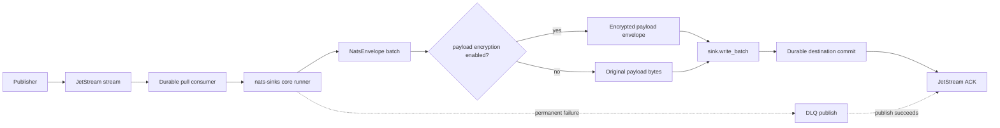
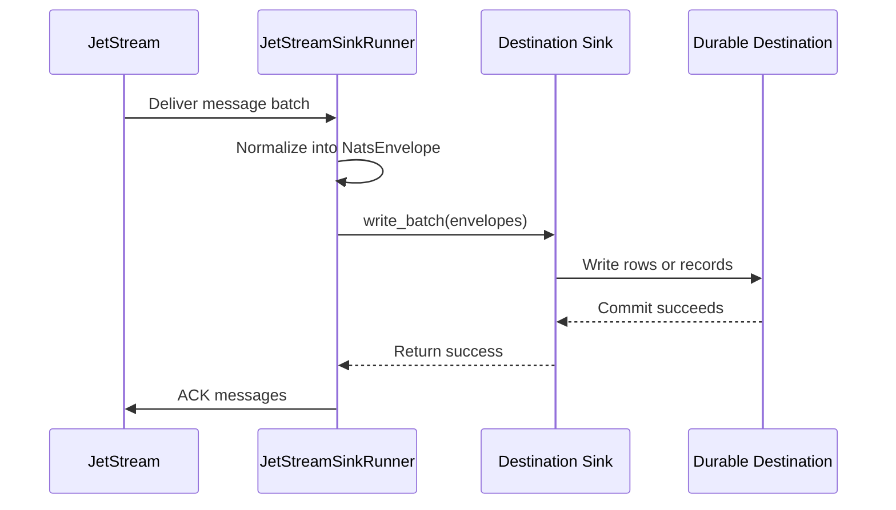
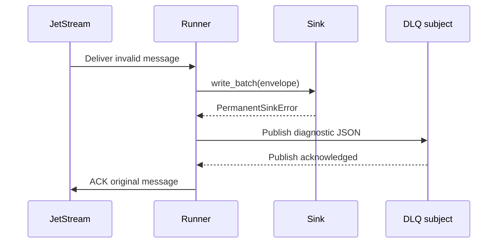

# nats-sinks

[](https://pypi.org/project/nats-sinks/)
[](https://pypi.org/project/nats-sinks/)
[](https://nats-sinks.readthedocs.io/en/latest/?badge=latest)
[](https://projectcuillin.github.io/nats-sinks/)

`nats-sinks` provides at-least-once delivery from JetStream to external destinations with commit-then-acknowledge processing and idempotent sink support.

The project repository is [ProjectCuillin/nats-sinks](https://github.com/ProjectCuillin/nats-sinks/). The current named contributor is Johan Louwers, reachable at [louwersj@gmail.com](mailto:louwersj@gmail.com).

## Overview

NATS is a lightweight messaging system used to move events between services.
JetStream is the persistence layer in NATS: it stores messages in streams and
delivers them to consumers. A sink is a consumer whose main job is to copy those
messages into another durable system, such as a database.

`nats-sinks` is a Python package for building outbound NATS JetStream sink consumers. It provides a reusable runtime that owns JetStream delivery semantics and delegates destination writes to sink implementations. The current production sinks are Oracle Database and local files.

The project is intentionally suitable for mission-oriented environments such as
defence logistics, operational reporting, secure platform telemetry, and other
domains where event loss, premature acknowledgement, and unclear audit trails
are unacceptable. The language throughout the documentation uses examples such
as priority, classification, labels, DLQs, and encrypted payloads because those
concepts map naturally to environments that must handle sensitive operational
information with discipline.

The package is designed as a production-ready foundation rather than a demo script. It includes a typed public API, JSON configuration, a CLI, security-conscious defaults, tests, documentation, CI configuration, and packaging metadata suitable for publishing to PyPI.

The public documentation is prepared for Read the Docs at
[nats-sinks.readthedocs.io](https://nats-sinks.readthedocs.io/en/latest/) and a
GitHub Pages mirror at
[projectcuillin.github.io/nats-sinks](https://projectcuillin.github.io/nats-sinks/).
Read the Docs is the preferred versioned documentation site for package users.
GitHub Pages publishes the current `main` branch documentation after the
repository Pages source is set to `GitHub Actions`.

## Available Today

The current release is focused on a small production-ready surface that can be
used immediately:

- `JetStreamSinkRunner` for pull-based JetStream consumption with bounded
  batches, commit-then-acknowledge processing, DLQ handling, graceful shutdown,
  logging hooks, metrics hooks, and safe redelivery behavior.
- `NatsEnvelope`, the immutable internal representation passed to sinks instead
  of raw NATS client messages.
- Core-normalized message metadata fields for `priority`, `classification`,
  and `labels`, with configurable NATS header extraction, defaults, and
  subject-specific rules shared by every sink. These fields are useful for
  separating routine traffic from urgent, restricted, coalition, exercise, or
  audit-relevant event streams without changing sink code.
- `nats-sink`, the CLI for validating JSON configuration, showing redacted
  effective config, testing sinks, and running sink processes.
- Optional core payload encryption for AES-256-GCM and AES-256-CCM before
  envelopes are delivered to Oracle, file, or future sinks.
- `nats_sinks.oracle.OracleSink`, the production Oracle Database sink with
  connection pooling, Oracle Autonomous Database connection options, `merge`
  and `insert_ignore` idempotent modes, subject-to-table routing, metadata
  persistence, payload normalization, and explicit transaction commit before
  ACK.
- `nats_sinks.file.FileSink`, the production local file sink with deterministic
  filenames, atomic temporary-file placement, optional `fsync`, duplicate
  handling, optional Python standard-library gzip compression, metadata
  persistence, and the same payload normalization contract used by Oracle.

Production sink modules shipped today:

- `nats_sinks.oracle`
- `nats_sinks.file`

## Status

The current release is `0.3.0`.

Included today:

- Core JetStream pull-consumer runtime.
- Commit-then-acknowledge processing.
- Immutable `NatsEnvelope` abstraction.
- Explicit sink protocol and safe sink registry.
- Oracle sink with idempotent production modes.
- File sink with atomic local JSON file writes and deterministic duplicate
  handling.
- Optional AES-256-GCM and AES-256-CCM payload encryption in the core runner.
- JSON configuration and redacted effective-config output.
- CLI command named `nats-sink`.
- Unit tests for ACK ordering, DLQ ordering, config loading, SQL generation, and Oracle mapping.
- Integration test placeholders isolated behind `integration` markers.
- MkDocs documentation, examples, GitHub Actions workflows, governance files, and security policy.

The package does not claim exactly-once delivery. It provides at-least-once
delivery with clear commit ordering and idempotent sink support. That means a
message may be delivered more than once, especially after failures, and sinks
must be configured so duplicate processing is safe.

## Architecture



The core rule is:

> Core owns delivery semantics. Sinks own destination writes.

Sinks never receive raw NATS messages. Sinks never ACK messages. The core runtime converts raw messages into `NatsEnvelope` instances, calls the sink, and ACKs only after durable success.

## Commit-Then-Acknowledge

The project invariant is:

> A JetStream message must only be acknowledged after all required durable side effects have completed successfully. ACK is the final confirmation of successful processing, never a prerequisite for processing.

Short slogan:

> Commit first. ACK last. Design for redelivery.

The normal processing sequence is:



If the sink fails before durable commit, the core does not ACK. If commit succeeds but the process exits before ACK, JetStream may redeliver the message. That is expected and must be handled by idempotency.

## Installation

```bash
pip install nats-sinks
pip install "nats-sinks[oracle]"
pip install "nats-sinks[crypto]"
pip install "nats-sinks[dev]"
pip install "nats-sinks[docs]"
pip install "nats-sinks[all]"
```

Python `>=3.11` is required.

## Quick Start

Start NATS with JetStream:

```bash
nats-server -js -m 8222
nats stream add ORDERS --subjects "orders.*"
nats pub orders.created '{"order_id":"O-1001","amount":42.50}'
```

Prepare the destination:

For a local no-database quick start, use the file sink. It writes one JSON file
per message under `.local/file-sink/events`, which is ignored by git. See
[File Sink](https://nats-sinks.readthedocs.io/en/latest/file-sink/) for the full
configuration and durability model.

Run the sink:

```bash
nats-sink validate examples/file-basic/config.json
nats-sink test-sink examples/file-basic/config.json
nats-sink run examples/file-basic/config.json
```

For a mission-system prototype, the file sink is often the fastest way to prove
the delivery contract before connecting a database. It preserves payloads and
metadata in ordinary JSON files so operators and maintainers can inspect the
flow, confirm classification and label handling, and validate redelivery
behavior without needing database access.

## JSON Configuration

Runtime configuration is JSON-only. The package uses the standard-library JSON parser for application configuration.
The generic `nats`, `delivery`, `dead_letter`, `logging`, and `metrics`
sections are shared by all sinks. The `sink` object selects the destination and
contains destination-specific fields documented on each sink page.

```json
{
  "nats": {
    "url": "nats://localhost:4222",
    "stream": "ORDERS",
    "consumer": "file-orders-sink",
    "subject": "orders.*",
    "durable": true
  },
  "delivery": {
    "batch_size": 100,
    "batch_timeout_ms": 1000,
    "max_in_flight_batches": 1,
    "ack_policy": "after_sink_commit",
    "max_retries": 5,
    "retry_backoff_ms": 1000,
    "prefer_safe_duplication": true
  },
  "dead_letter": {
    "enabled": true,
    "subject": "orders.dlq",
    "include_payload": true,
    "include_headers": true,
    "include_error": true
  },
  "logging": {
    "level": "INFO",
    "payload_logging": false
  },
  "metrics": {
    "enabled": false,
    "namespace": "nats_sinks"
  },
  "message_metadata": {
    "priority": {
      "header": "Nats-Sinks-Priority",
      "default": "normal"
    },
    "classification": {
      "header": "Nats-Sinks-Classification",
      "default": null
    }
  },
  "encryption": {
    "enabled": false,
    "algorithm": "aes-256-gcm",
    "key_id": "orders-runtime-key",
    "key_b64_env": "NATS_SINKS_PAYLOAD_KEY_B64"
  },
  "sink": {
    "type": "file",
    "directory": ".local/file-sink/events",
    "filename_strategy": "stream_sequence",
    "duplicate_policy": "skip_existing",
    "payload_mode": "json_or_envelope",
    "fsync": true
  }
}
```

Secret values should come from the environment or a secret manager. Use
environment-backed fields such as `password_env` and `token_env` rather than
storing credentials in config files.

## Payload Bodies

NATS message bodies are bytes. The generic framework accepts bytes and does not
require JSON at the core boundary. Sinks that store data in JSON-capable
destinations can use the shared payload normalization contract for JSON,
encrypted text, plain text, and opaque bytes.

The default `payload_mode` is `json_or_envelope`:

- valid JSON is stored unchanged,
- non-JSON UTF-8 text is wrapped in a JSON envelope,
- non-text bytes are wrapped as base64 in the same JSON envelope.

For encrypted text streams where the ciphertext may or may not decrypt to JSON
later, use `payload_mode: "text_envelope"` to wrap every body as text and avoid
unnecessary JSON parse attempts.

```json
{
  "sink": {
    "type": "file",
    "directory": ".local/file-sink/events",
    "payload_mode": "text_envelope"
  }
}
```

See [Sink Framework](https://nats-sinks.readthedocs.io/en/latest/sink-framework/) and
[File Sink](https://nats-sinks.readthedocs.io/en/latest/file-sink/) for the JSON envelope shape and operational
guidance. Oracle-specific payload storage is documented in
[Oracle Sink](https://nats-sinks.readthedocs.io/en/latest/oracle-sink/).

## Payload Encryption

The core runner can encrypt the message body before sending an envelope to any
sink. This protects the actual payload stored by Oracle, file, and future
sinks, while leaving operational metadata such as subject, headers, stream
sequence, message IDs, and timestamps readable for routing and idempotency.

Supported algorithms are AES-256-GCM and AES-256-CCM through the optional
`nats-sinks[crypto]` extra. Encryption can apply to every subject consumed by
the runner or to selected subjects through ordered NATS wildcard rules:

```json
{
  "encryption": {
    "enabled": true,
    "algorithm": "aes-256-gcm",
    "key_id": "orders-prod-2026-05",
    "key_b64_env": "NATS_SINKS_PAYLOAD_KEY_B64"
  }
}
```

For subject-specific encryption, leave the global policy disabled and add
rules. The first matching rule wins; subjects with no matching rule remain
unchanged in this example:

```json
{
  "encryption": {
    "enabled": false,
    "rules": [
      {
        "subject": "secure.>",
        "enabled": true,
        "algorithm": "aes-256-gcm",
        "key_id": "secure-prod-2026-05",
        "key_b64_env": "NATS_SINKS_SECURE_PAYLOAD_KEY_B64"
      }
    ]
  }
}
```

Use stable metadata-based idempotency such as stream sequence or message ID
when encryption is enabled. Ciphertext is intentionally non-deterministic
because each encryption uses a fresh nonce.

See [Payload Encryption](https://nats-sinks.readthedocs.io/en/latest/payload-encryption/)
for the full configuration reference, encrypted JSON envelope shape, testing
script, and decryption helper.

## Metadata Capture

`nats-sinks` captures a generic metadata JSON document for every message. This
is available to all current and future sinks through `NatsEnvelope`.

The metadata document preserves all message headers, known NATS-reserved
headers when present, unknown future `Nats-` headers, JetStream stream and
sequence metadata, optional reply subject, and timing fields. Optional headers
such as `Nats-Msg-Id` or `Nats-Expected-Stream` may be absent; that is normal
and does not cause a crash. Destination sinks can store this document directly
or map selected fields into destination-specific columns.

The core also normalizes three application-level metadata fields on every
message: `priority`, `classification`, and `labels`. They can be supplied by
NATS headers such as `Nats-Sinks-Priority`, `Nats-Sinks-Classification`, and
`Nats-Sinks-Labels`, configured with deployment defaults, configured with
ordered subject-specific defaults, or left unset. Headers always win when
present; subject defaults are used only when the corresponding header is
absent. Missing priority and classification values are stored as JSON `null` or
SQL `NULL`, not as the literal string `"null"`. Labels are normalized as a list
and are stored in scalar sink fields as semicolon-separated text.

Classification and priority values are operator-defined strings. The
documentation uses NATO-style examples such as `NATO UNCLASSIFIED`,
`NATO RESTRICTED`, `NATO CONFIDENTIAL`, `NATO SECRET`, and
`COSMIC TOP SECRET`; use the exact vocabulary required by your environment.

```json
{
  "message_metadata": {
    "priority": {
      "header": "Nats-Sinks-Priority",
      "default": "routine"
    },
    "classification": {
      "header": "Nats-Sinks-Classification",
      "default": "NATO UNCLASSIFIED"
    },
    "labels": {
      "header": "Nats-Sinks-Labels",
      "default": "logistics;default"
    },
    "rules": [
      {
        "subject": "mission.reports.>",
        "priority": "immediate",
        "classification": "NATO SECRET",
        "labels": "mission-report;coalition;watch-floor"
      }
    ]
  }
}
```

With the file sink, these values appear as top-level JSON fields such as
`"priority": "immediate"`, `"classification": "NATO SECRET"`, `"labels":
"mission-report;coalition;watch-floor"`, and `"labels_list":
["mission-report", "coalition", "watch-floor"]`. With Oracle, the same values
are stored in `PRIORITY`, `CLASSIFICATION`, and `LABELS` columns and repeated
inside `METADATA_JSON.message_metadata`.

## NATS Connections

`nats-sinks` supports common NATS client authentication options through the
`nats` JSON section:

- token authentication with `token_env` or `token`,
- username/password authentication with `user` and `password_env` or `password`,
- server-side bcrypted username/password credentials using the same client-side
  `user` and `password_env` settings,
- TLS server verification with `tls_ca_file`, including private or self-signed
  NATS server CAs.

Do not embed credentials in `nats.url`; use environment-backed fields instead.
See [NATS Connections And Authentication](https://nats-sinks.readthedocs.io/en/latest/nats-connections/) for
configuration examples and secure deployment notes.

## CLI

```bash
nats-sink --help
nats-sink validate examples/file-basic/config.json
nats-sink test-sink examples/file-basic/config.json
nats-sink validate examples/oracle-jetstream/config.json
nats-sink show-effective-config examples/oracle-jetstream/config.json
nats-sink test-sink examples/oracle-jetstream/config.json
nats-sink run examples/oracle-jetstream/config.json
```

The CLI:

- returns non-zero on validation or runtime errors,
- prints the active sink type,
- prints the commit-then-acknowledge ACK policy,
- renders effective configuration as redacted JSON,
- never prints resolved passwords.

## Python API

You can use `nats-sinks` directly from another Python project without shelling
out to the CLI. The recommended integration point is the public framework API:

```python
from nats_sinks import JetStreamSinkRunner
from nats_sinks.file import FileSink

sink = FileSink(
    directory="/var/lib/nats-sinks/events",
    filename_strategy="stream_sequence",
    duplicate_policy="skip_existing",
)

runner = JetStreamSinkRunner(
    nats_url="nats://localhost:4222",
    stream="ORDERS",
    consumer="orders-file-sink",
    subject="orders.*",
    sink=sink,
)

await runner.run()
```

You can also mount the Typer CLI into another Typer application:

```python
import typer
from nats_sinks.cli.main import app as nats_sink_cli

app = typer.Typer()
app.add_typer(nats_sink_cli, name="nats-sink")
```

See [Python Usage](https://nats-sinks.readthedocs.io/en/latest/python-usage/) for embedded application patterns and
the tradeoff between using the public runtime API and importing CLI internals.

## Production Sinks

Destination-specific details are split into dedicated pages:

- [Oracle Sink](https://nats-sinks.readthedocs.io/en/latest/oracle-sink/)
  covers Oracle connection types, Autonomous Database, table DDL,
  least-privilege users, idempotent write modes, subject-to-table routing,
  payload storage, metadata columns, and Oracle-specific performance guidance.
- [File Sink](https://nats-sinks.readthedocs.io/en/latest/file-sink/) covers
  local file output, atomic write behavior, deterministic file names, duplicate
  policies, gzip compression, filesystem safety, and file-specific performance
  guidance.

The generic sink framework is documented separately in
[Sink Framework](https://nats-sinks.readthedocs.io/en/latest/sink-framework/). That boundary is deliberate:
Oracle and file sinks use the same core delivery semantics, the same envelope
contract, and the same commit-then-acknowledge rule.

## Failure Behavior



Important failure cases:

- destination write or commit fails: no ACK, message redelivers according to
  the JetStream consumer policy,
- destination commit succeeds and the process crashes before ACK: message may
  redeliver, so sink idempotency must handle the duplicate,
- payload is permanently invalid for the selected sink: message is published to
  DLQ when configured, then the original is ACKed only after DLQ publish
  succeeds,
- DLQ publish fails: original message is not ACKed.

## Security Notes

- Do not store secrets in repository files.
- Do not log payloads by default.
- Do not log passwords, tokens, private keys, NATS credentials, Oracle credentials, or full connection strings.
- SQL identifiers are allow-list validated.
- SQL values use bind variables.
- Unit tests must not make network calls.
- Integration tests are isolated behind markers.
- Use TLS and authenticated NATS connections in production.
- Use core payload encryption when destination storage should retain encrypted
  message bodies while keeping routing metadata available.
- Use least-privilege destination credentials with access only to the required
  destination resources.

## Development

```bash
python -m pip install -e ".[dev,oracle,crypto,docs]"
ruff format --check .
ruff check .
mypy src
pytest
python -m build
twine check dist/*
```

Run only unit tests:

```bash
pytest -m "not integration"
```

Build documentation:

```bash
mkdocs build --strict
```

Manual live NATS connection testing is documented in
[NATS Connections And Authentication](https://nats-sinks.readthedocs.io/en/latest/nats-connections/) and
[Testing](https://nats-sinks.readthedocs.io/en/latest/testing/). The tracked helper script is
`scripts/nats-live-probe.py`; real CA files and credentials should stay under
ignored `.local/` paths.

The latest sanitized validation summary is maintained in
[Latest Test Report](https://nats-sinks.readthedocs.io/en/latest/test-report/). That report is overwritten in place
for each new validation run and must not contain server addresses, usernames,
passwords, tokens, certificate contents, wallet material, connection strings,
or sensitive payloads.

To run `nats-sink` as a systemd service on Oracle Linux or Debian, see
[Service Deployment](https://nats-sinks.readthedocs.io/en/latest/service-deployment/). The repository includes
example service files and installer scripts under `examples/systemd/` and
`scripts/`.

Release and PyPI publishing instructions are documented in
[Publishing Releases](https://nats-sinks.readthedocs.io/en/latest/publishing/). That guide covers version updates,
tag pushes, GitHub release workflows, TestPyPI, PyPI trusted publishing, and
manual fallback commands.

## Repository Layout

```text
src/nats_sinks/core      Core runtime, config, envelope, runner, DLQ
src/nats_sinks/sinks     Sink protocols and registry
src/nats_sinks/oracle    Oracle sink implementation
src/nats_sinks/file      Local file sink implementation
src/nats_sinks/cli       CLI entry point
tests/unit               Deterministic unit tests
tests/integration        External-service and local end-to-end tests
docs                     MkDocs documentation
examples                 Local development examples
```

## Roadmap

Future work is intentionally listed near the end of the README so new readers
first see what the package can do today. Planned items are not production
features until they are implemented, tested, documented, and released.

Phase 1:

- Core runtime.
- Oracle sink.
- File sink.
- CLI.
- Documentation.
- Tests.
- PyPI-ready package.

Phase 2:

- Better metrics.
- More idempotency strategies.
- Postgres sink.
- HTTP sink.
- S3 sink design with deterministic object keys.
- Kafka and other backend evaluation through the sink framework.
- Docker image.
- Kubernetes examples.
- Multiple NATS seed URLs for clustered deployments.
- NATS reconnect tuning and connection event metrics.
- Least-privilege NATS permissions templates for sink users.
- Certified TLS certificate authentication guidance.
- Certified NKEY with challenge authentication support.
- Certified decentralized JWT authentication/authorization support.
- Explicit JetStream consumer creation and reconciliation.
- Configurable consumer `AckWait`, `MaxDeliver`, `BackOff`, and `MaxAckPending`.
- Optional `AckSync` / double-ACK and `InProgress` support.
- JetStream advisory consumption for operational events.

Phase 3:

- Plugin discovery.
- Sink certification tests.
- Helm chart.
- Advanced observability.
- WebSocket connection support.
- Push and ordered consumer evaluation where compatible with project semantics.
- Stream management helpers and documentation.
- Server monitoring endpoint integration.
- Future sink certification tests.

Not planned unless scope changes:

- `AckNone`, early ACK, and `AckAll` behavior that weakens commit-then-ack.
- General-purpose Core NATS pub/sub, queue group, request/reply, or services
  framework support.
- JetStream Key/Value and Object Store APIs unless a future sink needs them.

See [NATS Feature Gap Analysis](https://nats-sinks.readthedocs.io/en/latest/nats-feature-gap-analysis/) for the
detailed comparison.

## License

Apache-2.0. See `LICENSE`.
