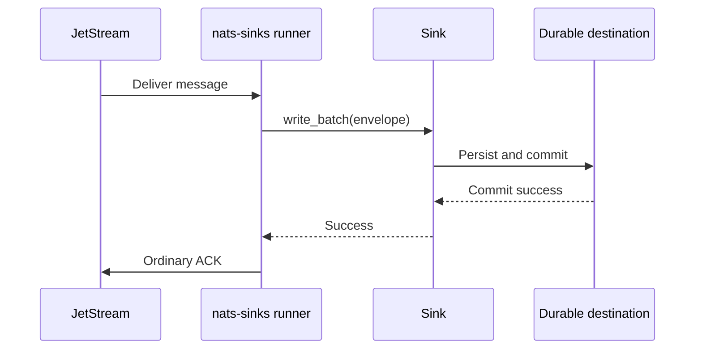
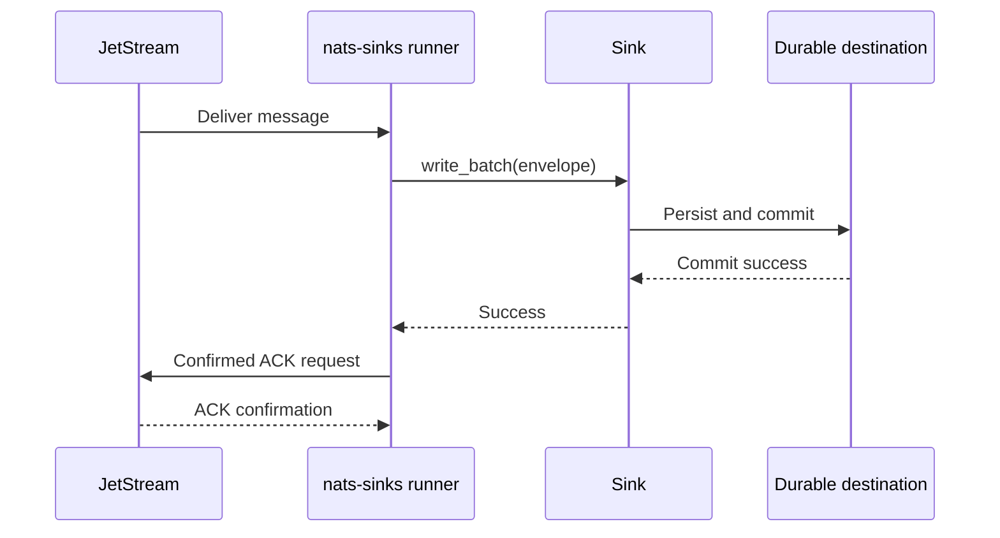
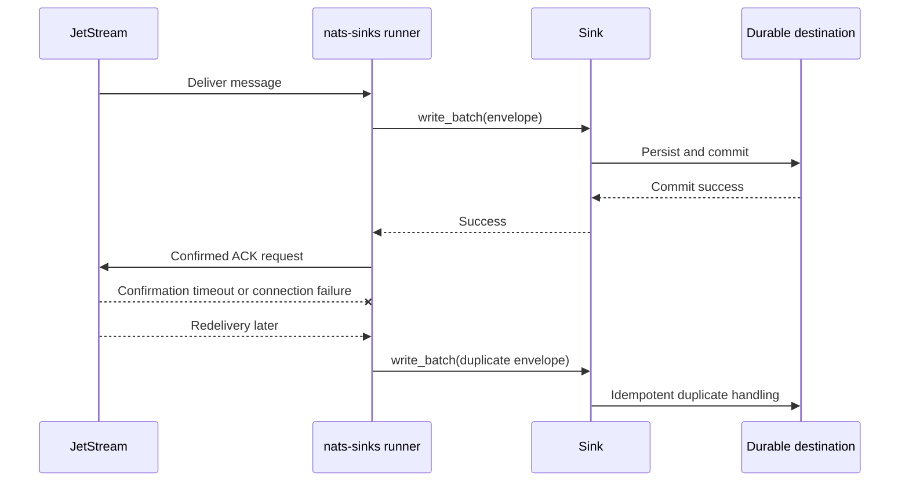
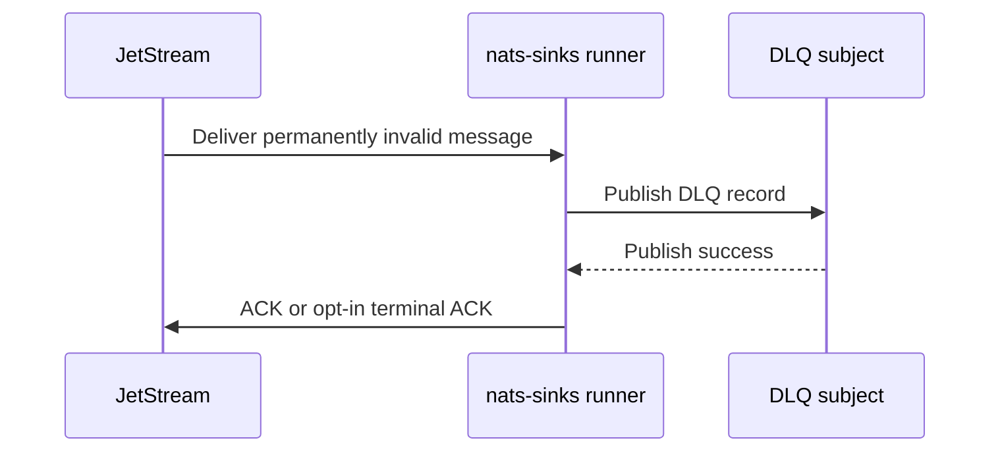

# Acknowledgement Confirmation Evaluation

This page records the evaluation for optional confirmed JetStream
acknowledgements in `nats-sinks`. It is written for operators and maintainers
who need to understand the difference between an ordinary ACK and a confirmed
ACK before deciding whether the feature should be enabled in a future release.

The conclusion is intentionally conservative:

- ordinary ACK remains the default behavior,
- confirmed ACK support should be implemented only as an opt-in feature,
- confirmation must happen only after durable sink success or after successful
  DLQ publication,
- confirmation failure after durable success can still lead to redelivery,
- idempotent sink behavior remains mandatory.

The evaluation resulted in separate backlog items for future implementation
work. The current release documents the design boundary but does not yet expose
a runtime `AckSync` configuration option.

## Background

NATS JetStream consumers use acknowledgements to tell the server how a delivered
message should be treated. The NATS documentation describes explicit ACK mode
as the required ACK mode for pull-based consumers and describes ACK variants
such as `+ACK`, `-NAK`, `+WPI`, `+NXT`, and `+TERM` in the JetStream model
deep dive. See the upstream
[JetStream Model Deep Dive](https://docs.nats.io/using-nats/developer/develop_jetstream/model_deep_dive).

The Python NATS client exposes both ordinary `ack()` and `ack_sync()`.
According to the current `nats.py` API documentation, `ack_sync()` waits for
the acknowledgement to be processed by the server. See the upstream
[`nats.aio.msg.Msg` source documentation](https://nats-io.github.io/nats.py/_modules/nats/aio/msg.html).

In `nats-sinks`, that client feature must be evaluated through the project
safety rule:

> Commit first. ACK last. Design for redelivery.

## Ordinary ACK Today

The current runner writes a batch to the configured sink and sends an ordinary
ACK only after the sink returns success.



This is already safe for at-least-once delivery. If the destination commit
fails, the runner does not ACK. If the commit succeeds but the ACK is lost, the
message may redeliver and the sink must handle the duplicate.

## Confirmed ACK Proposed Future Behavior

Confirmed ACK would replace the final ordinary ACK operation with a client
operation that waits for the server to confirm that it processed the ACK. In
`nats.py`, this is exposed as `ack_sync(timeout=...)`.



The durable destination boundary remains unchanged. Confirmation is useful
operational evidence, but it is not a prerequisite for processing and it does
not make delivery exactly once.

## Failure After Commit

The important failure mode is still the same as with ordinary ACK: the sink may
commit successfully and the process may fail before the ACK is accepted or
confirmed.



This is acceptable because `nats-sinks` prefers safe duplication over silent
loss. Operators should treat confirmed ACK failures after durable success as
redelivery-risk events, not as proof that the destination write failed.

## DLQ Path

Permanent failures use a different safety boundary. The original message may
be ACKed or terminally acknowledged only after the DLQ record has been
published successfully.



Future confirmed acknowledgement work should cover this path separately. If
DLQ publication succeeds but confirmation of the original-message ACK fails,
the original message may redeliver and DLQ publication must be idempotent.

## Recommendation

The evaluation recommends splitting the work into three implementation items:

1. Add optional confirmed ACK after durable sink success.
2. Evaluate and add optional confirmed ACK or terminal acknowledgement handling
   after successful DLQ publication.
3. Add ACK confirmation metrics and an operator runbook.

Keeping these items separate makes review easier. The runtime ACK path, the DLQ
failure path, and the operator-facing observability model each carry different
risks.

## Configuration Direction

A future configuration shape should keep ordinary ACK as the default. A
possible direction is shown below for illustration only:

```json
{
  "delivery": {
    "ack_policy": "after_sink_commit",
    "ack_confirmation": "ordinary",
    "ack_confirmation_timeout_ms": 1000
  }
}
```

Valid future values could include:

| Value | Meaning |
| --- | --- |
| `ordinary` | Use the existing post-commit ordinary ACK behavior. |
| `confirmed` | Use confirmed ACK after durable success with a bounded timeout. |

The feature should fail closed if the configured client does not support the
selected mode, if the timeout is invalid, or if the delivery policy would blur
the durable boundary.

## Metrics Direction

Future metrics should be explicit and low-cardinality. Suggested names include:

| Metric suffix | Type | Meaning |
| --- | --- | --- |
| `ack_confirmation_attempts_total` | counter | Messages for which confirmed ACK was attempted. |
| `ack_confirmation_success_total` | counter | Confirmed ACK attempts accepted by the server. |
| `ack_confirmation_timeouts_total` | counter | Confirmed ACK attempts that timed out. |
| `ack_confirmation_errors_total` | counter | Confirmed ACK attempts that failed for another reason. |
| `message_ack_confirmation_seconds` | observation | Elapsed time spent waiting for ACK confirmation. |

These metrics should be readable through `nats-sink-metrics` and shareable only
through the disabled-by-default observability policy layer.

## Operational Guidance

Confirmed ACK can improve confidence that the server received the final
acknowledgement, especially in controlled networks, disconnected-edge
operations, and other mission-support environments where auditability matters.
It does not remove the need for idempotency.

Use confirmed ACK only when the additional round trip and timeout behavior are
acceptable. For high-throughput environments, test with realistic message
volume, network latency, reconnect events, and destination latency before
enabling the option in production.

## Current Status

This release documents the evaluation and creates follow-up feature requests.
No runtime confirmed ACK option is enabled yet.
