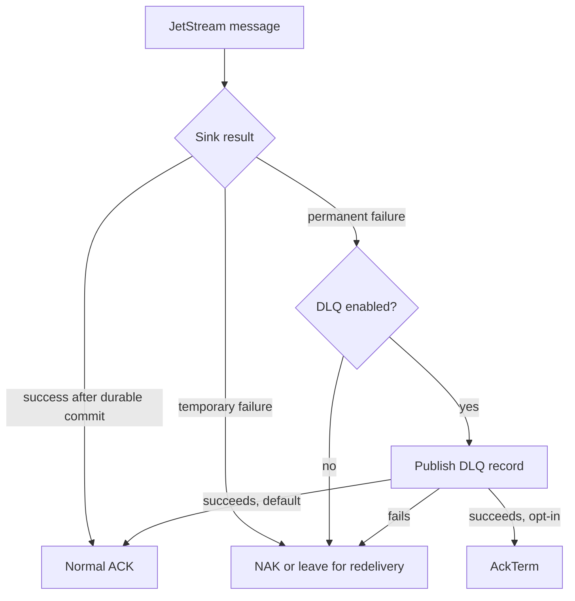

# ADR 0005: AckTerm And AckNext Evaluation

## Status

Accepted.

## Context

`nats-sinks` uses pull-based JetStream consumers and treats ACK as the final
confirmation that durable work has completed. The project deliberately prefers
safe redelivery over silent loss. That means any JetStream acknowledgement
variant must be evaluated against the same invariant:

> Commit first. ACK last. Design for redelivery.

The NATS JetStream protocol supports several acknowledgement forms. The
official NATS model deep dive describes `AckTerm` as stopping redelivery
without acknowledging successful processing, and `AckNext` as acknowledging a
message while requesting more messages for a pull consumer:
<https://docs.nats.io/using-nats/developer/develop_jetstream/model_deep_dive>.
The NATS consumer documentation explains that JetStream consumers can provide
at-least-once delivery and that pull consumers are recommended when detailed
flow control or error handling matters:
<https://docs.nats.io/nats-concepts/jetstream/consumers>. NATS monitoring
documentation also lists the advisory emitted when message delivery is
terminated with `AckTerm`:
<https://docs.nats.io/running-a-nats-service/nats_admin/monitoring/monitoring_jetstream>.

The Python client currently exposes normal ACK, double ACK, NAK, in-progress,
and term methods on `Msg`; it does not expose a high-level `ack_next` method in
the documented public API:
<https://nats-io.github.io/nats.py/>.

## Decision

`AckNext` is not suitable for the production sink runner and is not planned
unless project scope changes. The runner already owns explicit fetch loops,
bounded batch size, batch timeout, and max-in-flight behavior. Combining ACK
and the next pull request into one operation would make backpressure and
failure behavior harder to review without improving the commit-then-ACK safety
model. It also lacks double-ACK support in the NATS acknowledgement model, and
the Python client does not expose a high-level API for it.

`AckTerm` is useful only as an optional terminal-failure policy after
nats-sinks has already completed the required failure handling. The supported
production path is:

1. A message fails with a permanent framework error.
2. DLQ is configured.
3. The DLQ publish succeeds.
4. The operator explicitly configured terminal acknowledgement.
5. The runner sends `AckTerm` instead of the current final ACK.

The existing default remains unchanged: publish permanent failures to DLQ and
ACK the original only after DLQ publication succeeds.

## Required Safety Rules For Future AckTerm Work

- Disabled by default.
- Never used after successful sink writes; successful durable work still uses
  normal ACK or future optional AckSync.
- Never sent before required DLQ publication succeeds.
- Never sent when DLQ publication fails.
- Never used for temporary sink failures.
- Must emit clear metrics and safe logs that distinguish ACK, NAK, DLQ, and
  terminal acknowledgement outcomes.
- Must not log payloads, credentials, sensitive headers, or private operational
  locators.
- Must have unit tests proving terminal acknowledgement ordering.

## Decision Diagram

## Consequences

- Runtime behavior remains unchanged by default.
- `dead_letter.ack_term_after_publish` implements the optional `AckTerm` path
  described in this ADR. It is disabled by default and only applies after
  successful DLQ publication.
- `AckNext` is moved to not planned unless scope changes.
- Any future expansion of terminal acknowledgement behavior must use explicit
  configuration, delivery-contract tests, documentation, and release evidence
  before it can be considered production-ready.

## Non-Goals

- No exactly-once processing claim.
- No use of `AckAll`, `AckNone`, or early ACK behavior.
- No terminal acknowledgement before durable failure handling has completed.
- No coupling of fetch/backpressure logic to ACK payloads through `AckNext`.
