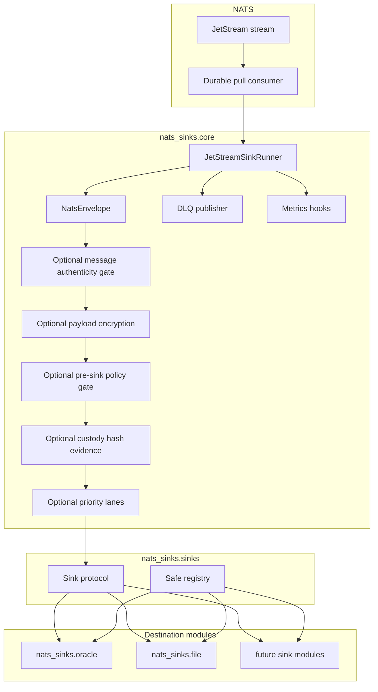
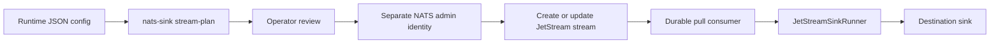
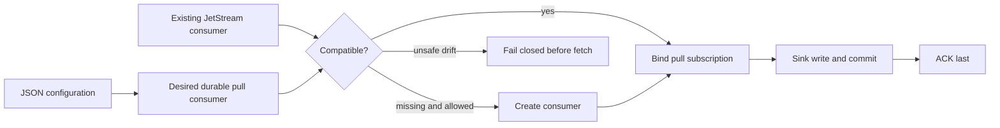

# Architecture

This page explains how the project is divided so that delivery safety is easy
to reason about. The most important concept is the difference between the core
runtime and a sink. The core runtime talks to NATS JetStream and owns message
delivery decisions. A sink talks to a destination system such as Oracle
Database, Oracle Autonomous Database on Oracle Cloud Infrastructure (OCI), a
file store, an object store, or another approved durable backend and owns only
destination writes.

The main architectural rule is:

> Core owns delivery semantics. Sinks own destination writes.

This separation keeps JetStream ACK behavior consistent across destinations. A sink implementation should be able to focus on writing to its destination and committing durable state. It should not need to know how to ACK, NAK, publish to DLQ, or manage a JetStream consumer.

This boundary matters especially in mission and defence-style deployments,
where multiple systems may depend on the same operational event stream. A
database outage, file-system delay, or schema issue should result in visible
redelivery or DLQ handling, not a quiet ACK that removes the event from the
processing path before it has crossed a durable boundary.

## Component Model

The diagram below shows the framework boundary. Oracle Database and local file
output are production destination modules, and additional destinations should
fit into the same shape: the runner manages JetStream, and sinks receive
normalized envelopes instead of raw NATS messages.



## Processing Path

The processing path is intentionally linear. A batch moves from JetStream to a
destination write, then to a durable commit, and only then to a JetStream ACK.

```text
JetStream stream
  -> durable consumer
  -> nats-sinks core runner
  -> optional message authenticity verification
  -> optional payload encryption
  -> optional pre-sink policy gate
  -> optional tamper-evident custody metadata
  -> optional in-batch priority lane ordering
  -> sink.write_batch(...)
  -> durable destination commit
  -> JetStream ACK
```

## Runtime Responsibilities

The core runtime handles:

- NATS and JetStream connectivity.
- Pull-based consumption.
- Bounded batch fetching.
- Conversion from raw NATS messages to `NatsEnvelope`.
- Optional message authenticity verification before any sink delivery.
- Optional payload encryption before sink delivery.
- Optional fail-closed policy enforcement after normalization and core payload
  transformation, but before any destination write.
- Optional tamper-evident custody metadata computation after policy acceptance,
  but before any destination write.
- Optional priority-lane ordering for already-fetched bounded batches.
- Sink lifecycle.
- Temporary versus permanent failure handling.
- DLQ publication.
- ACK and NAK behavior.
- Metrics hooks.
- Graceful shutdown.

Destination sinks handle:

- connection management for the destination,
- batch writes,
- durable commit,
- destination-specific error translation,
- destination-specific idempotency behavior.

Mission-oriented deployments should treat this split as an accountability
boundary. The core provides a consistent delivery contract, while each sink
documents exactly what counts as durable success for its destination.

## JetStream Topology Boundary

The runner binds to the stream, durable consumer, and subject declared in
configuration. Advanced JetStream topology that exists before that point, such
as mirrors, sources, subject transforms, republish rules, stream compression,
placement, and stream metadata, remains a NATS platform concern.

Those choices can still affect the envelope the runner receives. A transform
may change the subject used by sink routing. A source or mirror may change how
operators interpret stream and sequence identity. Placement can affect latency
and reconnect behavior. The core does not hide these concerns; it keeps them
outside the delivery-control boundary so they can be reviewed as platform
architecture.

See [Advanced JetStream Topology](jetstream-topology.md) for the detailed
operator guidance.

## Stream Administration Boundary

The core runner is not a stream administration engine. It may bind to or
prepare its configured durable pull consumer according to
`consumer_management.mode`, but broad stream creation, stream update, stream
retention policy, discard policy, storage type, replica count, and duplicate
window choices remain NATS control-plane decisions.

The optional `nats-sink stream-plan` command lives on the safe side of this
boundary. It reads local JSON configuration and generates an offline plan that
operators can review, but it does not connect to NATS and does not mutate
stream state.



This split keeps elevated stream-management permissions out of the ordinary
sink worker. It also prevents stream planning from becoming a hidden runtime
side effect that could change retention or replay behavior during message
processing. See [JetStream Stream Management Planning](stream-management.md).

## Durable Consumer Management

Before a runner fetches messages, it can now explicitly check the configured
durable pull consumer. The default `consumer_management.mode` is
`create_if_missing`, which preserves the previous developer-friendly behavior
while making the action visible in configuration. Production environments that
provision streams and consumers through infrastructure-as-code can switch to
`bind_only` so the worker fails if the durable consumer is missing. Controlled
platform deployments can use `reconcile` to submit the configured durable
pull-consumer settings when the existing consumer is already compatible.

Consumer management is part of the startup boundary, not the message-processing
boundary. The runner validates the durable name, single or plural filter
subjects, explicit ACK policy, pull-consumer shape, deliver and replay policy,
and configured delivery-sensitive fields before calling `pull_subscribe`.
Managed fields can include `AckWait`, server-side `BackOff`, `MaxDeliver`,
`MaxAckPending`, `MaxWaiting`, `HeadersOnly`, consumer replicas,
memory-storage state, and bounded consumer metadata. If drift is unsafe,
startup fails closed before any message can be fetched or ACKed.



## Why Raw NATS Messages Are Not Passed To Sinks

Raw `nats-py` messages expose `ack`, `nak`, and related methods. Passing raw messages into destination code would make it easy for a sink to ACK before durable success. `NatsEnvelope` prevents this by carrying payload and metadata without delivery-control methods.

Headers-only JetStream consumers are intentionally treated as a separate
design topic. nats-sinks can process empty payload bytes today, but explicit
headers-only support must distinguish a producer-empty message from a body that
the NATS server intentionally omitted. See
[Headers-Only Delivery Evaluation](headers-only-delivery.md) for the staged
design.

Ordered consumers are also intentionally separate from the production sink
runner. They are useful for inspection and analysis, but they are not a
replacement for durable pull consumers when writing to Oracle, files, or
future sinks. See [Ordered Consumer Evaluation](ordered-consumer-evaluation.md)
for the evaluation and follow-up tooling split.

Push consumers have also been evaluated as a possible future runner mode. They
can be useful for deployments that already standardize on server-initiated
delivery, but they add callback scheduling, client pending buffers, deliver
subjects, flow-control messages, and more complex shutdown behavior. Pull
consumers remain the production default until a push mode can prove the same
bounded backpressure and ACK-after-durable-success behavior. See
[Push Consumer Evaluation](push-consumer-evaluation.md).

## Extension Model

Future sinks should implement:

```python
class Sink(Protocol):
    async def start(self) -> None: ...
    async def write_batch(self, messages: Sequence[NatsEnvelope]) -> None: ...
    async def stop(self) -> None: ...
```

A future sink is production-ready only when it can demonstrate:

- no ACK ownership,
- durable success before returning from `write_batch`,
- idempotent duplicate handling,
- clear temporary/permanent error classification,
- deterministic unit tests,
- documentation for failure behavior.

Adding a new sink should be an additive release: a new module, optional
dependency extra, registry entry, tests, and destination-specific documentation.
The core `NatsEnvelope`, `Sink` protocol, commit-then-acknowledge ordering, and
existing Oracle configuration should remain compatible.

Generic route matching is also part of the core, but it is still
selection-only. The `routing` configuration can evaluate subject, priority,
classification, labels, and approved header hints against a normalized
`NatsEnvelope` and return logical target names plus ACK-gating policy for those
targets. It does not call sinks, create fan-out work, or ACK JetStream by
itself. That keeps the future multi-sink routing design additive: fan-out
delivery can use the core ACK-gate helper to wait for every required target and
to bound optional side copies without moving delivery semantics into
destination modules.

Payload encryption is also part of the core, not a sink-specific responsibility.
When enabled, the runner encrypts `NatsEnvelope.data` and passes a copied
envelope to the sink. Metadata remains clear. This lets all sinks store the
same encrypted payload envelope without duplicating cryptographic code.

Message authenticity verification is also part of the core. When enabled, the
runner checks producer-supplied signature headers against an allow-listed
subject rule before payload encryption, policy enforcement, custody hashing,
priority lanes, or sink delivery. A verification rejection is handled as a
permanent validation failure: the rejected message does not reach the sink, and
the core follows DLQ-before-ACK behavior when a DLQ is configured. This
complements NATS authentication and TLS; it does not replace them. See
[Message Authenticity](message-authenticity.md).

Pre-sink policy enforcement is also part of the core. The policy gate is
configured with explicit allow-listed checks such as required priority,
classification, labels, mission metadata, encrypted payloads, and bounded
payload size. It does not run dynamic code or destination-specific SQL. A
policy rejection is handled as a permanent validation failure: the rejected
message does not reach the sink, and the core follows DLQ-before-ACK behavior
when a DLQ is configured.

Tamper-evident custody metadata is another core transformation. When enabled,
the runner computes deterministic hashes over the normalized payload and stable
metadata, attaches the custody object to `NatsEnvelope`, and then calls the
sink. Sinks persist the custody object but do not decide whether it is required,
valid, or sufficient for ACK. A custody computation failure is a pre-sink
permanent validation failure, so the runner does not ACK the message unless
configured DLQ publication succeeds first. See
[Tamper-Evident Custody Metadata](tamper-evident-custody.md).
