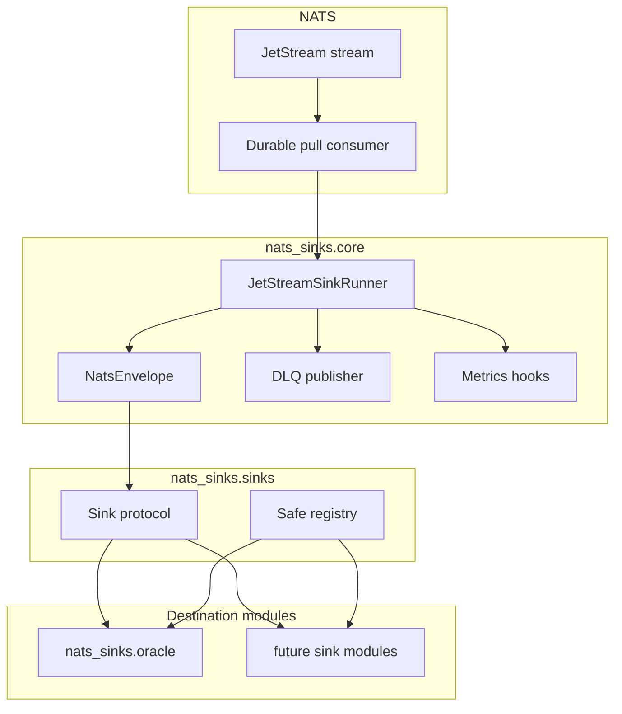

# Architecture

This page explains how the project is divided so that delivery safety is easy
to reason about. The most important concept is the difference between the core
runtime and a sink. The core runtime talks to NATS JetStream and owns message
delivery decisions. A sink talks to a destination system such as a database,
HTTP endpoint, file store, or object store and owns only destination writes.

The main architectural rule is:

> Core owns delivery semantics. Sinks own destination writes.

This separation keeps JetStream ACK behavior consistent across destinations. A sink implementation should be able to focus on writing to its destination and committing durable state. It should not need to know how to ACK, NAK, publish to DLQ, or manage a JetStream consumer.

## Component Model

The diagram below shows the framework boundary. Oracle is the first production
destination module, but additional destinations should fit into the same shape:
the runner manages JetStream, and sinks receive normalized envelopes instead of
raw NATS messages.



## Processing Path

The processing path is intentionally linear. A batch moves from JetStream to a
destination write, then to a durable commit, and only then to a JetStream ACK.

```text
JetStream stream
  -> durable consumer
  -> nats-sinks core runner
  -> sink.write_batch(...)
  -> durable destination commit
  -> JetStream ACK
```

## Runtime Responsibilities

The core runtime handles:

- NATS and JetStream connectivity.
- Pull-based consumption.
- Bounded batch fetching.
- Conversion from raw NATS messages to `NatsEnvelope`.
- Sink lifecycle.
- Temporary versus permanent failure handling.
- DLQ publication.
- ACK and NAK behavior.
- Metrics hooks.
- Graceful shutdown.

Destination sinks handle:

- connection management for the destination,
- batch writes,
- durable commit,
- destination-specific error translation,
- destination-specific idempotency behavior.

## Why Raw NATS Messages Are Not Passed To Sinks

Raw `nats-py` messages expose `ack`, `nak`, and related methods. Passing raw messages into destination code would make it easy for a sink to ACK before durable success. `NatsEnvelope` prevents this by carrying payload and metadata without delivery-control methods.

## Extension Model

Future sinks should implement:

```python
class Sink(Protocol):
    async def start(self) -> None: ...
    async def write_batch(self, messages: Sequence[NatsEnvelope]) -> None: ...
    async def stop(self) -> None: ...
```

A future sink is production-ready only when it can demonstrate:

- no ACK ownership,
- durable success before returning from `write_batch`,
- idempotent duplicate handling,
- clear temporary/permanent error classification,
- deterministic unit tests,
- documentation for failure behavior.

Adding a new sink should be an additive release: a new module, optional
dependency extra, registry entry, tests, and destination-specific documentation.
The core `NatsEnvelope`, `Sink` protocol, commit-then-acknowledge ordering, and
existing Oracle configuration should remain compatible.
