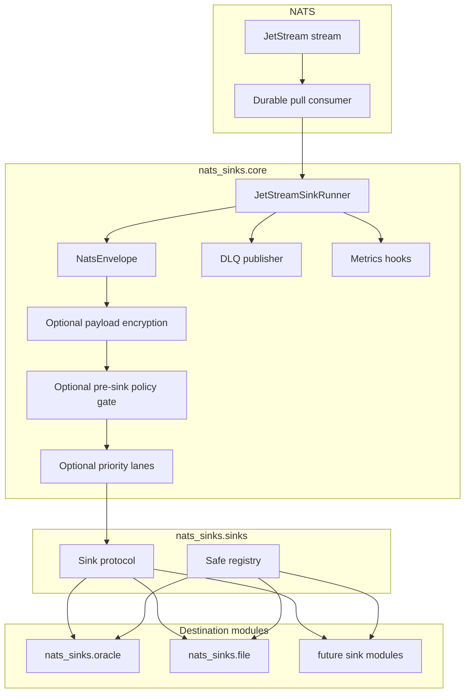

# Architecture

This page explains how the project is divided so that delivery safety is easy
to reason about. The most important concept is the difference between the core
runtime and a sink. The core runtime talks to NATS JetStream and owns message
delivery decisions. A sink talks to a destination system such as a database,
HTTP endpoint, file store, or object store and owns only destination writes.

The main architectural rule is:

> Core owns delivery semantics. Sinks own destination writes.

This separation keeps JetStream ACK behavior consistent across destinations. A sink implementation should be able to focus on writing to its destination and committing durable state. It should not need to know how to ACK, NAK, publish to DLQ, or manage a JetStream consumer.

This boundary matters especially in mission and defence-style deployments,
where multiple systems may depend on the same operational event stream. A
database outage, file-system delay, or schema issue should result in visible
redelivery or DLQ handling, not a quiet ACK that removes the event from the
processing path before it has crossed a durable boundary.

## Component Model

The diagram below shows the framework boundary. Oracle and local file output
are production destination modules, and additional destinations should fit into
the same shape: the runner manages JetStream, and sinks receive normalized
envelopes instead of raw NATS messages.



## Processing Path

The processing path is intentionally linear. A batch moves from JetStream to a
destination write, then to a durable commit, and only then to a JetStream ACK.

```text
JetStream stream
  -> durable consumer
  -> nats-sinks core runner
  -> optional payload encryption
  -> optional pre-sink policy gate
  -> optional in-batch priority lane ordering
  -> sink.write_batch(...)
  -> durable destination commit
  -> JetStream ACK
```

## Runtime Responsibilities

The core runtime handles:

- NATS and JetStream connectivity.
- Pull-based consumption.
- Bounded batch fetching.
- Conversion from raw NATS messages to `NatsEnvelope`.
- Optional payload encryption before sink delivery.
- Optional fail-closed policy enforcement after normalization and core payload
  transformation, but before any destination write.
- Optional priority-lane ordering for already-fetched bounded batches.
- Sink lifecycle.
- Temporary versus permanent failure handling.
- DLQ publication.
- ACK and NAK behavior.
- Metrics hooks.
- Graceful shutdown.

Destination sinks handle:

- connection management for the destination,
- batch writes,
- durable commit,
- destination-specific error translation,
- destination-specific idempotency behavior.

Mission-oriented deployments should treat this split as an accountability
boundary. The core provides a consistent delivery contract, while each sink
documents exactly what counts as durable success for its destination.

## JetStream Topology Boundary

The runner binds to the stream, durable consumer, and subject declared in
configuration. Advanced JetStream topology that exists before that point, such
as mirrors, sources, subject transforms, republish rules, stream compression,
placement, and stream metadata, remains a NATS platform concern.

Those choices can still affect the envelope the runner receives. A transform
may change the subject used by sink routing. A source or mirror may change how
operators interpret stream and sequence identity. Placement can affect latency
and reconnect behavior. The core does not hide these concerns; it keeps them
outside the delivery-control boundary so they can be reviewed as platform
architecture.

See [Advanced JetStream Topology](jetstream-topology.md) for the detailed
operator guidance.

## Why Raw NATS Messages Are Not Passed To Sinks

Raw `nats-py` messages expose `ack`, `nak`, and related methods. Passing raw messages into destination code would make it easy for a sink to ACK before durable success. `NatsEnvelope` prevents this by carrying payload and metadata without delivery-control methods.

Headers-only JetStream consumers are intentionally treated as a separate
design topic. nats-sinks can process empty payload bytes today, but explicit
headers-only support must distinguish a producer-empty message from a body that
the NATS server intentionally omitted. See
[Headers-Only Delivery Evaluation](headers-only-delivery.md) for the staged
design.

Ordered consumers are also intentionally separate from the production sink
runner. They are useful for inspection and analysis, but they are not a
replacement for durable pull consumers when writing to Oracle, files, or
future sinks. See [Ordered Consumer Evaluation](ordered-consumer-evaluation.md)
for the evaluation and follow-up tooling split.

## Extension Model

Future sinks should implement:

```python
class Sink(Protocol):
    async def start(self) -> None: ...
    async def write_batch(self, messages: Sequence[NatsEnvelope]) -> None: ...
    async def stop(self) -> None: ...
```

A future sink is production-ready only when it can demonstrate:

- no ACK ownership,
- durable success before returning from `write_batch`,
- idempotent duplicate handling,
- clear temporary/permanent error classification,
- deterministic unit tests,
- documentation for failure behavior.

Adding a new sink should be an additive release: a new module, optional
dependency extra, registry entry, tests, and destination-specific documentation.
The core `NatsEnvelope`, `Sink` protocol, commit-then-acknowledge ordering, and
existing Oracle configuration should remain compatible.

Payload encryption is also part of the core, not a sink-specific responsibility.
When enabled, the runner encrypts `NatsEnvelope.data` and passes a copied
envelope to the sink. Metadata remains clear. This lets all sinks store the
same encrypted payload envelope without duplicating cryptographic code.

Pre-sink policy enforcement is also part of the core. The policy gate is
configured with explicit allow-listed checks such as required priority,
classification, labels, mission metadata, encrypted payloads, and bounded
payload size. It does not run dynamic code or destination-specific SQL. A
policy rejection is handled as a permanent validation failure: the rejected
message does not reach the sink, and the core follows DLQ-before-ACK behavior
when a DLQ is configured.
