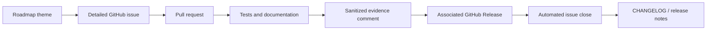
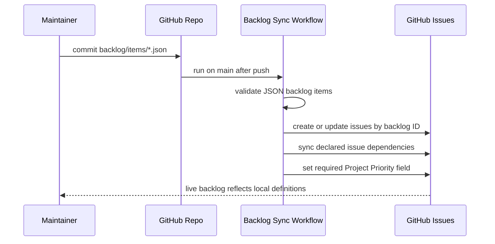
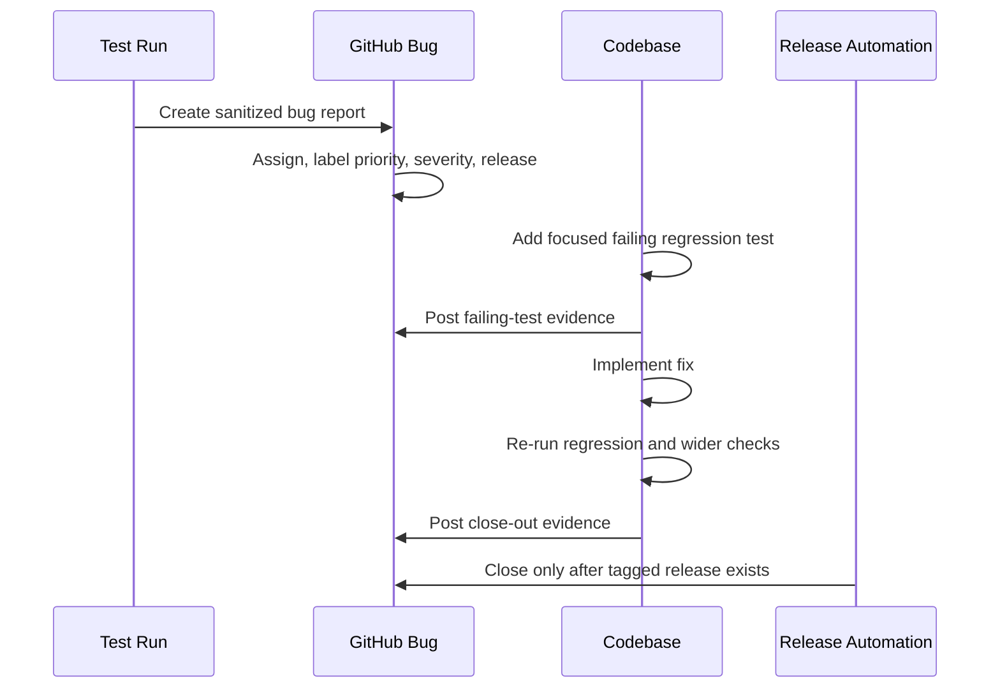

# Backlog Management

GitHub Issues are the live backlog for `nats-sinks`. The roadmap pages explain
themes and direction, while individual work items should live as detailed
issues in [ProjectCuillin/nats-sinks](https://github.com/ProjectCuillin/nats-sinks/).
`CHANGELOG.md` and the release pages record what has actually shipped.

This split keeps planning and release evidence clean:

- GitHub Issues describe requested work before implementation.
- Pull requests link to and close the issues they implement.
- `CHANGELOG.md` records user-visible behavior that has shipped or is staged
  under `Unreleased`.
- Release notes summarize the issues that were delivered by a tag.



## What Belongs In GitHub Issues

Create or maintain a GitHub issue for any user-visible feature, sink
capability, security hardening task, observability connector, deployment
asset, compatibility decision, or documentation effort that is more than a
small typo. A roadmap bullet is not enough for implementation work. The issue
should be detailed enough for a future maintainer to understand the work
without reading chat history.

Good issue topics include:

- a new sink such as Postgres, HTTP, S3, or Kafka,
- a new NATS capability such as consumer reconciliation or `AckSync`,
- a security hardening task such as payload size policies,
- an observability connector such as OpenTelemetry,
- a deployment feature such as Helm charts or Docker images,
- a documentation package for a mission-support workflow,
- a compatibility change that affects public imports or CLI behavior.

Very small typo fixes can be handled directly in a pull request, but the pull
request should still explain the change.

## Opening A Feature Request

Use the GitHub issue form named **Feature request or backlog item**. Fill every
section with concrete information:

- area and priority,
- target release, or `unscheduled` when the work has not been assigned,
- problem statement,
- proposed outcome,
- intended users and operational context,
- delivery semantics and idempotency impact,
- security and privacy considerations,
- acceptance criteria,
- test plan,
- documentation and release-note plan,
- close-out evidence expected when the issue is implemented.

The delivery-semantics section is required because all work must preserve the
project invariant:

> Commit first. ACK last. Design for redelivery.

If the work touches sinks, retries, DLQ behavior, payload transformation,
encryption, metadata, observability, or NATS connection handling, explicitly
state how safe redelivery and idempotency remain intact.

## Local Backlog Files

Maintainers may define backlog items locally before syncing them to GitHub.
Local backlog files are JSON files under `backlog/items/*.json`. JSON is used
because the project already uses strict JSON for runtime configuration and
because local backlog files are intended to be easy to validate without custom
parsers.

The local JSON file is a staging record, not the live backlog. After sync, the
GitHub Issue remains the authoritative item.

Example local item:

```json
{
  "id": "postgres-sink",
  "title": "[Feature]: Add a production Postgres sink",
  "area": "Future sink",
  "priority": "P2 - next minor release candidate",
  "target_release": "unscheduled",
  "labels": ["sink-new"],
  "problem": "Operators need a durable relational sink for PostgreSQL deployments.",
  "proposal": "Add a Postgres sink with idempotent merge and insert-ignore behavior.",
  "users": "Operators and developers running NATS JetStream with PostgreSQL as the durable event store.",
  "delivery_semantics": "The sink must commit the PostgreSQL transaction before the core ACKs JetStream messages. Duplicate redelivery must be safe through ON CONFLICT-based idempotency.",
  "security": "Use bind parameters for values, allow-list SQL identifiers, avoid logging payloads or connection strings, and document least-privilege grants.",
  "acceptance": [
    "PostgresSink is documented as a production sink.",
    "Unit tests prove duplicate handling and no ACK on sink failure.",
    "CHANGELOG.md is updated."
  ],
  "tests": "pytest tests/unit/test_postgres_*.py; mkdocs build --strict; scripts/check.sh",
  "documentation": "Update sink framework, configuration, README, and a new Postgres sink page.",
  "closeout": "Closing notes must include implementation PR, tests, docs, changelog, limitations, and follow-up issues.",
  "relationships": {
    "blocked_by": ["backlog:sink-certification-contract-and-tests"],
    "related": ["backlog:oracle-per-route-idempotency-overrides"]
  }
}
```

Do not put secrets, real server addresses, credentials, certificate material,
Oracle wallet content, sensitive subjects, classified examples, payloads,
network locators, IP literals, or private infrastructure details in local
backlog files. They are intended to be committed and synced into public GitHub
Issues. The sync script rejects common leak patterns such as network locators,
IP literals, token-like values, certificate blocks, and credential assignments
before an issue body is generated.

Validate local backlog files without touching GitHub:

```bash
python scripts/sync-backlog-issues.py --check
python scripts/sync-backlog-issues.py --dry-run
```

The local validation is part of `scripts/check.sh`, CI, and pre-commit.

## Syncing Local Backlog Files With GitHub CLI

The repository includes `scripts/sync-backlog-issues.py`, which uses the
GitHub CLI (`gh`) to create or update GitHub Issues from local backlog JSON
files.

Before syncing from a local workstation:

```bash
gh auth status --hostname github.com
gh auth login --hostname github.com --web
```

Preview the sync:

```bash
python scripts/sync-backlog-issues.py --dry-run
```

Create or update issues:

```bash
python scripts/sync-backlog-issues.py
```

The script is idempotent. Each generated issue body contains a hidden marker:

```text
<!-- nats-sinks-backlog-id: postgres-sink -->
```

On the next run, the script searches for that marker and updates the existing
open issue rather than creating a duplicate. Closed issues are left closed by
default so shipped work is not accidentally reopened. Use `--reopen-closed`
only when a maintainer deliberately wants to reopen a closed backlog issue.

The script also tries to create missing labels for the labels used by local
backlog items. Use `--skip-label-sync` if the token does not have permission to
create labels and the labels already exist.

The `target_release` field is rendered into the issue body and also becomes a
release label. Unscheduled work receives `release-unscheduled`. When a
maintainer starts work for a planned release, update the local item to a
concrete tag such as `v0.4.0` and sync it again, or use the comment helper
described below to add the release label to the live issue.

The `priority` field is rendered into the issue body and synchronized into the
official GitHub Issue `Priority` field. Priority is not represented as a GitHub
label for new managed issues. Older managed issues may still carry legacy
labels such as `priority-p2`; the sync tooling removes those legacy labels on
update so the native Issue field remains the single planning surface.

Use the JSON `priority` field as the source of truth and let the sync tooling
manage the GitHub Issue field. This avoids small spelling differences that make
issue searches, release planning, and triage views unreliable.

## GitHub Issue Priority Field

GitHub provides organization-level Issue fields. `nats-sinks` uses the native
single-select field named `Priority` with the standard GitHub values `Urgent`,
`High`, `Medium`, and `Low`. The local backlog keeps a more explicit
release-planning vocabulary and maps it to GitHub as follows:

| Local priority | GitHub Issue `Priority` value |
| --- | --- |
| `P1 - release blocker` | `Urgent` |
| `P2 - next minor release candidate` | `High` |
| `P3 - backlog candidate` | `Medium` |
| `P4 - research or design needed` | `Low` |

On a maintainer workstation, authorize the GitHub CLI for issue updates once:

```bash
gh auth refresh -s repo -s read:org
```

Then configure the organization Issue field target before syncing:

```bash
export NATS_SINKS_GITHUB_ISSUE_FIELD_ORG=ProjectCuillin
export NATS_SINKS_GITHUB_ISSUE_PRIORITY_FIELD=Priority
# Optional when automation can edit issues but cannot list organization fields.
export NATS_SINKS_GITHUB_ISSUE_PRIORITY_FIELD_ID=41029122

python scripts/sync-backlog-issues.py
python scripts/sync-bug-reports.py
```

For one-off local migrations, the same Issue field target can be passed without
exporting environment variables:

```bash
python scripts/sync-backlog-issues.py \
  --issue-field-org ProjectCuillin \
  --issue-priority-field Priority \
  --issue-priority-field-id 41029122

python scripts/sync-bug-reports.py \
  --issue-field-org ProjectCuillin \
  --issue-priority-field Priority \
  --issue-priority-field-id 41029122
```

The same metadata can be refreshed for all currently open managed issues:

```bash
python scripts/sync-issue-planning.py \
  --issue-field-org ProjectCuillin \
  --issue-priority-field Priority \
  --issue-priority-field-id 41029122 \
  --dry-run

python scripts/sync-issue-planning.py \
  --issue-field-org ProjectCuillin \
  --issue-priority-field Priority \
  --issue-priority-field-id 41029122
```

When the Issue field organization or field name is invalid, live backlog and bug
sync commands fail before creating or updating issues. This is intentional. It
keeps new managed issues from being published without their official priority
field. The optional numeric field ID lets automation skip the organization
field-list call while still writing the official field; it should be copied from
GitHub's Issue field metadata and reviewed whenever the organization field is
recreated. Dry-runs remain available for local validation, and
`scripts/sync-issue-planning.py --skip-priority-field` exists only for
deliberate relationship-only maintenance.

For GitHub Actions, set repository variables:

- `NATS_SINKS_GITHUB_ISSUE_FIELD_ORG`, usually `ProjectCuillin`; and
- `NATS_SINKS_GITHUB_ISSUE_PRIORITY_FIELD`, usually `Priority`.
- `NATS_SINKS_GITHUB_ISSUE_PRIORITY_FIELD_ID`, optional numeric field ID for
  tokens that can edit issues but cannot list organization Issue fields.

The workflows use the short-lived `GITHUB_TOKEN` with repository issue write
permission by default. If GitHub requires a broader token to access the Issue
field preview in your organization, configure a narrowly scoped, short-lived
secret named `NATS_SINKS_ISSUE_FIELDS_TOKEN` and prefer the explicit field ID
variable above so the token does not need to enumerate organization metadata.
Do not configure broad long-lived personal tokens for this path unless a GitHub
platform limitation leaves no safer option.

## Issue Relationships

Backlog and bug JSON files may declare relationships in a `relationships`
object:

```json
{
  "relationships": {
    "blocked_by": ["backlog:sink-certification-contract-and-tests"],
    "blocks": ["#91"],
    "related": ["bug:adjacent-defect"]
  }
}
```

Supported references are:

- `#123` for an existing GitHub issue number;
- `backlog:identifier` for another managed backlog item; and
- `bug:identifier` for another managed bug report.

The `blocked_by` and `blocks` relationships are synchronized to GitHub's native
issue dependency relationships when the target issue can be resolved. The
`related` list is rendered in the issue body for human navigation because
GitHub's native dependency API models blocking relationships rather than every
possible loose relationship.

Do not put URLs, private system names, service endpoints, IP addresses, payload
examples, or other confidential details in relationship fields. Use managed
issue identifiers or issue numbers only.

## Automatic GitHub Sync

The workflow `.github/workflows/backlog-sync.yml` can sync local backlog files
automatically. It runs when JSON files under `backlog/items/` change on `main`,
and it can also be started manually from the GitHub Actions tab.

The workflow uses the repository `GITHUB_TOKEN` through `gh` and requests:

```yaml
permissions:
  contents: read
  issues: write
```

For manual validation without writing issues, run the workflow with
`dry_run=true`.



This workflow only syncs files that are committed to the repository. If a
maintainer discovers a backlog item locally but does not want to commit a JSON
file, they can run the local sync command directly with `gh`.

## Triage Labels

Use labels consistently so the backlog can be filtered:

| Label | Meaning |
| --- | --- |
| `backlog` | Planned or proposed work that has not been implemented. |
| `enhancement` | A user-visible improvement or new capability. |
| `bug` | A reproducible defect. |
| `security` | Security posture, redaction, authentication, cryptography, dependency, or abuse-case work. |
| `documentation` | Documentation-only or documentation-led work. |
| `sink-oracle` | Oracle-specific work. |
| `sink-file` | File sink work. |
| `sink-new` | Future sink work. |
| `observability` | Metrics, snapshots, Prometheus, OpenTelemetry, or future observability connector work. |
| `nats` | NATS connection, JetStream, consumer, ACK, advisory, or stream behavior. |
| `release` | Packaging, PyPI, GitHub Releases, SBOM, CI, or release automation. |
| `release-unscheduled` | Work has not yet been assigned to a release tag. |

Labels do not replace clear issue bodies. They only make filtering easier.
Concrete release labels use the form `release-vX.Y.Z`, for example
`release-v0.4.0`. A feature request should not be closed merely because it has
that label. It closes only after the release containing the work has actually
been published.

## Implementing A Backlog Item

Before starting implementation:

1. Find the matching GitHub issue.
2. If no issue exists for a user-visible change, create one first unless the
   change is a small typo or mechanical maintenance item.
3. Confirm the issue has acceptance criteria and a test plan.
4. Link the issue from commits, branches, or the pull request description.

During implementation:

1. Keep the change scoped to the issue.
2. Assign the issue to the maintainer doing the work.
3. Post a public, sanitized implementation note before or during the work.
4. Add or update the release label that identifies the release expected to
   contain the work.
5. Update tests, examples, documentation, and `CHANGELOG.md` as part of the
   same change.
6. Preserve public API compatibility unless the issue explicitly describes a
   breaking change and the release plan accepts it.
7. Keep `docs/test-report.md` sanitized when refreshing validation evidence.

The pull request should normally use `Related #123` rather than `Closes #123`.
Feature requests remain open until the release containing the work is
published. Release automation closes managed issues at that boundary.

Pull requests should also carry the same searchable labels as the source
issue. `scripts/open-release-pr.sh` copies labels by default after it creates
or refreshes the pull request. It discovers source issues from branch names
such as `issue-123-short-name`, from `Related #123` references in the pull
request body, and from explicit `--issue` arguments:

```bash
scripts/open-release-pr.sh \
  --repo ProjectCuillin/nats-sinks \
  --base release-v0.4.1 \
  --issue 123 \
  --ready
```

Use `--no-copy-issue-labels-to-pr` only for exceptional maintenance work where
the PR intentionally has no source issue. Label synchronization copies GitHub
labels only. The official GitHub Issue `Priority` field is issue metadata, not
a pull request label, so priority remains managed by the backlog and bug sync
tooling on the issue itself.

Issue, feature, and development bug pull requests use guarded non-main
auto-approval after implementation evidence is complete and the pull request
is marked ready:

```bash
scripts/open-release-pr.sh \
  --repo ProjectCuillin/nats-sinks \
  --base release-v0.4.1 \
  --ready
```

This convenience is only for pull requests that merge into another work branch.
The helper refuses every pull request whose base branch is `main`. Release pull
requests into `main` still require explicit maintainer review, release
validation, and the normal release decision.

Use `scripts/comment-backlog-issue.py` for progress notes so comments are
validated with the same public-safety rules as local backlog JSON:

```bash
python scripts/comment-backlog-issue.py \
  --backlog-id postgres-sink \
  --release v0.4.0 \
  --status started \
  --assignee louwersj \
  --comment-file .local/backlog-comment.md \
  --dry-run
```

When the dry run is clean and GitHub CLI authentication is available, run the
same command without `--dry-run`. The helper finds the issue by the hidden
backlog marker, assigns the issue when `--assignee` is supplied, posts the
comment, adds the release label, and removes `release-unscheduled` when a
concrete release label is applied. The comment file must not contain secrets,
certificate material, private operational details, network locators, IP
literals, token-like values, or credential assignments.

Start comments must include these headings:

```markdown
## Planned Work

## Test Plan

## Documentation And Release Notes
```

Completion and close-out comments must include these headings:

```markdown
## Completed Work

## Acceptance Criteria

## Test Plan Evidence

## Close-Out Evidence
```

Use `--complete-acceptance` after the work has been implemented and the test
plan has been executed. This marks all checklist items in the issue's
`Acceptance Criteria` section as complete while leaving other checklists
unchanged:

```bash
python scripts/comment-backlog-issue.py \
  --backlog-id postgres-sink \
  --release v0.4.0 \
  --status completed \
  --assignee louwersj \
  --complete-acceptance \
  --comment-file .local/backlog-complete.md \
  --dry-run
```

When the lifecycle status is `completed`, `closeout`, or `released`, the helper
also applies the GitHub label `completed`. That label intentionally does not
close the issue. It means the work is complete in the development branch and is
waiting for the release workflow to close the issue after the matching GitHub
Release exists.

The evidence comment should include sanitized command names and summarized
results. Do not paste raw logs from private systems. Prefer links to public CI
runs, package artifacts, release notes, or the sanitized
`docs/test-report.md` summary when evidence needs to survive beyond a local
terminal session.

## Closing A Feature Request

Close feature requests with enough detail that the issue remains useful as
release evidence. A feature request should close only after the release that
contains it has actually been published. Before a release can close a managed
issue, the issue must have the evidence signals below. In normal workflow it
will also carry the `completed` label once implementation evidence has been
posted:

- a concrete release label such as `release-v0.4.0`,
- all `Acceptance Criteria` checklist items ticked,
- a public sanitized comment containing `Test Plan Evidence`,
- a public sanitized comment containing `Close-Out Evidence`,
- no secrets, private locators, IP addresses, credential assignments,
  certificate material, or sensitive payload examples in the comments.

The closing comment or pull request summary should include:

- the PR or commit that implemented the issue,
- the shipped behavior,
- user-visible configuration, API, CLI, or documentation changes,
- tests and checks that passed,
- documentation and changelog pages updated,
- known limitations,
- follow-up issues for deferred work.

Example close-out comment:

```text
Implemented in #123.

Shipped:
- Added policy-controlled OpenTelemetry metrics export.
- Kept Prometheus textfile export unchanged and disabled by default.
- Added config validation for exporter endpoint and timeout fields.

Validation:
- pytest tests/unit/test_observability_policy.py
- pytest tests/unit/test_otlp_observability.py
- scripts/check-docs.sh
- scripts/check.sh

Docs and release notes:
- Updated docs/observability.md, docs/configuration.md, and CHANGELOG.md.

Limitations:
- Trace export remains out of scope. Follow-up: #124.
```

For release-gated close-out, use the comment helper with `--close-released`.
The helper verifies that the named GitHub Release exists before closing the
issue. Most issues should be closed by the release workflow instead of this
manual command, but the manual path is available for maintainer repair work:

```bash
python scripts/comment-backlog-issue.py \
  --backlog-id postgres-sink \
  --release v0.4.0 \
  --status released \
  --comment-file .local/backlog-closeout.md \
  --close-released
```

This keeps the workflow honest: implementation may be complete in a branch,
but the public feature request remains open until the release containing that
implementation is published.

The release workflow runs the same release-boundary rule automatically. After
`.github/workflows/release.yml` creates or updates the GitHub Release for a
tag, it runs `scripts/close-released-backlog-issues.py`. That script closes
only open managed backlog issues with both the `backlog` label and the matching
release label, such as `release-v0.4.0`. It also verifies that the issue body
contains the hidden backlog marker, so unrelated issues that happen to share a
label are not closed by accident. It now also verifies that all acceptance
criteria are checked and that close-out evidence plus test-plan evidence were
posted before it closes the issue. If any of those signals are missing, the
workflow logs a skip reason and leaves the issue open.

## Keeping Roadmap And Issues In Sync

The roadmap should not be a hidden backlog. When a roadmap item becomes
actionable, create a GitHub issue and link it from the roadmap or from the
release planning discussion. When an item ships, remove it from future-looking
roadmap sections or move it to current-capability documentation.

Before a release:

1. Review all merged pull requests since the previous tag.
2. Confirm every closed feature issue has a detailed close-out summary.
3. Confirm `CHANGELOG.md` describes the shipped behavior.
4. Confirm open issues still represent future work and are not already done.
5. Confirm release notes link to the relevant issues or pull requests.

All implementation work for backlog and bug issues must happen inside the
hierarchical release branch model. The active release branch is named
`release-vX.Y.Z`. Feature and issue branches are created from that release
branch using names such as `issue-123-short-name` or
`feature-123-short-name`. Bugs found while developing a feature branch are
created from that feature branch using names such as `bug-456-short-name`.
Ordinary branch pushes are quiet: they should not start GitHub Actions. Pull
requests target the next branch in the hierarchy: bug branch to feature branch,
feature branch to release branch, and release branch to `main` only when the
maintainer explicitly decides to release. See
[Hierarchical Branch Development And Release Workflow](branch-workflow.md).

## Working With AI Agents

AI agents can help draft, refine, and close issues, but they must not treat
chat history as the backlog. When an agent implements a feature, it should:

- check whether a matching GitHub issue exists,
- create or switch to the approved release, issue, feature, or bug branch
  before editing files,
- create or update a local `backlog/items/*.json` file when a new backlog item
  is discovered and live GitHub access is not available,
- use `scripts/sync-backlog-issues.py --dry-run` to validate generated backlog
  files before asking a maintainer to sync them,
- use `scripts/comment-backlog-issue.py --dry-run` before posting progress or
  close-out comments,
- mention the issue number in its implementation summary when known,
- push small commits to the active branch without triggering GitHub Actions on
  every push,
- run `scripts/run-release-validation.sh` only when the release branch is ready
  for merge or a maintainer explicitly requests validation for a feature
  branch,
- update `CHANGELOG.md` and documentation,
- explain tests and known limitations in the final response,
- help draft a detailed issue close-out comment.

If GitHub authentication is not available locally, the agent should prepare the
issue body or close-out text in Markdown and clearly state that it has not
created or closed the live GitHub issue.

## Managed Bug Reports And TDD Fixes

Bug reports follow a similar public-evidence workflow, but they are not feature
requests. A bug is a defect in existing behavior. When a maintainer or agent
finds a defect during testing, review, integration work, or release
preparation, it should be captured as a managed GitHub bug report before the
fix is implemented unless the issue is a tiny typo or a non-user-visible
mechanical cleanup.

The expected bug workflow is deliberately test driven:

1. Create or sync a sanitized bug report.
2. Assign the issue to `louwersj`.
3. Add the correct priority, severity, and release labels.
4. Write the smallest focused failing regression test that proves the bug.
5. Add that test to the normal test suite.
6. Post a sanitized `failing-test` comment that names the committed test and
   summarizes the expected failure.
7. Post a `started` comment describing the planned fix, test-driven plan, docs,
   and release-note work.
8. Implement the fix.
9. Run the focused regression test again and then the relevant wider checks.
10. Post a `completed` or `closeout` comment with regression evidence,
    verification evidence, checked acceptance criteria, documentation changes,
    and release target.
11. Keep the bug open until the release containing the fix is published.



Local managed bug reports live under `bugs/reports/*.json`. They are intended
to be committed and synced to public GitHub Issues, so they must not contain
secrets, live service locators, IP addresses, credentials, certificate
material, Oracle wallet data, sensitive subjects, sensitive payload examples,
or private operational details.

Example local bug report:

```json
{
  "id": "sample-regression",
  "title": "[Bug]: Sample regression summary",
  "area": "Core runtime and delivery semantics",
  "severity": "medium",
  "priority": "P2 - next minor release candidate",
  "target_release": "unscheduled",
  "labels": ["testing"],
  "summary": "A deterministic behavior no longer matches the documented contract.",
  "observed": "The focused regression test shows the current incorrect behavior.",
  "expected": "The documented behavior should remain stable.",
  "reproduction": "Run the committed focused regression test.",
  "failing_test": "Add tests/unit/test_sample_regression.py before changing production code.",
  "impact": "The defect can confuse maintainers and users relying on the documented contract.",
  "delivery_semantics": "Commit-then-acknowledge must remain unchanged.",
  "security": "No secrets, payloads, locators, or private details are needed to reproduce the defect.",
  "acceptance": [
    "A focused failing regression test is committed before the fix.",
    "The same regression test passes after the fix.",
    "CHANGELOG.md is updated when behavior changes."
  ],
  "tests": "pytest tests/unit/test_sample_regression.py; scripts/check.sh",
  "documentation": "Update affected documentation and CHANGELOG.md if the fix changes user-visible behavior.",
  "closeout": "Close only after the release containing the fix is published."
}
```

Validate local bug reports without writing to GitHub:

```bash
python scripts/sync-bug-reports.py --check
python scripts/sync-bug-reports.py --dry-run
```

Create or update managed GitHub bug reports:

```bash
python scripts/sync-bug-reports.py
```

The bug sync script uses a hidden marker such as:

```text
<!-- nats-sinks-bug-id: sample-regression -->
```

The hidden marker lets the tool update an existing bug report instead of
creating duplicates. The script also applies:

- `bug`,
- one release label such as `release-unscheduled` or `release-v0.4.0`,
- one severity label such as `severity-medium`,
- additional safe labels from the JSON file,
- the default assignee `louwersj`.

Priority is synchronized to the configured GitHub Issue `Priority` field, not to
an issue label. If a managed bug still carries a legacy `priority-p*` label, the
sync tooling removes it during the next update.

Use `scripts/comment-bug-issue.py` for lifecycle notes. A failing-test comment
must include these headings:

```markdown
## Failing Test

## Reproduction Evidence

## Expected Failure
```

A started fix comment must include:

```markdown
## Planned Fix

## Test Driven Plan

## Documentation And Release Notes
```

A completed or close-out comment must include:

```markdown
## Completed Fix

## Acceptance Criteria

## Regression Test Evidence

## Verification Evidence

## Close-Out Evidence
```

Example dry run:

```bash
python scripts/comment-bug-issue.py \
  --bug-id sample-regression \
  --release v0.4.0 \
  --status failing-test \
  --comment-file .local/bug-failing-test.md \
  --test-file tests/unit/test_sample_regression.py \
  --dry-run
```

Use `--test-file` with `--status failing-test` when the focused regression
test is small and safe to publish. The helper accepts files under `tests/` or
`scripts/`, applies the same public leak checks to the file path and content,
and appends the test in a fenced code block to the GitHub comment. The fence
language is derived from the file extension so Python, shell, JSON, Markdown,
TOML, YAML, and plain-text attachments remain readable in GitHub. If the test
contains private locators, credentials, certificate material, sensitive
payloads, or any other non-public detail, sanitize the test before publishing
it or summarize the evidence instead.

Release automation closes managed bug reports only after the associated GitHub
Release exists. A bug is eligible for automated close only when:

- it has the `bug` label,
- it has the concrete release label,
- it may carry the `completed` label to show the fix is complete in
  development,
- the issue body contains the managed bug marker,
- all Acceptance Criteria checkboxes are checked,
- a sanitized comment contains `Regression Test Evidence`,
- a sanitized comment contains `Verification Evidence`,
- a sanitized comment contains `Close-Out Evidence`.

This keeps the public defect record honest: a bug can be fixed in development,
but it remains open until users can install the release that contains the fix.
The `completed` label is applied by `scripts/comment-bug-issue.py` for
`completed`, `closeout`, and `released` lifecycle statuses so maintainers can
filter fixed-but-not-yet-released defects.
