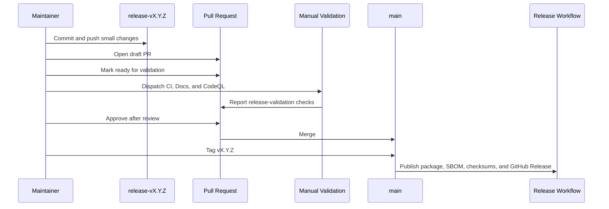

# Branch-First Development And Release Workflow

`nats-sinks` uses a branch-first workflow. All implementation work, issue
work, release preparation, documentation updates, and release-note changes must
be done on a work branch. The `main` branch is the public release integration
branch and should only change through reviewed pull requests.

This workflow protects users who install from PyPI, GitHub Releases,
Read the Docs, or GitHub Pages. It also gives maintainers a clear audit trail:
every released change can be traced to a branch, a pull request, automated
checks, review approval, release notes, and any related GitHub issues.

Ordinary work-branch pushes are intentionally quiet. GitHub Actions should not
start after every small commit. Validation is started deliberately when the
branch is ready for merge or release.

## Required Flow

```mermaid
flowchart LR
    Issue[GitHub issue or maintainer task]
    Branch[release, feature, bugfix, or hotfix branch]
    Push[Push quiet small commits to branch]
    PR[Draft pull request to main]
    Ready[Mark PR ready for release validation]
    Checks[Manually dispatch CI, CodeQL, and docs]
    Review[Maintainer or CODEOWNER review]
    Merge[Merge PR into main]
    Tag[Tag main for release]
    Release[Release workflow publishes artifacts]

    Issue --> Branch --> Push --> PR --> Ready --> Checks --> Review --> Merge --> Tag --> Release
```



The release boundary is intentionally conservative:

1. Create or switch to a work branch before editing files.
2. Commit and push small changes to that branch as work progresses.
3. Keep branch pushes quiet; do not run GitHub Actions after every small
   branch update.
4. Open or refresh a draft pull request with `scripts/open-release-pr.sh`.
5. Keep managed issue comments, acceptance criteria, and evidence up to date.
6. When the branch is ready for merge or release, mark the pull request ready
   and run `scripts/run-release-validation.sh`.
7. Wait for CI, CodeQL, documentation checks, dependency review, and sink
   checks to pass.
8. Require maintainer approval through CODEOWNERS and branch protection.
9. Merge the pull request into `main`.
10. Create the release tag from `main`, not from the work branch.

## Branch Names

Use clear branch prefixes so automation can decide what kind of work is being
reviewed:

| Prefix | Use |
| --- | --- |
| `release-vX.Y.Z` | Release preparation for a specific version, for example `release-v0.4.1`. |
| `feature-short-name` | New non-release feature work. |
| `bugfix-short-name` | Bug fixes and regression work. |
| `hotfix-short-name` | Urgent fixes that should move quickly but still require review. |

The pull request governance workflow rejects pull requests into `main` from
unexpected branch names. Dependabot branches are allowed separately.

## Pull Requests Without Per-Push Actions

Pull requests are normally created from a maintainer workstation:

```bash
scripts/check-gh-auth.sh
scripts/open-release-pr.sh --repo ProjectCuillin/nats-sinks
```

The local helper refuses to run from `main`. It pushes the current branch,
creates or updates a draft pull request, and uses a release-control checklist
in the pull request body. Draft pull requests keep review intent visible while
avoiding validation churn on every small branch push.

When the branch is ready, mark the pull request ready in GitHub and dispatch
release validation:

```bash
scripts/run-release-validation.sh --repo ProjectCuillin/nats-sinks
```

That helper starts the manual `CI`, `Docs`, and `CodeQL` workflows for the
current branch. Use it only when the branch is ready for merge or release.

The repository also includes a manual `.github/workflows/auto-pr.yml` workflow
for token-gated pull request creation. It is not triggered by branch pushes.

The workflow requires a repository secret named `NATS_SINKS_PR_BOT_TOKEN`.
GitHub intentionally prevents the default repository `GITHUB_TOKEN` from
creating or approving pull requests in some repository configurations. Use a
least-privileged fine-grained personal access token or GitHub App token that
can create pull requests in this repository. If the secret is not configured,
the workflow exits successfully with a notice and does not create a pull
request.

## Main Branch Protection

GitHub branch protection is the hard enforcement layer. The repository should
protect `main` with these settings:

- require a pull request before merging,
- require at least one approving review,
- require CODEOWNER review,
- dismiss stale approvals after new commits,
- require conversation resolution,
- require the CI matrix for Python 3.11, 3.12, and 3.13,
- block force pushes,
- block branch deletion,
- include administrators in the rule.

Apply or refresh that policy with:

```bash
scripts/check-gh-auth.sh
scripts/apply-branch-protection.sh --repo ProjectCuillin/nats-sinks
```

The authenticated GitHub account must have permission to administer branch
protection. The script does not read or print tokens.

## Release Tags Must Come From Main

The release workflow validates that a tag such as `v0.4.1` points at a commit
already merged into `main`. If a maintainer accidentally tags a release branch
before merging it, the release workflow fails before publishing to PyPI.



## Managed Issue References

Managed backlog and bug issues should remain open until the release containing
the fix is actually published. Pull requests should normally use `Related
#123`, not `Closes #123`, `Fixes #123`, or `Resolves #123`.

The pull request governance workflow rejects auto-closing keywords in pull
requests into `main`. Release automation closes eligible managed issues after
the GitHub Release exists and the required evidence has been posted.

## What To Do If Main Is Changed Directly

A direct commit to `main` is treated as a process failure, even if the code is
technically correct. The maintainer should:

1. stop release preparation,
2. verify branch protection is still enabled,
3. document the exception in the relevant GitHub issue or release notes,
4. create follow-up work if automation or permissions allowed the bypass,
5. continue future work from a branch.

The goal is not bureaucracy. The goal is a public, reviewable release trail for
a package that is intended for operational and mission-support environments.
