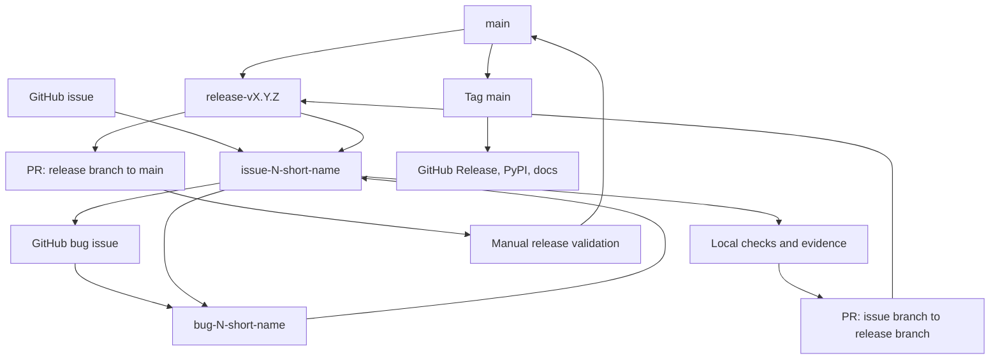
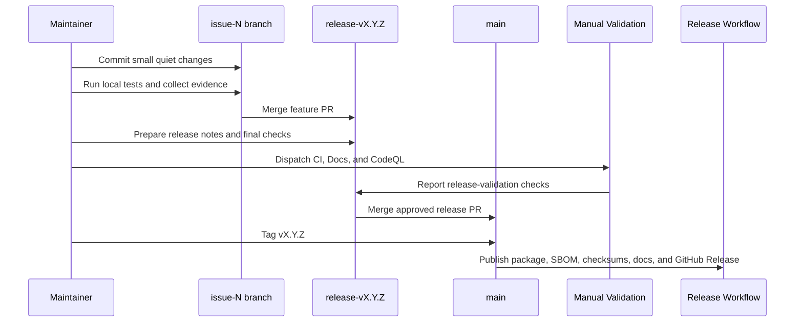

# Hierarchical Branch Development And Release Workflow

`nats-sinks` uses a hierarchical branch workflow. The `main` branch is the
public release integration branch. It should only change when maintainers
explicitly decide to release and merge the current release development branch.

Ordinary development happens below the release branch:

- one `release-vX.Y.Z` branch exists for the upcoming release,
- each feature or managed issue gets its own issue branch from that release
  branch,
- each bug found while developing a feature gets its own bug branch from the
  feature branch,
- solved bug branches merge back into their feature branch,
- completed feature branches merge back into the release branch,
- the release branch merges into `main` only for an explicit release.

This workflow protects users who install from PyPI, GitHub Releases, Read the
Docs, or GitHub Pages. It also gives maintainers a clear audit trail: every
released change can be traced to an issue, a branch, a pull request, local test
evidence, documentation updates, release notes, and, when relevant, GitHub
Actions release validation.

Ordinary branch pushes are intentionally quiet. GitHub Actions should not start
after every small commit. Validation is started deliberately when a maintainer
is ready to merge a feature branch into the release branch or when the release
branch is ready to merge into `main`.

## Required Flow



The release boundary is intentionally conservative:

1. Start every release from `main` with a branch named `release-vX.Y.Z`.
2. Start every feature or managed issue from the release branch with a branch
   named `issue-N-short-description` or `feature-N-short-description`.
3. If a defect is found during feature development, create a bug report and a
   branch named `bug-N-short-description` from the active feature branch.
4. Add the smallest focused regression test before fixing a bug.
5. Merge the bug branch back into the feature branch after the test evidence
   proves the fix.
6. Close branch-local development bug issues after their bug branch has merged
   into the feature branch and the issue contains sanitized evidence.
7. Merge completed feature branches into the release branch after local checks,
   documentation, changelog updates, and issue evidence are complete.
8. Keep ordinary branch pushes quiet; do not run GitHub Actions after every
   small branch update.
9. Run manual release validation only when the release branch is ready to merge
   into `main`, or when a maintainer explicitly requests validation for an
   important feature merge.
10. Merge the release branch into `main` only when the maintainer explicitly
    decides to release.
11. Create the release tag from `main`, not from any release, feature, or bug
    branch.

## Branch Names

Use clear branch prefixes so humans and automation can understand the merge
target:

| Prefix | Base Branch | Merge Target | Use |
| --- | --- | --- | --- |
| `release-vX.Y.Z` | `main` | `main` | Release integration for a specific version, for example `release-v0.4.1`. |
| `issue-N-short-name` | `release-vX.Y.Z` | `release-vX.Y.Z` | Normal issue implementation work. |
| `feature-N-short-name` | `release-vX.Y.Z` | `release-vX.Y.Z` | Feature work when the `feature` wording is clearer than `issue`. |
| `bug-N-short-name` | Active issue or feature branch | Active issue or feature branch | Defects found during development of that feature. |
| `hotfix-N-short-name` | `main` or a release branch | `main` or release branch | Urgent release-bound fixes that still require review. |

Avoid branch names that reveal private customer names, IP addresses, internal
systems, sensitive subjects, or operational details. Use public-safe issue
numbers and short neutral descriptions.

## Pull Request Targets

Pull request bases must follow the branch hierarchy:

| Current Branch | Pull Request Base | When To Open |
| --- | --- | --- |
| `bug-N-*` | the active `issue-N-*` or `feature-N-*` branch | After the failing regression test and fix are ready for review. |
| `issue-N-*` or `feature-N-*` | `release-vX.Y.Z` | After local checks, documentation, changelog, and issue evidence are complete. |
| `release-vX.Y.Z` | `main` | Only when the maintainer explicitly decides to release. |

Use `Related #123` in pull request descriptions for managed release-bound
issues. Avoid `Closes #123`, `Fixes #123`, or `Resolves #123` unless the issue
is intentionally closed before release. Release automation closes eligible
release-bound feature and bug issues after the associated GitHub Release exists
and the required evidence is present.

Pull requests should carry the same searchable labels as the managed source
issue. The local helper copies labels onto the PR by default. It detects issue
numbers from branch names such as `issue-123-short-name`, from dedicated
`Related #123` lines in the pull request body, and from explicit `--issue`
arguments.
This keeps GitHub issue and PR views aligned for release labels, sink labels,
bug labels, documentation labels, and the `completed` lifecycle label. The
official GitHub Issue `Priority` field is not copied because it is issue-field
metadata rather than a PR label.

Development-only bug reports created while working on a feature may be closed
when the bug branch has merged back into the feature branch. These bugs never
reached a released artifact, so their closure boundary is the feature branch
that contains the fix. The bug report must still include the failing test, the
fix approach, the successful test evidence, and a sanitized close-out comment.

## Local Pull Request Helper

Pull requests are normally created from a maintainer workstation:

```bash
scripts/check-gh-auth.sh
scripts/open-release-pr.sh --repo ProjectCuillin/nats-sinks --base release-v0.4.1
```

The helper refuses to run from `main`. It pushes the current branch, creates or
updates a draft pull request, and uses a release-control checklist in the pull
request body. Draft pull requests keep review intent visible while avoiding
validation churn on every small branch push.

Use an explicit `--base` whenever the current branch is not a release branch.
For example:

```bash
# Bug branch back into the feature branch.
scripts/open-release-pr.sh \
  --repo ProjectCuillin/nats-sinks \
  --base issue-129-websocket-transport

# Feature branch back into the release branch.
scripts/open-release-pr.sh \
  --repo ProjectCuillin/nats-sinks \
  --base release-v0.4.1

# Feature branch back into the release branch. Ready non-main PRs are eligible
# for guarded auto-approval and issue-label synchronization by default.
scripts/open-release-pr.sh \
  --repo ProjectCuillin/nats-sinks \
  --base release-v0.4.1 \
  --issue 123 \
  --ready

# Release branch into main when the release is explicitly approved.
scripts/open-release-pr.sh --repo ProjectCuillin/nats-sinks --base main
```

When a branch is ready for release-bound validation, mark the pull request
ready in GitHub and dispatch validation deliberately:

```bash
scripts/run-release-validation.sh --repo ProjectCuillin/nats-sinks
```

That helper starts the manual `CI`, `Docs`, and `CodeQL` workflows for the
current branch. Use it only when the branch is ready for merge or release
validation.

## Guarded Non-Main Auto-Approval

Issue, feature, and bug pull requests can be approved automatically when they
target another work branch, such as a release branch or a parent feature
branch. This is intended for pull requests raised by the local maintainer
workflow itself. It keeps the development branch moving while preserving the
protected release boundary around `main`.

The guardrail is strict:

- automated approval is allowed only when the pull request base is not `main`;
- release pull requests into `main` are never auto-approved;
- draft pull requests are not approved by default;
- the helper can require the pull request author to match the current GitHub
  identity;
- local checks, issue evidence, documentation, and changelog updates are still
  required before merge.

Use the dedicated helper to validate the rule directly:

```bash
scripts/approve-non-main-pr.sh \
  --repo ProjectCuillin/nats-sinks \
  --pr 123 \
  --expected-author louwersj \
  --dry-run
```

Example successful dry-run output:

```text
PR #123 is eligible for non-main auto-approval.
```

The same helper refuses release-bound pull requests:

```text
Refusing to auto-approve a pull request targeting main.
```

`scripts/open-release-pr.sh` calls this helper automatically after creating or
updating a ready pull request whose base branch is not `main`. Use
`--no-auto-approve-non-main` or
`NATS_SINKS_AUTO_APPROVE_NON_MAIN_PR=false` when a branch should stay
unapproved for manual inspection. If `--auto-approve-non-main` is explicitly
passed for a PR targeting `main`, the script exits before approval. GitHub may
not allow or count a self-approval under branch protection rules, depending on
repository settings. In that case the helper leaves the pull request open and
prints a warning unless approval was explicitly requested. Use a separate
reviewer or bot identity when true automatic approval is required. This helper
is a convenience for non-main development flow, not a substitute for
maintainer release approval.

## Pull Request Label Synchronization

`scripts/open-release-pr.sh` calls `scripts/sync-pr-labels.py` by default so
managed issue labels and pull request labels stay in sync. This is useful when
maintainers filter work by release, sink, bug, documentation, security, or
completed status.

The label sync helper is intentionally conservative:

- it copies labels only from GitHub Issues that are explicitly or safely
  detected;
- it treats only branch names, explicit `--issue` arguments, and dedicated
  `Related #123` lines as source issue references;
- it validates issue and pull request numbers before calling GitHub;
- it rejects label names containing ASCII control characters before printing or
  applying them;
- it removes stale project-managed pull request labels by default while
  preserving manual labels that automation does not own;
- it does not copy secrets, payloads, subjects, or any issue-field values;
- it leaves the official GitHub Issue `Priority` field on the issue instead of
  inventing a PR priority label.

Use an explicit issue argument when a branch covers work that cannot be derived
from the branch name:

```bash
scripts/open-release-pr.sh \
  --repo ProjectCuillin/nats-sinks \
  --base release-v0.4.1 \
  --issue 123
```

For diagnostic or manual use, run the helper directly:

```bash
python scripts/sync-pr-labels.py \
  --repo ProjectCuillin/nats-sinks \
  --pr 456 \
  --issue 123 \
  --dry-run
```

Example output:

```text
would add PR labels: enhancement, release-v0.4.1, completed
Would copy 3 label(s) from issue(s) #123 to PR #456.
```

If a pull request has stale project-managed labels, a dry-run also shows the
planned removal:

```text
would remove stale PR labels: release-unscheduled
```

Disable label synchronization only for exceptional maintenance work:

```bash
scripts/open-release-pr.sh \
  --repo ProjectCuillin/nats-sinks \
  --base release-v0.4.1 \
  --no-copy-issue-labels-to-pr
```

Disable stale-label removal only during deliberate repository maintenance:

```bash
scripts/open-release-pr.sh \
  --repo ProjectCuillin/nats-sinks \
  --base release-v0.4.1 \
  --no-remove-stale-pr-labels
```

The repository also includes a manual `.github/workflows/auto-pr.yml` workflow
for token-gated pull request creation. It is not triggered by branch pushes.
The workflow requires a repository secret named `NATS_SINKS_PR_BOT_TOKEN`. If
the secret is not configured, the workflow exits successfully with a notice and
does not create a pull request.

## Main Branch Protection

GitHub branch protection is the hard enforcement layer. The repository should
protect `main` with these settings:

- require a pull request before merging,
- require at least one approving review,
- require CODEOWNER review,
- dismiss stale approvals after new commits,
- require conversation resolution,
- require the CI matrix for Python 3.11, 3.12, and 3.13,
- block force pushes,
- block branch deletion,
- include administrators in the rule.

Apply or refresh that policy with:

```bash
scripts/check-gh-auth.sh
scripts/apply-branch-protection.sh --repo ProjectCuillin/nats-sinks
```

The authenticated GitHub account must have permission to administer branch
protection. The script does not read or print tokens.

## Release Tags Must Come From Main

The release workflow validates that a tag such as `v0.4.1` points at a commit
already merged into `main`. If a maintainer accidentally tags a release branch
before merging it, the release workflow fails before publishing to PyPI.



## What To Do If Main Is Changed Directly

A direct commit to `main` is treated as a process failure, even if the code is
technically correct. The maintainer should:

1. stop release preparation,
2. verify branch protection is still enabled,
3. document the exception in the relevant GitHub issue or release notes,
4. create follow-up work if automation or permissions allowed the bypass,
5. continue future work from the release branch hierarchy.

The goal is not bureaucracy. The goal is a public, reviewable release trail for
a package that is intended for operational and mission-support environments.
