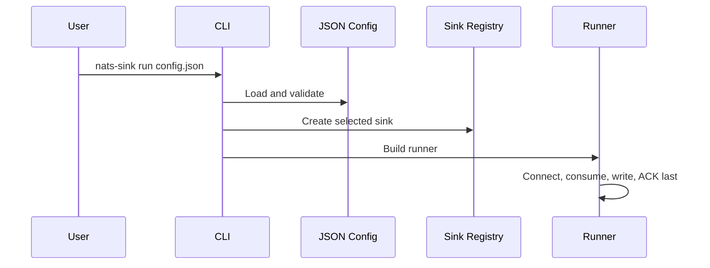

# CLI

The CLI command is `nats-sink`. It is intended for operators and developers who
want to run a sink process from a terminal, container, or service manager
without writing Python code. The CLI reads the same JSON configuration model
that the Python API uses.

For readers new to this project, the CLI does not implement a separate
delivery engine. It validates configuration, creates the selected sink, builds
`JetStreamSinkRunner`, and then the core runner performs commit-then-ACK
processing.

For operational teams, this means the same command can be used during local
tests, lab validation, and controlled service deployments. The behavior should
be reviewed through configuration and logs rather than through ad hoc scripts
that might accidentally weaken ACK ordering or secret handling.

```bash
nats-sink run config.json
nats-sink validate config.json
nats-sink show-effective-config config.json
nats-sink test-sink config.json
```

## Commands

### `validate`

Validates JSON syntax, Pydantic configuration models, and sink-specific
configuration. This is the safest first command to run because it does not need
to connect to NATS or the configured destination.

```bash
nats-sink validate examples/file-basic/config.json
```

### `show-effective-config`

Displays the validated configuration as redacted JSON. Use this when you want
to confirm defaults and environment-backed field names without printing
resolved secrets.

This is especially useful in reviewed environments because it lets operators
confirm NATS subjects, sink type, message metadata defaults, encryption policy,
and DLQ settings without exposing passwords, tokens, Oracle wallet passwords,
or encryption keys.

```bash
nats-sink show-effective-config examples/file-basic/config.json
```

### `test-sink`

Starts the configured sink and runs a health check when the sink supports it. This command opens destination connections, so use it only in environments where that is expected.

```bash
nats-sink test-sink examples/file-basic/config.json
```

### `run`

Starts the JetStream runner. This command opens NATS and destination
connections and begins processing messages.

```bash
nats-sink run examples/file-basic/config.json --log-level INFO
```

Use `--dry-run` to validate and construct runtime objects without opening NATS or sink connections.

## CLI Flow



The CLI returns non-zero for validation and runtime failures. It never prints resolved passwords.
