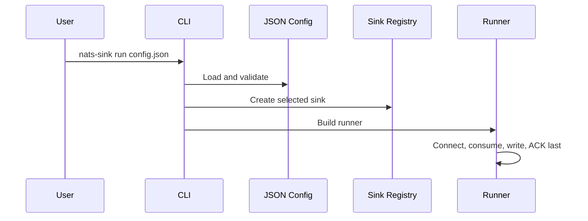

# CLI

The main CLI command is `nats-sink`. It is intended for operators and
developers who want to run a sink process from a terminal, container, or
service manager without writing Python code. The CLI reads the same JSON
configuration model that the Python API uses.

The project also ships a companion metrics command named `nats-sink-metrics`.
That command does not run a sink. It reads a local JSON metrics snapshot and
prints status in formats that are easy for humans, shell scripts, and simple
monitoring jobs to consume.

The project also ships an observability policy command named
`nats-sink-observe`. That command manages what may be shared with external
observability platforms. It can generate a disabled Prometheus policy from the
core config, list metric names and subject hints, validate policy, and render
policy-filtered Prometheus textfile output or run the optional native
Prometheus HTTP endpoint. It can also export approved metrics to an
OpenTelemetry Collector through OTLP/HTTP JSON.

For readers new to this project, the CLI does not implement a separate
delivery engine. It validates configuration, creates the selected sink, builds
`JetStreamSinkRunner`, and then the core runner performs commit-then-ACK
processing.

For operational teams, this means the same command can be used during local
tests, lab validation, and controlled service deployments. The behavior should
be reviewed through configuration and logs rather than through ad hoc scripts
that might accidentally weaken ACK ordering or secret handling.

```bash
nats-sink run config.json
nats-sink validate config.json
nats-sink show-effective-config config.json
nats-sink test-sink config.json
nats-sink stream-plan config.json
nats-sink query-lineage config.json --field mission_id --value MISSION-ALPHA --dry-run
nats-sink replay-spool spool-config.json target-config.json --dry-run
nats-sink-metrics show .local/nats-sinks/metrics.json
nats-sink-observe init-prometheus-policy config.json observability.prometheus.json
nats-sink-observe prometheus-http .local/nats-sinks/metrics.json observability.prometheus.json --dry-run
nats-sink-observe otlp-export .local/nats-sinks/metrics.json observability.prometheus.json --dry-run
nats-sink-observe nats-monitoring-poll observability.prometheus.json --dry-run
```

## Commands

### `nats-sink validate`

Validates JSON syntax, Pydantic configuration models, and sink-specific
configuration. This is the safest first command to run because it does not need
to connect to NATS or the configured destination.

```bash
nats-sink validate examples/file-basic/config.json
```

### `nats-sink show-effective-config`

Displays the validated configuration as redacted JSON. Use this when you want
to confirm defaults and environment-backed field names without printing
resolved secrets.

This is especially useful in reviewed environments because it lets operators
confirm NATS subjects, sink type, message metadata defaults, encryption policy,
and DLQ settings without exposing passwords, tokens, Oracle wallet passwords,
or encryption keys.

```bash
nats-sink show-effective-config examples/file-basic/config.json
```

### `nats-sink test-sink`

Starts the configured sink and runs a health check when the sink supports it. This command opens destination connections, so use it only in environments where that is expected.

```bash
nats-sink test-sink examples/file-basic/config.json
```

### `nats-sink stream-plan`

Generates an offline JetStream stream-management plan from the runtime JSON
configuration. This command is deliberately separate from `nats-sink run`: it
does not connect to NATS, does not create streams, does not update consumers,
does not resolve credentials, and does not need NATS administrator
permissions.

Use it when an operator wants to review stream retention, discard policy,
storage type, replica count, duplicate-window settings, and runtime versus
administration permission boundaries before applying changes with the NATS CLI,
Terraform, Ansible, or another approved platform process.

```bash
nats-sink stream-plan examples/file-basic/config.json \
  --retention limits \
  --discard old \
  --storage file \
  --replicas 3 \
  --duplicate-window-seconds 600
```

Use JSON output for scripts and review artifacts:

```bash
nats-sink stream-plan examples/file-basic/config.json --format json
```

Example JSON excerpt:

```json
{
  "stream": "ORDERS",
  "subjects": ["orders.*"],
  "durable_consumer": "file-orders-sink",
  "recommended_stream_settings": {
    "retention": "limits",
    "discard": "old",
    "storage": "file",
    "replicas": 3,
    "duplicate_window_seconds": 600
  },
  "runtime_permissions": [
    "$JS.API.CONSUMER.MSG.NEXT.ORDERS.file-orders-sink",
    "$JS.API.CONSUMER.INFO.ORDERS.file-orders-sink",
    "$JS.ACK.ORDERS.file-orders-sink.>",
    "_INBOX.>"
  ]
}
```

See [JetStream Stream Management Planning](stream-management.md) for the full
operator guide and permission discussion.

### `nats-sink query-lineage`

Queries already persisted Oracle rows by a small set of allow-listed lineage
fields. This command is read-only: it does not connect to NATS, does not ACK
messages, does not write to Oracle, and does not alter sink state.

Start with dry-run mode to validate the configured table, field, limit, and SQL
shape without opening an Oracle connection:

```bash
nats-sink query-lineage examples/oracle-jetstream/config.json \
  --field mission_id \
  --value MISSION-ALPHA \
  --limit 10 \
  --format json \
  --dry-run
```

The dry-run output prints bind names but not the lookup value:

```json
{
  "field": "mission_id",
  "table": "NATS_SINK_EVENTS",
  "limit": 10,
  "payload_included": false,
  "binds": ["lineage_value"],
  "sql": "select ... where json_value(MISSION_METADATA_JSON, '$.mission_id') = :lineage_value ... fetch first 10 rows only"
}
```

Supported fields are `correlation_id`, `causation_id`, `mission_id`,
`tasking_id`, `track_id`, `message_id`, and `subject`. Payload output is
omitted by default. See [Lineage Query Helpers](lineage-query-helpers.md) for
the security model, Oracle examples, and output reference.

### `nats-sink replay-spool`

Replays committed records from an encrypted edge spool into a final destination
sink. The first argument must be a normal configuration file whose
`sink.type` is `spool`. The second argument must be a normal configuration file
for the target sink, such as `file` or `oracle`.

```bash
nats-sink replay-spool /etc/nats-sinks/spool.json /etc/nats-sinks/oracle.json --dry-run
```

Example dry-run output:

```text
Dry run complete; 128 committed spool record(s) eligible.
```

Replay a bounded number of records:

```bash
nats-sink replay-spool /etc/nats-sinks/spool.json /etc/nats-sinks/oracle.json --max-records 100
```

Example replay output:

```text
Replay complete: scanned=100 replayed=100 deleted=100 failed=0
```

Replay does not ACK JetStream messages. The original ACK already happened when
the spool record was committed by `nats-sink run`. During replay, files are
deleted only after the target sink returns success and the spool config keeps
`delete_after_replay` enabled. See [Edge Spool Sink](spool-sink.md) for the
full delivery and security model.

### `nats-sink run`

Starts the JetStream runner. This command opens NATS and destination
connections and begins processing messages.

```bash
nats-sink run examples/file-basic/config.json --log-level INFO
```

Use `--dry-run` to validate and construct runtime objects without opening NATS or sink connections.

When `metrics.enabled` is true and `metrics.snapshot_file` is set in
configuration, `run` also writes a local metrics snapshot for
`nats-sink-metrics`:

```json
{
  "metrics": {
    "enabled": true,
    "namespace": "nats_sinks",
    "snapshot_file": ".local/nats-sinks/metrics.json",
    "event_freshness_enabled": true,
    "event_stale_after_seconds": 300,
    "event_future_skew_tolerance_seconds": 5
  }
}
```

### `nats-sink-metrics show`

Shows the status of counters, gauges, and timing observations from a local JSON
snapshot. The default output is a table:

```bash
nats-sink-metrics show .local/nats-sinks/metrics.json
```

Example output:

```text
KIND         METRIC                         VALUE  DESCRIPTION
counter      messages_fetched_total           256  Raw JetStream messages fetched by the pull consumer.
counter      messages_written_total           256  Messages reported durable by the destination sink.
counter      messages_acked_total             256  Messages acknowledged to JetStream after durable success or DLQ success.
observation  sink_batch_write_seconds.count     4  Elapsed seconds spent inside sink.write_batch for successful batches.
```

Script-friendly formats are available:

```bash
nats-sink-metrics show .local/nats-sinks/metrics.json --format shell
nats-sink-metrics show .local/nats-sinks/metrics.json --format json
nats-sink-metrics show .local/nats-sinks/metrics.json --format jsonl
nats-sink-metrics show .local/nats-sinks/metrics.json --format prometheus
nats-sink-metrics show .local/nats-sinks/metrics.json --format names
```

Filter and sort output:

```bash
nats-sink-metrics show .local/nats-sinks/metrics.json --kind counter
nats-sink-metrics show .local/nats-sinks/metrics.json --metric "*error*" --metric "*failed*"
nats-sink-metrics show .local/nats-sinks/metrics.json --sort value --reverse
```

Fail when the snapshot has gone stale:

```bash
nats-sink-metrics show .local/nats-sinks/metrics.json --stale-after-seconds 60
```

### `nats-sink-metrics get`

Prints one value, which is useful in shell scripts:

```bash
failed=$(nats-sink-metrics get .local/nats-sinks/metrics.json messages_failed_total --default 0)
if [ "$failed" -gt 0 ]; then
  echo "nats-sinks has failed messages"
  exit 2
fi
```

`get` exits with code `4` when a metric is missing and no `--default` value is
provided.

### `nats-sink-metrics describe`

Lists the metrics emitted by the framework:

```bash
nats-sink-metrics describe
nats-sink-metrics describe --format names
nats-sink-metrics describe --format json
```

The full metrics reference, Python hooks, staleness behavior, exit codes, and
Prometheus text output examples are documented in [Metrics](metrics.md).

### `nats-sink-observe init-prometheus-policy`

Generates a disabled observability policy from a runtime configuration. The
generated policy includes metric-sharing defaults, the configured namespace,
and subject hints discovered from the config. It does not enable Prometheus
sharing.

```bash
nats-sink-observe init-prometheus-policy \
  /etc/nats-sinks/config.json \
  /etc/nats-sinks/observability.prometheus.json \
  --output-file /var/lib/node_exporter/textfile_collector/nats_sinks.prom
```

### `nats-sink-observe validate-policy`

Validates a policy file before a service or operator relies on it:

```bash
nats-sink-observe validate-policy /etc/nats-sinks/observability.prometheus.json
```

Example output:

```text
Observability policy is valid.
schema=nats_sinks.observability.policy.v1
enabled=false
namespace=nats_sinks
prometheus_enabled=false
otlp_enabled=false
nats_server_monitoring_enabled=false
nats_server_monitoring_prometheus_enabled=false
allowed_metrics=0
allowed_metric_patterns=0
denied_metrics=0
denied_metric_patterns=0
subjects=1
```

### `nats-sink-observe list-metrics`

Lists metric names that can be used in an observability allow list:

```bash
nats-sink-observe list-metrics --format names
nats-sink-observe list-metrics --format json
```

### `nats-sink-observe list-subjects`

Lists subject hints copied from the runtime configuration:

```bash
nats-sink-observe list-subjects \
  /etc/nats-sinks/observability.prometheus.json \
  --format shell
```

Example output:

```text
NATS_SINKS_SUBJECT_1_ORDERS=orders.*
```

Current metrics are not subject-labeled. This command helps operators review
policy and prepares the extension point for future subject-aware connectors.

### `nats-sink-observe prometheus-textfile`

Renders Prometheus textfile output after applying the observability policy:

```bash
nats-sink-observe prometheus-textfile \
  /var/lib/nats-sink/metrics.json \
  /etc/nats-sinks/observability.prometheus.json \
  --output /var/lib/node_exporter/textfile_collector/nats_sinks.prom
```

Use `--dry-run` to print to stdout:

```bash
nats-sink-observe prometheus-textfile \
  /var/lib/nats-sink/metrics.json \
  /etc/nats-sinks/observability.prometheus.json \
  --dry-run
```

The command writes only a comment when the policy is disabled. See
[Observability](observability.md) for the sharing model and its
[Prometheus Integration](prometheus.md) sub-page for service deployment
guidance.

### `nats-sink-observe prometheus-http`

Runs the optional native Prometheus HTTP endpoint or renders one response for
review. The endpoint is disabled unless both the top-level policy and
`prometheus.http_endpoint.enabled` are true:

```bash
nats-sink-observe prometheus-http \
  /var/lib/nats-sink/metrics.json \
  /etc/nats-sinks/observability.prometheus.json \
  --dry-run
```

Example dry-run output:

```text
# HELP nats_sinks_messages_fetched_total Raw JetStream messages fetched by the pull consumer.
# TYPE nats_sinks_messages_fetched_total counter
nats_sinks_messages_fetched_total 256
```

Run the endpoint as a foreground process:

```bash
nats-sink-observe prometheus-http \
  /var/lib/nats-sink/metrics.json \
  /etc/nats-sinks/observability.prometheus.json
```

Example startup output:

```text
Serving Prometheus metrics on 127.0.0.1:9108/metrics
```

Use this command as a separate service, not inside the sink worker, unless an
embedding application deliberately accepts that coupling. The endpoint never
ACKs messages and never connects to NATS or a destination sink.

### `nats-sink-observe otlp-export`

Exports policy-approved metrics to an OpenTelemetry Collector through
OTLP/HTTP JSON. The command is disabled unless both the top-level
observability policy and `otlp.enabled` are true. It reads only the local
metrics snapshot and policy file; it does not connect to NATS, Oracle, file
sink directories, DLQ subjects, or future destination backends.

Dry-run mode prints the OTLP JSON request body without opening a network
connection:

```bash
nats-sink-observe otlp-export \
  /var/lib/nats-sink/metrics.json \
  /etc/nats-sinks/observability.prometheus.json \
  --dry-run
```

Example dry-run output:

```json
{"resourceMetrics":[{"resource":{"attributes":[{"key":"service.name","value":{"stringValue":"nats-sinks"}},{"key":"nats_sinks.namespace","value":{"stringValue":"nats_sinks"}}]},"scopeMetrics":[{"metrics":[{"description":"Raw JetStream messages fetched by the pull consumer.","name":"nats_sinks_messages_fetched_total","sum":{"aggregationTemporality":2,"dataPoints":[{"asDouble":256.0,"timeUnixNano":"1790000000000000000"}],"isMonotonic":true},"unit":"1"}],"scope":{"name":"nats-sinks.observability.otlp"}}]}]}
```

Live export uses the endpoint, timeout, retry, request-size, and optional
header environment-variable settings from the policy:

```bash
nats-sink-observe otlp-export \
  /var/lib/nats-sink/metrics.json \
  /etc/nats-sinks/observability.prometheus.json
```

Example success output:

```text
OTLP export: attempted=true delivered=true attempts=1 status=200 message=OTLP export delivered
```

Example bounded failure output:

```text
OTLP export: attempted=true delivered=false attempts=3 status=none message=OTLP export failed with URLError
```

The output is intentionally sanitized. It does not print the collector URL,
header values, payload bodies, subjects, table names, file paths, labels,
classification values, or other sensitive deployment detail. Full connector
guidance is documented in [OpenTelemetry OTLP Integration](otlp.md).

### `nats-sink-observe nats-monitoring-poll`

Polls policy-approved NATS server monitoring endpoints and writes a sanitized
local snapshot. This command is disabled unless the top-level observability
policy and `nats_server_monitoring.enabled` are true.

```bash
nats-sink-observe nats-monitoring-poll \
  /etc/nats-sinks/observability.prometheus.json \
  --output /var/lib/nats-sink/nats-monitoring.json
```

Use `--dry-run` to review the snapshot without writing a file:

```bash
nats-sink-observe nats-monitoring-poll \
  /etc/nats-sinks/observability.prometheus.json \
  --dry-run
```

Example dry-run output:

```json
{
  "schema": "nats_sinks.observability.nats_monitoring.snapshot.v1",
  "generated_at_epoch_seconds": 1797820000.0,
  "endpoints": [
    {
      "endpoint": "/jsz",
      "status_code": 200,
      "fields": {
        "jetstream.stats.messages": 42,
        "jetstream.stats.consumer_count": 3
      }
    }
  ]
}
```

The snapshot does not include the configured monitoring base URL. It includes
only endpoint paths and the scalar fields selected by policy.

### `nats-sink-observe nats-monitoring-prometheus`

Renders selected numeric NATS monitoring values as Prometheus text. This command
is disabled unless `nats_server_monitoring.prometheus_enabled` is true.

```bash
nats-sink-observe nats-monitoring-prometheus \
  /var/lib/nats-sink/nats-monitoring.json \
  /etc/nats-sinks/observability.prometheus.json \
  --output /var/lib/node_exporter/textfile_collector/nats_sinks_nats_monitoring.prom
```

Example output:

```text
# HELP nats_sinks_nats_monitoring_jsz_jetstream_stats_messages NATS server monitoring value for /jsz field jetstream.stats.messages
# TYPE nats_sinks_nats_monitoring_jsz_jetstream_stats_messages gauge
nats_sinks_nats_monitoring_jsz_jetstream_stats_messages 42
```

String values such as server identifiers are not rendered to Prometheus. They
remain in the local snapshot only when explicitly allowed by policy.

## CLI Flow



The CLI returns non-zero for validation and runtime failures. It never prints resolved passwords.

`nats-sink-metrics` returns `0` on success, `2` for invalid snapshot or display
input, `3` for stale snapshots when staleness is enforced, and `4` when `get`
cannot find a metric without a default value.

`nats-sink-observe` returns `0` on success, `2` for invalid configuration,
policy, snapshot, textfile output errors, or disabled native endpoint startup,
and `3` when an enabled Prometheus or OTLP policy rejects a stale snapshot, a
native HTTP dry-run returns an error response, or OTLP export exhausts its
bounded delivery attempts.
