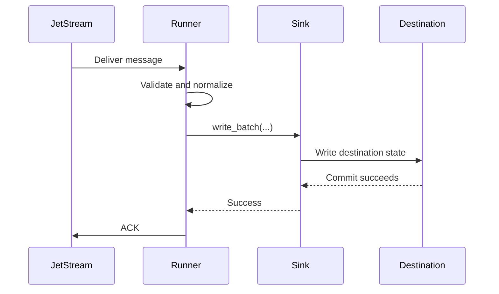
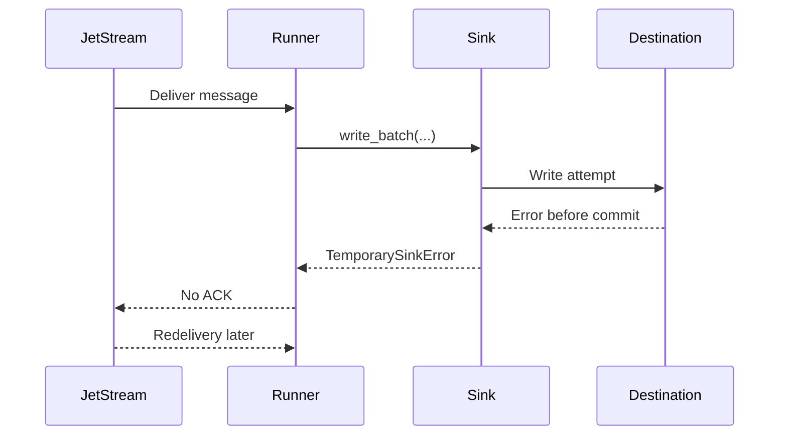
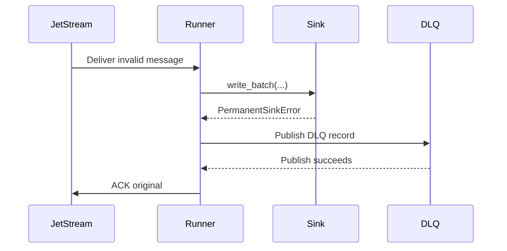

# Commit Then Acknowledge

JetStream consumers must follow a commit-then-acknowledge processing model whenever they persist data, modify downstream state, or trigger durable business actions.

The acknowledgement to JetStream is the final step in message processing. It must be sent only after all required work has completed and the resulting state has been durably committed. An ACK is a formal statement that the message has been fully handled and no longer requires redelivery.

In mission-oriented systems, that ACK can be read as an operational statement:
the event has crossed the agreed durable boundary. Sending it early can hide a
failed database write, missing file, or incomplete handoff from later recovery
and audit work.

## Required Order

1. Receive the message.
2. Validate that the message can be processed.
3. Execute the required business logic.
4. Persist or commit all required durable state.
5. Acknowledge the message only after successful completion.

## Why Early ACK Is Unsafe

Acknowledging too early creates a silent-loss risk. JetStream may consider the message handled even if the destination write fails afterward. A duplicate caused by redelivery is usually manageable with idempotency. A missing write after early ACK is much harder to detect and repair.

For defence logistics, operational reporting, or other sensitive workflows,
silent loss is usually worse than safe duplication. A duplicate can be
detected, reconciled, and explained. An event that was ACKed before durable
success may simply disappear from the processing path.

## Failure Before Commit

## Failure After Commit But Before ACK

If the destination commit succeeds and the process exits before ACK, JetStream may redeliver. This is acceptable. The sink must use idempotency controls to treat the duplicate safely.

## Multi-Sink ACK Gates

Future fan-out delivery can select more than one logical sink target for the
same message. The same safety rule still applies: JetStream may be ACKed only
after every required target has durably completed. Route targets are required
by default.

Optional targets are different. They are opt-in side effects with a bounded
`minimum_wait_ms` and `timeout_ms` policy. The ACK gate gives those optional
targets a controlled chance to finish, but it does not wait forever. If an
optional target has not committed before the ACK gate releases, the required
delivery path may still ACK and the optional copy must be treated as not
guaranteed.

This distinction is important for audit language. A required Oracle Database
sink can be part of the formal custody path. An optional diagnostic file copy,
secondary archive, or non-critical side copy is best-effort unless it completed
before ACK. Operators should use optional targets only when that trade-off is
acceptable and documented.

## Permanent Failure With DLQ

If DLQ publish fails, the original message is not ACKed.

## Terminal Acknowledgements

NATS also supports terminal acknowledgements (`AckTerm`) and next-message
acknowledgements (`AckNext`). They have different safety properties and must
not be treated as ordinary sink-success ACKs.

`AckTerm` stops redelivery without marking the message as successfully
processed. `nats-sinks` supports it only as an explicit opt-in DLQ policy:
when `dead_letter.ack_term_after_publish` is true, the runner publishes the DLQ
record first and sends `AckTerm` only after that publication succeeds. The
default remains DLQ publication followed by normal ACK. `AckTerm` must never be
sent before sink success, before DLQ publication success, or for temporary
failures.

`AckNext` acknowledges a pull-consumer message and requests more messages in
one protocol operation. That is not a good fit for `nats-sinks` production sink
processing because the runner already controls fetch size, batch timeout, and
backpressure explicitly. Keeping fetch separate from ACK makes the safety
boundary easier to review and test.

The full decision is documented in
[ADR 0005: AckTerm And AckNext Evaluation](adr/0005-ackterm-acknext-evaluation.md).

## Confirmed Acknowledgements

Some NATS clients support a confirmed ACK operation, often called `AckSync` or
double ACK. Confirmed ACK waits for the server to confirm that it processed the
ACK. That can improve operational visibility, but it does not move the safety
boundary.

For `nats-sinks`, confirmed ACK must still be the final step. It may be useful
as a future opt-in option after durable sink success, but it must never run
before `sink.write_batch(...)` returns success and it must never be used to
claim exactly-once delivery. If the sink commit succeeds and ACK confirmation
then times out, the message may redeliver and idempotency must handle the
duplicate.

The evaluation and future implementation split are documented in
[Acknowledgement Confirmation Evaluation](acknowledgement-confirmation.md).

## InProgress Signals

JetStream `InProgress` signals tell the server that a delivered message is
still being worked on and that the acknowledgement wait window should be
extended. They are not success acknowledgements. They must never replace final
ACK, NAK, Term, retry, or DLQ behavior.

For `nats-sinks`, any future `InProgress` feature must remain optional,
disabled by default, bounded, and owned by the core runner. The sink still only
returns durable success or raises an error. If the sink fails after one or more
progress signals, the message remains eligible for redelivery or DLQ according
to policy.

The evaluation and recommended implementation split are documented in
[InProgress Evaluation](in-progress-evaluation.md).

## Push Consumers

JetStream push consumers deliver messages to a delivery subject instead of
waiting for the client to fetch a bounded batch. That does not change the ACK
rule. A future push runner mode must use manual acknowledgement only and must
ACK only after the sink reports durable success or after DLQ publication
succeeds for permanent failures.

Push mode is not enabled today. It needs bounded callback intake, pending
message and byte limits, flow-control and heartbeat handling, and shutdown
tests before it can be production-ready. The evaluation and implementation
split are documented in [Push Consumer Evaluation](push-consumer-evaluation.md).

## Non-Negotiable Invariant

> A JetStream message must only be acknowledged after all required durable side effects have completed successfully. ACK is the final confirmation of successful processing, never a prerequisite for processing.

Short slogan:

> Commit first. ACK last. Design for redelivery.
