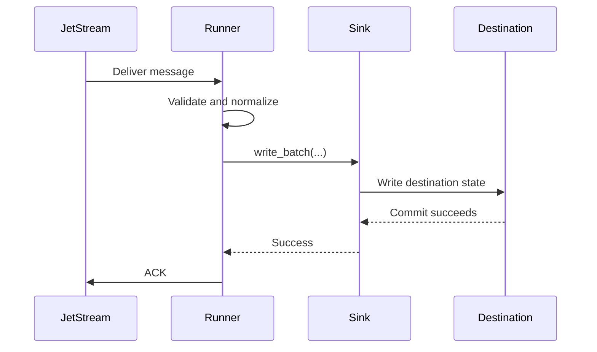
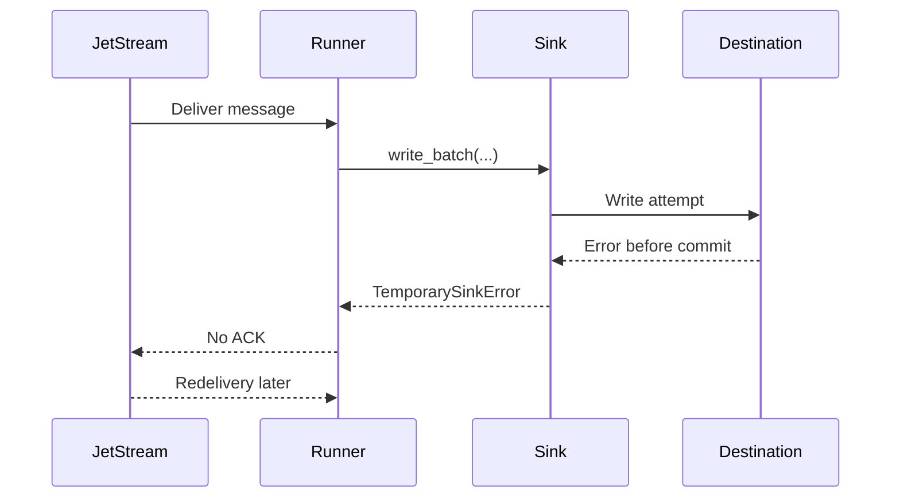
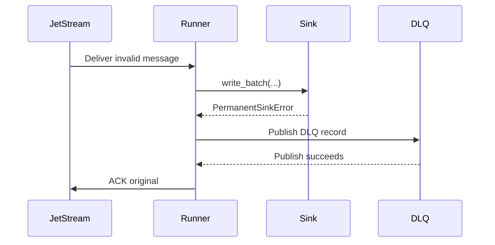

# Commit Then Acknowledge

JetStream consumers must follow a commit-then-acknowledge processing model whenever they persist data, modify downstream state, or trigger durable business actions.

The acknowledgement to JetStream is the final step in message processing. It must be sent only after all required work has completed and the resulting state has been durably committed. An ACK is a formal statement that the message has been fully handled and no longer requires redelivery.

## Required Order

1. Receive the message.
2. Validate that the message can be processed.
3. Execute the required business logic.
4. Persist or commit all required durable state.
5. Acknowledge the message only after successful completion.

## Why Early ACK Is Unsafe

Acknowledging too early creates a silent-loss risk. JetStream may consider the message handled even if the destination write fails afterward. A duplicate caused by redelivery is usually manageable with idempotency. A missing write after early ACK is much harder to detect and repair.

## Failure Before Commit

## Failure After Commit But Before ACK

If the destination commit succeeds and the process exits before ACK, JetStream may redeliver. This is acceptable. The sink must use idempotency controls to treat the duplicate safely.

## Permanent Failure With DLQ

If DLQ publish fails, the original message is not ACKed.

## Non-Negotiable Invariant

> A JetStream message must only be acknowledged after all required durable side effects have completed successfully. ACK is the final confirmation of successful processing, never a prerequisite for processing.

Short slogan:

> Commit first. ACK last. Design for redelivery.
