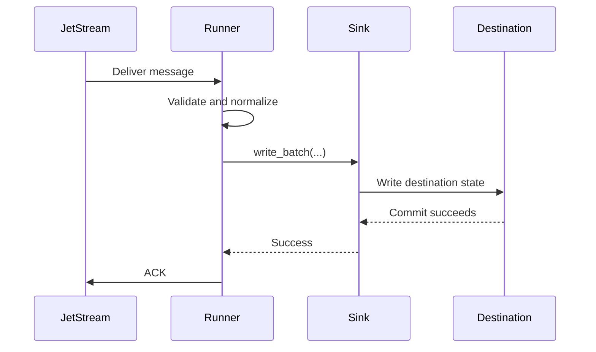
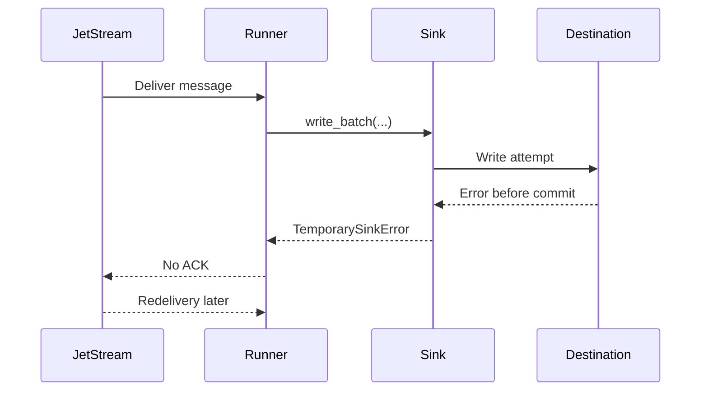
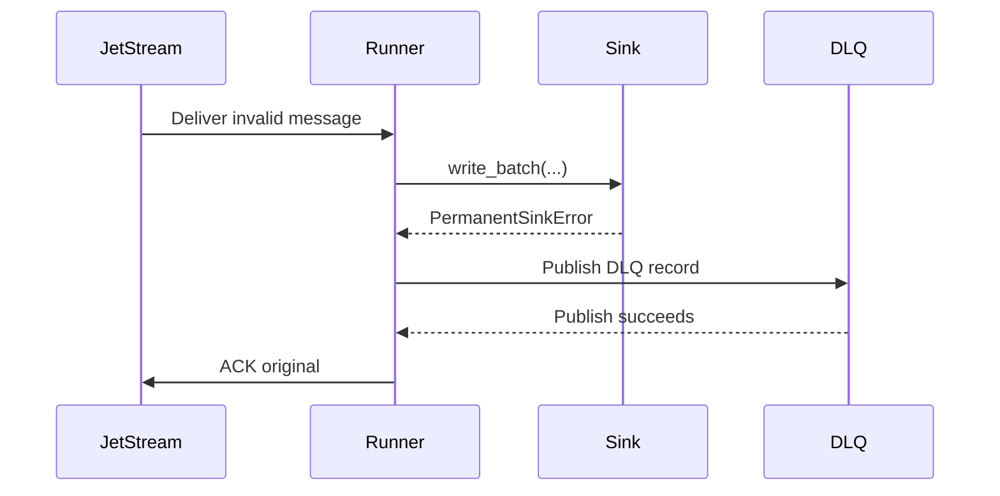

# Commit Then Acknowledge

JetStream consumers must follow a commit-then-acknowledge processing model whenever they persist data, modify downstream state, or trigger durable business actions.

The acknowledgement to JetStream is the final step in message processing. It must be sent only after all required work has completed and the resulting state has been durably committed. An ACK is a formal statement that the message has been fully handled and no longer requires redelivery.

In mission-oriented systems, that ACK can be read as an operational statement:
the event has crossed the agreed durable boundary. Sending it early can hide a
failed database write, missing file, or incomplete handoff from later recovery
and audit work.

## Required Order

1. Receive the message.
2. Validate that the message can be processed.
3. Execute the required business logic.
4. Persist or commit all required durable state.
5. Acknowledge the message only after successful completion.

## Why Early ACK Is Unsafe

Acknowledging too early creates a silent-loss risk. JetStream may consider the message handled even if the destination write fails afterward. A duplicate caused by redelivery is usually manageable with idempotency. A missing write after early ACK is much harder to detect and repair.

For defence logistics, operational reporting, or other sensitive workflows,
silent loss is usually worse than safe duplication. A duplicate can be
detected, reconciled, and explained. An event that was ACKed before durable
success may simply disappear from the processing path.

## Failure Before Commit

## Failure After Commit But Before ACK

If the destination commit succeeds and the process exits before ACK, JetStream may redeliver. This is acceptable. The sink must use idempotency controls to treat the duplicate safely.

## Permanent Failure With DLQ

If DLQ publish fails, the original message is not ACKed.

## Terminal Acknowledgements

NATS also supports terminal acknowledgements (`AckTerm`) and next-message
acknowledgements (`AckNext`). These are intentionally not part of the current
runtime behavior.

`AckTerm` stops redelivery without marking the message as successfully
processed. That can be useful for a future operator-controlled terminal failure
policy, but only after the failure record has already been durably published to
a DLQ. It must never be sent before sink success, before DLQ publication
success, or for temporary failures.

`AckNext` acknowledges a pull-consumer message and requests more messages in
one protocol operation. That is not a good fit for `nats-sinks` production sink
processing because the runner already controls fetch size, batch timeout, and
backpressure explicitly. Keeping fetch separate from ACK makes the safety
boundary easier to review and test.

The full decision is documented in
[ADR 0005: AckTerm And AckNext Evaluation](adr/0005-ackterm-acknext-evaluation.md).

## Non-Negotiable Invariant

> A JetStream message must only be acknowledged after all required durable side effects have completed successfully. ACK is the final confirmation of successful processing, never a prerequisite for processing.

Short slogan:

> Commit first. ACK last. Design for redelivery.
