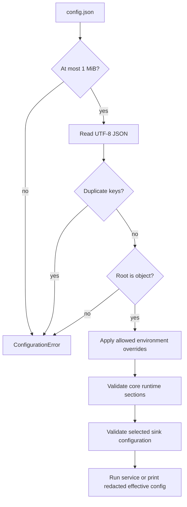
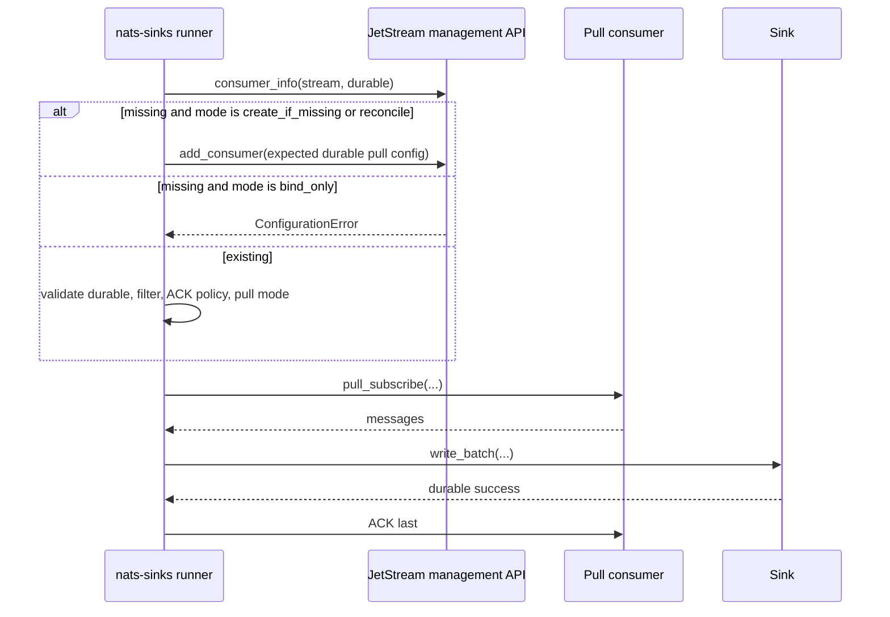
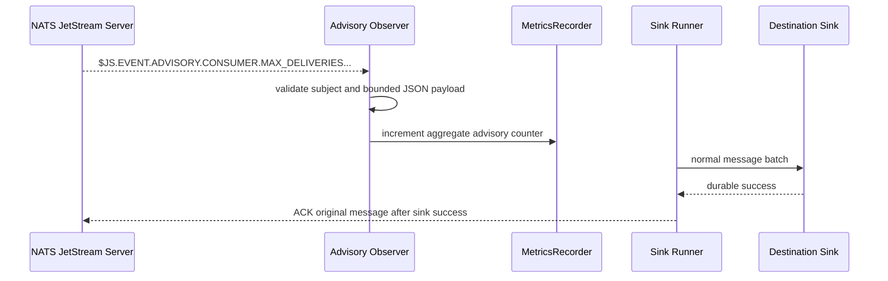
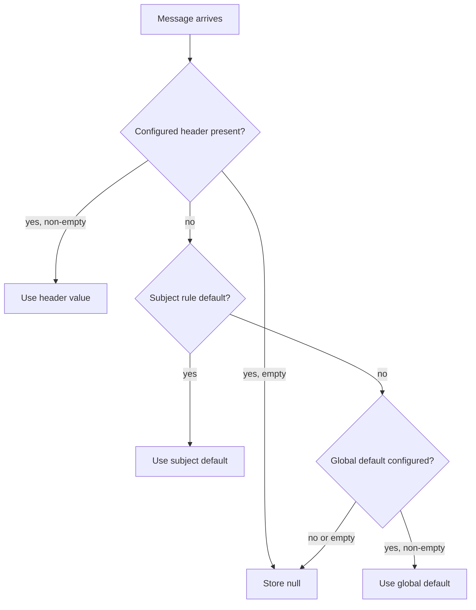
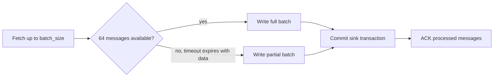
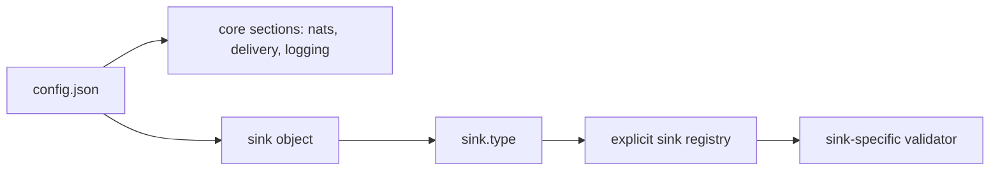
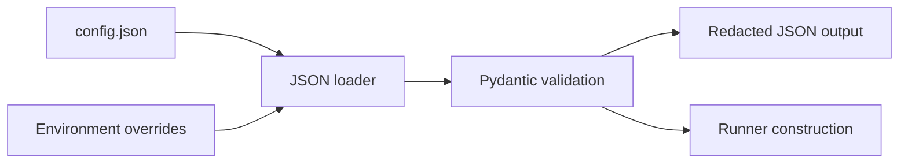

# Configuration

Runtime configuration is JSON-only. `nats-sinks` reads UTF-8 JSON files, requires a JSON object at the root, applies a small explicit allow-list of environment overrides, and validates the final structure with Pydantic.

The configuration model is deliberately explicit. In operational, defence, or
public-sector deployments, configuration is often reviewed by more than one
team. JSON files, strict validation, redacted effective output, and named
environment-variable secrets make it easier to review what a sink service will
connect to, what it will consume, which metadata defaults it will apply, and
where it will write.

## Minimal Configuration

The minimal example uses the local file sink because it does not require a
database or credentials. Oracle Database and Oracle MySQL use the same generic
runtime sections and add destination-specific fields inside the `sink` object.
When a deployment needs to prepare several destinations for routing and future
fan-out, it can also declare additional named instances in the top-level
`sinks` object.

```json
{
  "nats": {
    "url": "nats://localhost:4222",
    "stream": "ORDERS",
    "consumer": "file-orders-sink",
    "subject": "orders.*"
  },
  "sink": {
    "type": "file",
    "directory": ".local/file-sink/events",
    "filename_strategy": "stream_sequence",
    "duplicate_policy": "skip_existing"
  }
}
```

## Full Example

```json
{
  "nats": {
    "url": "nats://localhost:4222",
    "urls": [],
    "stream": "ORDERS",
    "consumer": "file-orders-sink",
    "subject": "orders.*",
    "durable": true,
    "token_env": "NATS_TOKEN",
    "tls_ca_file": "/etc/nats/certs/ca.crt",
    "tls_verify": true,
    "no_echo": false,
    "allow_reconnect": true,
    "connect_timeout_seconds": 2,
    "reconnect_time_wait_seconds": 2,
    "max_reconnect_attempts": 60,
    "ping_interval_seconds": 120,
    "max_outstanding_pings": 2,
    "pending_size_bytes": 2097152,
    "drain_timeout_seconds": 30
  },
  "consumer_management": {
    "mode": "create_if_missing",
    "filter_subjects": [],
    "deliver_policy": "all",
    "replay_policy": "instant",
    "ack_wait_seconds": null,
    "max_deliver": null,
    "backoff_seconds": null,
    "max_ack_pending": null,
    "max_waiting": null,
    "headers_only": null,
    "num_replicas": null,
    "memory_storage": null,
    "metadata": {}
  },
  "delivery": {
    "batch_size": 100,
    "batch_timeout_ms": 1000,
    "max_in_flight_batches": 1,
    "ack_policy": "after_sink_commit",
    "max_retries": 5,
    "retry_backoff_ms": 1000,
    "retry_backoff_max_ms": 60000,
    "retry_backoff_mode": "exponential",
    "retry_backoff_multiplier": 2.0,
    "retry_jitter": "full",
    "temporary_failure_action": "nak",
    "prefer_safe_duplication": true
  },
  "dead_letter": {
    "enabled": true,
    "subject": "orders.dlq",
    "include_payload": true,
    "include_headers": true,
    "include_error": true,
    "ack_term_after_publish": false
  },
  "logging": {
    "level": "INFO",
    "payload_logging": false
  },
  "metrics": {
    "enabled": false,
    "namespace": "nats_sinks",
    "snapshot_file": null,
    "event_freshness_enabled": true,
    "event_stale_after_seconds": 300,
    "event_future_skew_tolerance_seconds": 5
  },
  "advisories": {
    "enabled": false,
    "subjects": [
      "$JS.EVENT.ADVISORY.CONSUMER.MAX_DELIVERIES.*.*",
      "$JS.EVENT.ADVISORY.CONSUMER.MSG_NAKED.*.*",
      "$JS.EVENT.ADVISORY.CONSUMER.MSG_TERMINATED.*.*"
    ],
    "max_payload_bytes": 65536,
    "log_events": false
  },
  "message_metadata": {
    "priority": {
      "header": "Nats-Sinks-Priority",
      "default": "normal"
    },
    "classification": {
      "header": "Nats-Sinks-Classification",
      "default": null
    },
    "labels": {
      "header": "Nats-Sinks-Labels",
      "default": []
    },
    "rules": [
      {
        "subject": "orders.urgent.>",
        "priority": "urgent",
        "classification": "restricted",
        "labels": "urgent;customer-facing"
      }
    ]
  },
  "routing": {
    "enabled": false,
    "mode": "first",
    "no_match": "reject",
    "target_sink_types": {
      "oracle_secret": "oracle",
      "file_secret_audit": "file",
      "oracle_unclass": "oracle"
    },
    "default_targets": [],
    "routes": [
      {
        "name": "nato_secret_sensor_audit",
        "match": {
          "subject": "mission.sensor.>",
          "priority": ["urgent"],
          "classification": ["NATO SECRET"],
          "labels_all": ["sensor", "audit"],
          "headers": [
            {
              "name": "Nats-Sinks-Route",
              "values": ["mission-audit"]
            }
          ]
        },
        "targets": [
          "oracle_secret",
          {
            "sink": "file_secret_audit",
            "required": false,
            "minimum_wait_ms": 250,
            "timeout_ms": 1000
          }
        ]
      },
      {
        "name": "nato_unclass_sensor_audit",
        "match": {
          "subject": "mission.sensor.>",
          "priority": ["urgent"],
          "classification": ["NATO UNCLASS"],
          "labels_all": ["sensor", "audit"]
        },
        "targets": ["oracle_unclass"]
      }
    ]
  },
  "message_authenticity": {
    "enabled": false,
    "unmatched_subject_action": "reject",
    "signature_header": "Nats-Sinks-Authenticity-Signature",
    "algorithm_header": "Nats-Sinks-Authenticity-Algorithm",
    "key_id_header": "Nats-Sinks-Authenticity-Key-Id",
    "rules": [
      {
        "subject": "orders.secure.>",
        "enabled": true,
        "algorithm": "hmac-sha256",
        "key_id": "orders-producer-key-v1",
        "key_b64_env": "NATS_SINKS_AUTHENTICITY_KEY_B64",
        "signed_fields": ["subject", "message_id"]
      }
    ]
  },
  "encryption": {
    "enabled": false,
    "algorithm": "aes-256-gcm",
    "key_id": "orders-runtime-key",
    "key_b64_env": "NATS_SINKS_PAYLOAD_KEY_B64",
    "nonce_size_bytes": 12,
    "tag_length": 16,
    "rules": [
      {
        "subject": "secure.>",
        "enabled": true,
        "key_id": "secure-runtime-key",
        "key_b64_env": "NATS_SINKS_SECURE_PAYLOAD_KEY_B64"
      }
    ]
  },
  "custody": {
    "enabled": false,
    "algorithm": "sha256",
    "hash_payload": true,
    "hash_metadata": true,
    "include_previous_hash": false,
    "previous_hash_header": "Nats-Sinks-Previous-Custody-Hash",
    "key_id": null,
    "max_hash_input_bytes": 16777216
  },
  "size_policy": {
    "enabled": false,
    "max_payload_bytes": 16777216,
    "max_header_count": 128,
    "max_header_name_bytes": 256,
    "max_header_value_bytes": 8192,
    "max_headers_bytes": 65536,
    "max_label_count": 64,
    "max_label_bytes": 128,
    "max_labels_bytes": 4096,
    "max_mission_metadata_bytes": 8192,
    "max_standard_metadata_bytes": 262144,
    "max_normalized_record_bytes": 20971520,
    "max_batch_messages": 10000
  },
  "pre_sink_policy": {
    "enabled": false,
    "unmatched_subject_action": "reject",
    "rules": [
      {
        "subject": "orders.secure.>",
        "require_priority": true,
        "require_classification": true,
        "required_labels": ["orders"],
        "require_mission_metadata": true,
        "require_encrypted_payload": true,
        "max_payload_bytes": 1048576,
        "allowed_mission_metadata_keys": ["profile", "phase", "operation"]
      }
    ]
  },
  "plugins": {
    "enabled": false,
    "allowed_sinks": [],
    "require_production_ready": true
  },
  "sinks": {
    "oracle_secret": {
      "type": "oracle",
      "dsn": "tcps://adb.example.invalid/secret",
      "user": "app_secret",
      "password_env": "ORACLE_SECRET_PASSWORD",
      "table": "NATS_SECRET_EVENTS"
    },
    "file_audit": {
      "type": "file",
      "directory": ".local/file-audit/events",
      "fsync": false
    }
  },
  "sink": {
    "type": "file",
    "directory": ".local/file-sink/events",
    "mode": "one_file_per_message",
    "filename_strategy": "stream_sequence",
    "duplicate_policy": "skip_existing",
    "payload_mode": "json_or_envelope",
    "compression": "none",
    "include_metadata": true,
    "partition_by_subject": true,
    "create_directory": true,
    "fsync": true
  }
}
```

## Configuration File Rules

Configuration files are normal JSON documents. The root value must be an
object, comments are not allowed, duplicate object keys are rejected,
Python-specific constants such as `NaN` and `Infinity` are rejected, and
unknown fields in the generic runtime sections are rejected. Configuration
files are also bounded to 1 MiB. This strictness is intentional: production
sink services should fail early when an operator misspells a field, places an
option in the wrong section, accidentally carries configuration from another
deployment, or provides ambiguous JSON that different tools might interpret
differently.

The top-level sections are:

| Section | Required | Purpose |
| --- | --- | --- |
| `nats` | yes | NATS server connection, JetStream stream, consumer, subject, authentication, and TLS settings. |
| `consumer_management` | no | Optional durable pull-consumer creation, binding, and safe drift validation settings. |
| `delivery` | no | Batching, ACK policy, retry, and temporary failure behavior. Defaults are safe for local and early production deployments. |
| `dead_letter` | no | Optional DLQ publication for permanently invalid messages. |
| `logging` | no | Standard Python logging level and payload logging switch. |
| `metrics` | no | Metrics namespace, enablement flag, and optional local JSON snapshot path. |
| `advisories` | no | Optional observation-only JetStream advisory subscription settings. Disabled by default and isolated from source-message ACK behavior. |
| `message_metadata` | no | Optional priority, classification, and labels extraction defaults applied to every message before sink delivery. |
| `routing` | no | Optional generic route-match policy that selects logical sink target names from subject, priority, classification, labels, and approved headers. Disabled by default and selection-only until fan-out delivery is enabled. |
| `message_authenticity` | no | Optional fail-closed message-level authenticity verification before payload encryption and sink delivery. Disabled by default. |
| `custody` | no | Optional tamper-evident payload and metadata hashes computed by the core before sink delivery. Disabled by default. |
| `encryption` | no | Optional core payload encryption before messages are passed to any sink. |
| `size_policy` | no | Optional destination-neutral payload, header, metadata, label, record, and batch-size bounds evaluated before any sink write. Disabled by default. |
| `pre_sink_policy` | no | Optional fail-closed validation gate evaluated after normalization and core payload transformation, but before any sink write. |
| `plugins` | no | Optional allow-listed discovery for externally installed sink connectors. Disabled by default. Built-in Oracle, file, and spool sinks do not need this section. |
| `sinks` | no | Optional registry of named sink instances used by route validation, redacted output, named health checks, and future multi-sink fan-out. See [Named Sinks And Routing](named-sinks.md). |
| `sink` | yes | Destination-specific sink configuration. `sink.type` chooses the sink implementation. |

The only supported `delivery.ack_policy` value is `after_sink_commit`, which
means the runner ACKs only after durable sink success or after successful DLQ
publication for permanent failures. `AckNext` is intentionally not planned for
production sink processing because it combines acknowledgement and fetching.
`AckTerm` is available only through the explicit
`dead_letter.ack_term_after_publish` option and only after DLQ publication
succeeds.

Confirmed ACK, sometimes called `AckSync` or double ACK in client APIs, has
been evaluated but is not yet a runtime configuration option. Any future option
will be disabled by default and will run only after durable sink success. See
[Acknowledgement Confirmation Evaluation](acknowledgement-confirmation.md) for
the current design direction and limitations.

JetStream `InProgress` handling has also been evaluated but is not yet a
runtime configuration option. Any future option will be disabled by default,
bounded, advisory only, and tied to verifiable consumer `AckWait` or `BackOff`
timing. See [InProgress Evaluation](in-progress-evaluation.md).



## Named Sink Registry

The optional top-level `sinks` object declares additional named destination
instances. Each child object uses the same sink-specific fields as a normal
top-level `sink`. For example, an Oracle child still configures `dsn`, `user`,
`password_env`, `table`, and Oracle write policy, while a file child configures
`directory`, `filename_strategy`, `duplicate_policy`, compression, and fsync
behavior.

Named sinks are separate from route matching. The route policy contains match
rules and target names only; destination-specific configuration stays in
`sinks`. This makes review easier in environments where operational routes,
classification boundaries, Oracle Database schemas, local file handoff paths,
and secret sources are owned by different teams.

```json
{
  "sinks": {
    "oracle_secret": {
      "type": "oracle",
      "dsn": "tcps://adb.example.invalid/secret",
      "user": "app_secret",
      "password_env": "ORACLE_SECRET_PASSWORD",
      "table": "NATS_SECRET_EVENTS"
    },
    "oracle_unclass": {
      "type": "oracle",
      "dsn": "tcps://adb.example.invalid/unclass",
      "user": "app_unclass",
      "password_env": "ORACLE_UNCLASS_PASSWORD",
      "table": "NATS_UNCLASS_EVENTS"
    },
    "file_audit": {
      "type": "file",
      "directory": ".local/file-audit/events",
      "fsync": false
    }
  }
}
```

`nats-sink validate` checks the active `sink`, every named sink under `sinks`,
and every route target reference when named sinks are configured. It also prints
a safe route-to-target report. `nats-sink show-effective-config` includes the
named registry with password, token, credential, and key material redacted. Use
`nats-sink test-sink CONFIG --sink-name NAME` to health-check one named sink or
`--all-named-sinks` to check every named sink where opening those destinations
is appropriate.

See [Named Sinks And Routing](named-sinks.md) for complete examples covering
two Oracle backends, two Oracle tables in one backend, Oracle plus file, two
file destinations, route target validation, and CLI output.

## Core Configuration Reference

The tables below describe every generic configuration field understood by the
core runtime. Sink-specific options are documented later in this page and in the
dedicated sink pages.

### `nats`

The `nats` section tells the runner where to connect and which JetStream stream,
consumer, and subject should feed the sink.

For mission-style subject designs, choose names that express stable operational
domains rather than transient implementation details. For example, broad
subjects can represent mission reports, logistics events, platform telemetry,
or audit events, while `message_metadata.rules` can add priority,
classification, and labels without changing producer payloads.

| Field | Required | Default | Valid values | Description |
| --- | --- | --- | --- | --- |
| `url` | no | `nats://localhost:4222` | URL using `nats`, `tls`, `ws`, or `wss`. | Single server URL passed to `nats-py` when `urls` is not set. Use `tls://` for encrypted TCP connections. Use `wss://` for approved WebSocket deployments and keep certificate verification enabled. `ws://` is intended only for local labs or explicitly accepted controlled networks. Unsupported schemes and credentials embedded in URLs fail validation. |
| `urls` | no | `[]` | Non-empty list of URLs using `nats`, `tls`, `ws`, or `wss`. | Optional seed server list for clustered deployments. When set, it is passed to `nats-py` as `servers` and takes precedence over `url`. If any seed URL uses `tls://` or `wss://`, or if TLS certificate files are configured, the shared NATS option builder creates a TLS context. WebSocket seed lists must not mix `ws` or `wss` URLs with `nats` or `tls` URLs. |
| `stream` | yes | none | Non-empty JetStream stream name. | Stream that owns the messages consumed by the sink. |
| `consumer` | yes | none | Consumer/durable name accepted by NATS. | Durable consumer name when `durable` is true. It is also used in logging and metrics context. |
| `subject` | yes | none | NATS subject or wildcard subject, for example `orders.*` or `orders.>`. | Subject used for pull subscription binding. It should be covered by the configured stream subjects. |
| `durable` | no | `true` | `true` or `false`. | When true, binds the pull subscription as a durable consumer. Production deployments should normally keep this enabled. |
| `name` | no | `null` | Client name string. | Optional client name passed to the NATS connection. Useful for server-side connection inspection. |
| `user` | no | `null` | Username string. | Username for NATS username/password authentication. |
| `password` | no | `null` | Password string. | Direct NATS password. Use only for disposable local tests; prefer `password_env` for production. |
| `password_env` | no | `null` | Environment variable name. | Environment variable that contains the NATS password. Mutually exclusive with `password`. |
| `token` | no | `null` | Token string. | Direct NATS token. Use only for disposable local tests; prefer `token_env` for production. |
| `token_env` | no | `null` | Environment variable name. | Environment variable that contains the NATS token. Mutually exclusive with `token`. |
| `creds_file` | no | `null` | Local file path without surrounding whitespace or control characters. | Path to a NATS credentials file consumed by `nats-py` as `user_credentials`. Use for credentials-file and decentralized JWT user workflows. The path is redacted in effective configuration output. |
| `nkey_seed_file` | no | `null` | Local file path without surrounding whitespace or control characters. | Path to an NKEY seed file consumed by `nats-py` as `nkeys_seed`. Use for NKEY challenge authentication. The path is redacted in effective configuration output. |
| `tls_ca_file` | no | `null` | Local file path without surrounding whitespace or control characters. | CA certificate file used to trust a private or self-signed NATS server certificate. The CA path is not treated as secret, but the file should still come from a trusted deployment source. |
| `tls_cert_file` | no | `null` | Local file path without surrounding whitespace or control characters. | Optional client certificate file for mutual TLS transport. The path is redacted because it identifies the client. |
| `tls_key_file` | no | `null` | Local file path without surrounding whitespace or control characters. | Optional client private key file. Requires `tls_cert_file` when set and is redacted in effective configuration output. |
| `tls_verify` | no | `true` | `true` or `false`. | Enables certificate verification and hostname checking. Keep enabled in production. |
| `websocket_headers` | no | `{}` | Object with HTTP header names and non-sensitive string values. | Optional WebSocket handshake headers for approved proxy routing hints. Values are bounded, control characters are rejected, protocol-owned headers are rejected, and sensitive header names such as `Authorization` must use `websocket_headers_env` instead. Only valid with `ws://` or `wss://` transport. |
| `websocket_headers_env` | no | `{}` | Object with HTTP header names and environment variable names. | Optional WebSocket handshake headers whose values are read from environment variables at connection time. Use this for sensitive proxy or gateway material. The JSON config and redacted effective config show only redacted values, not resolved secrets. Only valid with `ws://` or `wss://` transport. |
| `no_echo` | no | `false` | `true` or `false`. | Passes `no_echo` to `nats-py`, asking the NATS server not to echo messages published on this connection back to subscriptions on the same connection. Normal sink workers should usually leave this disabled because JetStream pull delivery and DLQ publication do not require same-connection echo suppression. |
| `allow_reconnect` | no | `true` | `true` or `false`. | Enables `nats-py` automatic reconnect behavior after connection loss. Production deployments should normally keep this enabled. |
| `connect_timeout_seconds` | no | `2` | Integer `1` to `300`. | Initial NATS connection timeout passed as `connect_timeout`. |
| `reconnect_time_wait_seconds` | no | `2` | Integer `0` to `3600`. | Delay between reconnect attempts passed as `reconnect_time_wait`. |
| `max_reconnect_attempts` | no | `60` | Integer `-1` to `1000000`. | Maximum reconnect attempts. `-1` follows the `nats-py` convention for unlimited attempts. |
| `ping_interval_seconds` | no | `120` | Integer `1` to `3600`. | Interval for client pings used to detect unhealthy connections. |
| `max_outstanding_pings` | no | `2` | Integer `1` to `100`. | Maximum unanswered pings before the client treats the connection as unhealthy. |
| `pending_size_bytes` | no | `2097152` | Integer `1024` to `1073741824`. | Maximum pending bytes allowed by the NATS client before applying client-side pressure. |
| `drain_timeout_seconds` | no | `30` | Integer `1` to `3600`. | Timeout used by the NATS client when draining before close. |

Validation rules:

- configure either `password` or `password_env`, not both,
- configure either `token` or `token_env`, not both,
- username/password authentication requires `user` plus exactly one password
  source,
- token authentication, username/password authentication, `creds_file`, and
  `nkey_seed_file` are mutually exclusive authentication modes,
- identity and TLS file path fields are validated for empty values,
  surrounding whitespace, and control characters; file existence is checked
  later by `ssl` or `nats-py` when the live connection is opened so runtime
  secret mounts remain supported,
- `url` and every `urls` entry must use one of the supported NATS client
  schemes: `nats`, `tls`, `ws`, or `wss`,
- WebSocket URL lists must be all WebSocket (`ws`/`wss`) or all non-WebSocket
  (`nats`/`tls`); mixed transport lists fail validation before connection
  setup,
- WebSocket headers are allowed only with `ws://` or `wss://` and are validated
  through bounded allow-list rules,
- WebSocket URLs must not contain credentials; use `password_env`, `token_env`,
  `creds_file`, `nkey_seed_file`, or approved header environment variables
  instead,
- `tls_key_file` requires `tls_cert_file`,
- bcrypted NATS passwords are a server-side storage detail; the client still
  sends the clear-text password from `password` or `password_env`.
- `urls` entries are stripped and must not be empty or contain control
  characters.

Connection event callbacks are installed by the runner. The following metrics
are incremented when `nats-py` reports connection events:

- `nats_connection_disconnected_total`
- `nats_connection_reconnected_total`
- `nats_connection_closed_total`
- `nats_discovered_servers_total`
- `nats_async_errors_total`

If an embedding application passes its own `nats-py` callbacks through
`nats_options`, the runner wraps them so the application callback still runs
after metrics have been recorded.

Headers-only JetStream delivery is not yet a supported configuration switch in
nats-sinks. The current runtime can process empty payload bytes, but it does
not yet distinguish a producer-empty payload from a body omitted by a
headers-only consumer. See
[Headers-Only Delivery Evaluation](headers-only-delivery.md) for the design
decision and follow-up backlog items.

The `nats` section is also the source of truth for least-privilege NATS
authorization planning. `nats.stream`, `nats.consumer`, `nats.subject`, and
`dead_letter.subject` map directly to the permission placeholders described in
[NATS Least-Privilege Permissions](nats-permissions.md). Keep authentication
material such as `token_env` or `password_env` separate from authorization
design: a worker can authenticate successfully and still be denied if the NATS
server permission map does not allow the required JetStream API, inbox, ACK, or
DLQ subjects.

### `consumer_management`

The `consumer_management` section controls how the runner prepares the durable
JetStream pull consumer before fetching messages. This is startup behavior
only. It does not change the commit-then-acknowledge rule and it does not give
sinks access to NATS acknowledgement methods.

The default mode is `create_if_missing`, which preserves the historical
developer experience where a missing durable consumer can be created for the
configured stream and subject. The important change is that this behavior is
now explicit and the runner validates compatible existing consumers before it
starts fetching. If an existing consumer has unsafe drift, startup fails closed
with a readable configuration error.



| Field | Required | Default | Valid values | Description |
| --- | --- | --- | --- | --- |
| `mode` | no | `create_if_missing` | `bind_only`, `create_if_missing`, or `reconcile`. | `bind_only` requires the durable consumer to exist and match the configured delivery contract. `create_if_missing` creates it when absent and validates it when present. `reconcile` creates it when absent and asks JetStream to update a compatible existing consumer to the configured values. |
| `filter_subjects` | no | `[]` | List of up to `64` valid NATS subject filters. | Optional plural JetStream `FilterSubjects` list. When omitted, the runner uses `nats.subject` as the single `FilterSubject`. Each configured filter must be contained by `nats.subject` so a local configuration mistake cannot widen the worker's intended subject family. |
| `deliver_policy` | no | `all` | `all`, `last`, `new`, or `last_per_subject`. | Desired consumer deliver policy for managed consumers. Sequence-based and time-based policies are intentionally not exposed yet because they require extra replay controls. |
| `replay_policy` | no | `instant` | `instant` or `original`. | Desired replay policy. Most sink workers should use `instant`; `original` can slow replay to the original publish cadence. |
| `ack_wait_seconds` | no | `null` | Number greater than `0` and at most `86400`, or `null`. | Optional server-side ACK wait expectation. When set, incompatible existing values fail startup. |
| `max_deliver` | no | `null` | Integer `1` to `1000000`, or `null`. | Optional server-side maximum delivery count. Use with DLQ/advisory planning so poison messages do not cycle forever. |
| `backoff_seconds` | no | `null` | List of positive numbers, each at most `604800`, or `null`. | Optional server-side JetStream `BackOff` sequence. When set, `max_deliver` is required, the list length must be less than or equal to `max_deliver`, and `ack_wait_seconds` must remain `null` because JetStream BackOff overrides AckWait. |
| `max_ack_pending` | no | `null` | Integer `1` to `1000000`, or `null`. | Optional server-side outstanding ACK limit. This complements, but does not replace, `delivery.batch_size`. |
| `max_waiting` | no | `null` | Integer `1` to `1000000`, or `null`. | Optional pull-request wait limit on the server-side consumer. |
| `headers_only` | no | `null` | `true`, `false`, or `null`. | Optional JetStream headers-only delivery setting. The server-side consumer policy is supported here; payload-presence metadata and sink/DLQ certification for metadata-only workflows remain tracked separately. |
| `num_replicas` | no | `null` | Integer `0` to `5`, or `null`. | Optional consumer-state replica count. `0` means inherit from the stream when sent to JetStream. `null` leaves the field unmanaged by nats-sinks. |
| `memory_storage` | no | `null` | `true`, `false`, or `null`. | Optional JetStream `MemoryStorage` flag for consumer state. Use cautiously for durable sink workers because consumer state participates in redelivery behavior. |
| `metadata` | no | `{}` | Object with up to `32` safe string keys and values. | Optional JetStream consumer metadata. Keys and values are bounded, values reject control characters, and secret-looking keys are rejected. Do not place credentials, payloads, private hostnames, or sensitive operational details in consumer metadata. |

Examples:

```json
{
  "consumer_management": {
    "mode": "bind_only"
  }
}
```

Use `bind_only` when an operations team or infrastructure pipeline creates the
stream and durable consumer before the sink worker starts. This is the
preferred least-privilege production model because the runtime NATS account
does not need consumer creation permissions.

```json
{
  "consumer_management": {
    "mode": "create_if_missing",
    "max_deliver": 10,
    "backoff_seconds": [5, 30, 300],
    "max_ack_pending": 500
  }
}
```

Use `create_if_missing` for development environments, controlled test systems,
or platform teams that intentionally allow the worker to create its own durable
consumer. If a consumer already exists but has a different filter subject,
non-explicit ACK policy, push `deliver_subject`, or configured delivery drift,
startup fails before any message is fetched.

The `backoff_seconds` list is a server-side redelivery schedule for ACK timeout
redeliveries. It is separate from `delivery.retry_backoff_*`, which controls
client-side delayed NAK behavior after a retryable sink failure. JetStream
BackOff overrides `AckWait`, so the configuration rejects both fields together
to keep the operational meaning clear.

```json
{
  "nats": {
    "subject": "orders.>"
  },
  "consumer_management": {
    "filter_subjects": ["orders.created", "orders.updated"],
    "max_deliver": 8,
    "backoff_seconds": [2, 10, 60],
    "num_replicas": 3,
    "memory_storage": false,
    "metadata": {
      "component": "nats-sinks",
      "purpose": "orders-durable-sink"
    }
  }
}
```

Use `filter_subjects` when one durable pull consumer should receive several
explicit source subject families from the same stream. Every filter must stay
within `nats.subject`. For example, `orders.created` and `orders.updated` are
allowed under `orders.>`, but `orders.>` is not allowed under
`orders.created`. This conservative containment check avoids accidental access
expansion at the sink-worker boundary.

```json
{
  "consumer_management": {
    "mode": "reconcile",
    "deliver_policy": "all",
    "replay_policy": "instant",
    "max_ack_pending": 1000
  }
}
```

Use `reconcile` only with an account that is allowed to update consumer
configuration. The runner first verifies that the existing durable consumer is
compatible with pull-based, explicit-ACK sink processing, then submits the
configured durable pull-consumer settings through JetStream. If JetStream
rejects the update, startup fails and no source messages are processed.

Permission guidance:

- `bind_only` needs runtime pull and ACK permissions for the configured
  consumer, but does not require consumer creation permissions.
- `create_if_missing` and `reconcile` require JetStream consumer-management
  permissions in addition to runtime pull and ACK permissions.
- Use separate administrative and runtime NATS accounts when possible.
- Never broaden runtime permissions just to avoid provisioning consumers in
  infrastructure.

### `delivery`

The `delivery` section controls how the core runner fetches, writes, retries,
and ACKs messages. It is destination-neutral: Oracle, file, and future sinks all
receive batches according to these settings.

Current releases use pull consumers only. Push-consumer support has been
evaluated for a future explicit runner mode, but it is not a configuration
option yet because it needs separate manual-ACK, pending-limit, flow-control,
heartbeat, shutdown, and certification guardrails. See
[Push Consumer Evaluation](push-consumer-evaluation.md).

| Field | Required | Default | Valid values | Description |
| --- | --- | --- | --- | --- |
| `batch_size` | no | `100` | Integer `1` to `10000`. | Maximum number of messages to fetch and pass to `sink.write_batch(...)` at once. It is an upper bound, not a requirement to wait for a full batch. |
| `batch_timeout_ms` | no | `1000` | Integer greater than or equal to `1`. | Pull fetch timeout in milliseconds. Smaller values reduce latency for partial batches; larger values can improve batching efficiency. |
| `max_in_flight_batches` | no | `1` | Integer `1` to `64`. | Reserved for bounded concurrency. The current runner processes one active batch at a time to keep commit-then-ACK ordering simple and conservative. |
| `ack_policy` | no | `after_sink_commit` | Only `after_sink_commit`. | Non-negotiable commit-then-acknowledge policy. ACK happens only after the sink reports durable success or after DLQ publication succeeds for permanent failures. |
| `max_retries` | no | `5` | Integer `0` to `1000000`. | Maximum number of active delayed NAK attempts the runner will issue for retryable failures. When this budget is exhausted, the runner does not ACK and leaves the message redeliverable for JetStream consumer policy. |
| `retry_backoff_ms` | no | `1000` | Integer `0` to `3600000`. | Base delay used for retryable failures when `temporary_failure_action` is `nak`. |
| `retry_backoff_max_ms` | no | `60000` | Integer `0` to `3600000`, greater than or equal to `retry_backoff_ms`. | Maximum capped delay after fixed, linear, or exponential calculation. |
| `retry_backoff_mode` | no | `exponential` | `fixed`, `linear`, or `exponential`. | Backoff calculation mode. `fixed` always uses the base delay, `linear` multiplies the base by the one-based delivery attempt, and `exponential` multiplies by `retry_backoff_multiplier` for each redelivery attempt. |
| `retry_backoff_multiplier` | no | `2.0` | Float `1.0` to `10.0`. | Exponential multiplier used when `retry_backoff_mode` is `exponential`. Attempt `1` uses the base delay; attempt `2` uses base multiplied once. |
| `retry_jitter` | no | `full` | `none`, `full`, or `equal`. | Jitter mode applied after the delay is capped. `none` is deterministic, `full` chooses between zero and the capped delay, and `equal` chooses between half-delay and full-delay. |
| `temporary_failure_action` | no | `nak` | `nak` or `leave_unacked`. | `nak` asks JetStream to redeliver after the configured backoff. `leave_unacked` relies on the consumer ACK timeout. |
| `prefer_safe_duplication` | no | `true` | `true` or `false`. | Documents the intended reliability posture: duplicates are acceptable when idempotency handles them; silent loss is not. Keep true unless a future sink documents a reviewed alternative. |
| `priority_lanes` | no | disabled default lane | Object. | Optional in-batch priority scheduling policy. See [Priority-Aware Processing Lanes](priority-lanes.md). |

Retry delays are based on JetStream delivery-attempt metadata when available.
For example, with the defaults, the first retryable failure uses a base delay
of up to one second after jitter, the second delivery can use up to two seconds,
the third up to four seconds, and so on until the capped delay is reached.
Jitter is enabled by default so many sink instances do not retry in lockstep
after a shared Oracle, filesystem, or network outage. This is especially useful
in controlled networks where a temporary dependency outage can affect many
consumers at once.

When `max_retries` is reached, the runner still does not ACK the message.
Instead, it stops issuing active NAKs for that failure and leaves the message
redeliverable according to the configured JetStream consumer policy. This keeps
the framework aligned with commit-then-acknowledge while avoiding an endless
client-side retry loop.

#### `delivery.priority_lanes`

Priority lanes let the runner reorder an already-fetched batch before calling
`sink.write_batch(...)`. They are disabled by default. When enabled, each
message is assigned to a configured lane based on normalized
`NatsEnvelope.priority`, and the active batch is emitted with deterministic
weighted round-robin.

Priority lanes do not change JetStream server-side delivery order, do not
provide strict total ordering, and do not change ACK behavior. The runner still
ACKs only after the sink reports durable success for the batch.

```json
{
  "delivery": {
    "priority_lanes": {
      "enabled": true,
      "default_lane": "routine",
      "unknown_priority_action": "default_lane",
      "max_priority_value_length": 64,
      "lanes": [
        {
          "name": "urgent",
          "priorities": ["urgent", "immediate"],
          "weight": 3
        },
        {
          "name": "routine",
          "priorities": ["normal", "routine"],
          "weight": 1
        }
      ]
    }
  }
}
```

| Field | Required | Default | Valid values | Description |
| --- | --- | --- | --- | --- |
| `enabled` | no | `false` | `true` or `false`. | Enables in-batch priority scheduling. Disabled keeps fetched order unchanged. |
| `default_lane` | no | `default` | Configured lane name. | Lane used when priority is missing or, by default, unknown. |
| `unknown_priority_action` | no | `default_lane` | `default_lane` or `reject`. | Unknown but syntactically safe priorities can be downgraded to the default lane or rejected as permanent validation failures. |
| `max_priority_value_length` | no | `64` | Integer `1` to `256`. | Maximum accepted message priority length when lanes are enabled. |
| `lanes[].name` | yes | none | Lowercase lane name up to 64 characters. | Lane identifier. Use non-sensitive names because configuration and diagnostics may mention them. |
| `lanes[].priorities` | no | `[]` | String or string list. | Case-insensitive priority values mapped to the lane. A priority may appear in only one lane. |
| `lanes[].weight` | no | `1` | Integer `1` to `100`. | Weighted round-robin share inside a mixed batch. |

Priority values can be defaulted globally or by subject pattern through
`message_metadata.rules`. This lets operators assign urgency by subject family
without trusting every publisher to set a priority header.

For the full design, limitations, starvation controls, and metrics, read
[Priority-Aware Processing Lanes](priority-lanes.md).

### `dead_letter`

The `dead_letter` section controls what happens to permanently invalid messages,
for example malformed payloads when a sink is configured with
`payload_mode: "json_only"` or a message that lacks required idempotency
metadata. DLQ publication follows the same safety rule: the original message is
ACKed only after DLQ publication succeeds.

| Field | Required | Default | Valid values | Description |
| --- | --- | --- | --- | --- |
| `enabled` | no | `false` | `true` or `false`. | Enables DLQ publication for permanent failures. |
| `subject` | required when enabled | `null` | NATS subject. | Subject where DLQ messages are published. Required when `enabled` is true. |
| `include_payload` | no | `true` | `true` or `false`. | Includes the original message body in the DLQ payload. Disable when payload privacy is more important than DLQ replay convenience. |
| `include_headers` | no | `true` | `true` or `false`. | Includes original message headers in the DLQ payload. Disable if headers may contain sensitive values. |
| `include_error` | no | `true` | `true` or `false`. | Includes framework error type and message in the DLQ payload. |
| `ack_term_after_publish` | no | `false` | `true` or `false`. | When true, sends JetStream `AckTerm` after DLQ publication succeeds instead of normal ACK. This is disabled by default, applies only to permanent failures with successful DLQ publication, and must not be used to signal successful sink writes. |

### `logging`

The `logging` section configures Python standard logging. It does not enable
payload logging by itself; payload visibility is controlled by the separate
`payload_logging` flag.

| Field | Required | Default | Valid values | Description |
| --- | --- | --- | --- | --- |
| `level` | no | `INFO` | Standard levels such as `DEBUG`, `INFO`, `WARNING`, `ERROR`, `CRITICAL`. | Minimum log level configured by the CLI before the runner starts. Can be overridden by `NATS_SINKS_LOG_LEVEL` or CLI `--log-level`. |
| `payload_logging` | no | `false` | `true` or `false`. | Reserved privacy switch for code paths that may log payload details. Keep false in production. |

### `metrics`

The `metrics` section prepares the service for metrics emission while keeping
the default runtime dependency surface small. The built-in `nats-sink run`
command uses a no-op metrics recorder unless `metrics.enabled` is true and
`metrics.snapshot_file` is configured. Embedding applications can also supply a
custom recorder directly through the Python API. This avoids opening extra
ports or adding exporter dependencies by surprise.

When a snapshot file is configured, the runner writes a local JSON document
that can be inspected with the separate `nats-sink-metrics` CLI. The snapshot
does not contain payloads or secrets, but it can reveal operational tempo and
failure rates, so store it in an operator-controlled path.

| Field | Required | Default | Valid values | Description |
| --- | --- | --- | --- | --- |
| `enabled` | no | `false` | `true` or `false`. | Enables metrics when a snapshot file is configured or a concrete recorder/exporter is supplied by deployment code. |
| `namespace` | no | `nats_sinks` | Letters, digits, underscores, and colons. Must not start with a digit. | Prefix used by metrics integrations and documentation. Exporters should combine this namespace with emitted suffixes, for example `nats_sinks_messages_fetched_total`. |
| `snapshot_file` | no | `null` | Local filesystem path without control characters. | Optional JSON snapshot file written by `nats-sink run` when metrics are enabled. The `nats-sink-metrics` CLI reads this file for table, JSON, JSONL, shell, names, and Prometheus text output. |
| `event_freshness_enabled` | no | `true` | `true` or `false`. | Enables aggregate event freshness observations after sink durable success and before ACK. The metrics are observational only and never reject or ACK messages. |
| `event_stale_after_seconds` | no | `300` | `null` or number from `0` to `31536000`. | Threshold used to increment stale-event counters at receive time and store time. Set to `null` to observe ages without counting stale events. |
| `event_future_skew_tolerance_seconds` | no | `5` | Number from `0` to `86400`. | Allowed future timestamp skew before `event_creation_timestamp_future_total` is incremented. Positive skew is still observed in `event_source_clock_skew_seconds`. |

Preferred metric suffixes are documented in
[Metrics](metrics.md) and summarized in [Operations](operations.md#metrics).
The runner also emits a small set of legacy aliases so existing local
dashboards can migrate gradually.

External sharing is configured separately through an observability policy, not
inside the sink runtime config. Use [Observability](observability.md) for the
policy model, then use the connector-specific sub-pages when you want to
publish only approved metric names:
[Prometheus Integration](prometheus.md),
[OpenTelemetry OTLP Integration](otlp.md),
[Elastic Observability Profile](elastic-observability.md),
[Grafana Alloy Profile](grafana-alloy.md),
[Splunk HEC Integration](splunk-hec.md),
[StatsD Integration](statsd.md), and
[Syslog Bridge](syslog.md). The default generated policy keeps all Prometheus,
OTLP, Elastic, Grafana Alloy, Splunk HEC, StatsD, syslog, and NATS server
monitoring sharing disabled. The same observability policy also controls the
optional NATS server monitoring connector for selected `/healthz`, `/jsz`, and
related endpoint fields. That connector is separate from `nats-sink run` and
must be enabled explicitly through `nats_server_monitoring`.

Example:

```json
{
  "metrics": {
    "enabled": true,
    "namespace": "nats_sinks",
    "snapshot_file": ".local/nats-sinks/metrics.json",
    "event_freshness_enabled": true,
    "event_stale_after_seconds": 300,
    "event_future_skew_tolerance_seconds": 5
  }
}
```

Inspect the snapshot:

```bash
nats-sink-metrics show .local/nats-sinks/metrics.json --format table
nats-sink-metrics get .local/nats-sinks/metrics.json messages_failed_total --default 0
```

### `advisories`

The `advisories` section enables optional observation of selected JetStream
server advisories. JetStream publishes advisories as normal NATS messages below
`$JS.EVENT.ADVISORY.>`. The official
[NATS JetStream monitoring documentation](https://docs.nats.io/running-a-nats-service/nats_admin/monitoring/monitoring_jetstream#advisories)
lists these advisories as operational events covering API interactions, stream
and consumer actions, maximum-delivery signals, NAKs, terminal
acknowledgements, and clustered leadership or quorum changes.

This feature is disabled by default. When enabled, the runner creates separate
Core NATS subscriptions for the configured advisory subjects. Advisory messages
are parsed only to classify them into fixed, low-cardinality metric counters.
The runner does not store advisory payloads, does not export stream or consumer
names as metric labels, does not write advisories to a sink, and does not use
advisories to decide whether a source message should be ACKed.



| Field | Required | Default | Valid values | Description |
| --- | --- | --- | --- | --- |
| `enabled` | no | `false` | `true` or `false`. | Enables the observation-only advisory subscriber. Keep disabled unless the NATS account has explicit advisory-read permissions and operators need the counters. |
| `subjects` | no | Supported advisory subjects. | List of NATS subject patterns starting with `$JS.EVENT.ADVISORY.`. Up to 32 entries. | Advisory subjects to subscribe to. Duplicate subjects, non-advisory subjects, padded strings, control characters, and invalid wildcard patterns fail validation. |
| `max_payload_bytes` | no | `65536` | Integer `0` to `1048576`. | Maximum advisory JSON payload size accepted by the observer before it increments the parse-error counter. |
| `log_events` | no | `false` | `true` or `false`. | Emits sanitized one-line advisory-kind logs. Payload bodies, stream names, consumer names, and sequence numbers are still not logged by this observer. |

The built-in default subject list covers:

- `$JS.EVENT.ADVISORY.API`
- `$JS.EVENT.ADVISORY.API.>`
- `$JS.EVENT.ADVISORY.STREAM.CREATED.*`
- `$JS.EVENT.ADVISORY.STREAM.DELETED.*`
- `$JS.EVENT.ADVISORY.STREAM.MODIFIED.*`
- `$JS.EVENT.ADVISORY.STREAM.LEADER_ELECTED.*`
- `$JS.EVENT.ADVISORY.STREAM.QUORUM_LOST.*`
- `$JS.EVENT.ADVISORY.CONSUMER.CREATED.*.*`
- `$JS.EVENT.ADVISORY.CONSUMER.DELETED.*.*`
- `$JS.EVENT.ADVISORY.CONSUMER.MODIFIED.*.*`
- `$JS.EVENT.ADVISORY.CONSUMER.MAX_DELIVERIES.*.*`
- `$JS.EVENT.ADVISORY.CONSUMER.MSG_NAKED.*.*`
- `$JS.EVENT.ADVISORY.CONSUMER.MSG_TERMINATED.*.*`
- `$JS.EVENT.ADVISORY.CONSUMER.LEADER_ELECTED.*.*`
- `$JS.EVENT.ADVISORY.CONSUMER.QUORUM_LOST.*.*`

Example:

```json
{
  "advisories": {
    "enabled": true,
    "subjects": [
      "$JS.EVENT.ADVISORY.CONSUMER.MAX_DELIVERIES.*.*",
      "$JS.EVENT.ADVISORY.CONSUMER.MSG_TERMINATED.*.*"
    ],
    "max_payload_bytes": 32768,
    "log_events": false
  }
}
```

Required NATS permissions are separate from the normal sink permissions. The
runtime account needs subscribe rights for the configured advisory subjects
only. It does not need JetStream management rights merely to observe
advisories. See [NATS Least-Privilege Permissions](nats-permissions.md) for a
permission template.

### `message_metadata`

The `message_metadata` section defines three destination-neutral metadata
fields that the core runtime places on every `NatsEnvelope`: `priority`,
`classification`, and `labels`. These fields are useful when operators want to
preserve business urgency, information classification, and searchable tags
alongside the payload without making every sink implement its own header
parsing rules.

`nats-sinks` treats these values as operator-defined strings. It does not
enforce a classification scheme or priority vocabulary. Defence and
mission-oriented examples in this documentation use NATO-style classification
strings such as `NATO UNCLASSIFIED`, `NATO RESTRICTED`, `NATO CONFIDENTIAL`,
`NATO SECRET`, and `COSMIC TOP SECRET`. Use the exact values required by your
organization's policy, markings, and release process.

All three fields are optional. When priority or classification is missing after
resolution, nats-sinks stores it as null: JSON sinks write JSON `null`, and
Oracle writes SQL `NULL`. Labels are normalized as an immutable list in the
core; scalar sink fields store labels as semicolon-separated text such as
`billing;urgent`, while metadata documents store the label list. The literal
string `"null"` is not written by the framework.

Resolution order for each field is:

1. If the configured NATS header is present and non-empty, use that header
   value.
2. If the configured NATS header is present but empty or whitespace-only, store
   null for that message.
3. If the configured NATS header is absent, evaluate `message_metadata.rules`
   in order and use the first matching subject-specific default for that field.
4. If no subject rule supplies a default for that field, use the global
   configured default.
5. If the selected default is absent or empty, store null.



Default header names:

- `Nats-Sinks-Priority`
- `Nats-Sinks-Classification`
- `Nats-Sinks-Labels`

Configuration shape:

```json
{
  "message_metadata": {
    "priority": {
      "header": "Nats-Sinks-Priority",
      "default": "routine"
    },
    "classification": {
      "header": "Nats-Sinks-Classification",
      "default": "NATO UNCLASSIFIED"
    },
    "labels": {
      "header": "Nats-Sinks-Labels",
      "default": "logistics;default"
    },
    "rules": [
      {
        "subject": "mission.reports.>",
        "priority": "immediate",
        "classification": "NATO SECRET",
        "labels": "mission-report;coalition;watch-floor"
      },
      {
        "subject": "public.>",
        "priority": "routine",
        "classification": "NATO UNCLASSIFIED",
        "labels": "public;training"
      }
    ]
  }
}
```

| Field | Required | Default | Valid values | Description |
| --- | --- | --- | --- | --- |
| `priority.header` | no | `Nats-Sinks-Priority` | Non-empty header name without newlines. | Header read from each NATS message to populate `NatsEnvelope.priority`. |
| `priority.default` | no | `null` | String or `null`. | Value used when the priority header is absent. Blank strings become null. |
| `classification.header` | no | `Nats-Sinks-Classification` | Non-empty header name without newlines. | Header read from each NATS message to populate `NatsEnvelope.classification`. |
| `classification.default` | no | `null` | String or `null`. | Value used when the classification header is absent. Blank strings become null. |
| `labels.header` | no | `Nats-Sinks-Labels` | Non-empty header name without newlines. | Header read from each NATS message to populate `NatsEnvelope.labels`. |
| `labels.default` | no | `[]` | Semicolon-separated string, JSON string list, `[]`, or `null`. | Labels used when the labels header is absent. Empty items are removed and duplicate labels are ignored after their first occurrence. |
| `rules` | no | `[]` | List of subject-rule objects. | Ordered subject-specific defaults. First matching rule that sets the requested field wins; unmatched subjects use the global default. |

Subject rules use NATS wildcard syntax. `*` matches exactly one token and `>`
matches one or more remaining tokens only when it is the final token.

| Rule field | Required | Default | Valid values | Description |
| --- | --- | --- | --- | --- |
| `subject` | yes | none | NATS subject pattern, for example `orders.*` or `orders.>`. | Pattern matched against `NatsEnvelope.subject`. |
| `priority` | no | unset | String or `null`. | Subject-specific priority default used only when the priority header is absent. Explicit `null` overrides the global default for matching subjects. |
| `classification` | no | unset | String or `null`. | Subject-specific classification default used only when the classification header is absent. Explicit `null` overrides the global default for matching subjects. |
| `labels` | no | unset | Semicolon-separated string, JSON string list, `[]`, or `null`. | Subject-specific label default used only when the labels header is absent. Explicit `null` or `[]` overrides the global label default with no labels for matching subjects. |

At least one of `priority`, `classification`, or `labels` must be present in a
rule. Rule order is significant. Put more specific subject defaults before
broader patterns when both could match the same message.

Example publish command:

```bash
nats pub mission.reports.created '{"report_id":"R-1001","status":"received"}' \
  -H 'Nats-Sinks-Priority: immediate' \
  -H 'Nats-Sinks-Classification: NATO SECRET' \
  -H 'Nats-Sinks-Labels: mission-report;coalition;watch-floor'
```

The resulting `NatsEnvelope` has:

```json
{
  "priority": "immediate",
  "classification": "NATO SECRET",
  "labels": ["mission-report", "coalition", "watch-floor"]
}
```

File sinks store `labels` both as semicolon-separated text and as
`labels_list`; Oracle stores the scalar value in the `LABELS` column and the
list in the generic `METADATA_JSON` document.

For richer operational or mission-support context, use the optional
`mission_metadata` section described below. It carries one validated JSON
object through the core runtime so Oracle can store it in
`MISSION_METADATA_JSON`, file sink records can expose it as top-level
`mission_metadata`, and future sinks can preserve the same destination-neutral
context without adding many fixed framework fields.

### `routing`

The `routing` section defines a generic route-match policy. It is disabled by
default and currently performs selection only: it evaluates a normalized
`NatsEnvelope` and returns logical sink target names. It does not open those
sinks, fan out a message, commit a destination, or ACK JetStream. The separate
multi-sink fan-out work will use this policy layer as the safe selector.

Route matching always uses normalized framework fields:

- `subject` is matched with the same NATS wildcard grammar used elsewhere in
  the project.
- `priority` and `classification` match the resolved
  `NatsEnvelope.priority` and `NatsEnvelope.classification` values.
- `labels_all`, `labels_any`, and `labels_none` match the normalized
  `NatsEnvelope.labels` tuple.
- `headers` match only explicitly configured, non-secret, non-protocol-owned
  header names with exact bounded values.

This design keeps routing policy reviewable in high-assurance environments. It
does not accept regular expressions, expression languages, or code-like match
rules from configuration.

Example with two match sets for the same subject and label family:

```json
{
  "routing": {
    "enabled": true,
    "mode": "first",
    "no_match": "reject",
    "target_sink_types": {
      "oracle_secret": "oracle",
      "file_secret_audit": "file",
      "oracle_unclass": "oracle"
    },
    "routes": [
      {
        "name": "nato_secret_sensor_audit",
        "match": {
          "subject": "mission.sensor.>",
          "priority": ["urgent"],
          "classification": ["NATO SECRET"],
          "labels_all": ["sensor", "audit"],
          "headers": [
            {
              "name": "Nats-Sinks-Route",
              "values": ["mission-audit"]
            }
          ]
        },
        "targets": [
          "oracle_secret",
          {
            "sink": "file_secret_audit",
            "required": false,
            "minimum_wait_ms": 250,
            "timeout_ms": 1000
          }
        ]
      },
      {
        "name": "nato_unclass_sensor_audit",
        "match": {
          "subject": "mission.sensor.>",
          "priority": ["urgent"],
          "classification": ["NATO UNCLASS"],
          "labels_all": ["sensor", "audit"]
        },
        "targets": ["oracle_unclass"]
      }
    ]
  }
}
```

The target names are logical sink names. A future fan-out configuration will
bind names such as `oracle_secret`, `file_secret_audit`, and `oracle_unclass`
to concrete sink instances. For example, `oracle_secret` might point at one
Oracle Database schema, `oracle_unclass` at another Oracle Database table or
database, and `file_secret_audit` at a controlled local file destination. The
individual sink connection, table, filesystem, and durability settings remain
in sink-specific configuration blocks such as [Oracle Sink](oracle-sink.md)
and [File Sink](file-sink.md).

The route target list accepts either a string or an object. A string is the
short form for a required target. Required targets are the safe default:
future fan-out delivery must wait for every required target to durably complete
before ACK. A target object can set `required` to `false` for an optional side
copy. Optional targets are explicitly outside the required ACK contract. If an
optional target has not committed before the ACK gate releases, the project
must not claim that the optional copy is guaranteed.

Optional targets require `target_sink_types` so the loader can apply and show
bounded per-sink-type defaults in the effective redacted configuration. The
currently recognized sink types are `file`, `mysql`, `oracle`, and `spool`.
Unknown target references, unknown sink types, negative waits, excessive waits,
and `timeout_ms` values lower than `minimum_wait_ms` are rejected by
`nats-sink validate`.

| Field | Required | Default | Valid values | Description |
| --- | --- | --- | --- | --- |
| `enabled` | no | `false` | `true` or `false`. | Enables route selection. Disabled policies select no targets. |
| `mode` | no | `first` | `first` or `all`. | `first` selects the first matching route. `all` selects every matching route and de-duplicates target names while preserving route order. |
| `no_match` | no | `reject` | `reject`, `ignore`, or `default_route`. | Explicit action returned when no route matches. Delivery behavior remains owned by future fan-out execution. |
| `target_sink_types` | no | `{}` | Object mapping logical target names to `file`, `mysql`, `oracle`, or `spool`. | Required when optional route targets are configured. Used to validate target references and apply optional ACK-gate defaults. |
| `default_targets` | no | `[]` | String, target object, or list of those values. | Fallback targets used only when `no_match` is `default_route`. |
| `routes` | no | `[]` | List of route objects. | Ordered route definitions. Required when `enabled` is true. At most 128 routes. |

Route fields:

| Route field | Required | Default | Valid values | Description |
| --- | --- | --- | --- | --- |
| `name` | yes | none | Starts with a letter; then letters, digits, `.`, `_`, `:`, or `-`; at most 128 characters. | Stable route identifier for operator output, tests, and future metrics. |
| `match` | yes | none | Match object. | At least one criterion is required. |
| `targets` | yes | none | String, target object, or list of those values. | Logical sink targets selected by the route. At most 64 targets. Duplicate names are rejected. |

Target object fields:

| Target field | Required | Default | Valid values | Description |
| --- | --- | --- | --- | --- |
| `sink` | yes | none | Logical target name. | Name of the future child sink selected by the route. |
| `required` | no | `true` | `true` or `false`. | Required targets must complete before ACK. Optional targets get only a bounded grace window. |
| `minimum_wait_ms` | no | Per sink type. | Integer `0` to `60000`. | Grace period for an optional target before ACK may proceed. Only valid when `required` is `false`. |
| `timeout_ms` | no | Per sink type. | Integer `0` to `300000`; must be at least `minimum_wait_ms`. | Hard cap for an optional target attempt. Only valid when `required` is `false`. |

Optional target defaults:

| Sink type | Default `minimum_wait_ms` | Default `timeout_ms` | Rationale |
| --- | ---: | ---: | --- |
| `file` | `100` | `1000` | Local file side copies should not block the main custody path for long. |
| `spool` | `100` | `1000` | Local spool side effects are normally fast and bounded. |
| `oracle` | `1000` | `5000` | Network-backed transactional writes need a longer grace window. |
| `mysql` | `1000` | `5000` | Oracle MySQL writes have similar network and transaction timing concerns. |

Match fields:

| Match field | Required | Default | Valid values | Description |
| --- | --- | --- | --- | --- |
| `subject` | no | unset | NATS subject pattern. | Matches `NatsEnvelope.subject`. |
| `priority` | no | `[]` | String or list of strings. | Exact allowed priority values. At most 64 values. |
| `classification` | no | `[]` | String or list of strings. | Exact allowed classification values. At most 64 values. |
| `labels_all` | no | `[]` | Semicolon-separated string or list. | All listed labels must be present. |
| `labels_any` | no | `[]` | Semicolon-separated string or list. | At least one listed label must be present. |
| `labels_none` | no | `[]` | Semicolon-separated string or list. | None of the listed labels may be present. |
| `headers` | no | `[]` | List of `{ "name": "...", "values": "..." }` objects. | Exact matches against approved non-secret header names. At most 16 headers per route. |

Header matches reject secret-bearing headers such as `Authorization`, `Cookie`,
`Proxy-Authorization`, `X-Api-Key`, and `X-Auth-Token`. Publish a non-secret
routing hint such as `Nats-Sinks-Route` when a header needs to influence
selection.

Validate the tracked example:

```bash
nats-sink validate examples/routing-match-policy/config.json
```

### `mission_metadata`

The `mission_metadata` section is disabled by default. Enable it when messages
need a richer JSON context object such as mission ID, operation ID, platform
ID, source system, sensor ID, track ID, correlation ID, confidence,
releasability, domain, or a use-case-specific lifecycle marker.

```json
{
  "mission_metadata": {
    "enabled": true,
    "header": "Nats-Sinks-Mission-Metadata",
    "max_bytes": 8192,
    "allowed_profiles": ["mission-event-v1"],
    "default": {
      "profile": "mission-event-v1",
      "profile_version": 1,
      "origin_domain": "operations"
    },
    "rules": [
      {
        "subject": "mission.synthetic.>",
        "metadata": {
          "profile": "mission-event-v1",
          "profile_version": 1,
          "origin_domain": "synthetic-test"
        }
      }
    ]
  }
}
```

| Field | Required | Default | Valid values | Description |
| --- | --- | --- | --- | --- |
| `enabled` | no | `false` | `true` or `false`. | Enables parsing, validation, and sink delivery of mission metadata. Disabled runners ignore the configured header. |
| `header` | no | `Nats-Sinks-Mission-Metadata` | Non-empty header name without control characters. | Header containing a JSON object supplied by a publisher. |
| `max_bytes` | no | `8192` | Integer from `1` to `262144`. | Maximum canonical JSON size for one mission metadata object. |
| `allowed_profiles` | no | `[]` | List of non-empty strings. | Optional profile allow-list. When set, the metadata object must contain `profile` with one of these values. |
| `default` | no | `null` | JSON object or `null`. | Global default used when the header is absent and no subject rule matches. |
| `rules` | no | `[]` | List of subject-rule objects. | Ordered subject-specific defaults evaluated before the global default. |

Rule fields:

| Rule field | Required | Default | Valid values | Description |
| --- | --- | --- | --- | --- |
| `subject` | yes | none | NATS subject pattern. | Subject pattern matched against `NatsEnvelope.subject`. |
| `metadata` | yes | none | JSON object or `null`. | Default mission metadata for matching subjects. `null` explicitly clears the global default. |

Publisher-provided mission metadata uses the configured header:

```bash
nats pub mission.synthetic.sensor.track.0001 '{"event_id":"SYN-0001"}' \
  -H 'Nats-Sinks-Mission-Metadata: {"profile":"mission-event-v1","mission_id":"SYN-MISSION-001","f2t2ea_phase":"track"}'
```

Mission metadata is validated before sink delivery. Invalid JSON, duplicate
keys, secret-looking key names, unsupported value types, control characters,
oversized objects, and profile allow-list violations are permanent validation
failures and follow DLQ-before-ACK semantics when DLQ is configured.

See [Mission Metadata](mission-metadata.md) for the full storage contract and
[F2T2EA Event Phase Tagging](use-cases/defence/f2t2ea-event-phase-tagging.md)
for a defence-oriented use-case blueprint built on the generic feature.

### `security_labels`

The `security_labels` section is disabled by default. Enable it when messages
need a structured data-centric security label profile next to the normal
`priority`, `classification`, and `labels` fields. The profile is useful for
policy context such as releasability, handling caveats, owner, originator,
policy identifier, and retention category.

The profile is metadata only. It can inform routing, retention, audit, and
downstream authorization policy, but it does not enforce authorization by
itself.

```json
{
  "security_labels": {
    "enabled": true,
    "header": "Nats-Sinks-Security-Labels",
    "max_bytes": 8192,
    "allowed_priorities": ["routine", "priority", "immediate", "flash"],
    "allowed_classifications": [
      "NATO UNCLASSIFIED",
      "NATO RESTRICTED",
      "NATO CONFIDENTIAL",
      "NATO SECRET"
    ],
    "allowed_releasability": ["NATO", "FVEY", "EU"],
    "allowed_handling_caveats": ["MISSION", "TRAINING", "EXERCISE"],
    "allowed_retention_categories": ["mission-log-30d", "mission-log-1y"],
    "default": {
      "profile": "nats-sinks.security-label.v1",
      "classification": "NATO RESTRICTED",
      "releasability": ["NATO"],
      "handling_caveats": ["MISSION"],
      "owner": "example-owner",
      "originator": "example-originator",
      "policy_id": "example-policy",
      "retention_category": "mission-log-30d"
    },
    "rules": [
      {
        "subject": "mission.sensor.>",
        "profile": {
          "profile": "nats-sinks.security-label.v1",
          "classification": "NATO SECRET",
          "releasability": ["NATO", "FVEY"],
          "handling_caveats": ["MISSION"],
          "owner": "example-sensor-domain",
          "originator": "example-originator",
          "policy_id": "example-mission-policy",
          "retention_category": "mission-log-1y"
        }
      }
    ]
  }
}
```

| Field | Required | Default | Valid values | Description |
| --- | --- | --- | --- | --- |
| `enabled` | no | `false` | `true` or `false`. | Enables parsing, validation, and sink delivery of the data-centric security label profile. |
| `header` | no | `Nats-Sinks-Security-Labels` | Non-empty header name without control characters. | Header containing a JSON profile supplied by a publisher. |
| `max_bytes` | no | `8192` | Integer from `1` to `262144`. | Maximum canonical JSON size for one profile. |
| `allowed_priorities` | no | `[]` | List of non-empty strings. | Optional fail-closed vocabulary for profile `priority`. |
| `allowed_classifications` | no | `[]` | List of non-empty strings. | Optional fail-closed vocabulary for profile `classification`. |
| `allowed_releasability` | no | `[]` | List of non-empty strings. | Optional fail-closed vocabulary for every `releasability` value. |
| `allowed_handling_caveats` | no | `[]` | List of non-empty strings. | Optional fail-closed vocabulary for every `handling_caveats` value. |
| `allowed_retention_categories` | no | `[]` | List of non-empty strings. | Optional fail-closed vocabulary for `retention_category`. |
| `default` | no | `null` | JSON object or `null`. | Global default profile used when the header is absent and no subject rule matches. |
| `rules` | no | `[]` | List of subject-rule objects. | Ordered subject-specific defaults evaluated before the global default. |

Rule fields:

| Rule field | Required | Default | Valid values | Description |
| --- | --- | --- | --- | --- |
| `subject` | yes | none | NATS subject pattern. | Subject pattern matched against `NatsEnvelope.subject`. |
| `profile` | yes | none | JSON object or `null`. | Default profile for matching subjects. `null` explicitly clears the global default. |

Valid profile root fields are `profile`, `priority`, `classification`,
`labels`, `releasability`, `handling_caveats`, `owner`, `originator`,
`policy_id`, `retention_category`, and `extensions`. Unknown root fields are
rejected. Missing `priority`, `classification`, and `labels` values are filled
from the already-normalized message metadata values.

See [Data-Centric Security Label Profile](security-label-profile.md) for the
complete profile shape, storage examples, Mermaid diagrams, and security notes.

### `message_authenticity`

The `message_authenticity` section verifies producer-level message signatures
before payload encryption, size policy checks, pre-sink policy checks, custody
metadata, and destination writes. It is disabled by default because it requires
publisher cooperation: producers must sign the canonical nats-sinks
authenticity document and publish the algorithm, key identifier, and signature
as NATS headers.

Use this feature when broker authentication and TLS are not enough by
themselves. NATS authentication tells the server which client connected.
Message authenticity tells the sink runtime whether a particular message body
and selected metadata fields were signed with an approved key.

```json
{
  "message_authenticity": {
    "enabled": true,
    "unmatched_subject_action": "reject",
    "signature_header": "Nats-Sinks-Authenticity-Signature",
    "algorithm_header": "Nats-Sinks-Authenticity-Algorithm",
    "key_id_header": "Nats-Sinks-Authenticity-Key-Id",
    "rules": [
      {
        "subject": "mission.sensor.>",
        "enabled": true,
        "algorithm": "hmac-sha256",
        "key_id": "sensor-producer-key-v1",
        "key_b64_env": "NATS_SINKS_AUTHENTICITY_KEY_B64",
        "signed_fields": ["subject", "message_id", "classification", "labels"]
      }
    ]
  }
}
```

| Field | Required | Default | Valid values | Description |
| --- | --- | --- | --- | --- |
| `enabled` | no | `false` | `true` or `false`. | Enables message-level signature verification before sink delivery. |
| `unmatched_subject_action` | no | `reject` | `reject` or `allow`. | Controls messages whose subject matches no authenticity rule. `reject` is the secure default. |
| `signature_header` | no | `Nats-Sinks-Authenticity-Signature` | Non-empty header name without control characters. | Header containing the base64 signature. |
| `algorithm_header` | no | `Nats-Sinks-Authenticity-Algorithm` | Non-empty header name without control characters. | Header containing `hmac-sha256` or `ed25519`. |
| `key_id_header` | no | `Nats-Sinks-Authenticity-Key-Id` | Non-empty header name without control characters. | Header containing the configured non-secret key identifier. |
| `rules` | no | `[]` | List of subject-rule objects. | Ordered subject-specific verification rules. First matching rule wins. |

Rule fields:

| Rule field | Required | Default | Valid values | Description |
| --- | --- | --- | --- | --- |
| `subject` | yes | none | NATS subject pattern. | Pattern matched against `NatsEnvelope.subject`. |
| `enabled` | no | `true` | `true` or `false`. | Enables verification for the matching subject, or explicitly exempts the subject when `false`. |
| `algorithm` | no | `hmac-sha256` | `hmac-sha256` or `ed25519`. | Verification algorithm required by matching messages. |
| `key_id` | yes when enabled | none | Non-empty string up to 128 characters. | Non-secret key identifier that must match the message header. |
| `key_b64` | no | `null` | Base64 verification key material. | Direct HMAC shared key or Ed25519 public key. Redacted by CLI output. Prefer `key_b64_env` for production HMAC keys. |
| `key_b64_env` | no | `null` | Environment variable name. | Environment variable containing base64 verification key material. Mutually exclusive with `key_b64`. |
| `signed_fields` | no | `["subject", "message_id"]` | Allow-listed fields: `subject`, `message_id`, `priority`, `classification`, `labels`, `mission_metadata`, `security_labels`. | Normalized metadata fields included in the canonical signed document. The payload SHA-256 is always included. |

Key material requirements:

| Algorithm | Key material expected by nats-sinks | Recommended use |
| --- | --- | --- |
| `hmac-sha256` | Base64 shared secret, 32 to 1024 decoded bytes. | Symmetric producer and consumer trust domains where a shared secret can be managed safely. |
| `ed25519` | Base64 Ed25519 public key, exactly 32 decoded bytes. | Asymmetric producer signing where sinks only need public verification keys. Requires the optional crypto extra. |

Verification failure is a permanent pre-sink failure. With DLQ enabled, the
original message is published to DLQ and ACKed only after DLQ publication
succeeds. If DLQ publication fails, the original message is not ACKed and
remains eligible for redelivery. If DLQ is disabled, rejected messages are left
unacked.

See [Message Authenticity](message-authenticity.md) for the canonical signed
content, producer examples, Mermaid sequence diagrams, and security guidance.

### `encryption`

The `encryption` section is a generic core runtime feature. When enabled, the
runner encrypts `NatsEnvelope.data` before calling `sink.write_batch(...)`.
Metadata remains unencrypted so routing, idempotency, timestamps, headers,
subject names, and stream sequence values continue to work in every sink.

Payload encryption is optional and disabled by default. Install the crypto
extra before enabling it:

```bash
pip install "nats-sinks[crypto]"
```

| Field | Required | Default | Valid values | Description |
| --- | --- | --- | --- | --- |
| `enabled` | no | `false` | `true` or `false`. | Enables core payload encryption before sink delivery. |
| `algorithm` | no | `aes-256-gcm` | `aes-256-gcm` or `aes-256-ccm`. Uppercase spellings such as `AES-256-GCM` are accepted and normalized. | Authenticated encryption algorithm used for payload bytes. |
| `key_id` | no | `default` | Non-empty string up to 128 characters. | Non-secret identifier stored in the encrypted payload envelope so operators can identify which key was used. |
| `key_b64` | no | `null` | Base64 text that decodes to exactly 32 bytes. | Direct AES-256 key material. Use only for disposable local tests; prefer `key_b64_env` for production. Redacted by CLI output. |
| `key_b64_env` | no | `null` | Environment variable name. | Environment variable containing base64-encoded 32-byte AES key material. Recommended production shape. Mutually exclusive with `key_b64`. |
| `nonce_size_bytes` | no | `12` | Integer `7` to `13`. | Random nonce size for each message. The default works for both AES-GCM and AES-CCM. |
| `tag_length` | no | `16` | `4`, `6`, `8`, `10`, `12`, `14`, or `16`. | Authentication tag length used by AES-CCM. AES-GCM records `16`; the setting is accepted but does not change GCM tag length. |
| `rules` | no | `[]` | List of subject-rule objects. | Optional ordered per-subject encryption policy. First matching rule wins. Subjects with no matching rule use the top-level `enabled` setting. |

Example:

```json
{
  "encryption": {
    "enabled": true,
    "algorithm": "aes-256-gcm",
    "key_id": "orders-prod-2026-05",
    "key_b64_env": "NATS_SINKS_PAYLOAD_KEY_B64",
    "nonce_size_bytes": 12,
    "tag_length": 16
  }
}
```

Subject-specific rules let one runner encrypt only selected subjects or use
different keys for different subject families. The following configuration
encrypts `secure.>` but stores `public.>` and all other subjects without core
payload encryption:

```json
{
  "encryption": {
    "enabled": false,
    "rules": [
      {
        "subject": "secure.>",
        "enabled": true,
        "algorithm": "aes-256-gcm",
        "key_id": "secure-prod-2026-05",
        "key_b64_env": "NATS_SINKS_SECURE_PAYLOAD_KEY_B64"
      }
    ]
  }
}
```

The next configuration encrypts all subjects by default and uses a disabled
rule to exempt `public.>`:

```json
{
  "encryption": {
    "enabled": true,
    "algorithm": "aes-256-gcm",
    "key_id": "global-prod-2026-05",
    "key_b64_env": "NATS_SINKS_GLOBAL_PAYLOAD_KEY_B64",
    "rules": [
      {
        "subject": "public.>",
        "enabled": false
      }
    ]
  }
}
```

Subject rules use NATS wildcard syntax. `*` matches exactly one token and `>`
matches one or more remaining tokens only when it is the final token. Rule order
is significant and the first matching rule wins.

For key rotation, change the active `key_id` and key source for new messages,
then keep previous key material available to authorized decryption tooling for
the full replay and retention window. The runtime encrypts with the configured
active key only; operational tools can use the public `PayloadKeyRegistry`
helper to decrypt records written across multiple key generations. See
[Payload Encryption](payload-encryption.md) for the full rotation pattern and
secret-manager bootstrap guidance.

| Rule field | Required | Default | Valid values | Description |
| --- | --- | --- | --- | --- |
| `subject` | yes | none | NATS subject pattern, for example `orders.*` or `secure.>`. | Pattern matched against the normalized envelope subject. |
| `enabled` | no | `true` | `true` or `false`. | Enables encryption for matching subjects, or disables encryption when used as an exemption. |
| `algorithm` | no | Top-level `algorithm`. | `aes-256-gcm` or `aes-256-ccm`. | Optional algorithm override for the matching subject. |
| `key_id` | no | Top-level `key_id`. | Non-empty string up to 128 characters. | Optional non-secret key identifier override. |
| `key_b64` | no | Top-level `key_b64`. | Base64 text that decodes to exactly 32 bytes. | Optional direct key material for this subject rule. Redacted by CLI output. |
| `key_b64_env` | no | Top-level `key_b64_env`. | Environment variable name. | Optional environment-backed key source for this subject rule. |
| `nonce_size_bytes` | no | Top-level `nonce_size_bytes`. | Integer `7` to `13`. | Optional nonce size override for this subject rule. |
| `tag_length` | no | Top-level `tag_length`. | `4`, `6`, `8`, `10`, `12`, `14`, or `16`. | Optional AES-CCM tag length override for this subject rule. |

The environment variable value must be a base64-encoded 32-byte key:

```bash
python -c 'import base64, secrets; print(base64.b64encode(secrets.token_bytes(32)).decode())'
```

The encrypted body stored by sinks is a JSON object under
`_nats_sinks_encryption`. It contains the algorithm, key identifier, nonce,
ciphertext, tag length, plaintext size, and plaintext SHA-256 digest. It does
not contain the plaintext message body. See [Payload Encryption](payload-encryption.md)
for the full envelope shape, examples, testing guidance, and operational
security notes.

### `custody`

The `custody` section enables optional tamper-evident evidence computed by the
core before sink delivery. It is disabled by default because hashes can still
reveal repeated payloads or repeated metadata patterns. When enabled, the runner
computes a custody object, attaches it to `NatsEnvelope`, and every production
sink persists it next to the durable record.

Custody metadata is a pre-sink operation. If the core cannot compute it because
the configured algorithm is invalid, a previous hash is malformed, or the
canonical hash input exceeds the configured size limit, the sink is not called.
The failure is treated as a permanent validation failure and follows the
DLQ-before-ACK path when DLQ is enabled.

| Field | Required | Default | Valid values | Description |
| --- | --- | --- | --- | --- |
| `enabled` | no | `false` | `true` or `false`. | Enables custody metadata computation before sink writes. |
| `algorithm` | no | `sha256` | `sha256`, `sha512`. | Hash algorithm used for payload, metadata, and record hashes. |
| `hash_payload` | no | `true` | `true` or `false`. | Hashes the normalized payload storage value. |
| `hash_metadata` | no | `true` | `true` or `false`. | Hashes stable generic metadata. Sink-local storage timestamps are excluded. |
| `include_previous_hash` | no | `false` | `true` or `false`. | Reads an optional previous-record hash from the configured header. |
| `previous_hash_header` | no | `Nats-Sinks-Previous-Custody-Hash` | Header name without control characters. | Header used for optional hash chaining. Missing values are accepted; malformed values fail closed. |
| `key_id` | no | `null` | Non-secret text up to 128 characters. | Optional policy or future key-version identifier. Do not store key material here. |
| `max_hash_input_bytes` | no | `16777216` | Integer `1024` to `1073741824`. | Maximum canonical JSON byte length accepted for each hash input. |

Example:

```json
{
  "custody": {
    "enabled": true,
    "algorithm": "sha256",
    "hash_payload": true,
    "hash_metadata": true,
    "key_id": "custody-policy-v1"
  }
}
```

The persisted object includes fields such as `payload_hash`, `metadata_hash`,
`record_hash`, and `previous_record_hash`. Hashes are not encryption and are
not digital signatures. For the full model, examples, privacy guidance, and
sink storage behavior, read
[Tamper-Evident Custody Metadata](tamper-evident-custody.md).

### `size_policy`

The `size_policy` section is an optional core runtime gate for message and
metadata size limits. It is disabled by default to preserve compatibility with
existing deployments, but when enabled it runs before `sink.write_batch(...)`
for every configured sink. Oracle, file, and future sinks therefore receive
only messages that passed the same destination-neutral size policy.

The policy is evaluated after message normalization and optional payload
encryption, so `max_payload_bytes` refers to the sink-bound payload bytes. If
encryption is enabled, the encrypted payload envelope is measured. The policy
also measures normalized headers, labels, mission metadata, the standard
nats-sinks metadata document, an approximate normalized record size, and the
accepted batch size.

A violation is a permanent validation failure. If DLQ is enabled, the rejected
message is published to DLQ and the original JetStream message is ACKed or
terminally acknowledged only after DLQ publication succeeds. If DLQ
publication fails, the original message is not ACKed. Error text includes
sanitized reason codes and sizes, but not payloads, header values, labels,
mission metadata values, credentials, private endpoints, table names, or file
paths.

| Field | Required | Default | Valid values | Description |
| --- | --- | --- | --- | --- |
| `enabled` | no | `false` | `true` or `false`. | Enables the core size policy. |
| `max_payload_bytes` | no | `16777216` | Integer `0` to `1073741824`. | Maximum sink-bound payload bytes after core payload transformation. |
| `max_header_count` | no | `128` | Integer `0` to `1000000`. | Maximum number of normalized headers. |
| `max_header_name_bytes` | no | `256` | Integer `1` to `65536`. | Maximum UTF-8 byte length of a single header name. |
| `max_header_value_bytes` | no | `8192` | Integer `0` to `1073741824`. | Maximum UTF-8 byte length of a single header value. |
| `max_headers_bytes` | no | `65536` | Integer `0` to `1073741824`. | Maximum combined UTF-8 bytes across normalized header names and values. |
| `max_label_count` | no | `64` | Integer `0` to `1000000`. | Maximum number of normalized labels. |
| `max_label_bytes` | no | `128` | Integer `1` to `65536`. | Maximum UTF-8 byte length of a single normalized label. |
| `max_labels_bytes` | no | `4096` | Integer `0` to `1073741824`. | Maximum combined UTF-8 bytes across normalized labels. |
| `max_mission_metadata_bytes` | no | `8192` | Integer `0` to `1073741824`. | Maximum compact JSON size of the validated mission metadata object. |
| `max_standard_metadata_bytes` | no | `262144` | Integer `0` to `1073741824`. | Maximum compact JSON size of the standard nats-sinks metadata document generated for destination storage. |
| `max_normalized_record_bytes` | no | `20971520` | Integer `0` to `1073741824`. | Maximum approximate sink-bound record size, calculated as payload bytes plus standard metadata JSON bytes. |
| `max_batch_messages` | no | `10000` | Integer `1` to `1000000`. | Maximum number of messages accepted in one post-normalization batch. This should normally be greater than or equal to `delivery.batch_size`. |

Example: enable strict but still practical limits for operational events:

```json
{
  "size_policy": {
    "enabled": true,
    "max_payload_bytes": 1048576,
    "max_header_count": 32,
    "max_header_value_bytes": 2048,
    "max_headers_bytes": 16384,
    "max_label_count": 12,
    "max_label_bytes": 64,
    "max_mission_metadata_bytes": 4096,
    "max_standard_metadata_bytes": 65536,
    "max_normalized_record_bytes": 1179648,
    "max_batch_messages": 256
  }
}
```

For operational tuning guidance, see [Message Sizing](message-sizing.md).

### `pre_sink_policy`

The `pre_sink_policy` section is an optional core runtime gate. It is disabled
by default because not every deployment needs a policy layer. When enabled, it
runs after the runner has normalized the message, resolved priority,
classification, labels, mission metadata, and optional payload encryption, but
before `sink.write_batch(...)` is called.

This means the rule is sink-neutral: the same policy protects Oracle, file, and
future sinks. A rejected message never reaches a sink. Policy rejection is a
permanent validation failure. If DLQ is enabled, the rejected message is
published to DLQ and the original JetStream message is ACKed or terminally
acknowledged only after DLQ publication succeeds. If DLQ publication fails, the
original message is not ACKed.

The policy engine intentionally does not support Python code, dynamic imports,
regular expressions, templates, or a general expression language. Supported
checks are explicit allow-listed fields that are easy to review:

| Field | Required | Default | Valid values | Description |
| --- | --- | --- | --- | --- |
| `enabled` | no | `false` | `true` or `false`. | Enables the pre-sink policy gate. When true, at least one rule is required. |
| `unmatched_subject_action` | no | `reject` | `reject` or `allow`. | What happens when the gate is enabled and no rule matches a message subject. The secure default rejects unmatched subjects. |
| `rules` | no | `[]` | List of rule objects. | Subject-scoped checks. All matching rules apply, so a global rule and a subject-specific rule can both constrain the same message. |

Rule fields:

| Field | Required | Default | Valid values | Description |
| --- | --- | --- | --- | --- |
| `subject` | no | `>` | NATS subject pattern such as `orders.*` or `orders.secure.>`. | Subjects matched by this rule. |
| `require_priority` | no | `false` | `true` or `false`. | Requires `NatsEnvelope.priority` to be present after `message_metadata` resolution. |
| `require_classification` | no | `false` | `true` or `false`. | Requires `NatsEnvelope.classification` to be present. |
| `required_labels` | no | `[]` | String with semicolon-separated labels or a JSON array of strings. | Requires all listed labels to be present in `NatsEnvelope.labels`. |
| `require_mission_metadata` | no | `false` | `true` or `false`. | Requires a validated mission metadata object. |
| `require_encrypted_payload` | no | `false` | `true` or `false`. | Requires the payload delivered to the sink to be the standard nats-sinks encrypted payload envelope. |
| `max_payload_bytes` | no | `null` | Integer `0` to `1073741824`. | Rejects messages whose current sink-bound payload bytes exceed this size. If encryption is enabled, this checks encrypted envelope size. |
| `allowed_mission_metadata_keys` | no | `null` | JSON array of safe root key names. | If set, every root key in mission metadata must be in this allow list. An empty list means no mission metadata keys are allowed. Secret-looking key names are rejected in configuration. |

Example: require classification and encrypted payloads for secure operational
events, while still allowing routine order events through a less restrictive
rule:

```json
{
  "pre_sink_policy": {
    "enabled": true,
    "rules": [
      {
        "subject": "orders.secure.>",
        "require_priority": true,
        "require_classification": true,
        "required_labels": ["orders", "audit"],
        "require_mission_metadata": true,
        "require_encrypted_payload": true,
        "allowed_mission_metadata_keys": ["profile", "phase", "operation"]
      },
      {
        "subject": "orders.routine.*",
        "require_classification": true,
        "max_payload_bytes": 1048576
      }
    ]
  }
}
```

The gate emits policy metrics when enabled:

- `policy_messages_passed_total`,
- `policy_messages_rejected_total`,
- `policy_batches_passed_total`,
- `policy_batches_rejected_total`,
- `policy_evaluation_errors_total`.

Read [Metrics](metrics.md) for CLI examples and
[Dead Letter Queues](dead-letter-queues.md) for the ACK-after-DLQ rule.

### `sink`

The `sink` section selects the destination and carries all destination-specific
options. The core validates `sink.type`, then the safe sink registry passes the
remaining fields to the selected sink validator.

| Field | Required | Default | Valid values | Description |
| --- | --- | --- | --- | --- |
| `type` | yes | none | `file`, `oracle`, `mysql`, or `spool` in the current release. | Selects the production sink implementation. Future sinks should add new values without changing the generic core sections. |

All other fields under `sink` are sink-specific:

- `file` fields are documented in [File Sink](file-sink.md),
- `oracle` fields are documented in [Oracle Sink](oracle-sink.md),
- `mysql` fields are documented in [Oracle MySQL Sink](mysql-sink.md),
- `spool` fields are documented in [Edge Spool Sink](spool-sink.md).

### `plugins`

The `plugins` section controls optional discovery for externally installed sink
connectors. It is disabled by default because Python plugin loading is a
code-execution and supply-chain trust boundary. You do not need this section
for the built-in Oracle Database sink, built-in Oracle MySQL sink, built-in
FileSink, or built-in SpoolSink.

| Field | Required | Default | Valid values | Description |
| --- | --- | --- | --- | --- |
| `enabled` | no | `false` | `true` or `false`. | Enables optional entry-point discovery for externally installed connectors. Keep this `false` unless an operator has reviewed and installed a trusted connector package. |
| `allowed_sinks` | no | `[]` | List of connector names matching `^[a-z][a-z0-9_-]{0,63}$`. | Explicit allow-list of external connector names that may be loaded. The runner never loads every installed connector automatically. When `enabled` is `true`, at least one name is required. |
| `require_production_ready` | no | `true` | `true` or `false`. | Requires discovered external connectors to declare `production_ready=true` in their `SinkConnector` descriptor. Keep this enabled for real deployments. |

Example:

```json
{
  "plugins": {
    "enabled": true,
    "allowed_sinks": ["acme_archive"],
    "require_production_ready": true
  },
  "sink": {
    "type": "acme_archive",
    "directory": "/var/lib/nats-sinks/acme-archive"
  }
}
```

That example loads only the `acme_archive` connector from the Python entry-point
group `nats_sinks.sinks`, and only if the package returns a valid
`SinkConnector` descriptor with the same name. The JSON configuration does not
contain a module path or class path. This is intentional: runtime configuration
must not be able to choose arbitrary imports.

First-party future Oracle-family sinks, such as OCI Object Storage,
Oracle Berkeley DB, Oracle NoSQL Database, and OCI Streaming, are
expected to be added as built-in connectors in this repository unless project
governance changes that decision. They should not require `plugins.enabled`.

## Delivery Settings

The `delivery.batch_size` value is a maximum fetch and write size, not a
minimum. The runner asks JetStream for up to that many messages and also passes
`delivery.batch_timeout_ms` to the pull request. When fewer messages are
available, the NATS client can return a smaller batch after the timeout, and the
runner writes that partial batch immediately.

For example, with `batch_size=64`, a final batch of 58 messages is valid and is
written, committed, and ACKed just like a full batch. This keeps low-volume
streams from waiting indefinitely while still allowing larger batches when
traffic is available.



## Sink-Specific Configuration

The top-level configuration model validates the generic runtime sections
strictly and leaves `sink` fields to the selected sink implementation. This is
what lets the project add future sinks without changing the stable core
configuration shape:



Every sink must define its own documented JSON fields, validation rules,
secret-handling guidance, and examples. The current production sinks are:

- `"type": "oracle"` for Oracle Database. Detailed Oracle connection options,
  Autonomous Database wallet settings, table routing, payload modes, and column
  mappings live in [Oracle Sink](oracle-sink.md). Oracle-specific write
  controls such as `mode`, `idempotency`, `staging`, and
  `merge_update_columns` are intentionally documented there rather than in the
  generic configuration page. Route-specific Oracle idempotency overrides are
  also documented on the Oracle page because they depend on Oracle table
  design and constraints.
- `"type": "mysql"` for Oracle MySQL. Detailed Oracle MySQL connection
  options, TLS certificate handling, table routing, payload modes, column
  mappings, idempotent `upsert` and `insert_ignore` modes, and the local
  container-backed e2e test live in [Oracle MySQL Sink](mysql-sink.md).
- `"type": "file"` for local JSON file output. File durability, duplicate
  policies, deterministic file names, optional gzip compression, and filesystem
  safety live in [File Sink](file-sink.md).
- `"type": "spool"` for encrypted local edge custody. Spool durability,
  record-level encryption, bounded capacity, deterministic duplicate handling,
  priority-aware replay, and cleanup policy live in [Edge Spool Sink](spool-sink.md).

This separation is part of the compatibility contract. Adding a future
`http`, `s3`, or another database sink should add new sink-specific fields
under `"sink"` without requiring existing Oracle Database, Oracle MySQL, file,
or spool users to change the rest of their configuration.

## Payload Storage Modes

NATS message bodies are bytes. The framework-level payload normalization
contract lets JSON-capable sinks store both JSON and non-JSON bodies safely,
but the exact destination field names belong to each sink.

The shared payload modes are:

| Value | Meaning |
| --- | --- |
| `json_or_envelope` | Default for JSON-capable sinks. Store standards-compliant JSON unchanged; wrap non-JSON text or bytes in the nats-sinks JSON payload envelope. Python-only constants such as `NaN`, `Infinity`, and `-Infinity` are treated as non-JSON text. |
| `json_only` | Require standards-compliant JSON. Non-JSON bodies, malformed JSON, and Python-only constants such as `NaN` become permanent serialization failures and may go to DLQ. |
| `text_envelope` | Treat every body as UTF-8 text and wrap it in the JSON envelope. Use this for encrypted text streams. |
| `bytes_envelope` | Treat every body as bytes and wrap base64 content in the JSON envelope. |

Future sinks should either reuse these modes or document a deliberate,
well-tested alternative. See [Sink Framework](sink-framework.md) for the
destination-neutral payload envelope, [Oracle Sink](oracle-sink.md) for the
Oracle implementation, and [File Sink](file-sink.md) for local file output.

## Metadata Storage

`NatsEnvelope.metadata_for_json_storage()` produces a generic metadata document
that every sink can persist. The document includes all headers,
NATS-reserved headers when present, unknown future `Nats-` headers, JetStream
sequence metadata, optional reply subject, and timestamp fields.
It also includes the normalized application-level message metadata fields:

```json
{
  "message_metadata": {
    "priority": "urgent",
    "classification": "restricted",
    "labels": ["billing", "urgent"]
  }
}
```

Missing optional NATS headers are allowed and do not make the message invalid.
Destination-specific docs should explain whether the metadata is stored as one
document, split into columns, or mapped into another backend-native structure.

## Environment Overrides

Supported environment overrides:

- `NATS_SINKS_NATS_URL`
- `NATS_SINKS_NATS_STREAM`
- `NATS_SINKS_NATS_CONSUMER`
- `NATS_SINKS_NATS_SUBJECT`
- `NATS_SINKS_NATS_NO_ECHO`
- `NATS_SINKS_CONSUMER_MANAGEMENT_MODE`
- `NATS_SINKS_LOG_LEVEL`
- `NATS_SINKS_ENCRYPTION_ENABLED`
- `NATS_SINKS_ENCRYPTION_ALGORITHM`
- `NATS_SINKS_ENCRYPTION_KEY_ID`
- `NATS_SINKS_ENCRYPTION_KEY_B64_ENV`
- `NATS_SINKS_MESSAGE_AUTHENTICITY_ENABLED`
- `NATS_SINKS_MESSAGE_AUTHENTICITY_SIGNATURE_HEADER`
- `NATS_SINKS_MESSAGE_AUTHENTICITY_ALGORITHM_HEADER`
- `NATS_SINKS_MESSAGE_AUTHENTICITY_KEY_ID_HEADER`
- `NATS_SINKS_PRIORITY_HEADER`
- `NATS_SINKS_PRIORITY_DEFAULT`
- `NATS_SINKS_CLASSIFICATION_HEADER`
- `NATS_SINKS_CLASSIFICATION_DEFAULT`
- `NATS_SINKS_LABELS_HEADER`
- `NATS_SINKS_LABELS_DEFAULT`
- `NATS_SINKS_MISSION_METADATA_ENABLED`
- `NATS_SINKS_MISSION_METADATA_HEADER`
- `NATS_SINKS_CUSTODY_ENABLED`
- `NATS_SINKS_CUSTODY_ALGORITHM`
- `NATS_SINKS_CUSTODY_KEY_ID`
- `NATS_SINKS_ADVISORIES_ENABLED`
- `NATS_SINKS_SINK_TYPE`

Destination passwords should normally be supplied through environment variables
referenced by the selected sink configuration, for example `sink.password_env`
for sinks that use password-based authentication.

NATS passwords and tokens should normally be supplied through `nats.password_env`
or `nats.token_env`. Direct `nats.password` and `nats.token` values are useful
for disposable local tests but should not be committed.

## NATS Authentication And TLS

For NATS token authentication:

```json
{
  "nats": {
    "url": "tls://nats.example.com:4222",
    "stream": "ORDERS",
    "consumer": "orders-sink",
    "subject": "orders.*",
    "token_env": "NATS_TOKEN",
    "tls_ca_file": "/etc/nats/certs/ca.crt"
  }
}
```

For plain username/password or server-side bcrypted username/password:

```json
{
  "nats": {
    "url": "tls://nats.example.com:4222",
    "stream": "ORDERS",
    "consumer": "orders-sink",
    "subject": "orders.*",
    "user": "orders_sink",
    "password_env": "NATS_PASSWORD",
    "tls_ca_file": "/etc/nats/certs/ca.crt"
  }
}
```

In the bcrypted case, the bcrypt hash belongs in the NATS server
configuration. The client still supplies the clear-text password from
`NATS_PASSWORD`, and TLS protects that credential in transit.

Choose one NATS authentication mode per configuration. For example, do not mix
`token_env` with `user` and `password_env`, and do not combine `creds_file`
with token or username/password fields. The validator fails closed before the
runner connects to NATS.

For detailed connection guidance, see
[NATS Connections And Authentication](nats-connections.md).

## Logging

`nats-sinks` uses Python's standard logging levels. The default level is
`INFO`, which is intended to be useful for normal service operation without
printing sensitive message payloads or credentials.

The log level is allow-listed. Unknown levels fail configuration validation
instead of silently falling back to a different policy. Log records emitted
through the CLI formatter also escape control characters, newlines, carriage
returns, tabs, and terminal escape sequences so untrusted subjects, headers, or
driver messages cannot forge extra log lines.

Configure the level in JSON:

```json
{
  "logging": {
    "level": "INFO",
    "payload_logging": false
  }
}
```

You can also override the level at runtime with `NATS_SINKS_LOG_LEVEL` or with
the CLI `--log-level` option:

```bash
NATS_SINKS_LOG_LEVEL=DEBUG nats-sink run config.json
nats-sink run config.json --log-level WARNING
```

| Level | Intended use |
| --- | --- |
| `DEBUG` | Detailed troubleshooting during development or controlled support sessions. Avoid in production unless you have reviewed what the active code path can log. |
| `INFO` | Normal service lifecycle and processing information. This is the recommended default for most deployments. |
| `WARNING` | Unexpected but recoverable conditions, such as configuration choices that are valid but risky. |
| `ERROR` | Processing or destination failures that require attention but do not necessarily stop the process. |
| `CRITICAL` | Severe failures where the process or deployment may be unable to continue safely. |

Payload logging is separate from the level. Keep `payload_logging` set to
`false` in production unless the deployment has explicitly approved payload
visibility. Message bodies may contain customer data, business data,
ciphertext, credentials, or regulated information.

## Redaction

`nats-sink show-effective-config` prints JSON with secret-looking values
redacted. It does not resolve or display destination passwords, NATS passwords,
tokens, private keys, or credential file contents.


