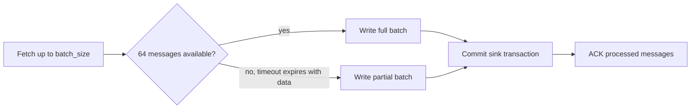
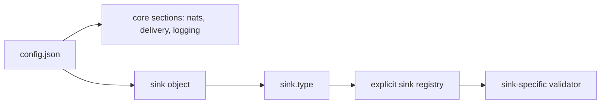
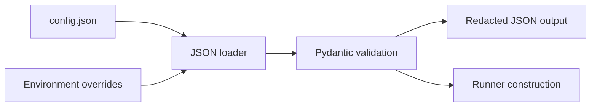

# Configuration

Runtime configuration is JSON-only. `nats-sinks` reads UTF-8 JSON files, requires a JSON object at the root, applies a small explicit allow-list of environment overrides, and validates the final structure with Pydantic.

## Minimal Configuration

The examples use Oracle because it is the first production sink. Future sinks
should keep the same generic runtime sections and define their own documented
fields inside the `sink` object.

```json
{
  "nats": {
    "url": "nats://localhost:4222",
    "stream": "ORDERS",
    "consumer": "orders-sink",
    "subject": "orders.*"
  },
  "sink": {
    "type": "oracle",
    "dsn": "localhost:1521/FREEPDB1",
    "user": "app_user",
    "password_env": "ORACLE_PASSWORD",
    "table": "NATS_SINK_EVENTS",
    "mode": "merge"
  }
}
```

## Full Example

```json
{
  "nats": {
    "url": "nats://localhost:4222",
    "stream": "ORDERS",
    "consumer": "orders-sink",
    "subject": "orders.*",
    "durable": true,
    "token_env": "NATS_TOKEN",
    "tls_ca_file": "/etc/nats/certs/ca.crt",
    "tls_verify": true
  },
  "delivery": {
    "batch_size": 100,
    "batch_timeout_ms": 1000,
    "max_in_flight_batches": 1,
    "ack_policy": "after_sink_commit",
    "max_retries": 5,
    "retry_backoff_ms": 1000,
    "temporary_failure_action": "nak",
    "prefer_safe_duplication": true
  },
  "dead_letter": {
    "enabled": true,
    "subject": "orders.dlq",
    "include_payload": true,
    "include_headers": true,
    "include_error": true
  },
  "logging": {
    "level": "INFO",
    "payload_logging": false
  },
  "metrics": {
    "enabled": false,
    "namespace": "nats_sinks"
  },
  "sink": {
    "type": "oracle",
    "dsn": "localhost:1521/FREEPDB1",
    "user": "app_user",
    "password_env": "ORACLE_PASSWORD",
    "table": "NATS_SINK_EVENTS",
    "mode": "merge",
    "auto_create": false,
    "payload_mode": "json_or_envelope",
    "idempotency": {
      "strategy": "stream_sequence",
      "columns": ["STREAM_NAME", "STREAM_SEQUENCE"]
    }
  }
}
```

## Delivery Settings

The `delivery.batch_size` value is a maximum fetch and write size, not a
minimum. The runner asks JetStream for up to that many messages and also passes
`delivery.batch_timeout_ms` to the pull request. When fewer messages are
available, the NATS client can return a smaller batch after the timeout, and the
runner writes that partial batch immediately.

For example, with `batch_size=64`, a final batch of 58 messages is valid and is
written, committed, and ACKed just like a full batch. This keeps low-volume
streams from waiting indefinitely while still allowing larger batches when
traffic is available.



## Sink-Specific Configuration

The top-level configuration model validates the generic runtime sections
strictly and leaves `sink` fields to the selected sink implementation. This is
what lets the project add future sinks without changing the stable core
configuration shape:



Every sink must define its own documented JSON fields, validation rules,
secret-handling guidance, and examples. The current production sink is Oracle,
so the tracked example files use `"type": "oracle"`. Detailed Oracle
connection options, Autonomous Database wallet settings, table routing,
payload modes, and column mappings live in [Oracle Sink](oracle-sink.md).

This separation is part of the compatibility contract. Adding a future
`postgres`, `http`, `file`, or `s3` sink should add new sink-specific fields
under `"sink"` without requiring existing Oracle users to change the rest of
their configuration.

## Payload Storage Modes

NATS message bodies are bytes. The framework-level payload normalization
contract lets JSON-capable sinks store both JSON and non-JSON bodies safely,
but the exact destination field names belong to each sink.

The shared payload modes are:

| Value | Meaning |
| --- | --- |
| `json_or_envelope` | Default for JSON-capable sinks. Store valid JSON unchanged; wrap non-JSON text or bytes in the nats-sinks JSON payload envelope. |
| `json_only` | Require valid JSON. Non-JSON bodies become permanent serialization failures and may go to DLQ. |
| `text_envelope` | Treat every body as UTF-8 text and wrap it in the JSON envelope. Use this for encrypted text streams. |
| `bytes_envelope` | Treat every body as bytes and wrap base64 content in the JSON envelope. |

Future sinks should either reuse these modes or document a deliberate,
well-tested alternative. See [Sink Framework](sink-framework.md) for the
destination-neutral payload envelope and [Oracle Sink](oracle-sink.md) for the
Oracle implementation.

## Metadata Storage

`NatsEnvelope.metadata_for_json_storage()` produces a generic metadata document
that every sink can persist. The document includes all headers,
NATS-reserved headers when present, unknown future `Nats-` headers, JetStream
sequence metadata, optional reply subject, and timestamp fields.

Missing optional NATS headers are allowed and do not make the message invalid.
Destination-specific docs should explain whether the metadata is stored as one
document, split into columns, or mapped into another backend-native structure.

## Environment Overrides

Supported environment overrides:

- `NATS_SINKS_NATS_URL`
- `NATS_SINKS_NATS_STREAM`
- `NATS_SINKS_NATS_CONSUMER`
- `NATS_SINKS_NATS_SUBJECT`
- `NATS_SINKS_LOG_LEVEL`
- `NATS_SINKS_SINK_TYPE`

Destination passwords should normally be supplied through environment variables
referenced by the selected sink configuration, for example `sink.password_env`
for sinks that use password-based authentication.

NATS passwords and tokens should normally be supplied through `nats.password_env`
or `nats.token_env`. Direct `nats.password` and `nats.token` values are useful
for disposable local tests but should not be committed.

## NATS Authentication And TLS

For NATS token authentication:

```json
{
  "nats": {
    "url": "tls://nats.example.com:4222",
    "stream": "ORDERS",
    "consumer": "orders-sink",
    "subject": "orders.*",
    "token_env": "NATS_TOKEN",
    "tls_ca_file": "/etc/nats/certs/ca.crt"
  }
}
```

For plain username/password or server-side bcrypted username/password:

```json
{
  "nats": {
    "url": "tls://nats.example.com:4222",
    "stream": "ORDERS",
    "consumer": "orders-sink",
    "subject": "orders.*",
    "user": "orders_sink",
    "password_env": "NATS_PASSWORD",
    "tls_ca_file": "/etc/nats/certs/ca.crt"
  }
}
```

In the bcrypted case, the bcrypt hash belongs in the NATS server
configuration. The client still supplies the clear-text password from
`NATS_PASSWORD`, and TLS protects that credential in transit.

For detailed connection guidance, see
[NATS Connections And Authentication](nats-connections.md).

## Logging

`nats-sinks` uses Python's standard logging levels. The default level is
`INFO`, which is intended to be useful for normal service operation without
printing sensitive message payloads or credentials.

Configure the level in JSON:

```json
{
  "logging": {
    "level": "INFO",
    "payload_logging": false
  }
}
```

You can also override the level at runtime with `NATS_SINKS_LOG_LEVEL` or with
the CLI `--log-level` option:

```bash
NATS_SINKS_LOG_LEVEL=DEBUG nats-sink run config.json
nats-sink run config.json --log-level WARNING
```

| Level | Intended use |
| --- | --- |
| `DEBUG` | Detailed troubleshooting during development or controlled support sessions. Avoid in production unless you have reviewed what the active code path can log. |
| `INFO` | Normal service lifecycle and processing information. This is the recommended default for most deployments. |
| `WARNING` | Unexpected but recoverable conditions, such as configuration choices that are valid but risky. |
| `ERROR` | Processing or destination failures that require attention but do not necessarily stop the process. |
| `CRITICAL` | Severe failures where the process or deployment may be unable to continue safely. |

Payload logging is separate from the level. Keep `payload_logging` set to
`false` in production unless the deployment has explicitly approved payload
visibility. Message bodies may contain customer data, business data,
ciphertext, credentials, or regulated information.

## Redaction

`nats-sink show-effective-config` prints JSON with secret-looking values
redacted. It does not resolve or display destination passwords, NATS passwords,
tokens, private keys, or credential file contents.


