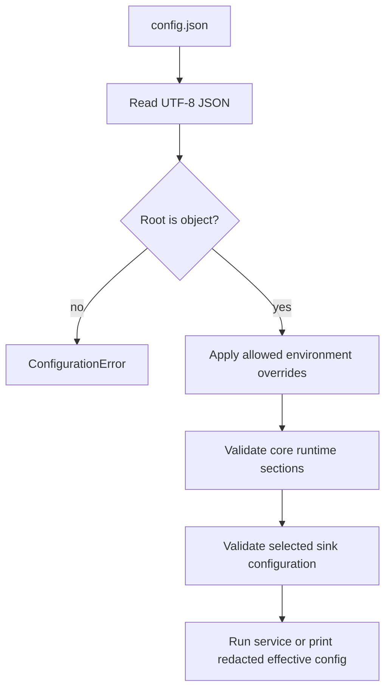
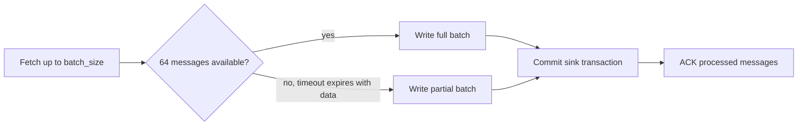
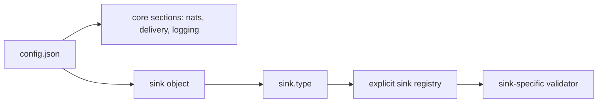
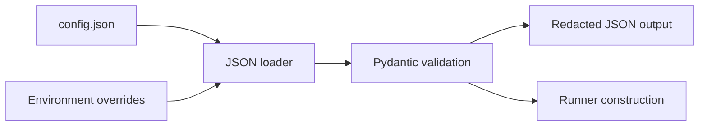

# Configuration

Runtime configuration is JSON-only. `nats-sinks` reads UTF-8 JSON files, requires a JSON object at the root, applies a small explicit allow-list of environment overrides, and validates the final structure with Pydantic.

## Minimal Configuration

The minimal example uses the local file sink because it does not require a
database or credentials. Oracle uses the same generic runtime sections and adds
Oracle-specific fields inside the `sink` object.

```json
{
  "nats": {
    "url": "nats://localhost:4222",
    "stream": "ORDERS",
    "consumer": "file-orders-sink",
    "subject": "orders.*"
  },
  "sink": {
    "type": "file",
    "directory": ".local/file-sink/events",
    "filename_strategy": "stream_sequence",
    "duplicate_policy": "skip_existing"
  }
}
```

## Full Example

```json
{
  "nats": {
    "url": "nats://localhost:4222",
    "stream": "ORDERS",
    "consumer": "file-orders-sink",
    "subject": "orders.*",
    "durable": true,
    "token_env": "NATS_TOKEN",
    "tls_ca_file": "/etc/nats/certs/ca.crt",
    "tls_verify": true
  },
  "delivery": {
    "batch_size": 100,
    "batch_timeout_ms": 1000,
    "max_in_flight_batches": 1,
    "ack_policy": "after_sink_commit",
    "max_retries": 5,
    "retry_backoff_ms": 1000,
    "temporary_failure_action": "nak",
    "prefer_safe_duplication": true
  },
  "dead_letter": {
    "enabled": true,
    "subject": "orders.dlq",
    "include_payload": true,
    "include_headers": true,
    "include_error": true
  },
  "logging": {
    "level": "INFO",
    "payload_logging": false
  },
  "metrics": {
    "enabled": false,
    "namespace": "nats_sinks"
  },
  "sink": {
    "type": "file",
    "directory": ".local/file-sink/events",
    "mode": "one_file_per_message",
    "filename_strategy": "stream_sequence",
    "duplicate_policy": "skip_existing",
    "payload_mode": "json_or_envelope",
    "compression": "none",
    "include_metadata": true,
    "partition_by_subject": true,
    "create_directory": true,
    "fsync": true
  }
}
```

## Configuration File Rules

Configuration files are normal JSON documents. The root value must be an
object, comments are not allowed, and unknown fields in the generic runtime
sections are rejected. This strictness is intentional: production sink services
should fail early when an operator misspells a field, places an option in the
wrong section, or accidentally carries configuration from another deployment.

The top-level sections are:

| Section | Required | Purpose |
| --- | --- | --- |
| `nats` | yes | NATS server connection, JetStream stream, consumer, subject, authentication, and TLS settings. |
| `delivery` | no | Batching, ACK policy, retry, and temporary failure behavior. Defaults are safe for local and early production deployments. |
| `dead_letter` | no | Optional DLQ publication for permanently invalid messages. |
| `logging` | no | Standard Python logging level and payload logging switch. |
| `metrics` | no | Metrics namespace and metrics enablement flag. The current implementation exposes a metrics abstraction and no-op default recorder. |
| `sink` | yes | Destination-specific sink configuration. `sink.type` chooses the sink implementation. |



## Core Configuration Reference

The tables below describe every generic configuration field understood by the
core runtime. Sink-specific options are documented later in this page and in the
dedicated sink pages.

### `nats`

The `nats` section tells the runner where to connect and which JetStream stream,
consumer, and subject should feed the sink.

| Field | Required | Default | Valid values | Description |
| --- | --- | --- | --- | --- |
| `url` | no | `nats://localhost:4222` | A NATS URL such as `nats://host:4222` or `tls://host:4222`. | Server URL passed to `nats-py`. Use `tls://` or TLS certificate fields for encrypted production connections. |
| `stream` | yes | none | Non-empty JetStream stream name. | Stream that owns the messages consumed by the sink. |
| `consumer` | yes | none | Consumer/durable name accepted by NATS. | Durable consumer name when `durable` is true. It is also used in logging and metrics context. |
| `subject` | yes | none | NATS subject or wildcard subject, for example `orders.*` or `orders.>`. | Subject used for pull subscription binding. It should be covered by the configured stream subjects. |
| `durable` | no | `true` | `true` or `false`. | When true, binds the pull subscription as a durable consumer. Production deployments should normally keep this enabled. |
| `name` | no | `null` | Client name string. | Optional client name passed to the NATS connection. Useful for server-side connection inspection. |
| `user` | no | `null` | Username string. | Username for NATS username/password authentication. |
| `password` | no | `null` | Password string. | Direct NATS password. Use only for disposable local tests; prefer `password_env` for production. |
| `password_env` | no | `null` | Environment variable name. | Environment variable that contains the NATS password. Mutually exclusive with `password`. |
| `token` | no | `null` | Token string. | Direct NATS token. Use only for disposable local tests; prefer `token_env` for production. |
| `token_env` | no | `null` | Environment variable name. | Environment variable that contains the NATS token. Mutually exclusive with `token`. |
| `creds_file` | no | `null` | Local file path. | Path to a NATS credentials file consumed by `nats-py` as `user_credentials`. |
| `nkey_seed_file` | no | `null` | Local file path. | Path to an NKEY seed file consumed by `nats-py` as `nkeys_seed`. |
| `tls_ca_file` | no | `null` | Local file path. | CA certificate file used to trust a private or self-signed NATS server certificate. |
| `tls_cert_file` | no | `null` | Local file path. | Optional client certificate file for mutual TLS transport. |
| `tls_key_file` | no | `null` | Local file path. | Optional client private key file. Requires `tls_cert_file` when set. |
| `tls_verify` | no | `true` | `true` or `false`. | Enables certificate verification and hostname checking. Keep enabled in production. |

Validation rules:

- configure either `password` or `password_env`, not both,
- configure either `token` or `token_env`, not both,
- `tls_key_file` requires `tls_cert_file`,
- bcrypted NATS passwords are a server-side storage detail; the client still
  sends the clear-text password from `password` or `password_env`.

### `delivery`

The `delivery` section controls how the core runner fetches, writes, retries,
and ACKs messages. It is destination-neutral: Oracle, file, and future sinks all
receive batches according to these settings.

| Field | Required | Default | Valid values | Description |
| --- | --- | --- | --- | --- |
| `batch_size` | no | `100` | Integer `1` to `10000`. | Maximum number of messages to fetch and pass to `sink.write_batch(...)` at once. It is an upper bound, not a requirement to wait for a full batch. |
| `batch_timeout_ms` | no | `1000` | Integer greater than or equal to `1`. | Pull fetch timeout in milliseconds. Smaller values reduce latency for partial batches; larger values can improve batching efficiency. |
| `max_in_flight_batches` | no | `1` | Integer `1` to `64`. | Reserved for bounded concurrency. The current runner processes one active batch at a time to keep commit-then-ACK ordering simple and conservative. |
| `ack_policy` | no | `after_sink_commit` | Only `after_sink_commit`. | Non-negotiable commit-then-acknowledge policy. ACK happens only after the sink reports durable success or after DLQ publication succeeds for permanent failures. |
| `max_retries` | no | `5` | Integer greater than or equal to `0`. | Retry policy setting reserved for explicit retry decisions. JetStream redelivery remains governed by the consumer policy. |
| `retry_backoff_ms` | no | `1000` | Integer greater than or equal to `0`. | Delay passed to NAK when `temporary_failure_action` is `nak` and the NATS client supports delayed NAK. |
| `temporary_failure_action` | no | `nak` | `nak` or `leave_unacked`. | `nak` asks JetStream to redeliver after the configured backoff. `leave_unacked` relies on the consumer ACK timeout. |
| `prefer_safe_duplication` | no | `true` | `true` or `false`. | Documents the intended reliability posture: duplicates are acceptable when idempotency handles them; silent loss is not. Keep true unless a future sink documents a reviewed alternative. |

### `dead_letter`

The `dead_letter` section controls what happens to permanently invalid messages,
for example malformed payloads when a sink is configured with
`payload_mode: "json_only"` or a message that lacks required idempotency
metadata. DLQ publication follows the same safety rule: the original message is
ACKed only after DLQ publication succeeds.

| Field | Required | Default | Valid values | Description |
| --- | --- | --- | --- | --- |
| `enabled` | no | `false` | `true` or `false`. | Enables DLQ publication for permanent failures. |
| `subject` | required when enabled | `null` | NATS subject. | Subject where DLQ messages are published. Required when `enabled` is true. |
| `include_payload` | no | `true` | `true` or `false`. | Includes the original message body in the DLQ payload. Disable when payload privacy is more important than DLQ replay convenience. |
| `include_headers` | no | `true` | `true` or `false`. | Includes original message headers in the DLQ payload. Disable if headers may contain sensitive values. |
| `include_error` | no | `true` | `true` or `false`. | Includes framework error type and message in the DLQ payload. |

### `logging`

The `logging` section configures Python standard logging. It does not enable
payload logging by itself; payload visibility is controlled by the separate
`payload_logging` flag.

| Field | Required | Default | Valid values | Description |
| --- | --- | --- | --- | --- |
| `level` | no | `INFO` | Standard levels such as `DEBUG`, `INFO`, `WARNING`, `ERROR`, `CRITICAL`. | Minimum log level configured by the CLI before the runner starts. Can be overridden by `NATS_SINKS_LOG_LEVEL` or CLI `--log-level`. |
| `payload_logging` | no | `false` | `true` or `false`. | Reserved privacy switch for code paths that may log payload details. Keep false in production. |

### `metrics`

The `metrics` section prepares the service for metrics emission while keeping
the default runtime dependency surface small.

| Field | Required | Default | Valid values | Description |
| --- | --- | --- | --- | --- |
| `enabled` | no | `false` | `true` or `false`. | Enables metrics when a concrete recorder/exporter is supplied by deployment code. The default recorder is no-op. |
| `namespace` | no | `nats_sinks` | Metric namespace string. | Prefix used by metrics integrations and documentation. |

### `sink`

The `sink` section selects the destination and carries all destination-specific
options. The core validates `sink.type`, then the safe sink registry passes the
remaining fields to the selected sink validator.

| Field | Required | Default | Valid values | Description |
| --- | --- | --- | --- | --- |
| `type` | yes | none | `file` or `oracle` in the current release. | Selects the production sink implementation. Future sinks should add new values without changing the generic core sections. |

All other fields under `sink` are sink-specific:

- `file` fields are documented in [File Sink](file-sink.md),
- `oracle` fields are documented in [Oracle Sink](oracle-sink.md).

## Delivery Settings

The `delivery.batch_size` value is a maximum fetch and write size, not a
minimum. The runner asks JetStream for up to that many messages and also passes
`delivery.batch_timeout_ms` to the pull request. When fewer messages are
available, the NATS client can return a smaller batch after the timeout, and the
runner writes that partial batch immediately.

For example, with `batch_size=64`, a final batch of 58 messages is valid and is
written, committed, and ACKed just like a full batch. This keeps low-volume
streams from waiting indefinitely while still allowing larger batches when
traffic is available.



## Sink-Specific Configuration

The top-level configuration model validates the generic runtime sections
strictly and leaves `sink` fields to the selected sink implementation. This is
what lets the project add future sinks without changing the stable core
configuration shape:



Every sink must define its own documented JSON fields, validation rules,
secret-handling guidance, and examples. The current production sinks are:

- `"type": "oracle"` for Oracle Database. Detailed Oracle connection options,
  Autonomous Database wallet settings, table routing, payload modes, and column
  mappings live in [Oracle Sink](oracle-sink.md).
- `"type": "file"` for local JSON file output. File durability, duplicate
  policies, deterministic file names, optional gzip compression, and filesystem safety live in
  [File Sink](file-sink.md).

This separation is part of the compatibility contract. Adding a future
`postgres`, `http`, or `s3` sink should add new sink-specific fields under
`"sink"` without requiring existing Oracle or file users to change the rest of
their configuration.

## Payload Storage Modes

NATS message bodies are bytes. The framework-level payload normalization
contract lets JSON-capable sinks store both JSON and non-JSON bodies safely,
but the exact destination field names belong to each sink.

The shared payload modes are:

| Value | Meaning |
| --- | --- |
| `json_or_envelope` | Default for JSON-capable sinks. Store valid JSON unchanged; wrap non-JSON text or bytes in the nats-sinks JSON payload envelope. |
| `json_only` | Require valid JSON. Non-JSON bodies become permanent serialization failures and may go to DLQ. |
| `text_envelope` | Treat every body as UTF-8 text and wrap it in the JSON envelope. Use this for encrypted text streams. |
| `bytes_envelope` | Treat every body as bytes and wrap base64 content in the JSON envelope. |

Future sinks should either reuse these modes or document a deliberate,
well-tested alternative. See [Sink Framework](sink-framework.md) for the
destination-neutral payload envelope, [Oracle Sink](oracle-sink.md) for the
Oracle implementation, and [File Sink](file-sink.md) for local file output.

## Metadata Storage

`NatsEnvelope.metadata_for_json_storage()` produces a generic metadata document
that every sink can persist. The document includes all headers,
NATS-reserved headers when present, unknown future `Nats-` headers, JetStream
sequence metadata, optional reply subject, and timestamp fields.

Missing optional NATS headers are allowed and do not make the message invalid.
Destination-specific docs should explain whether the metadata is stored as one
document, split into columns, or mapped into another backend-native structure.

## Environment Overrides

Supported environment overrides:

- `NATS_SINKS_NATS_URL`
- `NATS_SINKS_NATS_STREAM`
- `NATS_SINKS_NATS_CONSUMER`
- `NATS_SINKS_NATS_SUBJECT`
- `NATS_SINKS_LOG_LEVEL`
- `NATS_SINKS_SINK_TYPE`

Destination passwords should normally be supplied through environment variables
referenced by the selected sink configuration, for example `sink.password_env`
for sinks that use password-based authentication.

NATS passwords and tokens should normally be supplied through `nats.password_env`
or `nats.token_env`. Direct `nats.password` and `nats.token` values are useful
for disposable local tests but should not be committed.

## NATS Authentication And TLS

For NATS token authentication:

```json
{
  "nats": {
    "url": "tls://nats.example.com:4222",
    "stream": "ORDERS",
    "consumer": "orders-sink",
    "subject": "orders.*",
    "token_env": "NATS_TOKEN",
    "tls_ca_file": "/etc/nats/certs/ca.crt"
  }
}
```

For plain username/password or server-side bcrypted username/password:

```json
{
  "nats": {
    "url": "tls://nats.example.com:4222",
    "stream": "ORDERS",
    "consumer": "orders-sink",
    "subject": "orders.*",
    "user": "orders_sink",
    "password_env": "NATS_PASSWORD",
    "tls_ca_file": "/etc/nats/certs/ca.crt"
  }
}
```

In the bcrypted case, the bcrypt hash belongs in the NATS server
configuration. The client still supplies the clear-text password from
`NATS_PASSWORD`, and TLS protects that credential in transit.

For detailed connection guidance, see
[NATS Connections And Authentication](nats-connections.md).

## Logging

`nats-sinks` uses Python's standard logging levels. The default level is
`INFO`, which is intended to be useful for normal service operation without
printing sensitive message payloads or credentials.

Configure the level in JSON:

```json
{
  "logging": {
    "level": "INFO",
    "payload_logging": false
  }
}
```

You can also override the level at runtime with `NATS_SINKS_LOG_LEVEL` or with
the CLI `--log-level` option:

```bash
NATS_SINKS_LOG_LEVEL=DEBUG nats-sink run config.json
nats-sink run config.json --log-level WARNING
```

| Level | Intended use |
| --- | --- |
| `DEBUG` | Detailed troubleshooting during development or controlled support sessions. Avoid in production unless you have reviewed what the active code path can log. |
| `INFO` | Normal service lifecycle and processing information. This is the recommended default for most deployments. |
| `WARNING` | Unexpected but recoverable conditions, such as configuration choices that are valid but risky. |
| `ERROR` | Processing or destination failures that require attention but do not necessarily stop the process. |
| `CRITICAL` | Severe failures where the process or deployment may be unable to continue safely. |

Payload logging is separate from the level. Keep `payload_logging` set to
`false` in production unless the deployment has explicitly approved payload
visibility. Message bodies may contain customer data, business data,
ciphertext, credentials, or regulated information.

## Redaction

`nats-sink show-effective-config` prints JSON with secret-looking values
redacted. It does not resolve or display destination passwords, NATS passwords,
tokens, private keys, or credential file contents.


