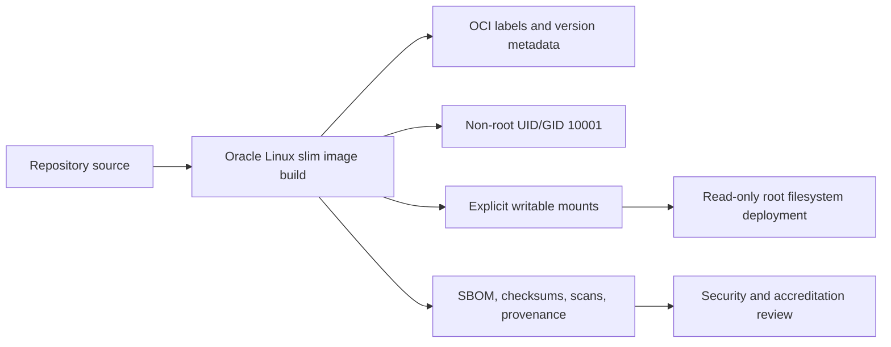

# Production Container Hardening

This page describes the hardened container posture for `nats-sinks`. It is
separate from the [Local Docker Stack](docker.md) page because local smoke
testing and production deployment have different goals. The local stack proves
that the image, NATS JetStream, and file sink work together. Production
hardening defines the controls an operator should review before running
`nats-sinks` as a long-lived service in a regulated, mission-oriented, or
defence environment.

`nats-sinks` is not formally DoD, DISA, NATO, Iron Bank, or Kubernetes
platform accredited by publishing this image. The image is designed to support
hardened deployment patterns that map cleanly to public DoD, DISA, NSA/CISA,
NIST, CIS, and NATO-aligned secure-delivery guidance. Final accreditation,
risk acceptance, and platform-specific controls remain the operator's
responsibility.

## Hardening Goals

The production container baseline has four goals:

- keep the runtime least-privileged and reviewable;
- keep secrets, wallets, certificates, and environment-specific configuration
  outside the image;
- make writable paths explicit so read-only root filesystem deployments are
  practical; and
- make release evidence visible through OCI labels, SBOMs, checksums,
  vulnerability scans, provenance, and operator documentation.



## Image Construction Baseline

The tracked `Dockerfile` uses Oracle's Oracle Linux 9 slim base image:

```text
container-registry.oracle.com/os/oraclelinux:9-slim
```

The base image reference is intentionally Oracle-owned and Oracle-centric.
Operators who require stronger reproducibility should pin the base image by
digest in their controlled build pipeline or internal registry mirror. The
project keeps the human-readable tag in the repository so local developers can
build and inspect the image without a private mirror.

The image build:

- installs Python 3.11 from Oracle Linux package repositories;
- disables pip's version check and cache;
- installs `nats-sinks` from the source tree;
- validates the installed package with `pip check`;
- removes package-manager caches after installation;
- creates a stable non-root runtime identity with UID and GID `10001`;
- marks `/opt/nats-sinks` read-only for group and other users;
- keeps configuration and runtime state outside the application directory; and
- declares `HEALTHCHECK NONE` so no image-level healthcheck can accidentally
  fetch, write, DLQ, or acknowledge messages.

The image uses the same entry point as every other deployment:

```text
nats-sink
```

Commit-then-acknowledge behavior is unchanged by containerization. The worker
still ACKs JetStream messages only after the selected sink reports durable
success, or after DLQ publish succeeds for a permanent failure.

## OCI Labels

The image declares standard OCI labels:

| Label | Purpose |
| --- | --- |
| `org.opencontainers.image.title` | Human-readable image title. |
| `org.opencontainers.image.description` | Short description of the image role. |
| `org.opencontainers.image.source` | Public source repository. |
| `org.opencontainers.image.url` | Project URL. |
| `org.opencontainers.image.documentation` | Container hardening documentation URL. |
| `org.opencontainers.image.licenses` | SPDX license identifier. |
| `org.opencontainers.image.vendor` | Project/vendor identity. |
| `org.opencontainers.image.version` | Build-supplied package or image version. |
| `org.opencontainers.image.revision` | Build-supplied Git revision. |
| `org.opencontainers.image.created` | Build-supplied creation timestamp. |
| `org.opencontainers.image.base.name` | Base image reference. |

Local builds default version, revision, and creation fields to safe placeholder
values. Release automation or an operator build pipeline should pass explicit
values:

```bash
docker build \
  --build-arg NATS_SINKS_VERSION=0.4.1 \
  --build-arg NATS_SINKS_REVISION="$(git rev-parse HEAD)" \
  --build-arg NATS_SINKS_CREATED="$(date -u +%Y-%m-%dT%H:%M:%SZ)" \
  -t nats-sinks:0.4.1 .
```

## Runtime Identity

The image runs as:

```text
UID 10001
GID 10001
```

Production platforms should keep that user non-root:

- Docker and Podman should not override the container to `root`.
- Kubernetes should set `runAsNonRoot: true`, `runAsUser: 10001`, and
  `runAsGroup: 10001`.
- Files mounted for output, metrics snapshots, spool custody, or temporary
  data must be writable by UID/GID `10001`.

Avoid privileged mode, host PID, host IPC, host networking, Docker socket
mounts, and broad hostPath mounts unless a separate security review explicitly
approves them.

## Writable Paths

The image expects only a small set of writable locations:

| Path | Expected use |
| --- | --- |
| `/etc/nats-sinks` | Mounted JSON configuration and trust material. In most deployments this should be read-only. |
| `/var/lib/nats-sinks/file` | File sink output when the file sink is used. |
| `/var/lib/nats-sinks/metrics` | Optional local metrics snapshot files. |
| `/var/lib/nats-sinks/spool` | Optional encrypted edge spool records. |
| `/tmp` | Temporary runtime files and Python cache directories when needed. |

When running with a read-only root filesystem, mount only the paths the selected
configuration actually needs. A file-sink worker usually needs a read-only
config mount, a writable file-output mount, and a small `/tmp` tmpfs.

```bash
docker run --rm --read-only \
  --tmpfs /tmp:rw,noexec,nosuid,nodev \
  --cap-drop ALL \
  --security-opt no-new-privileges:true \
  --user 10001:10001 \
  --mount type=bind,src="$PWD/examples/docker-local/config.json",dst=/etc/nats-sinks/config.json,ro \
  --mount type=tmpfs,dst=/var/lib/nats-sinks \
  nats-sinks:local validate /etc/nats-sinks/config.json
```

For long-running file-sink deployments, replace the `/var/lib/nats-sinks`
tmpfs with a persistent mount for the file output path. For Oracle-only
deployments, runtime state may be limited to metrics snapshots, temporary
files, and mounted trust material.

## Local Compose Hardening

The local Compose stack applies the same basic runtime restrictions to the
`nats-sink` service:

- `read_only: true`,
- `/tmp` mounted as tmpfs with `noexec`, `nosuid`, and `nodev`,
- all Linux capabilities dropped,
- `no-new-privileges:true`, and
- JSON configuration mounted read-only.

This is still a local smoke-test stack, not a production orchestrator. It helps
detect obvious image regressions, but it does not replace Kubernetes admission
policy, host hardening, registry policy, network policy, vulnerability
management, or accreditation evidence.

## Kubernetes Security Context

The Kubernetes examples use this security posture:

```yaml
securityContext:
  runAsNonRoot: true
  runAsUser: 10001
  runAsGroup: 10001
  fsGroup: 10001
  seccompProfile:
    type: RuntimeDefault
containers:
  - name: nats-sink
    securityContext:
      allowPrivilegeEscalation: false
      readOnlyRootFilesystem: true
      capabilities:
        drop:
          - "ALL"
```

That posture is a starting point. Operators should also add namespace-level
policy, image admission controls, registry allow lists, workload identity
policy, resource limits, NetworkPolicy, audit logging, and environment-specific
secret management.

## Supply-Chain Evidence

The Python package release already generates CycloneDX SBOMs and SHA-256
checksums. For production container use, operators should extend that evidence
with container-specific controls:

- build the image from an immutable Git revision;
- record the final image digest;
- generate or attach a container SBOM with tools approved by the organization;
- scan the final image with Trivy, Grype, Docker Scout, or equivalent tooling;
- document any risk acceptance for findings that cannot be removed;
- sign the image or attach signed attestations where the registry and platform
  support it; and
- keep release images immutable by tag and digest.

Example local checks:

```bash
docker build -t nats-sinks:local .
docker image inspect nats-sinks:local --format '{{.Id}} {{.Config.User}}'
trivy image nats-sinks:local
grype nats-sinks:local
```

The exact scanner, severity threshold, exception process, and reporting format
are operator-specific. Do not paste scanner output containing private registry
names, internal base-image mirrors, hostnames, usernames, or environment
references into public issues.

## Secrets And Configuration

The image must not contain:

- NATS tokens, credentials files, NKEY seed files, or passwords;
- Oracle wallet files, database passwords, or connect strings;
- TLS private keys, CA bundles from private environments, or client
  certificates;
- payload examples from real systems;
- local `.local/` test data; or
- environment-specific JSON configuration.

Use mounted files, environment variables sourced from a secret manager, or
platform-native secret injection. Avoid placing secrets in command-line
arguments because process lists, shell history, audit logs, and debugging
tools may expose them.

## Defence And Regulated Deployment Notes

The public guidance reviewed for this work points to a layered model:

- DoD and DISA material emphasizes approved or hardened bases, repeatable
  container hardening, scanning, evidence, and risk acceptance.
- NSA/CISA Kubernetes guidance emphasizes least privilege, restricted
  capabilities, read-only filesystems, RBAC, audit logging, network
  segmentation, and continuous review.
- NIST SP 800-190 and CIS benchmarks provide broadly used container and
  Kubernetes hardening baselines.
- Public NATO cyber and information-assurance material supports secure
  delivery, configuration discipline, resilience, and accreditation context
  rather than a single public Dockerfile checklist.

Use careful language during reviews: the image is hardened to support secure
deployment patterns, but the final deployment is compliant only after the
appropriate organizational assessment is complete.

## Operator Checklist

Before promoting a containerized `nats-sinks` deployment, verify:

- the image was built from the expected Git revision;
- the base image source and digest are approved for the environment;
- `docker image inspect` shows a non-root user;
- runtime configuration and secrets are mounted, not baked in;
- only required writable paths are mounted;
- the container can run with `--read-only` or the exceptions are documented;
- Linux capabilities are dropped unless explicitly justified;
- outbound network access is restricted to required NATS, sink, and optional
  observability endpoints;
- SBOM, checksum, vulnerability scan, and provenance evidence are retained;
- logs and metrics are sanitized and policy-controlled; and
- commit-then-acknowledge semantics remain unchanged by probes, sidecars, or
  platform lifecycle hooks.

## Current Limitations

The repository does not yet publish an official public container image as part
of the release workflow. The tracked Dockerfile and local smoke-test stack are
ready for local and operator-controlled builds. Public registry publication,
image signing, signed provenance, release-attached container SBOMs, and
container-specific vulnerability-scan gates remain separate backlog work.
