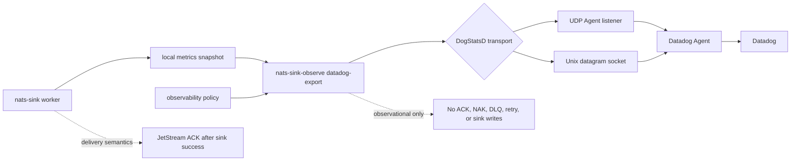

# Datadog Integration

The Datadog integration exports approved `nats-sinks` metrics as DogStatsD
datagrams for a local or explicitly approved Datadog Agent listener. It is
intended for teams that already use Datadog dashboards and alerts and want
`nats-sinks` aggregate runtime signals without placing Datadog API credentials
in the sink worker.

Datadog export is best-effort observability. UDP and Unix datagram transports
can drop packets, and the Datadog Agent may aggregate, sample, or reject
metrics according to its own configuration. Use this integration for
operational trend visibility, not for durable audit records, delivery proof, or
message custody evidence.

The connector is observational only. It reads a local metrics snapshot and a
reviewed observability policy. It does not read NATS messages, payload bodies,
Oracle rows, file-sink output, message IDs, subjects, classification values,
labels, mission metadata, credentials, or destination configuration. It never
changes JetStream ACK, NAK, DLQ, retry, fan-out, idempotency, or sink-write
behavior.

## Architecture



The delivery worker and Datadog export command should normally run as separate
operational concerns:

- the worker processes JetStream messages and writes to durable sinks;
- the metrics recorder writes a local snapshot;
- `nats-sink-observe datadog-export` reads that snapshot;
- the observability policy decides which metric names may be sent;
- the Datadog Agent receives approved DogStatsD datagrams.

If the Agent is unavailable, a Unix socket is missing, or UDP packets are
dropped, message delivery is not affected.

## What Is Exported

The connector renders one DogStatsD line per approved aggregate metric:

```text
nats_sinks.messages_fetched_total:256|g
nats_sinks.messages_acked_total:256|g
nats_sinks.sink_batch_write_seconds.count:4|g
nats_sinks.sink_batch_write_seconds.last:0.031|g
```

Metric types are mapped as follows:

| nats-sinks row kind | DogStatsD type | Notes |
| --- | --- | --- |
| Counter | `g` | Metrics snapshots contain absolute aggregate values, so counters are exported as gauges to avoid double-counting repeated exports. |
| Gauge | `g` | Current values are sent as DogStatsD gauges. |
| Observation `count` | `g` | Observation counts are snapshot values and are exported as gauges for the same reason as counters. |
| Observation `sum`, `min`, `max`, `last` | `g` | Observation summary values are sent as gauges. |

This is deliberate. DogStatsD counters are normally interpreted as deltas by
the Agent. The `nats-sinks` metrics snapshot stores the current total, not the
change since the previous export, so exporting snapshot totals as counters
would inflate values whenever the exporter runs repeatedly over the same
process metrics.

The connector does not export:

- message payloads;
- NATS subjects;
- message IDs;
- stream names or consumer names;
- NATS server URLs;
- Oracle connection strings;
- table names;
- file paths;
- classification values;
- labels unless prepared metric labels are explicitly enabled as tags;
- mission metadata;
- Datadog hostnames, Agent addresses, or socket paths in result summaries;
- Datadog API keys or application keys.

## Policy Example

Datadog export is disabled by default. Enable it only after reviewing the
metric allow list, the Datadog Agent path, and any tags.

```json
{
  "schema": "nats_sinks.observability.policy.v1",
  "enabled": true,
  "namespace": "nats_sinks",
  "allowed_metrics": [
    "messages_fetched_total",
    "messages_acked_total",
    "sink_batches_written_total"
  ],
  "allowed_metric_patterns": [],
  "denied_metrics": [],
  "denied_metric_patterns": [],
  "include_observations": false,
  "include_legacy": false,
  "subjects": [],
  "datadog": {
    "enabled": true,
    "transport": "udp",
    "host": "127.0.0.1",
    "port": 8125,
    "socket_path": null,
    "metric_prefix": null,
    "tags": {
      "environment": "test",
      "service": "nats-sinks"
    },
    "include_metric_labels_as_tags": false,
    "timeout_seconds": 1,
    "max_retries": 0,
    "retry_backoff_seconds": 0.25,
    "stale_after_seconds": 60,
    "max_datagram_bytes": 1432
  }
}
```

When `metric_prefix` is `null`, the connector uses the policy `namespace` as
the DogStatsD prefix. Set a prefix only when your Datadog naming scheme
requires a specific root.

## Configuration Fields

| Field | Default | Meaning |
| --- | --- | --- |
| `datadog.enabled` | `false` | Enables Datadog export when the top-level observability policy is also enabled. |
| `datadog.transport` | `udp` | Transport mode. Supported values are `udp` and `unixgram`. |
| `datadog.host` | `127.0.0.1` | UDP Agent target host. Keep loopback unless an approved network path exists. |
| `datadog.port` | `8125` | UDP Agent target port, validated from `1` through `65535`. |
| `datadog.socket_path` | `null` | Unix datagram socket path. Required when `transport` is `unixgram`. |
| `datadog.metric_prefix` | `null` | Optional DogStatsD metric prefix. When unset, the policy namespace is used. |
| `datadog.tags` | `{}` | Optional static low-cardinality tags. Tag names and values that look sensitive or high-cardinality are rejected. |
| `datadog.include_metric_labels_as_tags` | `false` | Adds prepared, policy-reviewed metric labels such as `subject_family` as tags. Keep disabled unless the subject-aware runbook has been completed. |
| `datadog.timeout_seconds` | `1` | Socket timeout, validated from greater than `0` through `60` seconds. |
| `datadog.max_retries` | `0` | Bounded retries after the initial send attempt. |
| `datadog.retry_backoff_seconds` | `0.25` | Delay between retry attempts when a local send operation fails. |
| `datadog.stale_after_seconds` | `null` | Optional maximum metrics snapshot age before export fails closed unless `--allow-stale` is used. |
| `datadog.max_datagram_bytes` | `1432` | Maximum size for each rendered datagram. The default is intentionally conservative for common UDP paths. |

## Tags

Tags are useful in Datadog, but they can also reveal sensitive context or
create unexpected cardinality and billing pressure. The connector therefore
starts with no tags and accepts only explicit static tags with bounded names
and values.

Allowed static tags should look like this:

```json
{
  "datadog": {
    "enabled": true,
    "tags": {
      "environment": "test",
      "service": "nats-sinks"
    }
  }
}
```

Do not use tags for subjects, classification values, labels, mission metadata,
message IDs, stream sequences, table names, file paths, hostnames, usernames,
tenant IDs, or credential references.

Prepared `labeled_metrics` rows are also suppressed by default. If
subject-family sharing has been reviewed and enabled, the connector can render
those prepared labels as DogStatsD tags:

```json
{
  "subject_metrics": {
    "enabled": true,
    "rules": [
      {
        "subject": "orders.*",
        "label": "orders"
      }
    ]
  },
  "datadog": {
    "enabled": true,
    "include_metric_labels_as_tags": true
  }
}
```

This still does not export raw subjects. It exports only the prepared stable
label from `labeled_metrics`, for example `subject_family:orders`.

## Dry Run

Dry-run mode prints the DogStatsD lines without opening a socket:

```bash
nats-sink-observe datadog-export \
  /var/lib/nats-sink/metrics.json \
  /etc/nats-sinks/observability.prometheus.json \
  --dry-run
```

Example output:

```text
nats_sinks.messages_fetched_total:256|g|#environment:test,service:nats-sinks
nats_sinks.messages_acked_total:256|g|#environment:test,service:nats-sinks
```

Use dry-run output during change review to confirm that only approved aggregate
metric names and approved tags are present.

## UDP Export

UDP export requires the top-level policy, `datadog.enabled`, and an Agent
listener:

```bash
nats-sink-observe datadog-export \
  /var/lib/nats-sink/metrics.json \
  /etc/nats-sinks/observability.prometheus.json
```

Example success output:

```text
Datadog export: attempted=true delivered=true attempts=1 datagrams=2 message=Datadog export delivered
```

Example safe failure output:

```text
Datadog export: attempted=true delivered=false attempts=3 datagrams=2 message=Datadog export failed with OSError
```

The output does not include the Agent host, Agent port, socket path, subject
names, tags, or payload data.

## Unix Datagram Export

Some Agent deployments expose a Unix datagram socket. This keeps traffic on the
host and can simplify firewall policy:

```json
{
  "datadog": {
    "enabled": true,
    "transport": "unixgram",
    "socket_path": "/run/datadog/dsd.socket"
  }
}
```

The socket path is validated as configuration, but the connector does not
create or manage the receiving socket. The Datadog Agent must create the socket
before the export command runs.

## systemd Pattern

Run Datadog export separately from the sink worker. This gives the Datadog
export service a narrower permission set: read the local snapshot, read the
policy, and send datagrams only to the approved Agent listener.

```ini
[Unit]
Description=nats-sinks Datadog export
After=network-online.target

[Service]
Type=oneshot
User=nats-sink
Group=nats-sink
ExecStart=/usr/local/bin/nats-sink-observe datadog-export /var/lib/nats-sink/metrics.json /etc/nats-sinks/observability.prometheus.json
NoNewPrivileges=true
PrivateTmp=true
ProtectSystem=strict
ProtectHome=true
ReadWritePaths=/var/lib/nats-sink
```

A timer can run the export periodically:

```ini
[Unit]
Description=Run nats-sinks Datadog export every 30 seconds

[Timer]
OnBootSec=30
OnUnitActiveSec=30
Unit=nats-sink-datadog.service

[Install]
WantedBy=timers.target
```

## Testing

The unit test suite covers disabled policy behavior, allow and deny filtering,
metric-name normalization, static tag rendering, prepared label suppression,
prepared label opt-in, datagram-size bounds, UDP sending, Unix datagram
sending, bounded retries, stale snapshot behavior, CLI dry-run output, and
public API compatibility.

Run the focused tests:

```bash
python -m pytest \
  tests/unit/test_datadog_observability.py \
  tests/unit/test_observability_policy.py \
  tests/unit/test_observability_cli.py \
  tests/unit/test_public_api.py -q
```

Optional live testing can be performed with a local Datadog Agent DogStatsD
listener, but it is not part of the default suite because Agent deployments and
network controls differ.
