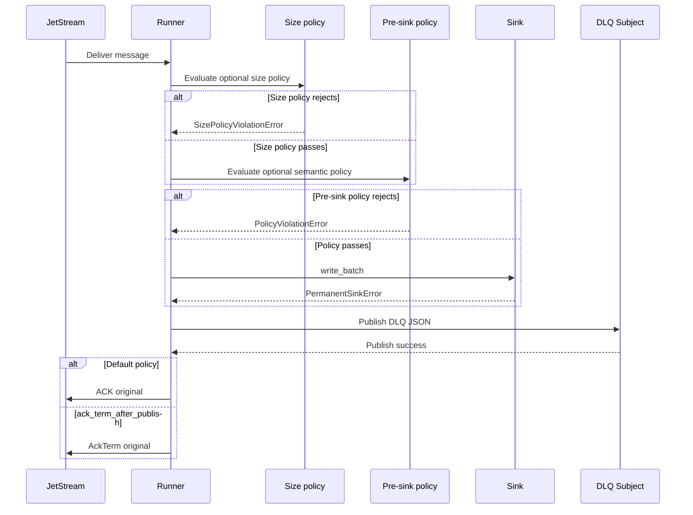

# Dead Letter Queues

A dead-letter queue, often shortened to DLQ, is a place where a consumer sends
messages that cannot be processed successfully in their current form. DLQs are
useful because they let the main stream continue while preserving failed
messages for inspection, repair, or replay.

In `nats-sinks`, DLQs are used for permanent failures that should not be
retried without changing the message or destination configuration.

In mission-oriented operations, a DLQ is part of the evidence trail. It should
give operators enough context to triage a malformed, unauthorized, or
schema-incompatible event without losing sight of the original processing
failure.

Examples:

- invalid JSON payload,
- missing required idempotency field,
- validation failure,
- size-policy rejection such as oversized payload, too many headers, labels
  outside the configured bounds, or a normalized record that exceeds the
  deployment contract,
- pre-sink policy rejection such as missing classification, missing required
  labels, unencrypted payload on a subject that requires encryption, or a
  payload that exceeds an approved size limit,
- non-retryable destination error.

## ACK Rule

> The original message is ACKed only after DLQ publication succeeds.

If DLQ publish fails, the original message remains unacked and eligible for
redelivery. This keeps the failure visible to JetStream rather than silently
discarding a message that still needs operator attention.

## Terminal Acknowledgements

The default runtime uses the conservative DLQ flow: publish the DLQ record, wait
for publication success, and then ACK the original message.

Deployments that consume JetStream terminal-delivery advisories can explicitly
enable `dead_letter.ack_term_after_publish`. When enabled, the runner still
publishes the DLQ record first, but sends `AckTerm` instead of normal ACK after
that publication succeeds. This is a terminal failure path, not a successful
sink-write path.

If DLQ publication fails, the runner sends neither ACK nor `AckTerm`; the
original message remains eligible for redelivery. If `AckTerm` fails after DLQ
publication, the failure is counted and raised. Redelivery may occur, and DLQ
handling must remain safe for duplicate publication attempts.

See [ADR 0005: AckTerm And AckNext Evaluation](adr/0005-ackterm-acknext-evaluation.md)
for the design decision and safety limits.

## Flow

## Payload Shape

The DLQ payload is JSON so operators can inspect it with ordinary tooling. It
can include:

- original subject,
- stream,
- consumer,
- stream sequence,
- consumer sequence,
- message ID,
- redelivery state,
- pending count,
- idempotency key,
- error type and message,
- optional headers,
- optional base64 payload.

Payload inclusion is configurable because source payloads may be sensitive.
For restricted, classified, or otherwise sensitive streams, consider disabling
payload inclusion in the DLQ and relying on message metadata, idempotency keys,
and the original stream retention policy for investigation.

DLQ publish permission is separate from source-subject permission. The sink
runtime account does not need to publish to the source subject, and it does not
need to subscribe to the DLQ subject. When DLQ is enabled, grant publish access
only to the configured `dead_letter.subject`. The complete NATS permission
templates are documented in
[NATS Least-Privilege Permissions](nats-permissions.md).

For a complete operational example of DLQ triage, replay preparation, and
safe public reporting, see
[DLQ Triage And Replay Preparation](use-cases/mission-support/dlq-triage-and-replay.md).
