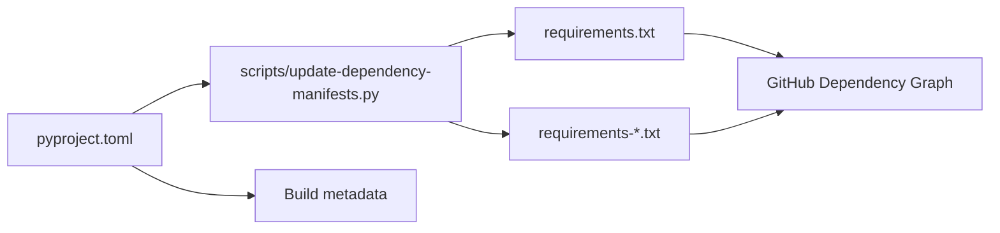

# Dependency Management

This page explains how `nats-sinks` keeps its dependency inventory visible to
GitHub, maintainers, and downstream operators.

The authoritative dependency definition is `pyproject.toml`. The project also
commits generated `requirements*.txt` files because GitHub's Dependency Graph
has broad Python/pip support for `requirements.txt` style manifests. GitHub's
documentation explains that the Dependency Graph scans supported manifest and
lock files when the feature is enabled, and lists `requirements.txt` as the
recommended pip manifest format:

- [About the dependency graph](https://docs.github.com/en/code-security/supply-chain-security/understanding-your-software-supply-chain/about-the-dependency-graph)
- [Dependency graph supported package ecosystems](https://docs.github.com/en/code-security/supply-chain-security/understanding-your-software-supply-chain/dependency-graph-supported-package-ecosystems)

## Repository Setting

The Dependency Graph is a GitHub repository security feature. Repository
owners should confirm it is enabled in GitHub:

1. Open the repository on GitHub.
2. Go to `Settings`.
3. Open `Code security and analysis`.
4. Enable `Dependency graph`.
5. Keep Dependabot alerts and dependency review enabled where the organization
   policy allows them.

The repository cannot guarantee that setting purely through source files. What
the repository can do is keep supported manifest files present, accurate, and
checked in CI.

## Generated Manifest Files

The following files are generated from `pyproject.toml`:

| File | Purpose |
| --- | --- |
| `requirements.txt` | Runtime dependencies published by the package. |
| `requirements-crypto.txt` | Runtime dependencies plus the `crypto` optional dependency group. |
| `requirements-oracle.txt` | Runtime dependencies plus the `oracle` optional dependency group. |
| `requirements-oci.txt` | Runtime dependencies plus the `oci` optional dependency group used by live OCI Monitoring export. |
| `requirements-test.txt` | Runtime dependencies plus the `test` optional dependency group. |
| `requirements-dev.txt` | Runtime dependencies plus the `dev` optional dependency group. |
| `requirements-docs.txt` | Runtime dependencies plus the `docs` optional dependency group. |
| `requirements-all.txt` | Runtime dependencies plus the production optional extras currently represented by `all`. |

These files are not hand-edited. To update dependencies:

1. Edit `pyproject.toml`.
2. Regenerate manifests:

   ```bash
   python scripts/update-dependency-manifests.py
   ```

3. Check that generated files are committed:

   ```bash
   python scripts/update-dependency-manifests.py --check
   ```



## CI And Pre-Commit Guard

The manifest check runs in:

- `scripts/check.sh`,
- GitHub Actions CI,
- the local pre-commit hook named `nats-sinks dependency manifest consistency`.

If the check fails, regenerate the manifests and include them in the same
change as the `pyproject.toml` edit. Do not update generated manifests without
also updating the dependency source in `pyproject.toml`.

## Dependabot And Dependency Review

The repository keeps:

- `.github/dependabot.yml` for weekly GitHub Actions and Python dependency
  update checks,
- `.github/workflows/dependency-review.yml` for pull request dependency review,
- generated pip manifests for the Dependency Graph,
- CycloneDX SBOM generation for release evidence.

These controls serve different purposes. The Dependency Graph helps GitHub
understand declared dependencies. Dependency review checks pull requests.
Dependabot proposes updates. SBOMs capture release evidence for a built
artifact. None of these controls replaces normal review, tests, or security
analysis.

## Connector Dependency Discipline

Observability connectors follow the same dependency discipline as sinks. The
OpenTelemetry OTLP metrics connector currently uses the Python standard
library to emit OTLP/HTTP JSON and therefore does not add an OpenTelemetry SDK
or protobuf dependency to the base package. That choice keeps the default
installation small, makes dependency review simpler, and avoids changing the
runtime footprint for users who do not enable OTLP export.

OCI Monitoring is the first observability connector with a vendor SDK. The
`oci` optional extra installs the OCI Python SDK only on hosts that perform
live OCI Monitoring export; dry-run rendering and the base sink package do not
require it.

If a future connector needs another vendor SDK, gRPC transport, protobuf
encoder, or cloud authentication library, add it behind an optional extra,
document why the dependency is required, update the generated manifest files,
and include tests proving the base install still works without that optional
connector.

## NATS Python Client Capability Checks

The runtime package depends on `nats-py` through the version range declared in
`pyproject.toml`. Some NATS client capabilities are not only a package-version
question; they also depend on which public client API the installed library
exposes. Ordered-consumer inspection is handled this way.

`nats-sink inspect-ordered` checks the active JetStream context before it
subscribes. It requires a callable public `JetStreamContext.subscribe` API with
an `ordered_consumer` keyword. If that support is missing, partial, or
ambiguous, the command fails closed with a short sanitized configuration error.
It does not fall back to ordinary push delivery, durable pull delivery, private
client attributes, or dynamic imports.

This check is deliberately limited to explicit inspection tooling. It does not
change the production durable pull runner, sink construction, commit
semantics, ACK ordering, DLQ handling, or idempotency behavior. Operators who
pin dependencies for controlled environments should validate
`nats-sink inspect-ordered` in their own runtime image if they intend to use
ordered inspection during incident response or lab analysis.

## Security Notes

Generated dependency manifests must never include secrets, private indexes with
credentials, local file paths, Oracle wallet locations, private CA contents, or
internal hostnames. If a future deployment needs private package sources,
document that separately and keep credentials in GitHub Actions secrets,
organization package settings, or an approved secret manager.

For high-trust environments, operators may additionally require hash-verified
installs, organization-approved package mirrors, or internally generated SBOMs.
Those controls are compatible with the manifest strategy, but they are
deployment policy decisions rather than default package behavior. See
[Hash-Verified Installs](hash-verified-installs.md) for a full operator
workflow using pinned versions, reviewed wheelhouses, SHA-256 hashes, and
`pip --require-hashes`.
