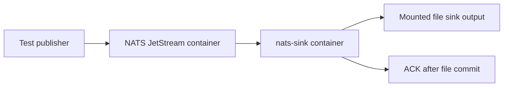

# Local Docker Image And NATS Test Stack

`nats-sinks` includes a local Docker image and a JSON-formatted Docker Compose
stack for developer smoke testing. The stack starts a NATS JetStream container
and a `nats-sink` container that writes test messages to the production file
sink.

This stack is intentionally a local testing workflow. It is useful for
validating the CLI, JSON configuration, NATS connectivity, pull-consumer
behavior, and file-sink output without installing `nats-sink` directly on the
host. The image is built from Oracle Linux 9 slim so the local container path
remains aligned with Oracle-centric Linux and OCI deployment expectations,
while still keeping the image small and easy to rebuild.

The same Dockerfile now carries a production hardening baseline: non-root
execution, explicit OCI metadata, read-only-root-compatible runtime paths, and
a no-side-effect healthcheck stance. Production operators should still read
[Production Container Hardening](container-hardening.md) before treating the
image as an approved deployment artifact.

## What The Stack Provides

The local stack contains two services:

- `nats`, using the public NATS image with JetStream enabled.
- `nats-sink`, built from this repository and started with
  `nats-sink run /etc/nats-sinks/config.json`.

The sink configuration is stored in
`examples/docker-local/config.json`. It subscribes to `orders.*`, uses the
`ORDERS` stream, and writes JSON records to a mounted directory.



The same commit-then-acknowledge rule applies inside the container. The runner
ACKs only after the file sink reports that the file has been durably written.
For this local example, `fsync` is disabled for speed. Production file-sink
deployments that need host-crash durability should enable `fsync`.

## Quick Smoke Test

Run the full local flow from the repository root:

```bash
python scripts/run-docker-local-smoke.py
```

Expected output:

```text
Local Docker smoke test passed: persisted 8 message(s) under /path/to/nats-sinks/.local/docker-file-sink.
```

The script:

1. Builds the local image as `nats-sinks:local`.
2. Starts a temporary NATS JetStream service.
3. Creates the `ORDERS` stream.
4. Publishes deterministic test messages to `orders.created`.
5. Starts the `nats-sink` service.
6. Waits until the expected number of JSON files exists.
7. Stops the Compose project unless `--keep-running` is selected.

Use a larger or smaller message count:

```bash
python scripts/run-docker-local-smoke.py --message-count 13
```

Keep the stack and generated files for inspection:

```bash
python scripts/run-docker-local-smoke.py --message-count 13 --keep-running --keep-output
```

The script chooses free localhost ports for the NATS client and monitoring
ports, which avoids collisions with another NATS server already running on the
developer machine.

## Post-Release PyPI Artifact Container

The project also includes a local post-release validation script that builds a
temporary Oracle Linux 9 slim based container and installs the public PyPI
artifact inside it:

```bash
python scripts/run-pypi-release-container-validation.py --version 0.4.1
```

This container is not a deployment image and is not pushed to a registry. It is
a maintainer QA tool that proves the published package can be installed and
used without importing from the local source tree. The script removes the
temporary image and container by default and writes only a sanitized report
under `.local/pypi-release-validation/reports/`.

The validation container runs with a read-only root filesystem, all Linux
capabilities dropped, `no-new-privileges`, a writable `/tmp` tmpfs, and a
bind-mounted validator script. The `/tmp` tmpfs is executable because the
script creates a short-lived Python virtual environment there and normal
Python dependencies may include native extension wheels. It keeps source-code
mounts out of the Python import path so the check exercises the same artifact
that external users receive from PyPI.

## Oracle Coherence Community Edition Test Backend

The project also includes a test-only Oracle Coherence Community Edition
backend for future sink certification:

```bash
python scripts/run-oracle-coherence-container-smoke.py
```

The smoke runner builds a small Oracle Linux 9 slim based test image, resolves
the explicit Oracle Coherence Community Edition runtime modules during build,
starts a short-lived container with a random loopback port, verifies one full
fake event JSON object as a key/value entry through the Coherence Python
client, and removes the container by default.

Install the optional client in an isolated local virtual environment before
running the live smoke test:

```bash
python -m venv .local/coherence-smoke-venv
. .local/coherence-smoke-venv/bin/activate
python -m pip install coherence-client
```

See [Oracle Coherence Community Edition Test Backend](oracle-coherence-test-container.md)
for the base-image choice, security posture, runtime sequence, expected output,
and limitations.

## Oracle NoSQL Database Test Backend

The project includes a local-only Oracle NoSQL Database KVLite backend for the
experimental Oracle NoSQL Database sink:

```bash
python scripts/run-oracle-nosql-container-smoke.py
```

The smoke runner uses Oracle's documented Community Edition KVLite image from
GitHub Container Registry, starts a short-lived container with `KV_PROXY_PORT`
set to `8080`, binds the HTTP proxy to a random `127.0.0.1` port, writes one
complete fake event JSON object to a key/value-style table, reads it back, and
removes the container by default.

Run the Oracle NoSQL sink e2e test against a fresh KVLite container:

```bash
python scripts/run-oracle-nosql-sink-e2e.py
```

Expected successful output:

```text
Oracle NoSQL sink container e2e test passed.
```

Install the optional Oracle NoSQL Python SDK first:

```bash
python -m pip install -e ".[oracle-nosql]"
```

The helper intentionally wraps the official image instead of building a custom
Oracle NoSQL image. It therefore does not make a local claim about the base OS
layer of the Oracle-provided image. See
[Oracle NoSQL Database Test Backend](oracle-nosql-test-container.md) for the
image strategy, local-only security posture, JSON verification, expected
output, and troubleshooting.

## Full Local Container E2E Suite

Before release, maintainers can run the Oracle key/value sink e2e tests
together with one explicit gate:

```bash
python -m pip install -e ".[coherence,oracle-nosql]"
NATS_SINKS_RUN_CONTAINER_E2E=1 scripts/check-sinks.sh
```

The gate runs `scripts/run-container-e2e-suite.py`, which invokes the
container-backed Oracle NoSQL Database sink e2e runner and the
container-backed Oracle Coherence Community Edition sink e2e runner. Both
backends use short-lived local containers, loopback endpoints, fake event JSON
data, bounded readiness waits, and cleanup by default.

Expected successful tail output:

```text
Oracle NoSQL sink container e2e test passed.
Oracle Coherence sink e2e test passed.
Full container-backed sink e2e suite passed.
```

Keep this as a local release-validation step. It is deliberately not enabled by
default in GitHub Actions, normal unit tests, or quick smoke checks because it
requires Docker and optional backend SDKs.

## Manual Compose Workflow

You can also run the stack manually:

```bash
docker compose -f examples/docker-local/compose.json build nats-sink
docker compose -f examples/docker-local/compose.json up -d nats
```

Create an `ORDERS` stream and publish messages with your preferred NATS tool,
then start the sink:

```bash
docker compose -f examples/docker-local/compose.json up -d nats-sink
```

Stop the stack:

```bash
docker compose -f examples/docker-local/compose.json down --volumes
```

The smoke-test script is preferred because it creates the stream, publishes
messages, waits for output, and selects non-conflicting ports automatically.

## Image Behavior

The `Dockerfile` builds from Oracle's Oracle Linux 9 slim base image:

```text
container-registry.oracle.com/os/oraclelinux:9-slim
```

During the image build, Python 3.11 and `pip` are installed from Oracle Linux
package repositories. The build then installs `nats-sinks` from the repository
source tree, removes package-manager caches, creates a fixed non-root runtime
identity, and exposes these paths as volumes:

- `/etc/nats-sinks` for mounted JSON configuration.
- `/var/lib/nats-sinks` for mounted state, output files, or local test data.

The runtime user is UID/GID `10001`. Keep mounted output directories writable
for that identity. The image also expects `/tmp` to be writable when a platform
uses a read-only root filesystem. The local Compose file provides `/tmp` as a
tmpfs and runs the `nats-sink` service with `read_only: true`, all Linux
capabilities dropped, and `no-new-privileges:true`.

The image entry point is:

```text
nats-sink
```

The local Compose stack runs:

```text
nats-sink run /etc/nats-sinks/config.json
```

The image does not contain Oracle wallets, NATS credentials, certificates,
payload examples from private environments, or other deployment secrets.

The Docker Hub `oraclelinux:9-slim` official image is also available, but the
project Dockerfile uses the Oracle Container Registry reference so the default
image source is explicit and Oracle-owned. Operators may still mirror or pin
the base image by digest in their own controlled build pipeline.

## Configuration Used By The Example

The Docker example uses this shape:

```json
{
  "nats": {
    "url": "nats://nats:4222",
    "stream": "ORDERS",
    "consumer": "docker-file-sink",
    "subject": "orders.*",
    "durable": true
  },
  "delivery": {
    "batch_size": 8,
    "batch_timeout_ms": 500,
    "ack_policy": "after_sink_commit"
  },
  "sink": {
    "type": "file",
    "directory": "/var/lib/nats-sinks/file/events",
    "mode": "one_file_per_message",
    "duplicate_policy": "skip_existing",
    "payload_mode": "json_or_envelope",
    "include_metadata": true
  }
}
```

The complete file is
`examples/docker-local/config.json`. It also sets example priority,
classification, and labels metadata defaults:

```json
{
  "priority": "normal",
  "classification": "NATO UNCLASSIFIED",
  "labels": ["docker-local", "smoke-test"]
}
```

Those values are ordinary metadata examples for local testing. They are not
authorization decisions and must not replace access control in NATS, Oracle,
the filesystem, Kubernetes, Linux, or a platform security boundary.

## Local Output Shape

With `partition_by_subject` enabled, files are written below the mounted output
directory using sanitized subject path segments. A typical local test output
tree looks like this:

```text
.local/docker-file-sink/
└── events/
    └── orders/
        └── created/
            ├── 1.json
            ├── 2.json
            └── 3.json
```

Each record follows the same file-sink JSON contract documented in
[File Sink](file-sink.md). Payloads are normalized with `json_or_envelope`, so
valid JSON remains JSON and non-JSON payloads are wrapped in a JSON envelope.

## Security Boundaries

The local image follows useful baseline practices:

- It is based on Oracle Linux 9 slim.
- It runs as non-root UID/GID `10001`.
- It does not bake secrets into the image.
- It expects configuration to be mounted read-only.
- It writes only to explicitly mounted output paths.
- It keeps the Docker build context small through `.dockerignore`.
- It declares no image-level healthcheck, so probes cannot accidentally fetch,
  write, DLQ, or ACK messages.
- It can be used with a read-only root filesystem when the required writable
  paths are mounted explicitly.

The image is hardened enough to serve as a reviewable baseline, but an
operator-controlled production deployment still needs environment-specific
evidence and policy. Review:

- pinned base-image digests or internal registry mirrors,
- vulnerability scanning and risk acceptance,
- SBOM attachment for the container image,
- provenance and signing,
- namespace, network, and runtime policy,
- registry publication and immutability, and
- operator guidance for Kubernetes, systemd, Docker, or Podman.

The full production guidance is documented in
[Production Container Hardening](container-hardening.md).

## Test Evidence

Unit tests validate the Docker assets without requiring Docker:

```bash
python -m pytest tests/unit/test_docker_assets.py -q
```

When Docker is available, run the smoke test:

```bash
python scripts/run-docker-local-smoke.py --message-count 13
```

This smoke test exercises an actual local NATS container, the built local
`nats-sinks` image, and production file-sink output.

## Oracle MySQL Test Database Container

The Docker documentation also includes a separate local Oracle MySQL test
database container for Oracle MySQL sink development and e2e certification. It
is not part of the file-sink/NATS Compose stack above. It exists so maintainers
can test Oracle MySQL connectivity, startup, schema creation, writes, reads,
cleanup, and the `MySqlSink` commit-before-success boundary without relying on
a long-lived shared database.

Run the smoke test:

```bash
python scripts/run-oracle-mysql-container-smoke.py
```

Run the Oracle MySQL sink e2e test:

```bash
python scripts/run-mysql-sink-e2e.py
```

Expected sanitized output:

```text
Oracle MySQL container smoke test passed with one verified test record.
```

The smoke runner builds `examples/oracle-mysql-test/Dockerfile`, starts a
short-lived Oracle MySQL container based on Oracle Linux 9 slim, generates fresh
random credentials, exposes the database only on a random loopback port, and
removes the container, Docker volume, and generated secret files by default.

For full details, see
[Oracle MySQL Test Container](oracle-mysql-test-container.md).
