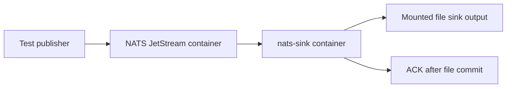

# Local Docker Image And NATS Test Stack

`nats-sinks` includes a local Docker image and a JSON-formatted Docker Compose
stack for developer smoke testing. The stack starts a NATS JetStream container
and a `nats-sink` container that writes test messages to the production file
sink.

This image is intentionally a local testing image. It is useful for validating
the CLI, JSON configuration, NATS connectivity, pull-consumer behavior, and
file-sink output without installing `nats-sink` directly on the host. It is not
yet the hardened public production image. Production hardening, signing,
registry publication, and automated release image publication are tracked as
separate backlog items.

## What The Stack Provides

The local stack contains two services:

- `nats`, using the public NATS image with JetStream enabled.
- `nats-sink`, built from this repository and started with
  `nats-sink run /etc/nats-sinks/config.json`.

The sink configuration is stored in
`examples/docker-local/config.json`. It subscribes to `orders.*`, uses the
`ORDERS` stream, and writes JSON records to a mounted directory.



The same commit-then-acknowledge rule applies inside the container. The runner
ACKs only after the file sink reports that the file has been durably written.
For this local example, `fsync` is disabled for speed. Production file-sink
deployments that need host-crash durability should enable `fsync`.

## Quick Smoke Test

Run the full local flow from the repository root:

```bash
python scripts/run-docker-local-smoke.py
```

Expected output:

```text
Local Docker smoke test passed: persisted 8 message(s) under /path/to/nats-sinks/.local/docker-file-sink.
```

The script:

1. Builds the local image as `nats-sinks:local`.
2. Starts a temporary NATS JetStream service.
3. Creates the `ORDERS` stream.
4. Publishes deterministic test messages to `orders.created`.
5. Starts the `nats-sink` service.
6. Waits until the expected number of JSON files exists.
7. Stops the Compose project unless `--keep-running` is selected.

Use a larger or smaller message count:

```bash
python scripts/run-docker-local-smoke.py --message-count 13
```

Keep the stack and generated files for inspection:

```bash
python scripts/run-docker-local-smoke.py --message-count 13 --keep-running --keep-output
```

The script chooses free localhost ports for the NATS client and monitoring
ports, which avoids collisions with another NATS server already running on the
developer machine.

## Manual Compose Workflow

You can also run the stack manually:

```bash
docker compose -f examples/docker-local/compose.json build nats-sink
docker compose -f examples/docker-local/compose.json up -d nats
```

Create an `ORDERS` stream and publish messages with your preferred NATS tool,
then start the sink:

```bash
docker compose -f examples/docker-local/compose.json up -d nats-sink
```

Stop the stack:

```bash
docker compose -f examples/docker-local/compose.json down --volumes
```

The smoke-test script is preferred because it creates the stream, publishes
messages, waits for output, and selects non-conflicting ports automatically.

## Image Behavior

The `Dockerfile` builds from `python:3.12-slim`, installs `nats-sinks` from the
repository source tree, creates a non-root `nats-sinks` user, and exposes these
paths as volumes:

- `/etc/nats-sinks` for mounted JSON configuration.
- `/var/lib/nats-sinks` for mounted state, output files, or local test data.

The image entry point is:

```text
nats-sink
```

The local Compose stack runs:

```text
nats-sink run /etc/nats-sinks/config.json
```

The image does not contain Oracle wallets, NATS credentials, certificates,
payload examples from private environments, or other deployment secrets.

## Configuration Used By The Example

The Docker example uses this shape:

```json
{
  "nats": {
    "url": "nats://nats:4222",
    "stream": "ORDERS",
    "consumer": "docker-file-sink",
    "subject": "orders.*",
    "durable": true
  },
  "delivery": {
    "batch_size": 8,
    "batch_timeout_ms": 500,
    "ack_policy": "after_sink_commit"
  },
  "sink": {
    "type": "file",
    "directory": "/var/lib/nats-sinks/file/events",
    "mode": "one_file_per_message",
    "duplicate_policy": "skip_existing",
    "payload_mode": "json_or_envelope",
    "include_metadata": true
  }
}
```

The complete file is
`examples/docker-local/config.json`. It also sets example priority,
classification, and labels metadata defaults:

```json
{
  "priority": "normal",
  "classification": "NATO UNCLASSIFIED",
  "labels": ["docker-local", "smoke-test"]
}
```

Those values are ordinary metadata examples for local testing. They are not
authorization decisions and must not replace access control in NATS, Oracle,
the filesystem, Kubernetes, Linux, or a platform security boundary.

## Local Output Shape

With `partition_by_subject` enabled, files are written below the mounted output
directory using sanitized subject path segments. A typical local test output
tree looks like this:

```text
.local/docker-file-sink/
└── events/
    └── orders/
        └── created/
            ├── 1.json
            ├── 2.json
            └── 3.json
```

Each record follows the same file-sink JSON contract documented in
[File Sink](file-sink.md). Payloads are normalized with `json_or_envelope`, so
valid JSON remains JSON and non-JSON payloads are wrapped in a JSON envelope.

## Security Boundaries

The local image follows useful baseline practices:

- It runs as a non-root user.
- It does not bake secrets into the image.
- It expects configuration to be mounted read-only.
- It writes only to explicitly mounted output paths.
- It keeps the Docker build context small through `.dockerignore`.

The image is not yet a hardened production image. The hardening follow-up
should evaluate:

- pinned image digests,
- vulnerability scanning,
- SBOM attachment,
- provenance and signing,
- read-only root filesystem behavior,
- minimal runtime package set,
- stricter Linux capabilities,
- OCI registry publication,
- release automation,
- operator guidance for Kubernetes and systemd use.

## Test Evidence

Unit tests validate the Docker assets without requiring Docker:

```bash
python -m pytest tests/unit/test_docker_assets.py -q
```

When Docker is available, run the smoke test:

```bash
python scripts/run-docker-local-smoke.py --message-count 13
```

This smoke test exercises an actual local NATS container, the built local
`nats-sinks` image, and production file-sink output.
