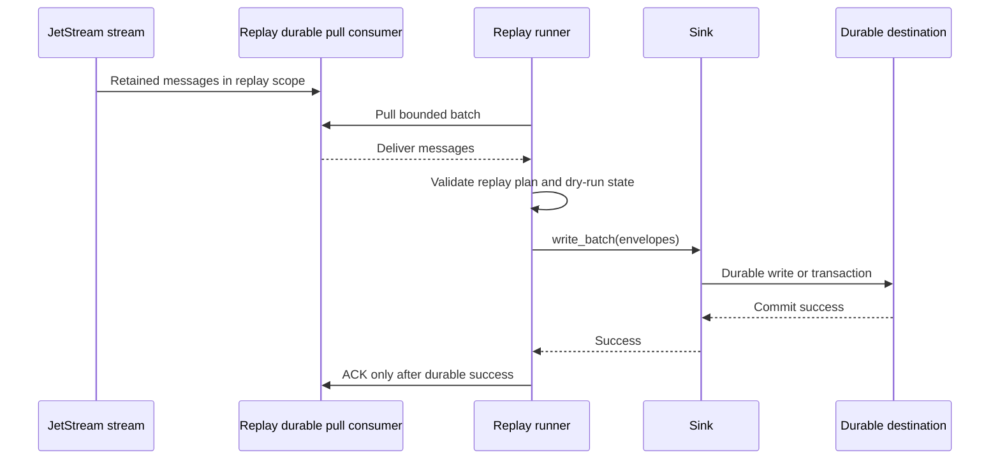

# Durable Replay To Sinks

Durable replay means reprocessing historical JetStream messages into one or
more sinks without weakening the normal `nats-sinks` delivery contract. It is
useful when an operator needs to rebuild downstream state, recover after a
destination outage, validate an incident-response finding, or move retained
events into a newly approved destination.

Replay is not the same as ordered inspection. Ordered consumers are useful for
bounded, read-only stream analysis. Durable replay to Oracle Database, Oracle
MySQL, file, fan-out, spool, or future sinks must use durable pull consumers,
idempotent destination writes, and commit-then-acknowledge behavior.

## Non-Negotiable Contract

A replay workflow must keep the same production safety rules as the normal
runner:

- use a durable pull consumer for sink writes;
- never use an ordered consumer for production sink writes;
- never ACK before durable sink success;
- preserve at-least-once semantics and design for duplicate delivery;
- require an idempotency strategy before replay starts;
- bound every replay by stream, subject scope, start boundary, and maximum
  message count or stopping condition;
- support a dry run before a write-capable replay;
- produce redacted reports by default;
- use least-privilege NATS permissions separate from stream administration;
- keep payloads, credentials, server locations, file paths, and destination
  details out of logs, issue comments, and public reports.

These rules apply whether the replay target is one Oracle table, a local file
directory, a fan-out route with required and optional targets, or a future
connector.



## Replay Boundaries

A future replay command or operator runbook should require explicit replay
boundaries. A safe replay plan needs all of the following:

| Boundary | Purpose |
| --- | --- |
| `stream` | Names the retained JetStream stream to replay from. |
| `subject_filter` or `subject_filters` | Limits replay to reviewed subject families. |
| `durable_consumer` | Keeps replay progress separate from the production worker. |
| `start_sequence` or `start_time` | Defines where replay begins. Configure one, not both. |
| `max_messages` | Prevents accidental unbounded scans or writes. |
| `batch_size` | Bounds memory, destination transactions, and ACK scope. |
| `stop_after_idle_seconds` | Lets the replay stop when the stream is drained. |
| `dry_run` | Defaults to `true` for planning and evidence generation. |
| `report_file` | Writes a sanitized local report under an approved output root. |

Example design shape for a future replay plan:

```json
{
  "replay": {
    "stream": "ORDERS",
    "subject_filters": ["orders.created", "orders.updated"],
    "durable_consumer": "orders-replay-2026-05",
    "start_sequence": 1000,
    "start_time": null,
    "max_messages": 5000,
    "batch_size": 64,
    "stop_after_idle_seconds": 30,
    "dry_run": true,
    "report_file": ".local/nats-sinks/replay/orders-replay-report.json"
  }
}
```

The plan is illustrative. It describes the shape future tooling should
validate; it is not a current runtime configuration block.

## Dry Run Requirements

A dry run should connect to NATS only with replay-read permissions and should
not call any sink. It should report:

- stream and durable consumer names after redaction policy is applied;
- selected subject families, not sensitive raw operational subjects unless
  explicitly approved for local display;
- start boundary and stop boundary;
- estimated or observed message count within the dry-run scan;
- configured destination type and idempotency mode;
- whether the destination can safely handle duplicate replay;
- warnings for missing DLQ, disabled idempotency, unbounded message count, or
  unsupported sink capabilities.

The dry-run report must not include message payloads, credentials, connection
strings, full server addresses, Oracle wallet details, database passwords,
private key material, local secret paths, or sensitive subject names.

## Sink-Specific Review

Replay safety depends on the destination.

| Sink | Replay review |
| --- | --- |
| Oracle Database | Confirm table DDL, idempotency strategy, duplicate mode, metadata columns, transaction size, and whether MERGE updates are intended. |
| Oracle MySQL | Confirm table DDL, idempotency strategy, duplicate/upsert mode, transaction size, TLS settings, and whether replay should update existing rows. |
| File sink | Confirm deterministic filename strategy, duplicate policy, filesystem capacity, fsync expectations, compression, encryption, and cleanup rules. |
| Edge spool sink | Confirm replay source custody, delete-after-success policy, priority ordering, key availability, and final target idempotency. |
| Fan-out sink | Confirm which child sinks are ACK-required, which are optional side copies, and each optional target timeout or minimum wait policy. |
| Future sinks | Require sink certification evidence before production replay is allowed. |

If a sink cannot provide an idempotent duplicate strategy, replay must be
treated as high risk and should not be automated for production use until the
destination behavior is reviewed.

## Failure Handling

Replay failure handling should follow the normal runner contract:

- temporary sink failure means do not ACK and allow redelivery;
- permanent sink failure should publish to the configured DLQ before ACK;
- DLQ publication failure means do not ACK the original message;
- replay reports should count written, ACKed, failed, DLQ, skipped, and
  duplicate records without printing payloads;
- operator cancellation should stop fetching new messages, finish or cancel
  in-flight work according to the normal shutdown policy, and close sinks
  cleanly.

Replay must be boring under failure. It should prefer an incomplete replay with
clear evidence over a quiet replay that skips messages or ACKs early.

## Future CLI Shape

Future stream replay tooling should be separate from `nats-sink run` and from
`nats-sink inspect-ordered`. A possible command shape is:

```bash
nats-sink replay-stream replay-plan.json target-config.json --dry-run
nats-sink replay-stream replay-plan.json target-config.json --execute
```

Before `--execute` is accepted, the command should validate:

- exactly one replay start boundary is configured;
- `max_messages`, `batch_size`, and idle timeout are within hard limits;
- the durable replay consumer is separate from the production durable consumer;
- the sink exposes a certified idempotency mode;
- the target configuration passes normal `nats-sink validate`;
- report output stays under an approved local root;
- write-capable execution is an explicit operator choice.

This future command should reuse the same `NatsEnvelope`, sink registry,
metadata, encryption, authenticity, policy, metrics, and DLQ contracts as the
production runner. It should not create a second delivery engine with different
ACK behavior.

## Test Design

Replay tooling must have deterministic tests before it can become a writeable
feature:

- configuration validation rejects missing stream, missing subject scope,
  multiple start boundaries, unbounded message counts, and unsafe output paths;
- dry run does not instantiate or call a sink;
- no early ACK is possible when a sink write fails;
- idempotent duplicate replay is exercised for Oracle Database, Oracle MySQL,
  file, spool, and fan-out targets where those sinks are enabled;
- DLQ-before-ACK behavior is preserved for permanent replay failures;
- reports are valid JSON or Markdown, bounded, and redacted;
- cancellation and shutdown do not leave partially written batches hidden from
  the operator;
- optional live tests remain environment-gated and use disposable streams,
  tables, directories, or containers.

Until that tooling exists, controlled replay should use existing durable
consumer operations, sink-specific runbooks, and the edge spool replay command
where appropriate.

## Relationship To Ordered Inspection

`nats-sink inspect-ordered` is read-only inspection. It is useful for viewing a
small in-order slice of a stream without advancing the production durable
consumer. It must not write to sinks and must not be used as a production
replay mechanism.

Durable replay-to-sinks is write-capable recovery or reprocessing. It belongs
on durable pull consumers because it needs explicit ACK decisions,
destination durability, idempotency, DLQ handling, and bounded operator
evidence.
