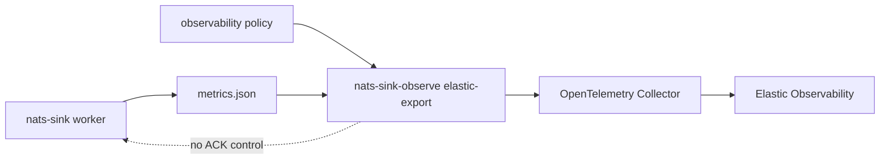

# Elastic Observability Profile

The Elastic Observability profile exports approved `nats-sinks` metrics through
the shared observability policy model. It is designed for operators who use
Elastic Observability, Elastic Cloud, Elastic-managed OpenTelemetry ingestion,
or an OpenTelemetry Collector that forwards telemetry into Elastic.

The profile is disabled by default. Enabling it never changes JetStream ACK,
NAK, retry, DLQ, sink-write, or idempotency behavior. It reads the local
`metrics.json` snapshot, applies the same allow and deny lists used by the
other observability connectors, renders a bounded OTLP metrics document, and
posts it to an explicitly configured endpoint.

## Why This Uses OTLP

Elastic documents OpenTelemetry as a supported ingestion path for
Observability. Elastic Cloud Hosted and Elastic Serverless can receive telemetry
through the Elastic Cloud Managed OTLP Endpoint, and Elastic also documents
Collector-based forwarding patterns for Elastic Observability:

- [Elastic Cloud Managed OTLP Endpoint](https://www.elastic.co/docs/solutions/observability/get-started/quickstart-elastic-cloud-otel-endpoint)
- [OpenTelemetry intake API](https://www.elastic.co/docs/solutions/observability/apm/opentelemetry-intake-api)
- [Upstream OpenTelemetry Collectors and SDKs with Elastic](https://www.elastic.co/docs/solutions/observability/apm/opentelemetry/upstream-opentelemetry-collectors-language-sdks)
- [Elasticsearch OTLP/HTTP endpoint](https://www.elastic.co/docs/manage-data/ingest/otlp-endpoint)

For this release, `nats-sinks` implements an Elastic profile over the existing
OTLP connector rather than a direct Elasticsearch writer. The recommended
production shape is:



This keeps all observability connectors on the same safety controls. It also
lets the OpenTelemetry Collector handle Elastic-specific authentication,
protocol, batching, queueing, compression, and backend tuning.

## Non-Goals

The Elastic profile is intentionally narrow:

- it does not connect to NATS,
- it does not read message payloads,
- it does not inspect sink output files,
- it does not query Oracle or future destination systems,
- it does not write directly to Elasticsearch indices,
- it does not use the Elasticsearch Bulk API,
- it does not add subject, message ID, table, file path, label,
  classification, username, hostname, or mission metadata values as metric
  dimensions by default,
- it does not affect ACK, NAK, DLQ, retry, sink writes, or idempotency.

Direct Elasticsearch writing may be evaluated later if a future issue proves a
direct path is safer and more useful than the Collector profile. That work
would need its own retry, partial-failure, index, mapping, and least-privilege
review.

## Policy Example

Elastic configuration lives in the same observability policy JSON used by the
other connectors:

```json
{
  "schema": "nats_sinks.observability.policy.v1",
  "enabled": true,
  "namespace": "nats_sinks",
  "allowed_metrics": [
    "messages_fetched_total",
    "messages_acked_total",
    "sink_batch_write_seconds"
  ],
  "allowed_metric_patterns": [],
  "denied_metrics": [],
  "denied_metric_patterns": [],
  "include_observations": true,
  "include_legacy": false,
  "subjects": [],
  "elastic": {
    "enabled": true,
    "ingestion_path": "otlp_collector",
    "endpoint": "http://127.0.0.1:4318/v1/metrics",
    "timeout_seconds": 5,
    "max_retries": 2,
    "retry_backoff_seconds": 0.25,
    "stale_after_seconds": 60,
    "max_request_bytes": 1048576,
    "headers_env": {
      "Authorization": "NATS_SINKS_ELASTIC_OTLP_AUTH_HEADER"
    },
    "data_stream_dataset": "nats_sinks.metrics",
    "data_stream_namespace": "default"
  }
}
```

The example points at a loopback Collector receiver. In many deployments, the
Collector then forwards to Elastic using Elastic-managed credentials or an
Elastic exporter configuration. Keep the Elastic API key in the Collector or in
an environment variable. Do not place it in the policy file.

## Configuration Fields

| Field | Default | Description |
| --- | --- | --- |
| `elastic.enabled` | `false` | Enables the Elastic profile when the top-level `enabled` field is also `true`. |
| `elastic.ingestion_path` | `otlp_collector` | Current profile mode. The connector emits OTLP metrics to a Collector-style endpoint and does not write directly to Elasticsearch. |
| `elastic.endpoint` | `null` | OTLP/HTTP metrics endpoint. Loopback collectors may use `http://127.0.0.1:4318/v1/metrics`; non-loopback endpoints must use `https://`. URLs with credentials, query strings, fragments, whitespace, or control characters are rejected. |
| `elastic.timeout_seconds` | `5` | Per-request timeout, validated from greater than `0` through `60` seconds. |
| `elastic.max_retries` | `0` | Bounded retries after the first attempt. Retries are an observability concern only and never affect message processing. |
| `elastic.retry_backoff_seconds` | `0.25` | Delay between retry attempts. |
| `elastic.stale_after_seconds` | `null` | Optional maximum age for the local metrics snapshot. Stale snapshots fail closed unless `--allow-stale` is used. |
| `elastic.max_request_bytes` | `1048576` | Maximum rendered OTLP JSON request body size. Oversized exports fail closed with a clear error. |
| `elastic.headers_env` | `{}` | Mapping of HTTP header names to environment variable names. Values are resolved at runtime and are not stored in JSON. |
| `elastic.data_stream_dataset` | `nats_sinks.metrics` | Static Elastic data stream dataset hint included as an OTLP resource attribute. Keep this low-cardinality and non-sensitive. |
| `elastic.data_stream_namespace` | `default` | Static Elastic data stream namespace hint included as an OTLP resource attribute. Keep this low-cardinality and non-sensitive. |

The connector uses the top-level `allowed_metrics`,
`allowed_metric_patterns`, `denied_metrics`, `denied_metric_patterns`, and
`include_observations` fields. The deny list wins over the allow list.

## Dry-Run Output

Use dry-run mode before enabling scheduled export:

```bash
nats-sink-observe elastic-export \
  /var/lib/nats-sink/metrics.json \
  /etc/nats-sinks/observability.prometheus.json \
  --dry-run
```

Example output, shortened for readability:

```json
{
  "resourceMetrics": [
    {
      "resource": {
        "attributes": [
          {
            "key": "service.name",
            "value": {
              "stringValue": "nats-sinks"
            }
          },
          {
            "key": "nats_sinks.namespace",
            "value": {
              "stringValue": "nats_sinks"
            }
          },
          {
            "key": "data_stream.dataset",
            "value": {
              "stringValue": "nats_sinks.metrics"
            }
          },
          {
            "key": "data_stream.namespace",
            "value": {
              "stringValue": "default"
            }
          },
          {
            "key": "nats_sinks.observability.profile",
            "value": {
              "stringValue": "elastic"
            }
          }
        ]
      },
      "scopeMetrics": [
        {
          "scope": {
            "name": "nats-sinks.observability.elastic"
          },
          "metrics": [
            {
              "name": "nats_sinks_messages_fetched_total",
              "description": "Messages fetched from JetStream by the runner.",
              "unit": "1"
            }
          ]
        }
      ]
    }
  ]
}
```

Review the dry-run output as an information-sharing artifact. It should contain
approved metric names, numeric values, and static routing hints only.

## Export Command

When the policy is reviewed and enabled:

```bash
export NATS_SINKS_ELASTIC_OTLP_AUTH_HEADER="ApiKey example-redacted"

nats-sink-observe elastic-export \
  /var/lib/nats-sink/metrics.json \
  /etc/nats-sinks/observability.prometheus.json
```

Successful output is intentionally short and redacted:

```text
Elastic Observability export: attempted=true delivered=true attempts=1 status=200 message=Elastic Observability export delivered
```

Failures are also sanitized:

```text
Elastic Observability export: attempted=true delivered=false attempts=3 status=none message=OTLP export failed with URLError
```

The endpoint URL and resolved authorization header are not printed.

## Collector Sketch

The exact Collector configuration depends on the Elastic deployment model. A
minimal local receiver shape looks like this:

```yaml
receivers:
  otlp:
    protocols:
      http:
        endpoint: 127.0.0.1:4318

processors:
  memory_limiter:
    check_interval: 1s
    limit_mib: 512
  batch:

exporters:
  otlp/elastic:
    endpoint: ${ELASTIC_OTLP_ENDPOINT}
    headers:
      Authorization: ${ELASTIC_OTLP_AUTH_HEADER}

service:
  pipelines:
    metrics:
      receivers: [otlp]
      processors: [memory_limiter, batch]
      exporters: [otlp/elastic]
```

Keep real endpoint values and API keys in the Collector environment or a
platform secret store. The example is intentionally generic so it can be
adapted to Elastic Cloud Hosted, Elastic Serverless, self-managed Elastic, or a
gateway Collector pattern after local security review.

## Service Deployment

Run the Elastic profile as a separate observability service or timer. The sink
worker should only need permission to write the local metrics snapshot. The
Elastic observability service should only need permission to read that snapshot
and policy file and to contact the configured Collector endpoint.

Example systemd service:

```ini
[Unit]
Description=nats-sinks Elastic Observability export
After=network-online.target

[Service]
Type=oneshot
User=nats-sink
Group=nats-sink
EnvironmentFile=-/etc/nats-sinks/elastic-observability.env
ExecStart=/usr/local/bin/nats-sink-observe elastic-export /var/lib/nats-sink/metrics.json /etc/nats-sinks/observability.prometheus.json
NoNewPrivileges=true
PrivateTmp=true
ProtectHome=true
ProtectSystem=strict
ReadWritePaths=/var/lib/nats-sink
```

Example timer:

```ini
[Unit]
Description=Run nats-sinks Elastic Observability export periodically

[Timer]
OnBootSec=30s
OnUnitActiveSec=30s
Unit=nats-sink-elastic.service

[Install]
WantedBy=timers.target
```

The timer interval should match the expected metrics freshness and Collector
capacity. If `elastic.stale_after_seconds` is set to `60`, avoid a timer
interval that routinely exceeds that value.

## Security Notes

- Keep `elastic.enabled=false` until the allow list and Collector route are
  reviewed.
- Prefer a loopback Collector receiver on the same host or pod when possible.
- Use HTTPS for non-loopback endpoints.
- Do not put credentials in the endpoint URL.
- Source authorization headers from environment variables or platform secrets.
- Keep `data_stream_dataset` and `data_stream_namespace` static,
  low-cardinality, and non-sensitive.
- Do not enable broad `allowed_metric_patterns` such as `*` until the rendered
  output has been reviewed.
- Treat Elastic indices and dashboards as searchable operational records.

## Testing

Deterministic unit tests cover:

- disabled policy behavior,
- allow and deny filtering through the shared policy model,
- observation inclusion controls,
- OTLP rendering with Elastic static resource attributes,
- bounded request size,
- environment-sourced authorization headers,
- missing header variables,
- retry limits,
- timeout propagation,
- dry-run CLI behavior,
- unsafe policy values.

Optional live tests should be added behind explicit markers and environment
gates if a deployment wants to test against a real Collector or Elastic lab
environment. Live test output must not include endpoint URLs, API keys,
subjects, payloads, table names, file paths, usernames, hostnames, message IDs,
or other sensitive operational details.
