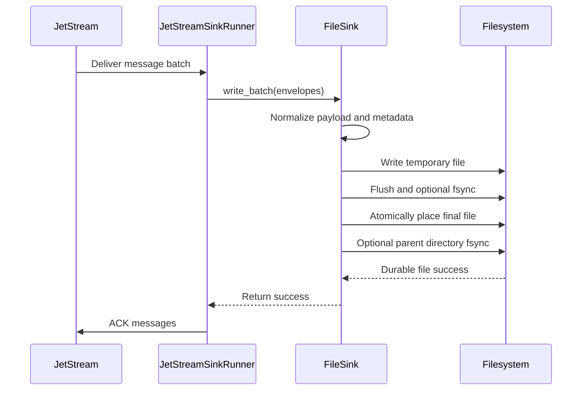
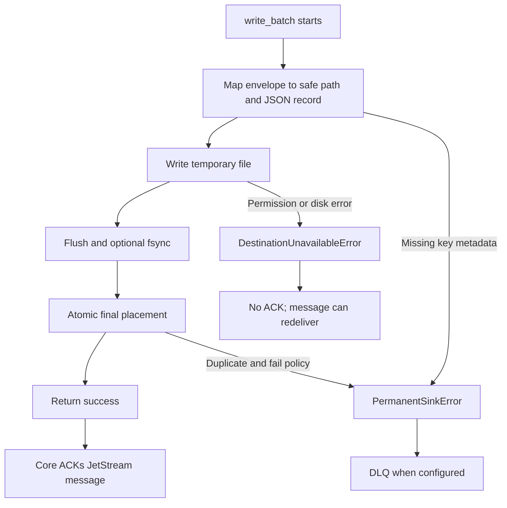

# File Sink

The local file sink writes JetStream messages to JSON files on a local or
mounted filesystem. It is the second production sink in `nats-sinks`, alongside
Oracle Database.

The file sink is useful when you need a durable handoff directory, a simple
audit trail, a development destination without a database, or an integration
point for another process that watches files. It follows the same core rule as
every sink in this project:

> Commit first. ACK last. Design for redelivery.

For `FileSink`, a batch is successful only after every required output file has
been written to a temporary file, flushed, optionally fsynced, and atomically
placed at its deterministic final path. The core runtime acknowledges
JetStream messages only after `FileSink.write_batch(...)` returns success.

## Processing Model



The sink does not call ACK, NAK, TERM, or any other JetStream acknowledgement
method. Delivery behavior remains owned by the core runtime.

## Installation

The file sink has no extra runtime dependencies. It is available with the base
package:

```bash
pip install nats-sinks
```

Oracle still requires the Oracle extra:

```bash
pip install "nats-sinks[oracle]"
```

## Configuration

Minimal file sink configuration:

```json
{
  "nats": {
    "url": "nats://localhost:4222",
    "stream": "ORDERS",
    "consumer": "file-orders-sink",
    "subject": "orders.*",
    "durable": true
  },
  "sink": {
    "type": "file",
    "directory": ".local/file-sink/events",
    "filename_strategy": "stream_sequence",
    "duplicate_policy": "skip_existing"
  }
}
```

Complete example:

```json
{
  "sink": {
    "type": "file",
    "directory": ".local/file-sink/events",
    "mode": "one_file_per_message",
    "filename_strategy": "stream_sequence",
    "duplicate_policy": "skip_existing",
    "payload_mode": "json_or_envelope",
    "extension": ".json",
    "include_metadata": true,
    "partition_by_subject": true,
    "create_directory": true,
    "fsync": true,
    "pretty": false
  }
}
```

## Configuration Reference

| Field | Default | Description |
| --- | --- | --- |
| `type` | Required | Must be `file`. |
| `directory` | Required | Root directory where output files are written. |
| `mode` | `one_file_per_message` | Writes one JSON file per message. |
| `filename_strategy` | `stream_sequence` | Idempotency key used for deterministic file names. |
| `duplicate_policy` | `skip_existing` | Behavior when a redelivered message maps to an existing file. |
| `payload_mode` | `json_or_envelope` | Shared payload normalization mode. |
| `extension` | `.json` | File extension for output documents. |
| `include_metadata` | `true` | Include standard NATS metadata snapshots in each file. |
| `partition_by_subject` | `true` | Put files into sanitized subject directories. |
| `create_directory` | `true` | Create the root directory when missing. |
| `fsync` | `true` | Flush files and parent directories for stronger crash safety. |
| `pretty` | `false` | Pretty-print JSON output. Compact JSON is faster and smaller. |

## Idempotency

The file sink is designed for at-least-once delivery. A message may be
redelivered after the file has already been committed, especially if the
process crashes before the JetStream ACK reaches the server.

The default strategy is `stream_sequence`, which creates file names from the
JetStream stream name and stream sequence:

```text
ORDERS-00000000000000000042.json
```

This is the recommended production strategy when the sink consumes from a
JetStream stream because stream sequence values are stable and unique inside a
stream.

Supported filename strategies:

| Strategy | Behavior | Recommended use |
| --- | --- | --- |
| `stream_sequence` | Uses stream name plus stream sequence. | Production JetStream sinks. |
| `message_id` | Uses `Nats-Msg-Id` or equivalent message ID metadata. | Streams where publishers reliably set unique message IDs. |
| `payload_sha256` | Uses subject plus payload digest. | Controlled archival workflows where identical payloads should collapse. |

If the selected strategy requires metadata that is missing, the sink raises a
framework `PermanentSinkError`. With DLQ enabled, the core publishes the
message to DLQ and ACKs the original only after DLQ publication succeeds.

## Duplicate Policies

| Policy | Behavior | Production guidance |
| --- | --- | --- |
| `skip_existing` | Existing final file is treated as prior durable success. | Recommended default. |
| `overwrite` | Existing final file is replaced. | Use only when later metadata replacement is acceptable. |
| `fail` | Existing final file raises `PermanentSinkError`. | Useful for strict diagnostics, not for normal redelivery. |

`skip_existing` is the safest default because it makes duplicate redelivery
boring: if the file already exists, the durable side effect has already
happened, so the sink can return success and allow the core to ACK.

## Output Shape

Each file contains a single JSON document:

```json
{
  "schema": "nats_sinks.file.message.v1",
  "schema_version": 1,
  "subject": "orders.created",
  "stream": "ORDERS",
  "stream_sequence": 42,
  "consumer": "file-orders-sink",
  "consumer_sequence": 12,
  "message_id": "O-1001",
  "payload": {
    "order_id": "O-1001",
    "amount": 42.5
  },
  "payload_info": {
    "original_format": "json",
    "wrapped": false,
    "sha256": "redacted-example",
    "size_bytes": 37
  },
  "metadata": {
    "metadata_version": 1,
    "subject": "orders.created",
    "headers": {},
    "jetstream": {},
    "timestamps": {}
  }
}
```

The actual `metadata` document contains the standard framework metadata
snapshot: headers, known and future `Nats-*` reserved headers, JetStream stream
and sequence values, and epoch nanosecond timing fields.

## Payload Handling

The file sink uses the same payload normalization contract as Oracle and future
JSON-capable sinks:

- valid JSON is stored as JSON,
- non-JSON UTF-8 text is wrapped in a JSON envelope,
- non-text bytes are base64-wrapped in a JSON envelope,
- empty payloads are represented safely and do not crash the sink.

For encrypted text streams where the ciphertext may or may not decrypt to JSON
later, use:

```json
{
  "sink": {
    "type": "file",
    "payload_mode": "text_envelope"
  }
}
```

That mode avoids repeated JSON parse attempts and stores every body in the
standard text envelope.

## Filesystem Safety

Subjects, streams, and message IDs are external input. The file sink never uses
them as raw path names. It sanitizes path components with an allow-list and
verifies that the resolved destination remains under the configured root
directory.

The default output layout partitions by subject:

```text
.local/file-sink/events/
  orders.created/
    ORDERS-00000000000000000001.json
    ORDERS-00000000000000000002.json
```

Characters that are unsafe for path components are replaced with `_`. Very long
components are truncated with a digest suffix so they remain deterministic
without creating oversized filenames.

## Failure Behavior



Failure examples:

| Scenario | Sink behavior | Core behavior |
| --- | --- | --- |
| Output directory cannot be created | Raises `DestinationUnavailableError`. | No ACK; message remains eligible for redelivery. |
| Disk is full during temporary file write | Raises `DestinationUnavailableError`. | No ACK; message remains eligible for redelivery. |
| Stream sequence is missing with `stream_sequence` strategy | Raises `PermanentSinkError`. | DLQ then ACK if DLQ succeeds. |
| Duplicate file exists with `skip_existing` | Treats as success. | ACK after sink returns success. |
| Duplicate file exists with `fail` | Raises `PermanentSinkError`. | DLQ then ACK if DLQ succeeds. |
| Subject contains path traversal text | Sanitizes path component. | File remains under configured root. |
| Payload is not JSON | Wraps text or bytes in JSON envelope. | ACK after durable write succeeds. |
| Empty payload | Wraps empty text in JSON envelope. | ACK after durable write succeeds. |
| Parent directory is a symlink outside root | Rejects escaped resolved path. | No ACK; message can redeliver after operator fixes path. |
| Fsync fails | Raises `DestinationUnavailableError`. | No ACK; message can redeliver. |

## Throughput Notes

The file sink is optimized for correctness first. It writes compact JSON by
default and moves filesystem work into a worker thread so the NATS event loop
does not block on local disk I/O.

For higher throughput:

- keep `pretty` set to `false`,
- use a fast local disk or low-latency mounted volume,
- tune `delivery.batch_size`,
- keep `partition_by_subject` enabled for large subject sets,
- consider `fsync: false` only when the surrounding storage layer provides an
  acceptable durability boundary.

Disabling `fsync` can improve speed, but it weakens crash durability. If the
process returns success and the core ACKs, the file should already be durable
according to the configured policy. Keep `fsync: true` when local file loss
after a host crash is unacceptable.

## Python API

```python
from nats_sinks import JetStreamSinkRunner
from nats_sinks.file import FileSink

sink = FileSink(
    directory="/var/lib/nats-sinks/events",
    filename_strategy="stream_sequence",
    duplicate_policy="skip_existing",
)

runner = JetStreamSinkRunner(
    nats_url="nats://localhost:4222",
    stream="ORDERS",
    consumer="file-orders-sink",
    subject="orders.*",
    sink=sink,
)

await runner.run()
```

## Local Example

The repository includes a tracked example at `examples/file-basic/config.json`.
It writes generated files under `.local/file-sink/events`, which is ignored by
git.

```bash
nats-sink validate examples/file-basic/config.json
nats-sink test-sink examples/file-basic/config.json
```

To run against local NATS:

```bash
nats-server -js -m 8222
nats stream add ORDERS --subjects "orders.*"
nats-sink run examples/file-basic/config.json
nats pub orders.created '{"order_id":"O-1001","amount":42.50}'
```

## Production Recommendations

- Run the service as a dedicated operating system user.
- Use an absolute output directory in production service configs.
- Make the output directory writable only by the sink service and trusted
  operators.
- Keep generated files out of the source repository.
- Monitor disk usage and inode usage.
- Back up or rotate files according to your retention policy.
- Prefer `stream_sequence` plus `skip_existing` for JetStream consumers.
- Keep payload logging disabled unless a deployment has explicit approval to
  log message bodies.
