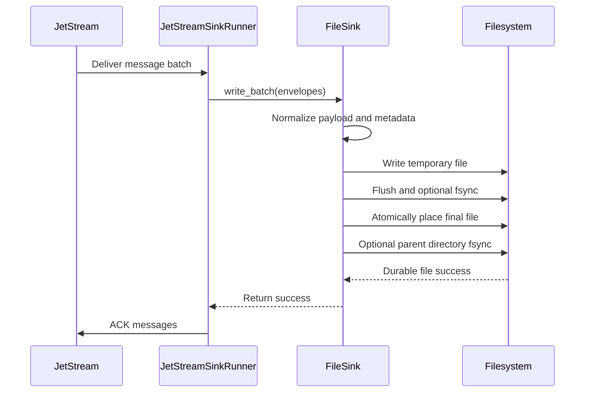
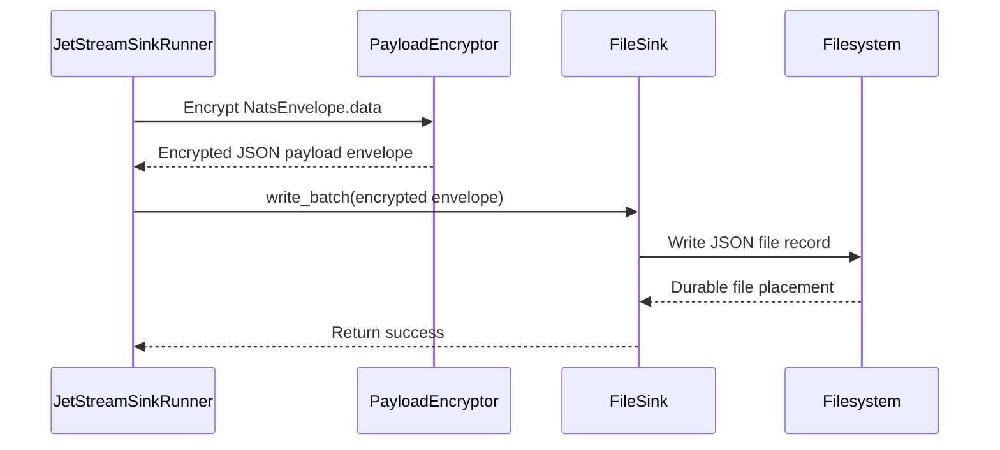
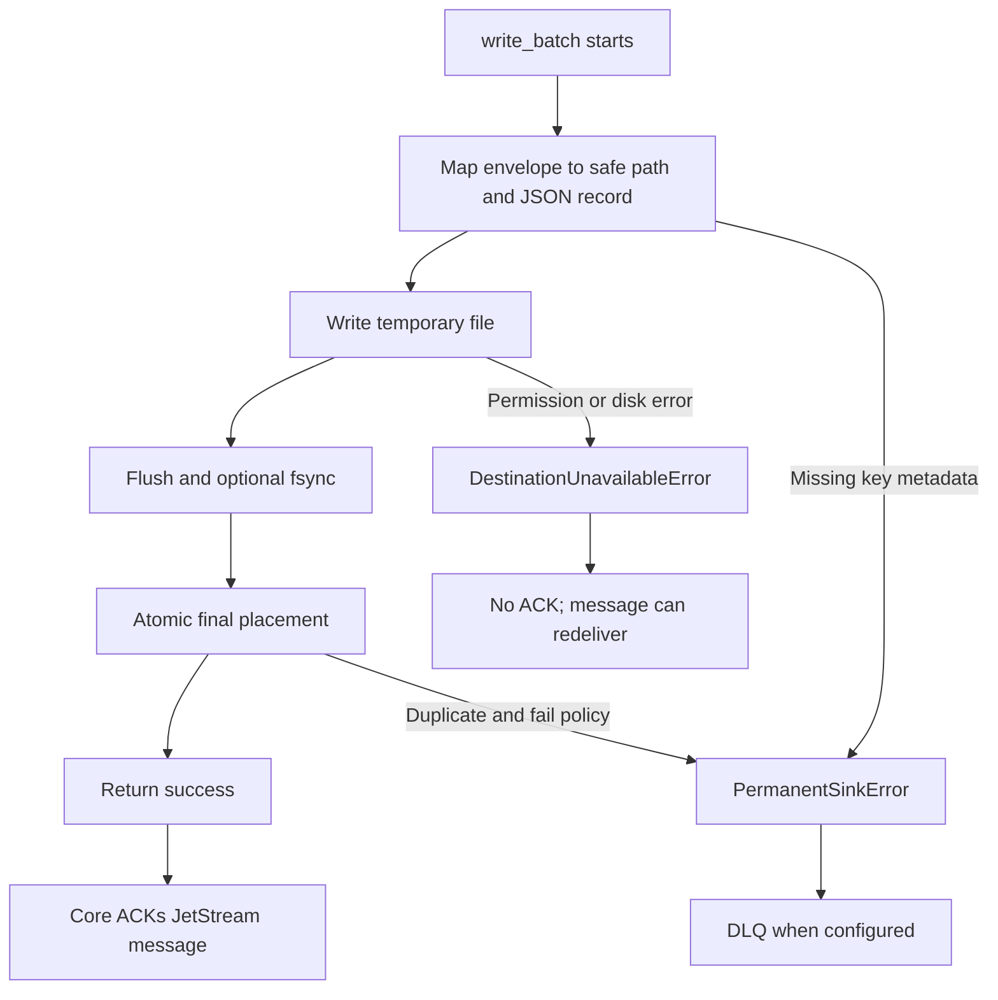

# File Sink

The local file sink writes JetStream messages to JSON files on a local or
mounted filesystem. It is the second production sink in `nats-sinks`, alongside
Oracle Database.

The file sink is useful when you need a durable handoff directory, a simple
audit trail, a development destination without a database, or an integration
point for another process that watches files. It follows the same core rule as
every sink in this project:

It can also be useful in controlled mission environments where a system needs a
simple local handoff, disconnected transfer, or inspection point before a more
specialized backend is introduced. The file sink is not a replacement for a
records-management system, but it gives a clear durable boundary and preserves
the same metadata contract as the database sink.

> Commit first. ACK last. Design for redelivery.

For `FileSink`, a batch is successful only after every required output file has
been written to a temporary file, flushed, optionally fsynced, and atomically
placed at its deterministic final path. The core runtime acknowledges
JetStream messages only after `FileSink.write_batch(...)` returns success.

## Processing Model



The sink does not call ACK, NAK, TERM, or any other JetStream acknowledgement
method. Delivery behavior remains owned by the core runtime.

For operational evidence handling, this matters: the final file path is the
durable artifact, and the JetStream ACK is sent only after that artifact has
been placed according to the configured durability settings.

## Certification Status

`FileSink` is part of the first-party production sink surface and is covered by
the shared [Sink Certification](sink-certification.md) process. Its
certification evidence includes:

- lifecycle and write certification using the reusable helper module,
- duplicate-redelivery certification with deterministic file names and
  `skip_existing`,
- atomic temporary-file-to-final-file placement tests,
- gzip and uncompressed output tests,
- encrypted payload envelope storage and decrypt verification,
- JSON, text, bytes, and empty payload handling,
- path traversal and unsafe filename sanitization tests,
- local file e2e tests proving ACK happens after file success.

Live external services are not required for the file sink certification path.
All deterministic tests write under pytest-managed temporary directories or
ignored `.local/` paths.

## Installation

The file sink has no extra runtime dependencies. It is available with the base
package:

```bash
pip install nats-sinks
```

Oracle still requires the Oracle extra:

```bash
pip install "nats-sinks[oracle]"
```

## Configuration

Minimal file sink configuration:

```json
{
  "nats": {
    "url": "nats://localhost:4222",
    "stream": "ORDERS",
    "consumer": "file-orders-sink",
    "subject": "orders.*",
    "durable": true
  },
  "sink": {
    "type": "file",
    "directory": ".local/file-sink/events",
    "filename_strategy": "stream_sequence",
    "duplicate_policy": "skip_existing"
  }
}
```

Complete example:

```json
{
  "sink": {
    "type": "file",
    "directory": ".local/file-sink/events",
    "mode": "one_file_per_message",
    "filename_strategy": "stream_sequence",
    "duplicate_policy": "skip_existing",
    "payload_mode": "json_or_envelope",
    "extension": ".json",
    "compression": "none",
    "compression_level": 6,
    "include_metadata": true,
    "partition_by_subject": true,
    "create_directory": true,
    "fsync": true,
    "pretty": false
  }
}
```

## Configuration Reference

This section lists every file sink field. The core sections such as `nats`,
`delivery`, `dead_letter`, `logging`, and `metrics` are documented in
[Configuration](configuration.md).

| Field | Required | Default | Valid values | Description |
| --- | --- | --- | --- | --- |
| `type` | yes | none | `file` | Selects the local filesystem sink. |
| `directory` | yes | none | Local or mounted directory path. | Root directory where output files are written. Relative paths are resolved from the process working directory. Production services should normally use an absolute path. |
| `mode` | no | `one_file_per_message` | `one_file_per_message` | Writes one durable file per message. This is the only production file mode today because it gives deterministic idempotency and simple replay behavior. |
| `filename_strategy` | no | `stream_sequence` | `stream_sequence`, `message_id`, `payload_sha256` | Controls the deterministic filename and therefore the idempotency key. See [Filename Strategies](#filename-strategies). |
| `duplicate_policy` | no | `skip_existing` | `skip_existing`, `overwrite`, `fail` | Controls what happens when a redelivered message maps to a final file that already exists. See [Duplicate Policies](#duplicate-policies). |
| `payload_mode` | no | `json_or_envelope` | `json_or_envelope`, `json_only`, `text_envelope`, `bytes_envelope` | Controls how NATS message bytes become JSON storage content. See [Payload Mode Values](#payload-mode-values). |
| `extension` | no | `.json`, or `.json.gz` when gzip is enabled and no extension is set | String beginning with `.` and containing no path separators. | File suffix appended to generated filenames. Use `.json` for plain JSON and `.json.gz` for gzip-compressed JSON. |
| `compression` | no | `none` | `none`, `gzip` | Compression mode for each output file. `gzip` uses Python's standard-library `gzip` module, not an operating-system command. |
| `compression_level` | no | `6` | Integer `1` to `9`. | Gzip compression level. Lower values generally use less CPU; higher values may reduce file size for compressible data. Ignored when `compression` is `none`. |
| `include_metadata` | no | `true` | `true` or `false`. | Includes the standard nats-sinks metadata document in each output file. Keep enabled for audit, replay, and troubleshooting. |
| `partition_by_subject` | no | `true` | `true` or `false`. | Places files under sanitized subject directories, for example `orders.created/ORDERS-0001.json`. Disable only when all files should share one directory. |
| `create_directory` | no | `true` | `true` or `false`. | Creates the root output directory if it does not exist. Set false when deployment tooling must create directories explicitly. |
| `fsync` | no | `true` | `true` or `false`. | Flushes file contents and parent directory metadata for stronger crash durability before returning success. Disabling can improve speed but weakens the durable boundary. |
| `pretty` | no | `false` | `true` or `false`. | Pretty-prints JSON with indentation. Useful for manual inspection; compact JSON is faster and smaller. |

### Payload Mode Values

`payload_mode` is a shared nats-sinks concept used by JSON-capable sinks. It is
important for file output because each file is a JSON record even when the
original NATS message body is not JSON.

| Value | Behavior | When to use it |
| --- | --- | --- |
| `json_or_envelope` | Attempts to parse the body as standards-compliant JSON. Valid JSON is stored as the original JSON value. UTF-8 text that is not JSON, including Python-only constants such as `NaN`, is wrapped in a text envelope. Non-text bytes are base64-wrapped in a bytes envelope. | Recommended default for mixed streams. |
| `json_only` | Requires every body to be standards-compliant JSON. Invalid JSON, text, bytes, malformed JSON, and Python-only constants such as `NaN` become permanent serialization failures. | Strict data contracts where non-JSON messages should be sent to DLQ. |
| `text_envelope` | Treats every body as UTF-8 text and wraps it in the standard text envelope without attempting JSON parsing. Non-UTF-8 bytes fail serialization. | Encrypted text or log streams where parsing as JSON would waste CPU or create ambiguity. |
| `bytes_envelope` | Treats every body as opaque bytes and stores base64 text inside the standard bytes envelope. | Binary, compressed, encrypted, or otherwise opaque payloads. |

For payloads that arrive from NATS already encrypted by another system, choose
`text_envelope` when the ciphertext is guaranteed to be UTF-8 text and
`bytes_envelope` when the ciphertext may contain arbitrary bytes. For
framework-level payload encryption configured with the top-level `encryption`
section, keep the default `json_or_envelope`; the core stores ciphertext inside
a valid nats-sinks encrypted JSON payload envelope.

### Filename Strategies

`filename_strategy` decides how a message maps to a deterministic final path.
The strategy should be stable across redelivery so duplicate processing is safe.

| Value | Required message data | Filename shape | Production guidance |
| --- | --- | --- | --- |
| `stream_sequence` | JetStream stream name and stream sequence. | `ORDERS-00000000000000000042.json` | Recommended for normal JetStream sinks. |
| `message_id` | `Nats-Msg-Id` or equivalent message ID metadata. | Sanitized message ID plus extension. | Use when publishers reliably set unique message IDs. |
| `payload_sha256` | Message subject and payload bytes. | Subject plus payload digest. | Useful for controlled archival flows where identical payloads should collapse. |

### Compression Values

| Value | File content | Typical suffix | Notes |
| --- | --- | --- | --- |
| `none` | Plain UTF-8 JSON followed by a newline. | `.json` | Fastest and easiest to inspect manually. |
| `gzip` | Gzip-compressed JSON bytes. | `.json.gz` | Saves space for compressible data and uses Python's standard-library `gzip` module. |

Compression happens after payload normalization and before atomic placement.
Both modes keep the same commit-then-ACK rule: the core ACKs only after the file
sink returns success.

Compression can reduce storage volume for log-like or report-like operational
streams, but it does not change handling classification. A compressed file that
contains restricted data should be protected exactly like the uncompressed JSON
record.

## Idempotency

The file sink is designed for at-least-once delivery. A message may be
redelivered after the file has already been committed, especially if the
process crashes before the JetStream ACK reaches the server.

The default strategy is `stream_sequence`, which creates file names from the
JetStream stream name and stream sequence:

```text
ORDERS-00000000000000000042.json
```

This is the recommended production strategy when the sink consumes from a
JetStream stream because stream sequence values are stable and unique inside a
stream.

Supported filename strategies:

| Strategy | Behavior | Recommended use |
| --- | --- | --- |
| `stream_sequence` | Uses stream name plus stream sequence. | Production JetStream sinks. |
| `message_id` | Uses `Nats-Msg-Id` or equivalent message ID metadata. | Streams where publishers reliably set unique message IDs. |
| `payload_sha256` | Uses subject plus payload digest. | Controlled archival workflows where identical payloads should collapse. |

If the selected strategy requires metadata that is missing, the sink raises a
framework `PermanentSinkError`. With DLQ enabled, the core publishes the
message to DLQ and ACKs the original only after DLQ publication succeeds.

## Duplicate Policies

| Policy | Behavior | Production guidance |
| --- | --- | --- |
| `skip_existing` | Existing final file is treated as prior durable success. | Recommended default. |
| `overwrite` | Existing final file is replaced. | Use only when later metadata replacement is acceptable. |
| `fail` | Existing final file raises `PermanentSinkError`. | Useful for strict diagnostics, not for normal redelivery. |

`skip_existing` is the safest default because it makes duplicate redelivery
boring: if the file already exists, the durable side effect has already
happened, so the sink can return success and allow the core to ACK.

## Output Shape

Each uncompressed file contains a single JSON document:

```json
{
  "schema": "nats_sinks.file.message.v1",
  "schema_version": 1,
  "subject": "mission.reports.created",
  "stream": "MISSION",
  "stream_sequence": 42,
  "consumer": "file-mission-sink",
  "consumer_sequence": 12,
  "message_id": "R-1001",
  "priority": "immediate",
  "classification": "NATO SECRET",
  "labels": "mission-report;coalition;watch-floor",
  "labels_list": ["mission-report", "coalition", "watch-floor"],
  "mission_metadata": {
    "profile": "mission-event-v1",
    "profile_version": 1,
    "mission_id": "SYN-MISSION-001",
    "f2t2ea_phase": "track"
  },
  "custody": null,
  "payload": {
    "report_id": "R-1001",
    "status": "received"
  },
  "payload_info": {
    "original_format": "json",
    "wrapped": false,
    "sha256": "sha256-of-stored-encrypted-envelope",
    "size_bytes": 512
  },
  "metadata": {
    "metadata_version": 1,
    "subject": "mission.reports.created",
    "headers": {},
    "jetstream": {},
    "timestamps": {}
  }
}
```

The actual `metadata` document contains the standard framework metadata
snapshot: headers, known and future `Nats-*` reserved headers, JetStream stream
and sequence values, epoch nanosecond timing fields, and the normalized
`priority`, `classification`, and `labels` values. When priority or
classification is missing, the file sink writes JSON `null` rather than the
literal string `"null"`. When labels are missing, the scalar `labels` field is
JSON `null` and `labels_list` is an empty JSON array.

When the core `mission_metadata` feature is enabled, the file sink writes the
validated object as top-level `mission_metadata` and also includes it in
`metadata.mission_metadata`. If mission metadata is absent, both locations use
JSON `null`. This is the recommended pattern for optional F2T2EA phase tagging
and other mission-support context that should not become fixed generic
framework fields. See [Mission Metadata](mission-metadata.md) and
[F2T2EA Event Phase Tagging](use-cases/defence/f2t2ea-event-phase-tagging.md).
For broader file-based handoff, edge operation, classification, labels, and
audit examples, see [Defence And Mission Support](use-cases/defence/index.md).

When top-level `custody.enabled` is true, the file sink writes the custody
object as a top-level `custody` field. This object contains hashes for the
normalized payload and stable metadata before the file was written. It gives
auditors a deterministic value to recompute later, while the normal
commit-then-ACK rule still depends on the file being atomically placed.

Example custody object:

```json
{
  "custody": {
    "schema": "nats_sinks.custody.v1",
    "schema_version": 1,
    "algorithm": "sha256",
    "hash_input_format": "canonical-json",
    "key_id": "custody-policy-v1",
    "payload_hash": "hex-encoded-payload-hash",
    "metadata_hash": "hex-encoded-metadata-hash",
    "record_hash": "hex-encoded-record-hash",
    "previous_record_hash": null,
    "hash_payload": true,
    "hash_metadata": true,
    "privacy": "hashes_are_not_encryption"
  }
}
```

See [Tamper-Evident Custody Metadata](tamper-evident-custody.md) for the full
configuration model and privacy notes.

### Output Shape With Payload Encryption

When top-level payload encryption is enabled, the top-level operational fields
remain readable and the body moves into the encrypted payload envelope. This is
the visible effect of enabling encryption for the same message:

```json
{
  "schema": "nats_sinks.file.message.v1",
  "schema_version": 1,
  "subject": "mission.reports.created",
  "stream": "MISSION",
  "stream_sequence": 42,
  "consumer": "file-mission-sink",
  "consumer_sequence": 12,
  "message_id": "R-1001",
  "priority": "immediate",
  "classification": "NATO SECRET",
  "labels": "mission-report;coalition;watch-floor",
  "labels_list": ["mission-report", "coalition", "watch-floor"],
  "mission_metadata": {
    "profile": "mission-event-v1",
    "mission_id": "SYN-MISSION-001",
    "f2t2ea_phase": "track"
  },
  "payload": {
    "_nats_sinks_encryption": {
      "schema": "nats_sinks.encrypted_payload.v1",
      "version": 1,
      "algorithm": "aes-256-gcm",
      "key_id": "mission-prod-2026-05",
      "nonce": "base64-nonce",
      "nonce_size_bytes": 12,
      "ciphertext": "base64-ciphertext-and-tag",
      "ciphertext_encoding": "base64",
      "tag_length": 16,
      "plaintext_sha256": "hex-encoded-sha256",
      "plaintext_size_bytes": 43
    }
  },
  "payload_info": {
    "original_format": "json",
    "wrapped": false,
    "sha256": "redacted-example",
    "size_bytes": 43
  },
  "metadata": {
    "message_metadata": {
      "priority": "immediate",
      "classification": "NATO SECRET",
      "labels": ["mission-report", "coalition", "watch-floor"]
    }
  }
}
```

The file name and idempotency behavior should still use stable metadata such as
stream sequence or message ID. Do not use `payload_sha256` with core payload
encryption unless you explicitly accept that fresh nonces can produce different
ciphertext for the same redelivered message.

## Compression

The file sink can gzip-compress each output file by setting
`compression: "gzip"`:

```json
{
  "sink": {
    "type": "file",
    "directory": ".local/file-sink/events",
    "compression": "gzip",
    "compression_level": 6
  }
}
```

When gzip is enabled and `extension` is not explicitly configured, the sink
uses `.json.gz` as the default extension:

```text
ORDERS-00000000000000000042.json.gz
```

Compression happens after the message has been normalized into the standard
JSON file record and before the temporary file is flushed, optionally fsynced,
and atomically placed. This means compressed and uncompressed files have the
same durable boundary: `write_batch(...)` returns success only after the final
file has been placed according to the configured durability settings.

Gzip is implemented with Python's standard-library `gzip` module. The file sink
does not call an operating-system `gzip` command, does not require a gzip binary
to be installed on the host, and does not invoke a shell for compression. This
keeps behavior portable across Oracle Linux, Debian, macOS, containers, and CI.

Compression is useful for JSON, text, logs, and repeated structured messages.
It may provide little benefit for encrypted or already-compressed payloads and
can add CPU cost. For encrypted text streams, test both `compression: "none"`
and `compression: "gzip"` with realistic payloads before enabling gzip in
production.

Compressed output uses a deterministic gzip timestamp so two otherwise
identical records do not differ only because they were compressed at different
times. The JSON record itself may still contain processing timestamps when
metadata is enabled.

If you need a custom extension, configure it explicitly:

```json
{
  "sink": {
    "type": "file",
    "directory": ".local/file-sink/events",
    "compression": "gzip",
    "extension": ".event.json.gz"
  }
}
```

## Payload Handling

The file sink uses the same payload normalization contract as Oracle and future
JSON-capable sinks:

- valid JSON is stored as JSON,
- non-JSON UTF-8 text is wrapped in a JSON envelope,
- non-text bytes are base64-wrapped in a JSON envelope,
- empty payloads are represented safely and do not crash the sink.

For encrypted text streams where the ciphertext may or may not decrypt to JSON
later, use:

```json
{
  "sink": {
    "type": "file",
    "payload_mode": "text_envelope"
  }
}
```

That mode avoids repeated JSON parse attempts and stores every body in the
standard text envelope.

## Core Payload Encryption

When top-level payload encryption is enabled, the core runner encrypts the
message body before `FileSink.write_batch(...)` is called. The file sink stores
the encrypted JSON payload envelope in the `payload` field and still writes
normal subject, stream, header, and timing metadata in the rest of the file
record.



Example:

```json
{
  "encryption": {
    "enabled": true,
    "algorithm": "aes-256-gcm",
    "key_id": "file-prod-2026-05",
    "key_b64_env": "NATS_SINKS_PAYLOAD_KEY_B64"
  },
  "sink": {
    "type": "file",
    "directory": "/var/lib/nats-sinks/events",
    "filename_strategy": "stream_sequence",
    "duplicate_policy": "skip_existing",
    "payload_mode": "json_or_envelope"
  }
}
```

The file output remains a JSON document. The encrypted body appears under
`payload._nats_sinks_encryption`, and metadata remains clear:

```json
{
  "schema": "nats_sinks.file.message.v1",
  "subject": "mission.reports.created",
  "priority": "immediate",
  "classification": "NATO SECRET",
  "labels": "mission-report;coalition;watch-floor",
  "labels_list": ["mission-report", "coalition", "watch-floor"],
  "payload": {
    "_nats_sinks_encryption": {
      "schema": "nats_sinks.encrypted_payload.v1",
      "algorithm": "aes-256-gcm",
      "key_id": "mission-prod-2026-05"
    }
  }
}
```

Use `filename_strategy: "stream_sequence"` or `message_id` when encryption is
enabled. The `payload_sha256` filename strategy hashes the encrypted payload
bytes it receives; because the core uses a fresh nonce per encryption, the same
redelivered message can produce different ciphertext. Stable JetStream metadata
is safer for duplicate handling.

## Filesystem Safety

Subjects, streams, and message IDs are external input. The file sink never uses
them as raw path names. It sanitizes path components with an allow-list and
verifies that the resolved destination remains under the configured root
directory.

The default output layout partitions by subject:

```text
.local/file-sink/events/
  orders.created/
    ORDERS-00000000000000000001.json
    ORDERS-00000000000000000002.json
```

With gzip compression enabled, the same layout uses compressed file suffixes:

```text
.local/file-sink/events/
  orders.created/
    ORDERS-00000000000000000001.json.gz
    ORDERS-00000000000000000002.json.gz
```

Characters that are unsafe for path components are replaced with `_`. Very long
components are truncated with a digest suffix so they remain deterministic
without creating oversized filenames.

## Failure Behavior



Failure examples:

| Scenario | Sink behavior | Core behavior |
| --- | --- | --- |
| Output directory cannot be created | Raises `DestinationUnavailableError`. | No ACK; message remains eligible for redelivery. |
| Disk is full during temporary file write | Raises `DestinationUnavailableError`. | No ACK; message remains eligible for redelivery. |
| Stream sequence is missing with `stream_sequence` strategy | Raises `PermanentSinkError`. | DLQ then ACK if DLQ succeeds. |
| Duplicate file exists with `skip_existing` | Treats as success. | ACK after sink returns success. |
| Duplicate file exists with `fail` | Raises `PermanentSinkError`. | DLQ then ACK if DLQ succeeds. |
| Subject contains path traversal text | Sanitizes path component. | File remains under configured root. |
| Payload is not JSON | Wraps text or bytes in JSON envelope. | ACK after durable write succeeds. |
| Empty payload | Wraps empty text in JSON envelope. | ACK after durable write succeeds. |
| Gzip compression is enabled | Writes gzip-compressed JSON records. | ACK after compressed file placement succeeds. |
| Parent directory is a symlink outside root | Rejects escaped resolved path. | No ACK; message can redeliver after operator fixes path. |
| Fsync fails | Raises `DestinationUnavailableError`. | No ACK; message can redeliver. |

## Throughput Notes

The file sink is optimized for correctness first. It writes compact JSON by
default and moves filesystem work into a worker thread so the NATS event loop
does not block on local disk I/O.

For higher throughput:

- keep `pretty` set to `false`,
- keep `compression` set to `none` when CPU is the bottleneck or payloads are
  already encrypted/compressed,
- use `compression: "gzip"` when disk capacity or file transfer size is the
  bottleneck and payloads compress well,
- use a fast local disk or low-latency mounted volume,
- tune `delivery.batch_size`,
- keep `partition_by_subject` enabled for large subject sets,
- consider `fsync: false` only when the surrounding storage layer provides an
  acceptable durability boundary.

Disabling `fsync` can improve speed, but it weakens crash durability. If the
process returns success and the core ACKs, the file should already be durable
according to the configured policy. Keep `fsync: true` when local file loss
after a host crash is unacceptable.

## Python API

```python
from nats_sinks import JetStreamSinkRunner
from nats_sinks.file import FileSink

sink = FileSink(
    directory="/var/lib/nats-sinks/events",
    filename_strategy="stream_sequence",
    duplicate_policy="skip_existing",
)

runner = JetStreamSinkRunner(
    nats_url="nats://localhost:4222",
    stream="ORDERS",
    consumer="file-orders-sink",
    subject="orders.*",
    sink=sink,
)

await runner.run()
```

## Local Example

The repository includes a tracked example at `examples/file-basic/config.json`.
It writes generated files under `.local/file-sink/events`, which is ignored by
git.

```bash
nats-sink validate examples/file-basic/config.json
nats-sink test-sink examples/file-basic/config.json
```

To run against local NATS:

```bash
nats-server -js -m 8222
nats stream add ORDERS --subjects "orders.*"
nats-sink run examples/file-basic/config.json
nats pub orders.created '{"order_id":"O-1001","amount":42.50}'
```

For a complete mission-support file handoff pattern, including compression,
duplicate handling, failure behavior, and test guidance, see
[Disconnected File Handoff](use-cases/mission-support/disconnected-file-handoff.md).

## Production Recommendations

- Run the service as a dedicated operating system user.
- Use an absolute output directory in production service configs.
- Make the output directory writable only by the sink service and trusted
  operators.
- Keep generated files out of the source repository.
- Monitor disk usage and inode usage.
- Back up or rotate files according to your retention policy.
- Prefer `stream_sequence` plus `skip_existing` for JetStream consumers.
- Keep payload logging disabled unless a deployment has explicit approval to
  log message bodies.
