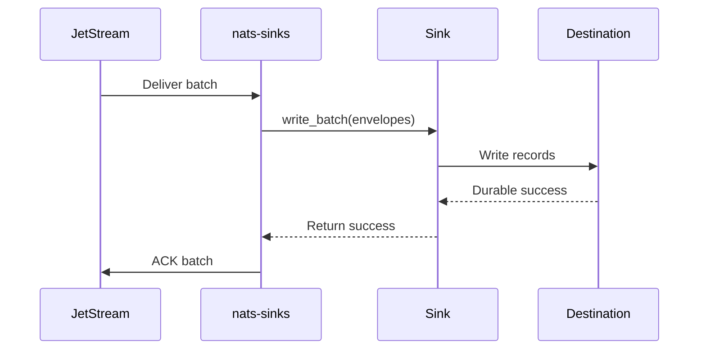

# Getting Started

This guide gets a local NATS stream and a local file sink configuration ready.
It is written for readers who may be new to NATS, JetStream, or sink
connectors.

NATS is the message broker. JetStream is the NATS feature that stores messages
and tracks whether consumers have acknowledged them. The file sink is the
simplest local destination because it does not require a database. The goal is
to publish one message to NATS, let `nats-sinks` write it to a durable
destination, and ACK the message only after that destination reports durable
success.

The examples assume Python `>=3.11`, a local `nats-server`, and the NATS CLI.
Install the NATS tools with your normal package manager before starting the
demo.

The local example uses order-style subjects because they are easy to recognize.
In a mission or defence prototype, the same flow could represent operational
reports, logistics updates, audit events, or platform telemetry. The important
behavior is the same: write durably first, then ACK.

## Local MVP Demo

This is the shortest local path for experimenting with the project. It uses
JetStream plus the file sink, so no database, wallet, cloud account, or secret
store is required.

### 1. Install `nats-sinks`

```bash
python -m pip install --upgrade pip
python -m pip install nats-sinks
```

For development:

```bash
python -m pip install -e ".[dev,oracle,crypto,docs]"
```

### 2. Start NATS With JetStream

Use one terminal for the local server:

Start a local NATS server with JetStream enabled. The `-js` flag turns on
JetStream storage. The `-m 8222` flag exposes a monitoring endpoint that is
useful during local development.

```bash
nats-server -js -m 8222
```

Use a second terminal for the remaining commands. Create a stream with a
subject family that matches the tracked file-sink example:

```bash
nats stream add ORDERS --subjects "orders.*" --storage file --retention limits --defaults
```

### 3. Validate The Demo Configuration

For the local file sink, choose an output directory. The tracked example uses
`.local/file-sink/events`, which is ignored by git. No credentials are required.

Oracle setup is documented separately in [Oracle Sink](oracle-sink.md). File
sink durability, duplicate behavior, and filesystem safety are documented in
[File Sink](file-sink.md).

Validate the tracked example before running it:

```bash
nats-sink validate examples/file-basic/config.json
nats-sink test-sink examples/file-basic/config.json
```

Expected output:

```text
Configuration is valid.
Active sink: file
ACK policy: commit-then-acknowledge
Active sink: file
ACK policy: commit-then-acknowledge
Sink test succeeded.
```

### 4. Run The Sink

Runtime configuration is JSON-only:

```json
{
  "nats": {
    "url": "nats://localhost:4222",
    "stream": "ORDERS",
    "consumer": "file-orders-sink",
    "subject": "orders.*"
  },
  "sink": {
    "type": "file",
    "directory": ".local/file-sink/events",
    "filename_strategy": "stream_sequence",
    "duplicate_policy": "skip_existing",
    "payload_mode": "json_or_envelope"
  }
}
```

Do not put real credentials in config files. The file example does not require
secrets. Database sinks should use environment-backed fields such as
`password_env`.

Start the worker:

```bash
nats-sink run examples/file-basic/config.json
```

Leave this command running while you publish test messages.

### 5. Publish One Message

In another terminal:

```bash
nats pub orders.created '{"order_id":"O-1001","amount":42.50}'
```

The sink writes one JSON file only after the file sink reports durable
placement.

### 6. Inspect The Local Output

```bash
find .local/file-sink/events -type f -name "*.json" -print
```

A first message usually produces a file shaped like this:

```text
.local/file-sink/events/orders.created/ORDERS-00000000000000000001.json
```

Pretty-print one generated record:

```bash
python -m json.tool .local/file-sink/events/orders.created/ORDERS-00000000000000000001.json
```

The record includes the original payload, subject, stream sequence,
idempotency-related metadata, priority, classification, labels, and store time.
That makes the file sink a good first demo before moving to Oracle Database,
Oracle MySQL, S3-compatible object storage, or another durable sink.

## What Success Means

Success is not just "the message was received." For this project, success means
the destination has completed the durable write and only then has JetStream
been ACKed. This is the central safety property of `nats-sinks`.



The ACK is sent after durable sink success. If the process crashes after the
destination commit but before ACK, JetStream may redeliver the message. Use an
idempotent sink mode so that duplicate delivery is safe.
