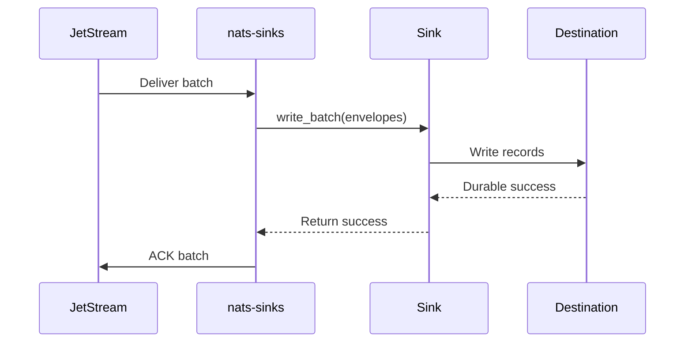

# Getting Started

This guide gets a local NATS stream and the current first production sink
configuration ready. It is written for readers who may be new to NATS,
JetStream, or sink connectors.

NATS is the message broker. JetStream is the NATS feature that stores messages
and tracks whether consumers have acknowledged them. Oracle is the first
implemented destination sink in this project, so the first walkthrough uses the
Oracle example while keeping the generic runtime concepts visible. The goal is
to publish one message to NATS, let `nats-sinks` write it to a durable
destination, and ACK the message only after that destination reports durable
success.

The examples assume Python `>=3.11`.

## Install

```bash
python -m pip install --upgrade pip
python -m pip install "nats-sinks[oracle]"
```

For development:

```bash
python -m pip install -e ".[dev,oracle,docs]"
```

## Start NATS

Start a local NATS server with JetStream enabled. The `-js` flag turns on
JetStream storage. The `-m 8222` flag exposes a monitoring endpoint that is
useful during local development.

```bash
nats-server -js -m 8222
```

Create a stream and publish a test message:

```bash
nats stream add ORDERS --subjects "orders.*"
nats pub orders.created '{"order_id":"O-1001","amount":42.50}'
```

## Prepare The Destination

For the current Oracle sink, create a table compatible with the default
`stream_sequence` idempotency strategy and configure a least-privilege runtime
user. The exact DDL, older Oracle JSON alternatives, Autonomous Database
options, and subject-to-table routing examples are documented in
[Oracle Sink](https://github.com/ProjectCuillin/nats-sinks/blob/main/docs/oracle-sink.md).

## Configure

Runtime configuration is JSON-only:

```json
{
  "nats": {
    "url": "nats://localhost:4222",
    "stream": "ORDERS",
    "consumer": "oracle-orders-sink",
    "subject": "orders.*"
  },
  "sink": {
    "type": "oracle",
    "dsn": "localhost:1521/FREEPDB1",
    "user": "app_user",
    "password_env": "ORACLE_PASSWORD",
    "table": "NATS_SINK_EVENTS",
    "mode": "merge",
    "payload_mode": "json_or_envelope"
  }
}
```

Do not put real passwords in config files. Use an environment variable:

```bash
export ORACLE_PASSWORD=example
```

## Validate And Run

```bash
nats-sink validate examples/oracle-jetstream/config.json
nats-sink show-effective-config examples/oracle-jetstream/config.json
nats-sink run examples/oracle-jetstream/config.json
```

## What Success Means

Success is not just "the message was received." For this project, success means
the destination has completed the durable write and only then has JetStream
been ACKed. This is the central safety property of `nats-sinks`.



The ACK is sent after durable sink success. If the process crashes after the
destination commit but before ACK, JetStream may redeliver the message. Use an
idempotent sink mode so that duplicate delivery is safe.
