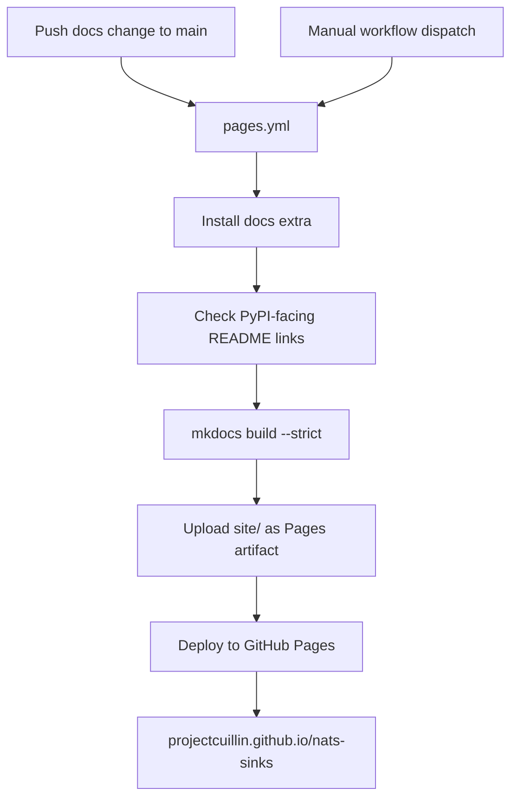
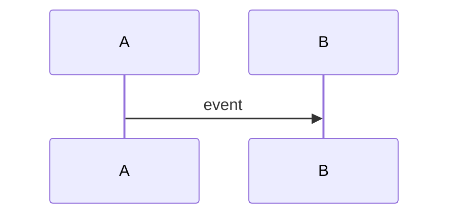

# GitHub Pages

This page explains how `nats-sinks` can publish the MkDocs documentation site
to GitHub Pages. GitHub Pages is useful as a repository-hosted documentation
mirror, while Read the Docs remains the preferred versioned documentation
service for package users.

## What The Workflow Does

The repository contains a GitHub Pages workflow at
`.github/workflows/pages.yml`. It builds the same MkDocs site used by Read the
Docs and deploys the generated `site/` directory through GitHub's official
Pages deployment actions.



The build sets `NATS_SINKS_DOCS_SITE_URL` to:

```text
https://projectcuillin.github.io/nats-sinks/
```

That value becomes the MkDocs `site_url` for the GitHub Pages build, so
canonical links point to the GitHub Pages site during that deployment. When the
environment variable is not set, `mkdocs.yml` falls back to the Read the Docs
canonical URL.

## One-Time GitHub Setup

A repository maintainer needs to enable GitHub Pages once:

1. Open the GitHub repository.
2. Go to `Settings`.
3. Open `Pages`.
4. Under `Build and deployment`, set `Source` to `GitHub Actions`.
5. Confirm that the `github-pages` environment exists after the first
   deployment. GitHub can create it automatically.
6. Optionally add deployment protection rules so only `main` can deploy.

After that, pushes to `main` that change documentation-related files should
build and publish automatically.

## Readiness Checklist

The repository is ready to publish GitHub Pages when all of the following are
true:

- `.github/workflows/pages.yml` is present on `main`,
- `mkdocs.yml` contains the `GitHub Pages` navigation entry,
- local builds pass with the GitHub Pages canonical URL,
- GitHub repository Pages settings use `Source: GitHub Actions`,
- the first workflow run completes successfully,
- the published site is available at
  [projectcuillin.github.io/nats-sinks](https://projectcuillin.github.io/nats-sinks/).

The workflow can also be run manually from the GitHub Actions tab through
`workflow_dispatch`.

## Workflow Permissions

The deploy job uses the minimum permissions needed for GitHub Pages:

```yaml
permissions:
  pages: write
  id-token: write
```

`pages: write` allows the workflow to create a Pages deployment. `id-token:
write` allows GitHub to issue an OpenID Connect token that proves the
deployment came from the expected workflow run.

## Relationship To Read The Docs

GitHub Pages and Read the Docs can coexist:

- Read the Docs provides versioned documentation such as `latest` and release
  tags.
- GitHub Pages provides a repository-hosted mirror from the `main` branch.
- Pull requests continue to use the `Docs` workflow for validation.
- Release publishing continues to use the release workflow and Read the Docs
  tag builds.

The README should continue to link to Read the Docs for public package
documentation because PyPI users normally need versioned documentation. GitHub
Pages is best treated as an additional hosted build of the current `main`
documentation.

## Mermaid Diagrams

GitHub Pages uses the same MkDocs build as Read the Docs. Mermaid diagrams stay
in the Markdown files as fenced code blocks:

````markdown

````

`mkdocs.yml` configures `pymdownx.superfences` so those blocks render as
diagrams in the generated static HTML. This keeps one documentation source for
GitHub, Read the Docs, and GitHub Pages instead of maintaining separate image
exports.

## Local Verification

Before relying on the workflow, build the documentation locally:

```bash
python -m pip install -e ".[docs]"
python scripts/check-markdown-links.py
scripts/check-docs.sh
```

The helper builds the GitHub Pages variant without using the shared `site/`
directory, so it is safe to run while another local documentation check is
active. The GitHub Pages workflow itself still writes to `site/` because that
single workflow build is the artifact that gets uploaded.

To preview the site in a browser:

```bash
mkdocs serve
```

Then open:

```text
http://127.0.0.1:8000/
```
