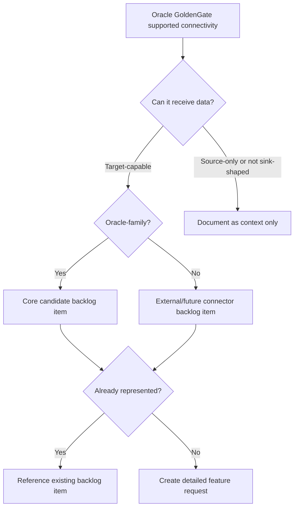

# GoldenGate-Inspired Sink Candidate Research

This page records a research pass over Oracle GoldenGate connectivity and maps
the supported source and target families to the `nats-sinks` backlog. It is not
a claim that `nats-sinks` is compatible with Oracle GoldenGate. The goal is
more practical: Oracle GoldenGate is a mature data-movement product, so its
supported source and target catalog is a useful reference when deciding which
future `nats-sinks` connectors deserve explicit backlog coverage.

The research was performed on 2026-05-23 using public Oracle documentation:

- [OCI GoldenGate: What's supported](https://docs.oracle.com/en/cloud/paas/goldengate-service/wxntz/)
- [Oracle GoldenGate for Big Data Targets](https://docs.oracle.com/en/database/goldengate/core/26/ogglc/oracle-goldengate-big-data-targets.html)
- [Oracle GoldenGate real-time data integration connectivity](https://www.oracle.com/integration/goldengate/connectivity/)
- [Oracle GoldenGate for Distributed Applications and Analytics](https://docs.oracle.com/en/middleware/goldengate/core/21.3/ogglc/oracle-goldengate-distributed-applications-and-analytics.html)

## How To Read This Page

`nats-sinks` is an outbound sink framework. That means the most direct
comparison with GoldenGate is target-side connectivity: systems that can
receive data from a running pipeline. GoldenGate also lists source-only and
source-capable technologies. Those are useful signals for future ingestion,
inspection, or replay tooling, but they do not automatically become
`nats-sinks` sink connectors.

The backlog mapping uses these decisions:

- Oracle Database, File, and Edge Spool are already implemented.
- Oracle-family and Oracle Cloud targets are considered first-party core
  candidates when they fit the package mission.
- Non-Oracle targets are considered external or future connector candidates.
- Cloud variants such as Amazon RDS, Google Cloud SQL, Azure SQL, and
  PostgreSQL derivatives are normally treated as compatibility profiles under
  a database-family connector unless their behavior requires a dedicated sink.
- A backlog item can be an evaluation item. This is deliberate: some GoldenGate
  targets are operationally complex, older, vendor-specific, or potentially
  non-durable, and should not be implemented before a design review.

## Coverage Flow

## Already Implemented

| GoldenGate family | nats-sinks coverage |
| --- | --- |
| Oracle Database, Oracle Autonomous Database, Oracle Exadata, Oracle Database@Azure, Oracle Database@Google Cloud, Oracle Database@AWS, Amazon RDS for Oracle | Covered by `OracleSink` where the Python Oracle driver and Oracle network configuration can connect to the database. Autonomous Database wallet and TCPS scenarios are documented separately. |
| Flat File and local file systems | Covered by `FileSink`. |
| Disconnected local handoff | Covered by `SpoolSink`, which is not a GoldenGate target but fills an edge custody role that appears repeatedly in operational data-movement deployments. |

## Already On The Backlog Before This Review

| Family | Backlog item |
| --- | --- |
| OCI Object Storage / Oracle Object Storage | `oci-object-storage-sink` |
| OCI Streaming / OCI Streaming with Apache Kafka | `oci-streaming-sink` and `kafka-sink` |
| Oracle NoSQL | `oracle-nosql-database-sink` |
| Oracle MySQL / Oracle MySQL HeatWave | `oracle-mysql-sink` |
| Oracle Berkeley DB | `oracle-berkeley-db-sink` |
| Apache Kafka / Confluent Kafka | `kafka-sink` |
| Amazon S3 | `s3-sink` |
| Azure Blob Storage / Azure Data Lake Storage | `azure-blob-data-lake-sink` |
| Google BigQuery | `bigquery-sink` |
| Snowflake | `snowflake-sink` |
| MongoDB | `mongodb-sink` |
| Apache Cassandra / DataStax | `cassandra-sink` |
| Redis | `redis-sink` |
| Elasticsearch / OpenSearch | `elasticsearch-opensearch-sink` |
| PostgreSQL and derivatives | `postgres-sink`, currently marked not planned unless scope changes |
| HTTP APIs | `http-sink` |

## New Oracle-Family Backlog Items Added

These items are Oracle-centric and should be considered first-party core
candidates if the research phase proves that a durable, secure, maintainable
sink can be built.

| Backlog item | GoldenGate signal | Notes |
| --- | --- | --- |
| `oracle-autonomous-lakehouse-sink` | Oracle Autonomous AI Lakehouse target | Decide whether existing Oracle database semantics are sufficient or whether a lakehouse-specific profile is needed. |
| `oracle-ai-data-platform-sink` | Oracle AI Data Platform target | Keep event custody separate from AI inference or decision automation. |
| `oracle-json-document-sink` | Oracle Autonomous AI JSON Database, Oracle JSON Collection, Oracle API for MongoDB | Define Oracle JSON collection/document storage without replacing the existing table-oriented OracleSink. |
| `oci-cache-cluster-sink` | OCI Cache Cluster target | Research whether cache storage is durable enough for ACK gating. |
| `oracle-weblogic-jms-sink` | Oracle WebLogic JMS | Decide relationship with a future generic JMS sink. |
| `oracle-timesten-sink` | Oracle TimesTen connectivity | Validate durable TimesTen modes before ACK-gated use. |
| `oracle-spatial-graph-profile` | Oracle Spatial and Graph | Likely an OracleSink profile or schema helper rather than a fully separate sink. |
| `oracle-applications-connectors-evaluation` | Oracle application families | Evaluation item for E-Business Suite, Fusion, NetSuite, Retail, Health, Transportation, Utilities, and similar application families. |
| `oci-postgresql-sink-profile` | OCI Database with PostgreSQL | Relationship to the not-planned generic Postgres sink needs an explicit decision. |

## New Non-Oracle Backlog Items Added

These are external or future connector candidates. Most start as research
items because sink certification must prove idempotency, commit boundaries,
security, and realistic testing before implementation.

| Backlog item | GoldenGate signal | Notes |
| --- | --- | --- |
| `amazon-kinesis-sink` | Amazon Kinesis target | Streaming handoff with partial-failure handling. |
| `amazon-redshift-sink` | Amazon Redshift target | Warehouse ingest, likely staged COPY or transactional SQL. |
| `amazon-documentdb-sink` | AWS DocumentDB target | Compatibility profile versus MongoDB sink decision. |
| `azure-event-hubs-sink` | Azure Event Hubs source and target | Streaming handoff with managed identity support. |
| `azure-synapse-fabric-sink` | Azure Synapse Analytics, Microsoft Fabric Eventstream, Lakehouse, Mirror | Microsoft analytics platform evaluation. |
| `google-cloud-storage-sink` | Google Cloud Storage target | Object sink comparable to S3 and OCI Object Storage. |
| `google-pubsub-sink` | Google Pub/Sub target and Kafka compatibility signal | Pub/Sub publisher confirmation and ordering-key design. |
| `databricks-sink` | Databricks target | Lakehouse ingestion, Delta table, or staged object path. |
| `apache-iceberg-lakehouse-sink` | Apache Iceberg and S3 Tables targets | Open table-format sink evaluation. |
| `hadoop-ecosystem-sink` | HDFS, HBase, Hive, Flume, Cloudera, Hortonworks, MapR | Grouped evaluation because each target has different durability semantics. |
| `apache-druid-sink` | Apache Druid connectivity | Direct ingestion versus Kafka-mediated ingestion decision. |
| `apache-ignite-gridgain-sink` | Apache Ignite and GridGain connectivity | Research durable versus cache-only modes. |
| `generic-jms-sink` | Java Message Service family | Generic JMS behavior, separate from WebLogic-specific profile. |
| `generic-jdbc-sink` | JDBC target | High-risk generic sink framework evaluation; destination-specific sinks may be safer. |
| `microsoft-sql-server-sink` | SQL Server, Azure SQL, RDS SQL Server, Cloud SQL SQL Server | Database-family sink candidate. |
| `ibm-db2-sink` | Db2 for i, Db2 for z/OS, Db2 LUW | Enterprise and mainframe profile research. |
| `sap-hana-sink` | SAP HANA | Dedicated database-family sink candidate. |
| `data-warehouse-specialty-sinks` | Teradata, Vertica, Netezza | Grouped evaluation for specialty warehouse targets. |
| `distributed-sql-database-sinks-evaluation` | SingleStoreDB, YugabyteDB, Greenplum, EDB Postgres Advanced Server | Decide profile versus dedicated sink. |
| `legacy-database-sinks-evaluation` | Sybase ASE, HPE Enscribe, HPE NonStop SQL/MP, SQL/MX, FairCom DB | Evaluate whether these are in scope before creating dedicated implementation issues. |
| `solace-sink` | Solace streaming/event connectivity | Event-broker sink candidate. |
| `managed-kafka-compatibility-profiles` | Amazon MSK, Confluent, Google managed Kafka, OCI Streaming Kafka, Pub/Sub Kafka compatibility | Certification profiles for a future Kafka sink. |
| `azure-cosmosdb-sink-profiles` | Azure Cosmos DB for MongoDB and PostgreSQL | Compatibility profile rather than immediate dedicated implementation. |
| `mariadb-sink` | MariaDB and Amazon RDS for MariaDB | Decide whether MariaDB is covered by MySQL or needs its own certification. |

## Covered Without A New Standalone Item

Some GoldenGate entries are important but do not need a new issue at this time:

- Amazon MSK, Confluent Kafka, Google Cloud Managed Service for Apache Kafka,
  OCI Streaming with Apache Kafka, and Pub/Sub Kafka compatibility mode are
  grouped under `managed-kafka-compatibility-profiles` plus the existing
  `kafka-sink`.
- Amazon Aurora Oracle MySQL-compatible, Amazon RDS for Oracle MySQL-compatible,
  Azure Database for Oracle MySQL-compatible, Google Cloud SQL for Oracle
  MySQL-compatible, and Oracle MySQL HeatWave variants are represented by
  `oracle-mysql-sink` and `mariadb-sink` where appropriate.
- PostgreSQL-compatible cloud variants are represented by `postgres-sink`,
  `oci-postgresql-sink-profile`, `azure-cosmosdb-sink-profiles`, and
  `distributed-sql-database-sinks-evaluation`.
- Azure SQL Database, Azure SQL Managed Instance, Amazon RDS for SQL Server,
  and Google Cloud SQL for SQL Server are represented by
  `microsoft-sql-server-sink`.
- Flat files are already covered by `FileSink`.
- Oracle Database deployment variants are covered by `OracleSink` unless a
  future issue identifies a service-specific gap.

## Design Guardrails For Future Sink Work

Every candidate connector created from this research inherits the same
requirements:

- Core owns delivery semantics. Sinks never ACK JetStream messages.
- ACK-gated sinks must return success only after the destination has durably
  accepted the write.
- Non-durable systems, caches, or asynchronous job submissions must not be
  presented as durable unless the acceptance boundary is proven and documented.
- Idempotency is mandatory for production modes.
- Unit tests must not make network calls.
- Live tests must be explicitly gated, isolated, and sanitized.
- Credentials, endpoints, private service names, payloads, labels, and
  classification values must not be leaked into issues, logs, or evidence.

## Next Step

The new backlog items are intentionally not implementation commitments. They
give the project a structured map for future connector work, while allowing
the maintainers to prioritize Oracle-family core connectors separately from
external connector families.
