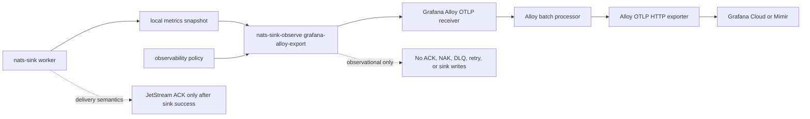

# Grafana Alloy Profile

The Grafana Alloy profile exports approved `nats-sinks` metrics to a local or
nearby Grafana Alloy OTLP receiver. Alloy then forwards those metrics into
Grafana Cloud, Grafana Mimir, or another OTLP-compatible observability
pipeline.

This profile exists for teams that already operate Grafana Alloy as their
collector layer and want `nats-sinks` observability to follow the same
collector-first pattern. It is not part of the message delivery path. It does
not read NATS messages, payload bodies, Oracle rows, file-sink output files, or
mission metadata. It only reads a local metrics snapshot that was already
written by `nats-sinks`.

Grafana describes Alloy as a Grafana Labs distribution of the OpenTelemetry
Collector with Prometheus-native collection capabilities and OTLP-compatible
pipelines. The profile in `nats-sinks` follows that model by using
`otelcol.receiver.otlp` and `otelcol.exporter.otlphttp` rather than inventing a
Grafana-specific HTTP API.

Relevant Grafana documentation:

- [Grafana Alloy overview](https://grafana.com/oss/alloy-opentelemetry-collector/)
- [Set up Grafana Alloy for Application Observability](https://grafana.com/docs/opentelemetry/collector/grafana-alloy/)
- [`otelcol.receiver.otlp`](https://grafana.com/docs/alloy/latest/reference/components/otelcol/otelcol.receiver.otlp/)
- [`otelcol.exporter.otlphttp`](https://grafana.com/docs/alloy/latest/reference/components/otelcol/otelcol.exporter.otlphttp/)

## Architecture



The delivery worker and Alloy exporter are separate operational concerns:

- the worker owns JetStream delivery, sink writes, idempotency, DLQ handling,
  and commit-then-acknowledge behavior;
- the observability command reads local metrics after the fact;
- Alloy receives metrics from the observability command;
- Alloy forwards metrics according to its own collector configuration.

If Alloy is unavailable, the Grafana Cloud endpoint rejects telemetry, or a
network timeout occurs, message delivery is not affected.

## Why The Profile Uses OTLP

The profile chooses OTLP/HTTP handoff because it matches the existing
`nats-sinks` observability architecture:

- `nats-sinks` already has a bounded OTLP/HTTP JSON renderer;
- Alloy has a first-class OTLP receiver;
- Alloy has first-class OTLP HTTP exporters;
- credentials can stay in Alloy or in environment variables;
- retry, queueing, batching, and downstream routing belong in the collector;
- `nats-sinks` does not need to learn Grafana Cloud, Mimir, Loki, Tempo, or
  Pyroscope APIs directly.

## What Is Exported

Only metrics approved by the observability policy are exported.

The profile does not export:

- message payloads;
- subjects;
- message IDs;
- NATS server URLs;
- Oracle connection strings;
- file paths;
- table names;
- classification values;
- labels;
- mission metadata;
- credentials;
- collector endpoint values in result summaries.

The generated OTLP document includes only low-cardinality resource attributes:

- `service.name = nats-sinks`
- `nats_sinks.namespace = <policy namespace>`
- `nats_sinks.observability.profile = grafana_alloy`
- `telemetry.collector = grafana_alloy`

## Policy Example

The profile is disabled by default. Enable it explicitly after reviewing which
metrics are safe for your environment.

```json
{
  "schema": "nats_sinks.observability.policy.v1",
  "enabled": true,
  "namespace": "nats_sinks",
  "allowed_metrics": [
    "messages_fetched_total",
    "messages_acked_total",
    "sink_batches_written_total"
  ],
  "allowed_metric_patterns": [],
  "denied_metrics": [],
  "denied_metric_patterns": [],
  "include_observations": false,
  "include_legacy": false,
  "subjects": [],
  "grafana_alloy": {
    "enabled": true,
    "handoff_mode": "otlp_http",
    "endpoint": "http://127.0.0.1:4318/v1/metrics",
    "timeout_seconds": 5,
    "max_retries": 2,
    "retry_backoff_seconds": 0.25,
    "stale_after_seconds": 60,
    "max_request_bytes": 1048576,
    "headers_env": {},
    "receiver_label": "nats_sinks",
    "batch_label": "nats_sinks_batch",
    "exporter_label": "grafana_cloud",
    "auth_label": "grafana_cloud_auth",
    "upstream_endpoint_env": "GRAFANA_CLOUD_OTLP_ENDPOINT",
    "upstream_auth_mode": "basic",
    "upstream_auth_username_env": "GRAFANA_CLOUD_OTLP_USERNAME",
    "upstream_auth_password_env": "GRAFANA_CLOUD_OTLP_API_KEY"
  }
}
```

The endpoint is the local Alloy receiver endpoint, not the Grafana Cloud
endpoint. Keep it on loopback unless there is a reviewed network boundary and a
clear operational reason to expose it.

## Configuration Fields

| Field | Default | Meaning |
| --- | --- | --- |
| `grafana_alloy.enabled` | `false` | Enables the profile when the top-level policy is also enabled. |
| `grafana_alloy.handoff_mode` | `otlp_http` | Current handoff mode. The profile sends OTLP/HTTP JSON to Alloy. |
| `grafana_alloy.endpoint` | `null` | Local Alloy OTLP metrics endpoint. Enabled policies require `/v1/metrics`. Plain `http` is allowed only for loopback hosts. |
| `grafana_alloy.timeout_seconds` | `5` | Per-request timeout for posting to Alloy. |
| `grafana_alloy.max_retries` | `0` | Bounded retries after the first attempt. |
| `grafana_alloy.retry_backoff_seconds` | `0.25` | Delay between retry attempts. |
| `grafana_alloy.stale_after_seconds` | `null` | Optional maximum metrics snapshot age before export fails closed unless `--allow-stale` is used. |
| `grafana_alloy.max_request_bytes` | `1048576` | Maximum rendered OTLP JSON request size. |
| `grafana_alloy.headers_env` | `{}` | Optional local Alloy receiver headers sourced from environment variables. Values are not stored in JSON policy files. |
| `grafana_alloy.receiver_label` | `nats_sinks` | Alloy receiver component label used in generated River snippets. |
| `grafana_alloy.batch_label` | `nats_sinks_batch` | Alloy batch processor component label used in generated River snippets. |
| `grafana_alloy.exporter_label` | `grafana_cloud` | Alloy OTLP HTTP exporter component label used in generated River snippets. |
| `grafana_alloy.auth_label` | `grafana_cloud_auth` | Alloy basic-auth component label used when basic auth is enabled. |
| `grafana_alloy.upstream_endpoint_env` | `GRAFANA_CLOUD_OTLP_ENDPOINT` | Environment variable name read by Alloy for its upstream OTLP endpoint. |
| `grafana_alloy.upstream_auth_mode` | `none` | Upstream auth mode for generated config. Supported values are `none` and `basic`. |
| `grafana_alloy.upstream_auth_username_env` | `null` | Environment variable name for Alloy basic-auth username. Required when `upstream_auth_mode` is `basic`. |
| `grafana_alloy.upstream_auth_password_env` | `null` | Environment variable name for Alloy basic-auth password or API key. Required when `upstream_auth_mode` is `basic`. |

## Generate Alloy Configuration

Use `grafana-alloy-config` to render a small River snippet from the policy.

```bash
nats-sink-observe grafana-alloy-config /etc/nats-sinks/observability.prometheus.json
```

Example output:

```river
// nats-sinks Grafana Alloy profile.
// Keep Alloy separate from the nats-sink delivery worker.
otelcol.receiver.otlp "nats_sinks" {
  http {
    endpoint = "127.0.0.1:4318"
  }

  output {
    metrics = [otelcol.processor.batch.nats_sinks_batch.input]
  }
}

otelcol.processor.batch "nats_sinks_batch" {
  output {
    metrics = [otelcol.exporter.otlphttp.grafana_cloud.input]
  }
}

otelcol.auth.basic "grafana_cloud_auth" {
  client_auth {
    username = sys.env("GRAFANA_CLOUD_OTLP_USERNAME")
    password = sys.env("GRAFANA_CLOUD_OTLP_API_KEY")
  }
}

otelcol.exporter.otlphttp "grafana_cloud" {
  client {
    endpoint = sys.env("GRAFANA_CLOUD_OTLP_ENDPOINT")
    auth     = otelcol.auth.basic.grafana_cloud_auth.handler
  }
}
```

This is a starter snippet. Operators should review it alongside their existing
Alloy configuration, TLS settings, queueing policy, and network controls.

## Dry Run

Dry-run mode prints the OTLP JSON body that would be posted to Alloy without
opening a network connection:

```bash
nats-sink-observe grafana-alloy-export \
  /var/lib/nats-sink/metrics.json \
  /etc/nats-sinks/observability.prometheus.json \
  --dry-run
```

Example output:

```json
{"resourceMetrics":[{"resource":{"attributes":[{"key":"service.name","value":{"stringValue":"nats-sinks"}},{"key":"nats_sinks.namespace","value":{"stringValue":"nats_sinks"}},{"key":"nats_sinks.observability.profile","value":{"stringValue":"grafana_alloy"}},{"key":"telemetry.collector","value":{"stringValue":"grafana_alloy"}}]},"scopeMetrics":[{"metrics":[{"description":"Raw JetStream messages fetched by the pull consumer.","name":"nats_sinks_messages_fetched_total","sum":{"aggregationTemporality":2,"dataPoints":[{"asDouble":256.0,"timeUnixNano":"1790000000000000000"}],"isMonotonic":true},"unit":"1"}],"scope":{"name":"nats-sinks.observability.grafana_alloy"}}]}]}
```

## Export

When enabled, export posts the same bounded OTLP document to the configured
Alloy receiver:

```bash
nats-sink-observe grafana-alloy-export \
  /var/lib/nats-sink/metrics.json \
  /etc/nats-sinks/observability.prometheus.json
```

Successful output:

```text
Grafana Alloy export: attempted=true delivered=true attempts=1 status=200 message=Grafana Alloy export delivered
```

Failure output is intentionally sanitized:

```text
Grafana Alloy export: attempted=true delivered=false attempts=3 status=none message=OTLP export failed with URLError
```

The command does not print the receiver URL, upstream Grafana endpoint, or
header values.

## Linux Service Separation

Run Alloy as its own service and run the `nats-sink-observe` export command as a
separate observability service or timer. The main `nats-sink` worker should not
need the Grafana Cloud credentials.

Example systemd service:

```ini
[Unit]
Description=nats-sinks Grafana Alloy export
After=network-online.target alloy.service
Wants=network-online.target

[Service]
Type=oneshot
User=nats-sink-observe
Group=nats-sink-observe
EnvironmentFile=/etc/nats-sinks/grafana-alloy-export.env
ExecStart=/usr/local/bin/nats-sink-observe grafana-alloy-export /var/lib/nats-sink/metrics.json /etc/nats-sinks/observability.prometheus.json
NoNewPrivileges=true
PrivateTmp=true
ProtectSystem=strict
ProtectHome=true
ReadWritePaths=/var/lib/nats-sink
```

Example timer:

```ini
[Unit]
Description=Run nats-sinks Grafana Alloy export periodically

[Timer]
OnBootSec=30s
OnUnitActiveSec=30s
AccuracySec=5s

[Install]
WantedBy=timers.target
```

## Kubernetes Guidance

For Kubernetes, keep the delivery worker and Alloy in separate containers or
separate Pods unless you have an explicit reason to colocate them:

- mount the metrics snapshot as read-only for the observability sidecar or
  exporter container;
- do not mount Oracle wallets, NATS credentials, sink output directories, or
  payload material into the Alloy container;
- provide Grafana Cloud credentials through Kubernetes Secrets mounted only
  into Alloy or the observability export container;
- keep the profile disabled in the policy until the platform owner approves the
  metric allow list.

## Security Notes

- The profile is disabled by default.
- Non-loopback HTTP endpoints are rejected; use HTTPS outside loopback.
- Endpoint URLs must not contain credentials, query strings, or fragments.
- Header values are loaded from environment variables, not policy files.
- Alloy upstream credentials are referenced by environment variable name in the
  generated River snippet.
- Allowed metrics should remain low-cardinality.
- Subject labels, message IDs, classification values, labels, mission metadata,
  payload snippets, table names, file paths, and usernames are intentionally
  not exported by this profile.

## Testing

The unit test suite covers:

- disabled policy behavior;
- policy validation;
- generated Alloy River snippets;
- safe environment-variable references;
- allow-list and deny-list filtering;
- stale snapshot rejection;
- bounded request size;
- dry-run rendering;
- bounded retry behavior;
- public API compatibility.

Live Alloy testing is optional. A local integration test should:

1. start Alloy with a reviewed test-only River config;
2. configure `grafana_alloy.endpoint` as a local loopback receiver;
3. run `nats-sink-observe grafana-alloy-export`;
4. verify Alloy accepted the OTLP request;
5. avoid sending real operational metrics, subjects, payloads, labels, or
   mission metadata to a public tenant.

## Non-Goals

This profile does not:

- manage the Alloy process;
- validate an entire Alloy deployment;
- write directly to Grafana Cloud APIs;
- write directly to Mimir, Loki, Tempo, or Pyroscope;
- export logs or traces;
- add subject-level metric labels;
- change message delivery semantics.
