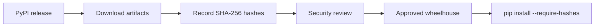
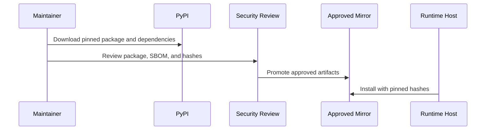

# Hash-Verified Installs

Hash-verified installation is a supply-chain control for environments that
need stronger evidence about exactly which Python distributions are installed.
It combines version pinning with SHA-256 hashes for every package file that
`pip` is allowed to install.

For most users, a normal pinned install is enough:

```bash
python -m pip install "nats-sinks==0.4.0"
```

High-trust environments may require more. In those environments, operators
often download release artifacts into an approved wheelhouse, review the
artifacts, record hashes, and install only files whose hashes match the
approved manifest.



## What This Protects

Hash verification helps detect accidental or unauthorized artifact changes
between review and installation. It is useful when deployments must prove that
the package being installed is the same package that was reviewed.

Hash verification does not replace:

- vulnerability scanning,
- dependency review,
- SBOM review,
- trusted publishing,
- code review,
- runtime configuration validation,
- secret management,
- commit-then-acknowledge testing.

It is one layer in a larger supply-chain process.

## Release Checksums

Every release build now generates a `SHA256SUMS` manifest for GitHub Release
assets. The manifest covers:

- the source distribution,
- the wheel,
- CycloneDX SBOM JSON,
- CycloneDX SBOM XML.

The local command is:

```bash
python -m build
scripts/sbom.sh
python scripts/generate-checksums.py dist
```

Example output:

```text
Generated checksum manifest: dist/SHA256SUMS
```

Example manifest shape:

```text
<sha256-for-wheel>  nats_sinks-0.4.0-py3-none-any.whl
<sha256-for-sdist>  nats_sinks-0.4.0.tar.gz
<sha256-for-json-sbom>  nats-sinks-0.4.0.cyclonedx.json
<sha256-for-xml-sbom>  nats-sinks-0.4.0.cyclonedx.xml
```

The values above are placeholders. Use the `SHA256SUMS` attached to the
specific GitHub Release you plan to deploy.

## Hash-Verified pip Installs

`pip --require-hashes` requires every package in the install plan, including
transitive dependencies, to be pinned and hashed. A single `nats-sinks` line is
not enough because runtime dependencies such as the NATS client and
configuration libraries also need hashes.

The recommended operator workflow is:

1. Choose the exact package version and optional extras.
2. Download all required distributions into a controlled wheelhouse.
3. Generate or review hashes for every file.
4. Create a fully pinned requirements file with one or more hashes per package.
5. Install with `--require-hashes` and, when appropriate, `--no-index`.

Example download:

```bash
python -m pip download \
  --dest wheelhouse \
  "nats-sinks[oracle]==0.4.0"
```

Generate hashes for downloaded files:

```bash
python -m pip hash wheelhouse/*
```

Example hash-pinned requirements shape:

```text
nats-sinks[oracle]==0.4.0 \
    --hash=sha256:<sha256-for-nats-sinks-wheel>
nats-py==<approved-version> \
    --hash=sha256:<sha256-for-nats-py-wheel>
pydantic==<approved-version> \
    --hash=sha256:<sha256-for-pydantic-wheel>
```

Install from the reviewed wheelhouse:

```bash
python -m pip install \
  --no-index \
  --find-links wheelhouse \
  --require-hashes \
  -r requirements-hashed.txt
```

Example successful output shape:

```text
Processing ./wheelhouse/nats_sinks-0.4.0-py3-none-any.whl
Installing collected packages: ...
Successfully installed ...
```

The exact dependency list depends on the extras you select. The Oracle extra,
crypto extra, documentation extra, and development extra have different
dependency surfaces. Use the generated `requirements*.txt` files in this
repository as visibility aids, not as hash-locked production lock files.

## Offline Or Mirror-Based Installation

Some environments do not install directly from PyPI. A common approach is to
mirror reviewed distributions into an internal package repository or file
share. The pattern is:



For file-based wheelhouses, use `--no-index --find-links`. For an approved
internal package index, use your organization's package-index configuration
and still keep `--require-hashes` enabled when policy requires it.

Do not put private package-index credentials in committed requirements files,
shell history, issue comments, test reports, or documentation examples.

## Relationship To SBOMs

The SBOM answers a different question from a hash manifest:

| Evidence | Main Question |
| --- | --- |
| `SHA256SUMS` | Are these release files the same bytes that were reviewed? |
| CycloneDX SBOM | Which components and dependency versions were present in the build evidence? |
| Hash-pinned requirements | Which exact distributions may pip install in this environment? |

Use all three when a deployment requires strong release evidence. The GitHub
Release carries the package artifacts, checksum manifest, and SBOM evidence.
The deployment environment owns the final hash-pinned lock file because it
depends on selected extras, platform wheels, and internal package policy.

## Security Notes

- Keep hashes and package names public; keep credentials private.
- Do not place tokens in package URLs.
- Do not pass package-index passwords as command-line arguments.
- Do not include private mirror locations in public issues or documentation.
- Keep separate lock files for development, testing, staging, and production
  when those environments use different extras.
- Recreate hashes when changing Python versions, platforms, extras, or
  approved indexes.
- Treat hash mismatches as a deployment stop condition until reviewed.

Hash-verified installs improve supply-chain assurance, but they do not change
runtime delivery behavior. `nats-sinks` still provides at-least-once delivery
with commit-then-acknowledge processing and idempotent sink support.
