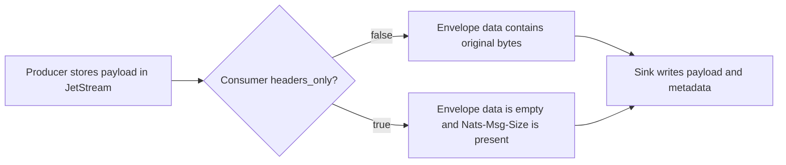
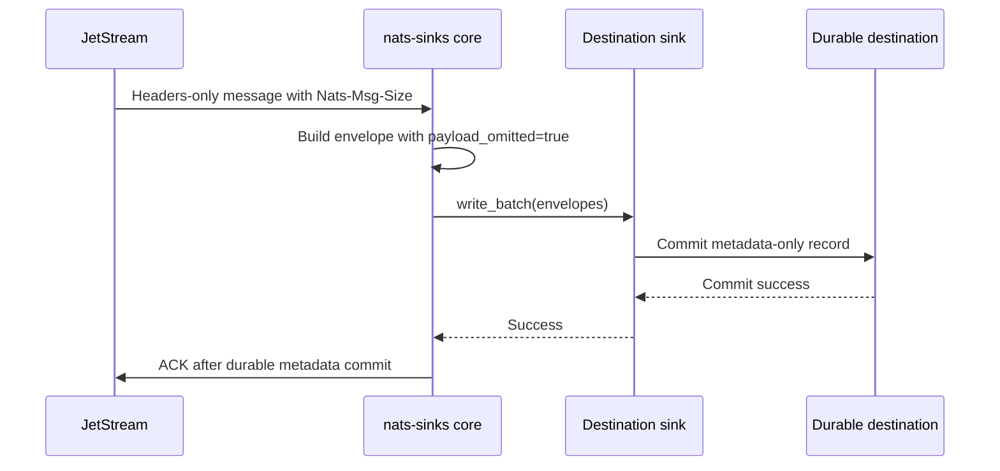

# Headers-Only Delivery Evaluation

NATS JetStream can deliver a message to a consumer without the original body.
This is called headers-only delivery. It is useful when a workflow needs to
inspect metadata, route an event, or prove that a message existed without
exposing the full payload to the consumer.

This page records the nats-sinks evaluation of that capability. Current
releases can create, reconcile, or validate the JetStream `headers_only`
consumer setting through `consumer_management.headers_only`. The remaining
gap is payload-presence semantics: the runtime safely handles empty message
bodies, but it does not yet distinguish a genuinely empty producer payload
from a payload that the NATS server intentionally omitted.

## What NATS Provides

The NATS consumer configuration includes `HeadersOnly`. When enabled, the
consumer receives headers without the message body, and the server adds the
`Nats-Msg-Size` header so the consumer can see the size of the removed payload.
The NATS documentation lists this as a JetStream consumer option introduced in
NATS Server 2.6.2.

The `nats-py` client also exposes `headers_only` on `ConsumerConfig`, which
means Python applications can request this behavior when they create or update
a JetStream consumer. nats-sinks exposes that setting through the validated
`consumer_management` startup block for durable pull consumers.

## Current nats-sinks Behavior

Today, nats-sinks converts every message into `NatsEnvelope`. The envelope
always has a `data: bytes` field. If a NATS message has no data, the core uses
`b""` and continues processing. This is stable and intentional: empty payloads
must not crash the runner, Oracle sink, file sink, DLQ builder, metrics, or
commit-then-acknowledge flow.

However, that behavior is not enough to claim support for headers-only
delivery. These two events currently look the same to most sink logic:

- the producer published an empty payload,
- the server omitted a non-empty payload because the consumer is headers-only.

That difference matters for audit, replay, idempotency, DLQ records, and
destination schemas.



## Design Decision

Headers-only delivery should become an explicit nats-sinks feature rather than
an accidental side effect of seeing an empty byte string.

The recommended design is:

1. Keep validated consumer configuration for requesting or verifying
   `headers_only`.
2. Add a destination-neutral payload-presence contract to `NatsEnvelope`.
3. Persist the payload-presence state in sink metadata so operators can see
   whether the original payload was present, empty, or intentionally omitted.
4. Keep ACK ordering unchanged: ACK only after the metadata-only workflow has
   durably succeeded.
5. Treat DLQ records carefully: a headers-only consumer cannot include the
   original payload in the DLQ because it never received that payload.

The feature must not imply confidentiality. Headers, subjects, stream names,
sequences, timestamps, priority, classification, labels, mission metadata, and
`Nats-Msg-Size` can still reveal sensitive operational information.

## Proposed Envelope Semantics

A future implementation should add explicit payload-presence fields while
preserving backward compatibility for `NatsEnvelope.data`.

Recommended internal fields:

| Field | Meaning |
| --- | --- |
| `payload_present` | `true` when the body delivered to nats-sinks is the original message body. |
| `payload_omitted` | `true` when the server intentionally omitted the body for headers-only delivery. |
| `payload_omitted_reason` | A stable reason such as `headers_only`. |
| `original_payload_size_bytes` | Parsed value from `Nats-Msg-Size` when available. |

For normal messages, `payload_present` is `true` and `payload_omitted` is
`false`. For producer-empty messages, `payload_present` is still `true`, `data`
is `b""`, and `original_payload_size_bytes` is `0` when known. For
headers-only messages, `payload_present` is `false`, `payload_omitted` is
`true`, `data` remains `b""` for compatibility, and `original_payload_size_bytes`
comes from `Nats-Msg-Size`.



## Idempotency

Stream sequence idempotency remains the recommended mode. A headers-only
consumer still receives JetStream metadata, so `stream + stream_sequence`
continues to identify the source message safely.

Message ID idempotency can also work when `Nats-Msg-Id` is present.

Payload-hash fallback must be treated as unsafe for headers-only mode. If the
server omits bodies, many different messages may appear to have `b""` as their
payload, which can cause false duplicate detection. A future implementation
should reject payload-hash fallback when `payload_omitted` is true and no
stream sequence or message ID is available.

## DLQ Behavior

DLQ behavior must be explicit:

- if a headers-only message fails permanently, the DLQ record may include
  headers and metadata,
- it cannot include the original payload unless a different consumer retrieves
  the full message,
- the DLQ payload should record that the original body was intentionally
  omitted and include `Nats-Msg-Size` when present,
- the original message must only be ACKed after DLQ publication succeeds.

This keeps the existing safety rule intact:

> Prefer redelivery or explicit DLQ custody over pretending that omitted data
> was stored.

## Sink Storage Impact

Oracle and file sinks should store payload-presence metadata in the standard
metadata document. Oracle may also need optional dedicated columns for
operators who query metadata-only custody records frequently.

Recommended metadata shape:

```json
{
  "payload": {
    "present": false,
    "omitted": true,
    "omitted_reason": "headers_only",
    "original_size_bytes": 4096
  }
}
```

The normal payload field should not be filled with a fake placeholder that
looks like producer data. If a sink needs a JSON-compatible representation, it
should store a clear nats-sinks envelope that states the body was omitted.

## Security Notes

Headers-only delivery can reduce payload exposure to the sink process, but it
does not make the workflow non-sensitive.

Operators must still protect:

- NATS subjects,
- all NATS headers,
- `Nats-Msg-Size`,
- JetStream stream and sequence values,
- message timestamps,
- priority, classification, and labels,
- mission metadata,
- DLQ records,
- database rows and files that record custody metadata.

The feature should be disabled by default and documented as a deliberate
metadata-only custody mode.

## Follow-Up Work

The research split created separate backlog items for implementation work:

- validated headers-only consumer configuration,
- a payload-presence contract in the envelope and metadata model,
- sink and DLQ certification for headers-only workflows.

Those items should be implemented independently so each change can be tested,
reviewed, documented, and released without overloading this evaluation issue.
