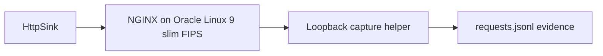

# HTTP Sink NGINX FIPS Test Endpoint

The HTTP sink has a local container-backed e2e test endpoint for release
validation. The image is built from Oracle Linux 9 slim FIPS and runs NGINX as
the externally visible HTTP boundary. NGINX proxies accepted requests to a
small loopback-only capture helper inside the same container so the test can
prove what the production `HttpSink` sent without requiring a live application
service.

This endpoint is for local testing only. It is not a production HTTP ingestion
service, it does not implement authentication, and it must not be used with
sensitive payloads. The runner sends deterministic fake events and removes the
container plus copied evidence by default.

## Architecture



The test keeps NGINX as the endpoint boundary. The capture helper is bound only
to `127.0.0.1` inside the container, writes bounded JSONL evidence, suppresses
default request logging, and records only selected safe headers such as the
idempotency key and test route header.

## What The Runner Verifies

Run the focused test from the repository root:

```bash
python scripts/run-http-sink-nginx-e2e.py
```

Expected successful output:

```text
HTTP sink NGINX container e2e test passed.
```

The runner performs these steps:

1. Builds `examples/http-nginx-fips-test/Dockerfile` as
   `nats-sinks-http-nginx-fips-test:local`.
2. Starts a short-lived container with `--read-only`, `--cap-drop ALL`,
   `no-new-privileges`, tmpfs-backed writable paths, and a random
   `127.0.0.1` host port.
3. Waits for NGINX to serve `/health`.
4. Uses the production `HttpSink` to send fake JetStream envelope records to
   `/nats-sink`.
5. Copies `/var/lib/nats-sinks-http/requests.jsonl` from the container.
6. Verifies the captured method, path, HTTP envelope schema, subject,
   deterministic payload, route header, and `Idempotency-Key` value.
7. Removes the container and copied evidence unless preservation was requested.

Use a different fake message count when inspecting behavior:

```bash
python scripts/run-http-sink-nginx-e2e.py --message-count 5
```

Keep the container and copied request evidence for local debugging:

```bash
python scripts/run-http-sink-nginx-e2e.py --preserve-artifacts
```

Preserved evidence is written under `.local/http-nginx-fips-e2e/`. Keep that
directory local and do not copy raw request evidence into GitHub issues,
release notes, or public documentation.

## Full Container E2E Gate

The HTTP endpoint runner is part of the opt-in full container-backed sink
suite:

```bash
NATS_SINKS_RUN_CONTAINER_E2E=1 scripts/check-sinks.sh
```

Expected successful tail output includes:

```text
HTTP sink NGINX container e2e test passed.
Full container-backed sink e2e suite passed.
```

This gate is intentionally local and explicit. It is not enabled by default in
GitHub Actions or ordinary unit tests because it needs Docker and may pull or
build container images.

## Security Posture

The local endpoint image is designed for repeatable testing with a narrow
runtime surface:

- Oracle Linux 9 slim FIPS base image.
- NGINX installed as the only HTTP endpoint.
- Non-root runtime user.
- Loopback-only host port binding.
- Read-only container root filesystem in the e2e runner.
- Linux capabilities dropped.
- `no-new-privileges` enabled.
- Writable paths provided only through tmpfs.
- No production credentials, certificates, wallets, tokens, or private
  endpoints.
- Fake payloads only.

The runner enables `allow_http_for_local_testing=true` only for the loopback
URL it creates. Production HTTP sink configurations should use HTTPS,
environment-backed credentials, explicit host allow-lists, endpoint-side
idempotency, and normal deployment controls.
