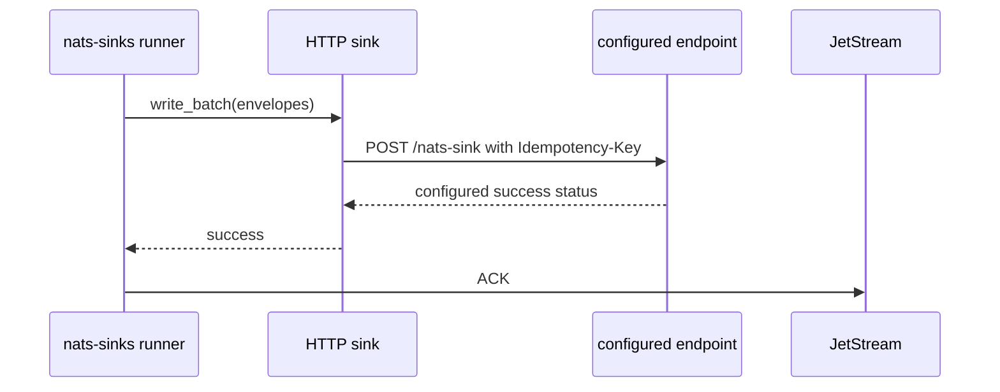

# HTTP Sink

The HTTP sink forwards normalized JetStream messages to one fixed
operator-configured HTTP endpoint. It is useful when an existing internal
service already exposes an ingestion API and the service can safely handle
at-least-once delivery.

The sink never ACKs NATS messages. It returns success only after every request
in the batch has received one of the configured success status codes. The core
runner ACKs afterward.

## Delivery Contract



The configured endpoint is the durable success boundary for this sink. A
client-side timeout is ambiguous: the endpoint may have processed the request
even if the client did not receive the response. Production endpoints should
therefore honor the propagated idempotency key and treat duplicate redelivery
as a no-op or a safe repeat.

## Minimal Configuration

```json
{
  "nats": {
    "url": "nats://localhost:4222",
    "stream": "EVENTS",
    "consumer": "http-events-sink",
    "subject": "events.>"
  },
  "sink": {
    "type": "http",
    "url": "https://events.example.invalid/nats-sink",
    "endpoint_allowed_hosts": ["events.example.invalid"]
  }
}
```

By default the sink:

- uses `POST`,
- sends a JSON envelope body,
- accepts HTTP `200`, `201`, `202`, or `204` as success,
- propagates `Idempotency-Key`,
- performs no in-call HTTP retry,
- bounds the request body to `1 MiB`,
- bounds the response body to `64 KiB`,
- requires HTTPS unless `allow_http_for_local_testing=true` and the host is
  loopback.

## Request Body

With the default `body_format="envelope"`, the endpoint receives a JSON object
similar to this:

```json
{
  "schema": "nats_sinks.http.message.v1",
  "schema_version": 1,
  "idempotency_key": "stream-sequence:EVENTS:42",
  "subject": "events.created",
  "stream": "EVENTS",
  "stream_sequence": 42,
  "consumer": "http-events-sink",
  "consumer_sequence": 7,
  "message_id": "publisher-message-42",
  "priority": "normal",
  "classification": "unclassified",
  "labels": "audit;api",
  "labels_list": ["audit", "api"],
  "payload": {
    "event_id": "EVT-42",
    "status": "accepted"
  },
  "payload_info": {
    "original_format": "json",
    "wrapped": false,
    "sha256": "example-redacted",
    "size_bytes": 41
  },
  "metadata": {
    "schema": "nats_sinks.metadata.v1"
  },
  "mission_metadata": null,
  "security_labels": null,
  "custody": null
}
```

Set `body_format` to `payload` when the endpoint expects only the normalized
payload JSON value:

```json
{
  "sink": {
    "type": "http",
    "url": "https://events.example.invalid/nats-sink",
    "endpoint_allowed_hosts": ["events.example.invalid"],
    "body_format": "payload"
  }
}
```

Payload normalization uses the shared framework contract. Valid JSON is sent
as JSON. Non-JSON text or bytes are wrapped according to `payload_mode`.

## Idempotency

The default idempotency configuration is:

```json
{
  "sink": {
    "type": "http",
    "url": "https://events.example.invalid/nats-sink",
    "endpoint_allowed_hosts": ["events.example.invalid"],
    "idempotency": {
      "enabled": true,
      "required": true,
      "header": "Idempotency-Key",
      "strategy": "idempotency_key"
    }
  }
}
```

Supported strategies:

| Strategy | Meaning |
| --- | --- |
| `idempotency_key` | Use the framework envelope key. This prefers stream sequence, then message ID, then payload hash when safe. |
| `stream_sequence` | Use `stream-sequence:<stream>:<sequence>`. Recommended when JetStream stream metadata is available. |
| `message_id` | Use `message-id:<Nats-Msg-Id>`. Use only when publishers consistently set unique message IDs. |
| `payload_sha256` | Use `payload-sha256:<subject>:<digest>`. Avoid for headers-only delivery or encrypted payloads unless the implications are understood. |

If `required=true` and the selected strategy cannot produce a key, the sink
raises a permanent framework error. With DLQ enabled, the core can publish the
message to DLQ before ACK.

## Headers And Secrets

Static headers are for non-secret routing hints only:

```json
{
  "sink": {
    "type": "http",
    "url": "https://events.example.invalid/nats-sink",
    "endpoint_allowed_hosts": ["events.example.invalid"],
    "headers": {
      "X-Nats-Sinks-Route": "orders"
    }
  }
}
```

Sensitive headers must use environment variables:

```json
{
  "sink": {
    "type": "http",
    "url": "https://events.example.invalid/nats-sink",
    "endpoint_allowed_hosts": ["events.example.invalid"],
    "headers_env": {
      "Authorization": "NATS_SINKS_HTTP_AUTHORIZATION"
    }
  }
}
```

The effective configuration prints the environment-variable name, not the
resolved value. The sink rejects framework-owned headers such as `Host`,
`Content-Length`, `Content-Type`, `Accept`, and `User-Agent`.

## Bounded Retries

In-call HTTP retries are disabled by default:

```json
{
  "sink": {
    "type": "http",
    "url": "https://events.example.invalid/nats-sink",
    "endpoint_allowed_hosts": ["events.example.invalid"],
    "retry": {
      "max_retries": 0
    }
  }
}
```

Enable them only for endpoints that honor the idempotency key:

```json
{
  "sink": {
    "type": "http",
    "url": "https://events.example.invalid/nats-sink",
    "endpoint_allowed_hosts": ["events.example.invalid"],
    "retry": {
      "max_retries": 2,
      "backoff_ms": 250,
      "max_backoff_ms": 5000,
      "backoff_mode": "exponential",
      "backoff_multiplier": 2.0,
      "jitter": "full"
    }
  }
}
```

Retryable statuses default to `408`, `425`, `429`, `500`, `502`, `503`, and
`504`. All other non-success statuses are permanent sink failures unless the
operator explicitly adds them to `success_statuses` or `retry_statuses`.

## Configuration Reference

| Field | Required | Default | Description |
| --- | --- | --- | --- |
| `type` | yes | none | Must be `http`. |
| `url` | yes | none | Fixed endpoint URL. Must use HTTPS unless loopback HTTP testing is explicitly enabled. Userinfo, fragments, and query strings are rejected. |
| `method` | no | `POST` | `POST`, `PUT`, or `PATCH`. |
| `body_format` | no | `envelope` | `envelope` or `payload`. |
| `endpoint_allowed_hosts` | no | `[]` | Optional host allow-list. When set, the URL host must be listed. |
| `allow_http_for_local_testing` | no | `false` | Allows `http://localhost`, `http://127.0.0.1`, or `http://[::1]` only for local tests. |
| `headers` | no | `{}` | Non-secret static headers. Sensitive and framework-owned names are rejected. |
| `headers_env` | no | `{}` | Header values resolved from environment variables at write time. |
| `user_agent` | no | `nats-sinks-http/0.4` | Generated `User-Agent` value. |
| `request_timeout_seconds` | no | `10.0` | Per-request timeout. |
| `max_request_bytes` | no | `1048576` | Maximum serialized JSON request body. |
| `max_response_bytes` | no | `65536` | Maximum response body read before failing closed. |
| `success_statuses` | no | `[200, 201, 202, 204]` | Statuses that count as durable endpoint success. |
| `retry_statuses` | no | `[408, 425, 429, 500, 502, 503, 504]` | Statuses that are temporary failures when retry budget remains. |
| `payload_mode` | no | `json_or_envelope` | Shared payload normalization mode. |
| `include_metadata` | no | `true` | Include standard NATS metadata in envelope bodies. |
| `include_mission_metadata` | no | `true` | Include parsed mission metadata in envelope bodies. |
| `include_security_labels` | no | `true` | Include parsed security-label metadata in envelope bodies. |
| `include_custody` | no | `true` | Include custody metadata in envelope bodies. |
| `idempotency` | no | enabled | Idempotency-key propagation settings. |
| `retry` | no | disabled | Bounded in-call retry settings. |

## Production Guidance

- Use HTTPS and a fixed host allow-list.
- Prefer `stream_sequence` or the default framework idempotency key.
- Keep in-call retries disabled unless the endpoint has documented
  idempotency behavior.
- Do not put authorization values in JSON configuration. Use `headers_env`.
- Keep response bodies small. The sink does not need endpoint payloads to
  decide ACK behavior.
- Do not expose raw subjects, classifications, labels, or payload fields in
  external monitoring labels merely because they are sent to the endpoint.

## Local NGINX Test Endpoint

Maintainers can validate the HTTP sink against a local NGINX endpoint built on
Oracle Linux 9 slim FIPS:

```bash
python scripts/run-http-sink-nginx-e2e.py
```

The test image exposes NGINX on a random loopback port and records bounded fake
request evidence inside the container. It is a local-only test harness, not a
production ingestion service. See
[HTTP Sink NGINX FIPS Test Endpoint](http-nginx-test-container.md) for the
container contract, command output, and full-suite integration.
