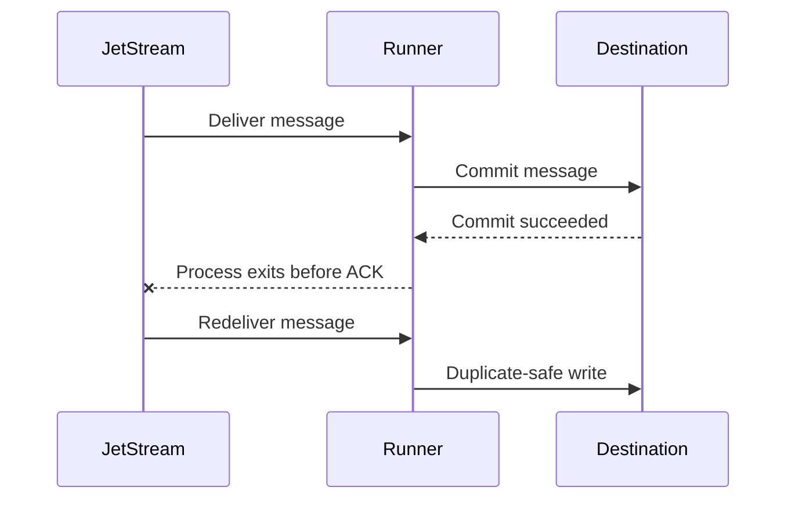

# Idempotency

Idempotency means that processing the same message more than once does not
create incorrect duplicate effects. For example, writing the same event twice
should not create two business records when the event represents one real
business action.

In operational or defence logistics systems, the same principle might mean that
one movement report, status update, sensor-derived alert, or audit event should
not create duplicate downstream facts simply because JetStream redelivered it.
Redelivery is a reliability mechanism, not a signal that the business event
happened twice.

JetStream redelivery is normal in an at-least-once system. Redelivery may
happen after a process crash, NATS reconnect, ACK failure, destination timeout,
or successful destination commit followed by process failure before ACK.

The package prefers safe duplication over silent loss.

## Why Idempotency Is Required

`nats-sinks` ACKs after the destination commit. That avoids silent loss, but it
also means there is a small window where the destination has committed and the
ACK has not yet reached JetStream. If the process stops in that window, the
message can be redelivered. A correctly designed sink treats that duplicate as
safe.

The duplicate must not corrupt state or create unwanted business effects.

## Common Strategy Names

The framework uses shared strategy names so future sinks can document familiar
behavior even when their destination-specific implementation differs.

### `stream_sequence`

Recommended for JetStream sinks. It uses:

- stream name,
- stream sequence.

This pair is stable for a message in a stream and maps naturally to a primary key.

When mirrors, sources, subject transforms, or rebuilt streams are part of the
event path, confirm which stream name and sequence number the sink actually
observes. `stream_sequence` is intentionally scoped to the consumed stream. If
the same business event may reach the sink through more than one topology path,
prefer a stable producer `Nats-Msg-Id` or a strict `payload_field` key.
Topology-specific guidance is documented in
[Advanced JetStream Topology](jetstream-topology.md).

### `message_id`

Uses a stable NATS message ID header. This is useful when producers already enforce message IDs.

### `payload_field`

Extracts a field from the normalized JSON payload value. This is useful for
business keys such as `order_id`, but it requires every message to carry the
expected field.

When a message body is non-JSON text or bytes, JSON-capable sinks may wrap it
in the nats-sinks JSON payload envelope. In that case, `payload_field` paths
refer to the envelope. For example, `payload` would refer to the wrapped text
value. For encrypted text and opaque payloads, prefer `stream_sequence` or
`message_id` idempotency because those strategies do not depend on decrypting
or interpreting the payload body.

## Duplicate Handling Modes

Duplicate handling is destination-specific. A relational database might use an
upsert or an insert-that-ignores-conflicts. An object store might use
deterministic object keys. An HTTP sink might use an idempotency-key header and
require the target service to honor it.

The important rule is destination-neutral: a sink must either make duplicate
redelivery safe or clearly document that a mode is not suitable for normal
production use.

For mission-support systems, prefer modes where duplicates are detectable and
boring. A visible duplicate that is safely ignored is usually far easier to
explain during recovery or audit than a missing event that was ACKed too early.

## Production Recommendation

Use `stream_sequence` unless you have a strong reason to use producer-supplied
IDs. For each destination, choose a write mode that treats duplicate delivery
as success rather than creating duplicate business effects.

## Current Scope

The current production implementations are Oracle Database, Oracle MySQL,
FileSink, and SpoolSink. Oracle duplicate handling is documented in
[Oracle Sink](oracle-sink.md), including `merge`, configurable merge update
columns, `insert_ignore`, `insert`, and `append` behavior. Oracle MySQL
duplicate handling is documented in [Oracle MySQL Sink](mysql-sink.md),
including `upsert`, `insert_ignore`, idempotency key columns, and table routes.
The experimental Oracle NoSQL Database sink documents K/V-style table
duplicate behavior in [Oracle NoSQL Database Sink](oracle-nosql-sink.md),
including conditional `skip_existing`, unconditional `replace`, and
`fail_existing` policies. The experimental Oracle Coherence Community Edition
sink documents K/V duplicate behavior in
[Oracle Coherence Community Edition Sink](coherence-sink.md), including
`skip_existing`, `replace`, and `fail_existing` policies. File
duplicate handling is documented in [File Sink](file-sink.md), including
deterministic file names and `skip_existing`, `overwrite`, and `fail` policies.
Edge spool duplicate handling is documented in [Edge Spool Sink](spool-sink.md),
including deterministic idempotency-key filenames, encrypted replay records,
`skip_existing`, and replay cleanup after target sink success.
Destination-specific key-column, filename, or payload-field details are kept on
the sink pages so future sinks can document their own backend-native approach
without changing this generic guide.

Oracle table routes may also override the sink-level idempotency policy. That
lets one Oracle sink process several subject families while using stream
sequence keys for one table, message IDs for another, and payload-field keys
for a third. Route overrides are validated before processing starts, and the
core still ACKs only after the full Oracle transaction commits.

The generic core also protects idempotency by owning all acknowledgement
decisions. Sinks never receive raw NATS messages and cannot ACK early. If a sink
raises before durable success, the core leaves the message eligible for
redelivery. If a permanent failure is sent to a DLQ, the original message is
ACKed only after DLQ publication succeeds.

Fan-out delivery adds another boundary to review. Required route targets
remain part of the formal commit-then-ACK path and therefore need normal
idempotency guarantees. Optional route targets are explicitly side copies
unless they complete before the ACK gate releases. Optional targets should
still be idempotent, but operators must not use an optional target as the only
durable record for business or mission state.

## Roadmap

Future idempotency work should focus on certifying every new sink, not only on
adding more strategy names. Planned areas include:

- additional certification evidence for complex multi-route Oracle
  idempotency deployments,
- richer duplicate counters and metrics where backend drivers expose reliable
  committed outcomes,
- HTTP idempotency-key support and explicit warnings for unsafe endpoints,
- S3 sinks with deterministic object keys and atomic overwrite-or-skip
  behavior,
- a reusable sink certification test suite that proves duplicate redelivery is
  safe before a sink is called production-ready.
