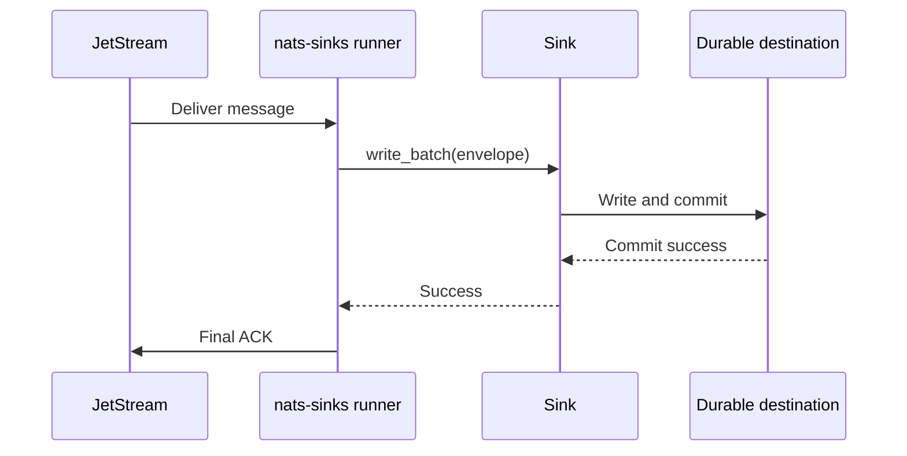
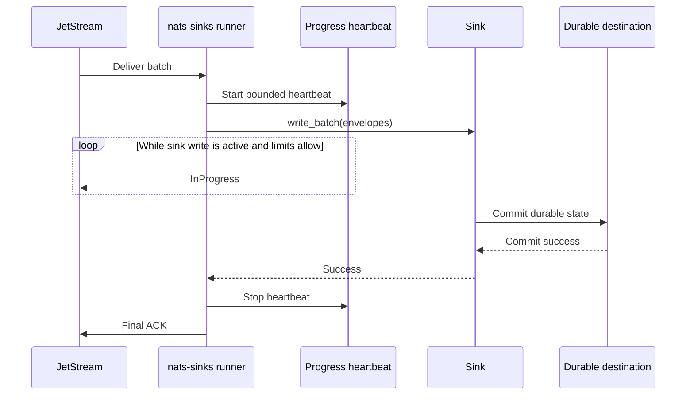
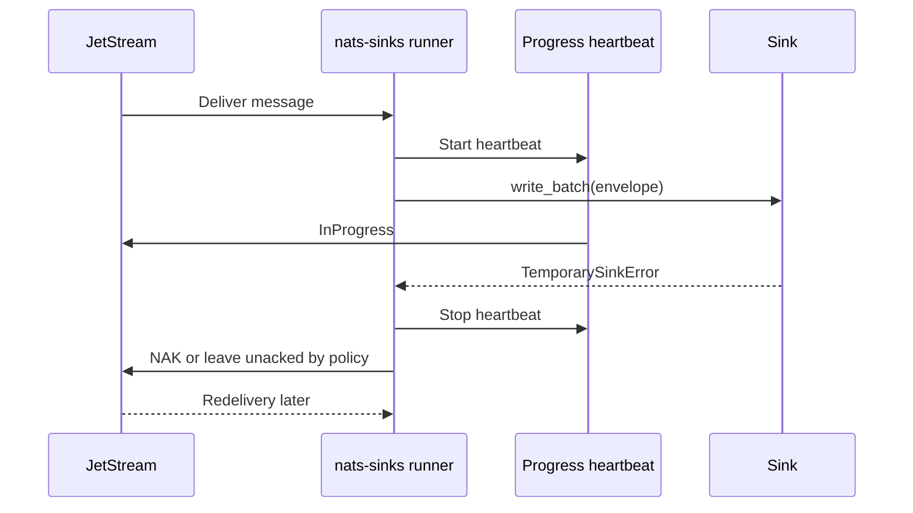

# InProgress Evaluation

This page records the evaluation for optional JetStream `InProgress` handling
in `nats-sinks`. It is intended for operators and maintainers who need to
understand whether progress signals can safely help long-running sink writes
without weakening commit-then-acknowledge.

The conclusion is deliberately cautious:

- `InProgress` can be useful for slow but healthy sink writes,
- it must be disabled by default,
- it must be bounded by interval, count, timeout, and shutdown behavior,
- it must never replace final ACK, NAK, Term, DLQ, or retry decisions,
- it requires guardrails around the effective consumer `AckWait` and `BackOff`
  policy before it should be considered production-ready.

The current release provides the first runtime option: a disabled-by-default
heartbeat around active sink writes. It is intentionally conservative. It
requires explicit `consumer_management.ack_wait_seconds`, rejects
`consumer_management.backoff_seconds`, and requires the heartbeat interval to be
below 80% of AckWait. Richer administrative inspection and BackOff-aware
guardrails remain separate backlog work.

## Background

NATS JetStream supports an acknowledgement type called `AckProgress`, sent on
the wire as `+WPI`. The official JetStream model deep dive describes it as a
signal sent before the `AckWait` period expires to indicate that work is still
ongoing and that the period should be extended by another `AckWait` window. See
the upstream
[JetStream Model Deep Dive](https://docs.nats.io/using-nats/developer/develop_jetstream/model_deep_dive).

The NATS consumer documentation explains that if an acknowledgement is required
but not received within the `AckWait` window, the message is redelivered. It
also describes how `BackOff` can override `AckWait`, with the first backoff
value determining the effective acknowledgement wait window. See
[JetStream Consumers](https://docs.nats.io/nats-concepts/jetstream/consumers).

The Python NATS client exposes `Msg.in_progress()`. The current `nats.py`
documentation states that this method acknowledges that a JetStream message is
still being worked on and, unlike other acknowledgement types, it can be called
multiple times. See the upstream
[`nats.aio.msg.Msg` source documentation](https://nats-io.github.io/nats.py/_modules/nats/aio/msg.html).

## Current Behavior

By default, `nats-sinks` does not send progress acknowledgements. The runner
fetches bounded batches, transforms messages into internal envelopes, calls
`sink.write_batch(...)`, and then ACKs only after the sink returns durable
success.

When `delivery.in_progress.enabled=true`, the core runner starts a bounded
background heartbeat only while `sink.write_batch(...)` is active. The
heartbeat stops before final ACK, NAK, Term, DLQ, retry handling, cancellation,
or shutdown completion.



This keeps the delivery contract simple. The optional heartbeat addresses the
case where a very long but healthy sink write can exceed the server-side
`AckWait` window and cause JetStream to redeliver while the first processing
attempt is still running.

## Runtime Shape

`InProgress` is a heartbeat around active sink work. It is not a sink API and
it is not a message-success signal.



The heartbeat stops on every terminal path:

- sink success,
- sink temporary failure,
- sink permanent failure,
- DLQ path entry,
- cancellation,
- shutdown,
- heartbeat maximum count reached,
- heartbeat timeout or unrecoverable heartbeat error.

## Failure Behavior

The most important rule is that `InProgress` does not make work successful. It
only tells JetStream that work is ongoing.



If the sink fails after one or more progress signals, the message must still be
eligible for redelivery or DLQ according to the normal policy. Progress signals
must never become an early ACK and must never suppress a failure.

## When It Is Appropriate

`InProgress` may be appropriate when:

- sink writes are expected to take longer than the default consumer `AckWait`,
- the destination is slow but actively working,
- idempotency is already in place,
- the operator can verify the effective `AckWait` or `BackOff` policy,
- the heartbeat interval is meaningfully shorter than the effective wait
  window,
- shutdown behavior is tested and deterministic.

Examples include large Oracle batches, constrained edge links, encrypted
payload handling, and mission-support stores where durable commit latency may
occasionally be higher than ordinary message-processing latency.

## When It Is Unsafe

`InProgress` is unsafe when:

- the sink may be stuck rather than slow,
- the consumer `AckWait` is unknown,
- `BackOff` overrides the effective acknowledgement window and the policy is
  not configured or verified through `consumer_management`,
- the interval is configured too close to the wait window,
- the maximum heartbeat count is unbounded,
- logs or metrics would expose sensitive subjects or payloads,
- the feature is used to hide a destination performance issue instead of
  tuning batch size, indexes, commit strategy, or infrastructure.

In those cases, the runner should fail closed when the option is enabled rather
than process messages with unclear redelivery timing.

## Implementation Split

The evaluation split this work into three implementation items:

1. Add AckWait and BackOff guardrails for InProgress support.
2. Add optional InProgress heartbeat during long sink writes.
3. Add InProgress metrics and an operator runbook.

The current release implements the runtime heartbeat, stable metrics, and the
operator runbook with a first fail-closed AckWait-only guardrail. BackOff-aware
support and richer consumer-policy inspection remain separate work because
BackOff changes the effective acknowledgement wait window.

## Configuration

`InProgress` stays disabled by default:

```json
{
  "delivery": {
    "ack_policy": "after_sink_commit",
    "in_progress": {
      "enabled": false,
      "interval_ms": 5000,
      "max_heartbeats": 12,
      "shutdown_timeout_ms": 5000
    }
  }
}
```

To enable it safely, set an explicit AckWait policy and use an interval below
80% of that window:

```json
{
  "consumer_management": {
    "ack_wait_seconds": 30
  },
  "delivery": {
    "in_progress": {
      "enabled": true,
      "interval_ms": 5000,
      "max_heartbeats": 12,
      "shutdown_timeout_ms": 5000
    }
  }
}
```

Validation rules:

| Field | Safety rule |
| --- | --- |
| `enabled` | Default `false`; explicit opt-in required. |
| `interval_ms` | Must be positive, bounded, and below 80% of configured AckWait when enabled. |
| `max_heartbeats` | Must be positive and bounded to prevent unbounded heartbeats. |
| `shutdown_timeout_ms` | Must be bounded so final ACK or failure handling cannot wait forever on heartbeat shutdown. |

The current implementation rejects `consumer_management.backoff_seconds` when
the heartbeat is enabled. Operators using BackOff should leave runtime
heartbeats disabled until BackOff-aware guardrails are implemented.

## Metrics Direction

The stable metric contract is low-cardinality and never includes payloads,
subjects, credentials, private deployment details, classification values,
labels, message IDs, table names, or file paths.

| Metric suffix | Type | Meaning |
| --- | --- | --- |
| `in_progress_attempts_total` | counter | Progress heartbeats attempted while sink work is active. |
| `in_progress_successes_total` | counter | Progress heartbeats accepted by the client path; not sink success. |
| `in_progress_failures_total` | counter | Progress heartbeat calls that failed before the final ACK decision. |
| `in_progress_max_heartbeats_reached_total` | counter | Batches that reached the configured heartbeat limit. |
| `current_in_progress_batches_active` | gauge | Active batches currently under heartbeat supervision. |
| `in_progress_heartbeat_seconds` | observation | Elapsed time spent sending heartbeat operations. |

These metrics should be readable through `nats-sink-metrics` and shared
externally only through explicit observability policies.

Operator interpretation is documented in the
[InProgress Metrics Runbook](inprogress-metrics-runbook.md).

## Operational Guidance

`InProgress` is not a performance fix. It is a redelivery-timing tool for work
that is legitimately still running. Before enabling it, operators should first
measure sink latency, tune batch size, review database indexes and commit
behavior, and confirm that the consumer `AckWait` policy matches the expected
write duration.

In mission-oriented deployments, use it only when it improves custody of
long-running work without hiding saturation. A slow destination should still
produce alerts, and a failed destination should still lead to redelivery or
DLQ according to policy.

## Current Status

This release includes optional runtime heartbeat support with conservative
AckWait-only startup validation, metrics, documentation, and tests. BackOff
guardrails and richer consumer-policy inspection remain follow-up work.
