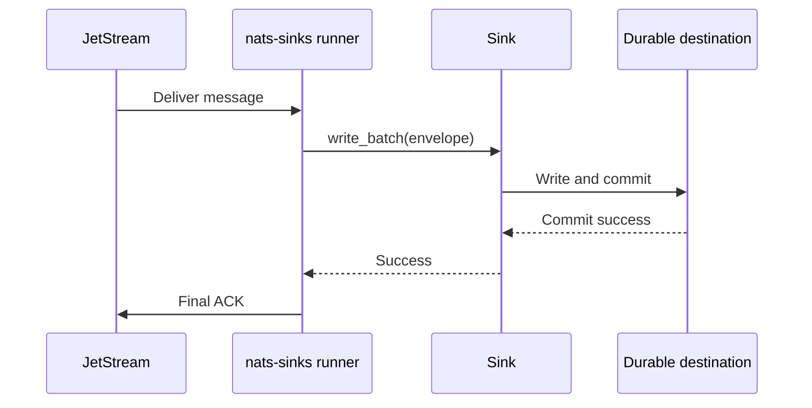
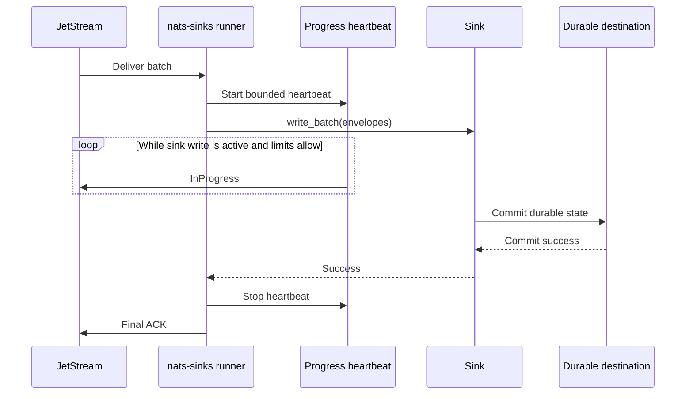
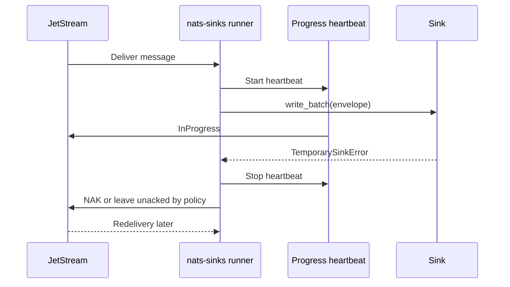

# InProgress Evaluation

This page records the evaluation for optional JetStream `InProgress` handling
in `nats-sinks`. It is intended for operators and maintainers who need to
understand whether progress signals can safely help long-running sink writes
without weakening commit-then-acknowledge.

The conclusion is deliberately cautious:

- `InProgress` can be useful for slow but healthy sink writes,
- it must be disabled by default,
- it must be bounded by interval, count, timeout, and shutdown behavior,
- it must never replace final ACK, NAK, Term, DLQ, or retry decisions,
- it requires guardrails around the effective consumer `AckWait` and `BackOff`
  policy before it should be considered production-ready.

The current release documents the evaluation and creates follow-up backlog
items. It does not yet expose a runtime `InProgress` configuration option.

## Background

NATS JetStream supports an acknowledgement type called `AckProgress`, sent on
the wire as `+WPI`. The official JetStream model deep dive describes it as a
signal sent before the `AckWait` period expires to indicate that work is still
ongoing and that the period should be extended by another `AckWait` window. See
the upstream
[JetStream Model Deep Dive](https://docs.nats.io/using-nats/developer/develop_jetstream/model_deep_dive).

The NATS consumer documentation explains that if an acknowledgement is required
but not received within the `AckWait` window, the message is redelivered. It
also describes how `BackOff` can override `AckWait`, with the first backoff
value determining the effective acknowledgement wait window. See
[JetStream Consumers](https://docs.nats.io/nats-concepts/jetstream/consumers).

The Python NATS client exposes `Msg.in_progress()`. The current `nats.py`
documentation states that this method acknowledges that a JetStream message is
still being worked on and, unlike other acknowledgement types, it can be called
multiple times. See the upstream
[`nats.aio.msg.Msg` source documentation](https://nats-io.github.io/nats.py/_modules/nats/aio/msg.html).

## Current Behavior

Today, `nats-sinks` does not send progress acknowledgements. The runner fetches
bounded batches, transforms messages into internal envelopes, calls
`sink.write_batch(...)`, and then ACKs only after the sink returns durable
success.



This keeps the delivery contract simple. The downside is that a very long sink
write can exceed the server-side `AckWait` window. In that case, JetStream may
redeliver while the first processing attempt is still running.

## Proposed Future Shape

If implemented, `InProgress` should be a heartbeat around active sink work. It
should not be a sink API and it should not be a message-success signal.



The heartbeat should stop on every terminal path:

- sink success,
- sink temporary failure,
- sink permanent failure,
- DLQ path entry,
- cancellation,
- shutdown,
- heartbeat maximum count reached,
- heartbeat timeout or unrecoverable heartbeat error.

## Failure Behavior

The most important rule is that `InProgress` does not make work successful. It
only tells JetStream that work is ongoing.



If the sink fails after one or more progress signals, the message must still be
eligible for redelivery or DLQ according to the normal policy. Progress signals
must never become an early ACK and must never suppress a failure.

## When It Is Appropriate

`InProgress` may be appropriate when:

- sink writes are expected to take longer than the default consumer `AckWait`,
- the destination is slow but actively working,
- idempotency is already in place,
- the operator can verify the effective `AckWait` or `BackOff` policy,
- the heartbeat interval is meaningfully shorter than the effective wait
  window,
- shutdown behavior is tested and deterministic.

Examples include large Oracle batches, constrained edge links, encrypted
payload handling, and mission-support stores where durable commit latency may
occasionally be higher than ordinary message-processing latency.

## When It Is Unsafe

`InProgress` is unsafe when:

- the sink may be stuck rather than slow,
- the consumer `AckWait` is unknown,
- `BackOff` overrides the effective acknowledgement window and the runner does
  not understand that policy,
- the interval is configured too close to the wait window,
- the maximum heartbeat count is unbounded,
- logs or metrics would expose sensitive subjects or payloads,
- the feature is used to hide a destination performance issue instead of
  tuning batch size, indexes, commit strategy, or infrastructure.

In those cases, the runner should fail closed when the option is enabled rather
than process messages with unclear redelivery timing.

## Recommended Implementation Split

The evaluation recommends three separate implementation items:

1. Add AckWait and BackOff guardrails for InProgress support.
2. Add optional InProgress heartbeat during long sink writes.
3. Add InProgress metrics and an operator runbook.

This split matters. Timing policy, runtime heartbeats, and observability have
different risks and deserve separate review.

## Configuration Direction

A future configuration shape should keep `InProgress` disabled by default.
This example is illustrative only:

```json
{
  "delivery": {
    "ack_policy": "after_sink_commit",
    "in_progress": {
      "enabled": false,
      "interval_ms": 5000,
      "max_signals_per_message": 12,
      "require_consumer_ack_wait_verification": true
    }
  }
}
```

Suggested validation rules:

| Field | Safety rule |
| --- | --- |
| `enabled` | Default `false`; explicit opt-in required. |
| `interval_ms` | Must be positive, bounded, and lower than the effective `AckWait`. |
| `max_signals_per_message` | Must be positive and bounded to prevent unbounded heartbeats. |
| `require_consumer_ack_wait_verification` | Default `true`; fail closed when safe timing cannot be verified. |

## Metrics Direction

Future metrics should be low-cardinality and should never include payloads or
private deployment details.

| Metric suffix | Type | Meaning |
| --- | --- | --- |
| `in_progress_attempts_total` | counter | Progress signals attempted. |
| `in_progress_success_total` | counter | Progress signals sent successfully. |
| `in_progress_errors_total` | counter | Progress signal calls that failed. |
| `in_progress_max_count_reached_total` | counter | Messages or batches that reached the configured heartbeat limit. |
| `in_progress_active_batches` | gauge | Active batches currently under a progress heartbeat. |
| `message_in_progress_seconds` | observation | Elapsed time spent sending progress signals. |

These metrics should be readable through `nats-sink-metrics` and shared
externally only through explicit observability policies.

## Operational Guidance

`InProgress` is not a performance fix. It is a redelivery-timing tool for work
that is legitimately still running. Before enabling it in a future release,
operators should first measure sink latency, tune batch size, review database
indexes and commit behavior, and confirm that the consumer `AckWait` policy
matches the expected write duration.

In mission-oriented deployments, use it only when it improves custody of
long-running work without hiding saturation. A slow destination should still
produce alerts, and a failed destination should still lead to redelivery or
DLQ according to policy.

## Current Status

This release documents the evaluation and creates follow-up feature requests.
No runtime `InProgress` option is enabled yet.
