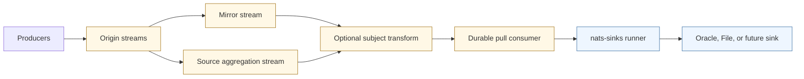
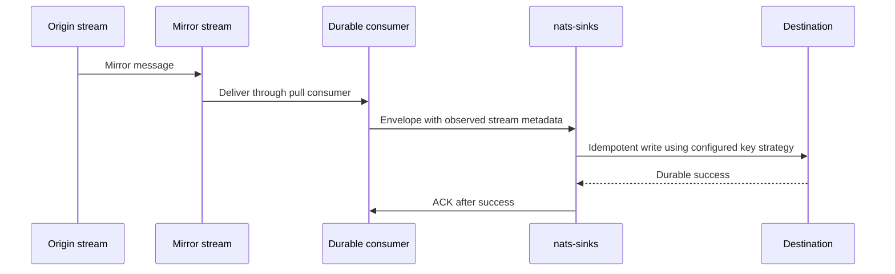
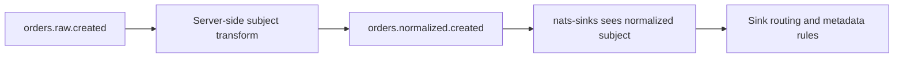

# Advanced JetStream Topology

This page explains how advanced JetStream stream-topology choices can affect
`nats-sinks` deployments. It is guidance for architects and operators, not a
claim that `nats-sinks` manages every JetStream stream feature.

`nats-sinks` consumes from the stream and durable consumer configured in
`config.json`. Stream creation, stream replication, subject transformation,
placement, compression, and stream metadata remain NATS server and platform
concerns. Those choices still matter because they can change which subject,
stream name, sequence number, header set, and replay path the sink observes.

## Design Boundary

The current runtime boundary is intentionally narrow:

```text
JetStream stream selected by configuration
  -> durable pull consumer selected by configuration
  -> nats-sinks runner
  -> sink.write_batch(...)
  -> durable destination commit
  -> JetStream ACK
```

Advanced topology lives before that boundary. The runner does not create or
reconcile mirrors, sources, transforms, republish rules, placement policy, or
compression policy. It observes the messages that JetStream delivers from the
configured stream and consumer.



In the diagram, NATS owns the topology and `nats-sinks` owns delivery handling
after a message reaches the runner. That separation keeps commit-then-ACK
behavior reviewable and prevents a sink worker from becoming a general-purpose
stream administration tool.

## Quick Decision Table

| Topology feature | What it can change | `nats-sinks` guidance |
| --- | --- | --- |
| Mirrors | Stream identity, sequence interpretation, replay topology, failure domain. | Prefer pre-created mirrors. Validate the metadata that the runner receives before using `stream_sequence` as the only business key across mirrored deployments. |
| Sources | Aggregation of one or more streams, local sequence assignment, ordering across sources. | Include the consumed stream name in idempotency keys and consider producer `Nats-Msg-Id` or payload keys when aggregating many origins. |
| Subject transforms | Subject names seen by consumers and subject-based routing. | Route and metadata rules match the transformed subject delivered to the runner. Preserve the original subject in a header if downstream operators need it. |
| RePublish | Server-side publication of stored messages to another subject. | Treat it as a separate NATS topology feature. It is not the same as `nats-sinks` DLQ publishing and is not managed by the runner. |
| Stream compression | Server-side storage format and resource use. | Transparent to the runner. Do not confuse stream compression with file sink gzip compression or payload encryption. |
| Placement | Cluster placement, latency, availability, and failure domain. | Tune reconnect, batch timeout, and destination write expectations to match the chosen placement. |
| Stream metadata | Stream-level labels or operator hints. | Not automatically persisted as per-message metadata. Use message headers or `message_metadata` defaults when the destination must store a value. |
| Consumer AckWait and BackOff | Redelivery timing for unacknowledged work. | Required for optional `InProgress` safety. The runner verifies effective AckWait before progress heartbeats are allowed and rejects effective BackOff until BackOff-aware heartbeat timing is supported. |

## Mirrors

A mirror stream follows another stream. Operators often use mirrors for
regional replication, controlled replay, or separating consumers from a
high-value origin stream.

For `nats-sinks`, the important question is: which stream metadata does the
runner receive from the durable consumer it is bound to? The framework builds
the default `stream_sequence` idempotency key from:

- stream name,
- stream sequence.

That pair is safe inside the consumed stream. It is not a universal business
identity across every possible topology unless your platform has tested and
documented how mirror sequence and stream names are handled in that deployment.



Recommended practice:

- keep mirrors pre-created and reviewed outside the sink worker,
- record which stream the sink consumes from in runbooks,
- test redelivery after mirror failover or replay before relying on
  `stream_sequence` as the only key, and
- use `message_id` or `payload_field` when the same business event may be
  delivered through more than one stream path.

## Sources

A source stream can receive messages from another stream, and a stream can be
configured with multiple sources. This is useful for aggregation, consolidation,
or building an operational view from several origin streams.

Aggregation is exactly where idempotency deserves extra care. If the sink
consumes the aggregate stream, the stream sequence observed by the sink belongs
to that aggregate stream. A replay through a different aggregate stream, a
rebuilt stream, or a changed source layout may produce a different stream and
sequence pair for the same business event.

Recommended practice:

- keep `stream_sequence` for simple one-stream custody paths,
- use producer-controlled `Nats-Msg-Id` when producers can provide stable IDs,
- use `payload_field` only when payload schema is strict and the field is
  stable across all source streams,
- include source/origin information in headers if operators need to investigate
  provenance later, and
- test duplicate redelivery through the exact source topology that production
  will use.

## Subject Transforms

Subject transforms can change the subject stored or delivered by JetStream.
This is powerful, but it means downstream routing may see a different subject
than the producer originally published.

`nats-sinks` applies subject-aware configuration to the subject present in the
`NatsEnvelope`. This affects:

- Oracle subject-to-table routing,
- file sink subject partitioning,
- metadata default rules,
- encryption rules,
- logging context,
- metrics context where subject information is intentionally allowed.

If the original subject has audit value, preserve it as a header before the
transform or use a platform convention that records provenance in the payload.
Do not assume that a sink can reconstruct an original subject after the server
has transformed it.



## RePublish

JetStream RePublish can republish stored messages to another NATS subject. This
is a server-side broadcast or fan-out tool. It is not the same thing as
`nats-sinks` dead-letter publication.

Keep these concepts separate:

| Concept | Owner | Purpose |
| --- | --- | --- |
| JetStream RePublish | NATS stream configuration | Republish stored messages to another subject for topology or fan-out purposes. |
| `nats-sinks` DLQ publish | Core runner | Publish a permanent-failure record only after sink processing fails permanently. |
| Destination sink write | Sink module | Persist the message batch to Oracle, files, or a future backend. |

If a deployment uses RePublish to feed another stream that is later consumed by
`nats-sinks`, document that intermediate stream as part of the event custody
path and select idempotency keys accordingly.

## Stream Compression

JetStream can apply compression to file-backed streams. This is a server-side
storage decision. It should be transparent to `nats-sinks`: the runner receives
the message payload bytes after NATS has handled storage.

Do not confuse these separate layers:

- stream compression reduces NATS stream storage usage,
- file sink gzip compression changes destination file representation,
- payload encryption protects the stored payload body before any sink writes
  it,
- TLS protects the network connection between client and server.

Each layer solves a different problem. Compression is not encryption, and
encryption is not retention management.

## Placement

Stream placement controls where the stream should live in a NATS cluster.
Placement can affect latency, availability, disaster-recovery design, and the
failure domain between producer, sink worker, and destination system.

`nats-sinks` does not inspect or enforce placement. Operators should instead
review:

- whether the sink worker runs near the NATS servers that host the stream,
- whether the destination backend is near the sink worker,
- whether reconnect settings match expected failover times,
- whether `delivery.batch_timeout_ms` and `delivery.batch_size` match latency
  and throughput goals, and
- whether service monitoring can distinguish a NATS placement event from a
  destination outage.

## Stream Metadata

JetStream streams can carry stream-level metadata. That metadata is useful for
operators, automation, and documentation, but it is not automatically stored as
per-message metadata by `nats-sinks`.

If a value must be stored with every destination row or file, use one of these
runtime-visible mechanisms:

- a NATS message header,
- a payload field,
- `message_metadata.priority.default`,
- `message_metadata.classification.default`,
- `message_metadata.labels.default`,
- a subject-specific `message_metadata.rules` entry.

For example, a stream metadata value that says a stream belongs to a restricted
mission compartment may be helpful for operators, but destination records
should still receive an explicit classification header or metadata default when
that classification must be preserved downstream.

## Unsupported Management Behavior

The current `nats-sinks` runtime does not manage:

- stream creation,
- mirror or source creation,
- subject-transform creation,
- republish rules,
- stream compression settings,
- stream placement settings,
- stream metadata mutation,
- stream purge, delete, restore, or snapshot operations.

Those operations belong in infrastructure-as-code, NATS operational tooling, or
a future explicitly scoped management helper. Keeping them out of the sink
worker supports least privilege: a runtime account can consume and ACK the
messages it owns without receiving broad stream administration rights.

## Idempotency Questions For Topology Reviews

Before approving an advanced topology for a production sink, answer these
questions:

1. Which stream and consumer will `nats-sinks` actually bind to?
2. Can the same business event reach the sink through more than one stream
   path?
3. Does the consumed stream preserve the sequence identity you expect after
   mirrors, sources, transforms, or rebuilds?
4. Is `stream_sequence` enough, or should producers provide `Nats-Msg-Id`?
5. Is `payload_field` safe, strict, and available for JSON and non-JSON
   payload modes?
6. Does the destination have a duplicate-safe write mode for the selected key?
7. Are transformed subjects still suitable for routing, encryption, metadata
   defaults, and operational triage?
8. Are original subjects, origin streams, or source compartments preserved in
   headers when they matter?
9. Can DLQ records be correlated back to the topology path without exposing
   sensitive operational structure?
10. Has redelivery been tested through the same topology rather than only
    through a direct local stream?

## Security Notes

Advanced topology can reveal operational structure even when payloads are
encrypted. Stream names, subject transforms, republish subjects, origin headers,
placement labels, advisory subjects, and stream metadata can all disclose
mission tempo or system boundaries.

Use placeholders in public documentation and issue evidence. Keep real stream
names, operational compartments, source-subject families, and placement tags in
private runbooks or controlled configuration repositories.

## References

- [NATS JetStream Streams](https://docs.nats.io/nats-concepts/jetstream/streams)
- [JetStream Model Deep Dive](https://docs.nats.io/using-nats/developer/develop_jetstream/model_deep_dive)
- [NATS JetStream Consumers](https://docs.nats.io/nats-concepts/jetstream/consumers)
