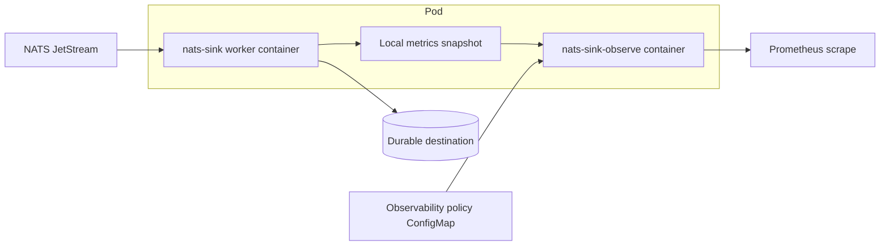
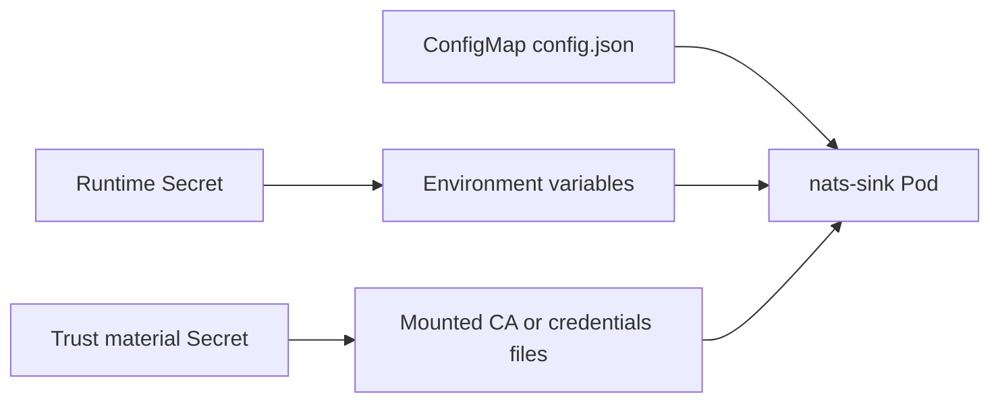
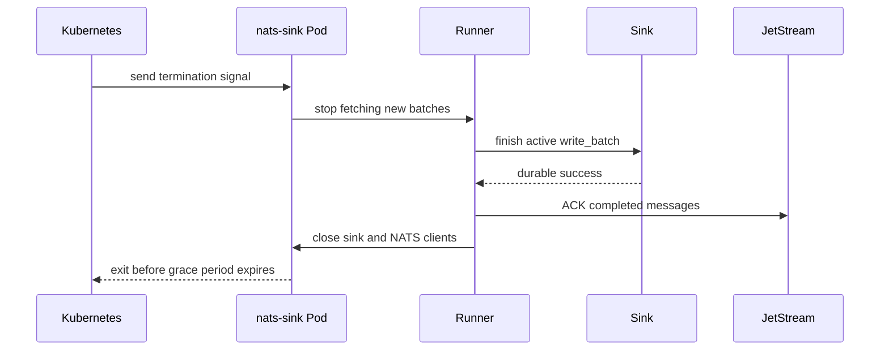

# Kubernetes Deployment

This page explains how to adapt the tracked Kubernetes examples under
`examples/kubernetes/`. The examples are intentionally conservative. They show
deployment shape, security boundaries, graceful shutdown, resource limits, and
observability separation without embedding real service endpoints, credentials,
wallets, certificates, private subjects, or payload samples.

`nats-sinks` runtime configuration remains JSON. The Kubernetes API manifests
are YAML because Kubernetes commonly represents resources that way, but the
`config.json` stored in the ConfigMap is the same JSON configuration used by
the CLI, systemd examples, tests, and Python users.

## Example Layout

```text
examples/kubernetes/
  README.md
  namespace.yaml
  service-account.yaml
  configmap-file-worker.yaml
  secret-template.yaml
  persistent-volume-claim.yaml
  sink-worker-deployment.yaml
  observability-policy-configmap.yaml
  prometheus-http-sidecar-deployment.yaml
  prometheus-http-service.yaml
  network-policy.yaml
```

The examples are not a Helm chart. They are meant to be readable, reviewable
starting points for platform teams. A future chart remains a separate roadmap
item because it needs upgrade semantics, values validation, release packaging,
and compatibility guarantees.

## Deployment Shape

The recommended shape keeps delivery-critical work isolated from optional
observability work:



The sink worker container runs:

```bash
nats-sink run /etc/nats-sinks/config.json
```

The optional observability container runs:

```bash
nats-sink-observe prometheus-http \
  /var/lib/nats-sinks/metrics/metrics.json \
  /etc/nats-sinks-observability/observability.prometheus.json
```

The observability container reads only the local metrics snapshot and the
policy file. It does not connect to NATS, Oracle, the file sink output
directory, DLQ subjects, or future destination backends. If observability fails,
delivery must continue to follow commit-then-acknowledge behavior.

## What To Customize

Before applying any manifest, customize these values:

| Area | Values to review |
| --- | --- |
| Image | Replace `ghcr.io/projectcuillin/nats-sinks:0.4.0` with the image registry, tag, and digest approved for your environment. Review [Production Container Hardening](container-hardening.md) before promotion. |
| NATS | Replace the example NATS URL, stream, consumer, subject, DLQ subject, TLS CA mount, and authentication settings. |
| Sink | Replace the file sink with the sink and destination settings required by your deployment. Oracle deployments should use Secret references and wallet or TLS material mounted from approved secrets. |
| Secrets | Replace the placeholder Secret with a cluster secret manager, sealed-secret workflow, External Secrets operator, or another approved secret-injection mechanism. |
| Storage | Replace the example `PersistentVolumeClaim` with a storage class, access mode, size, retention policy, and backup policy suitable for the selected sink. |
| Resources | Tune CPU and memory requests and limits based on measured payload size, batch size, compression, encryption, and destination latency. |
| Network | Replace the example `NetworkPolicy` selectors with the namespaces, pod labels, egress gateway, or CNI-specific controls used in your cluster. |
| Observability | Keep external metric sharing disabled until the allowed metric list, scrape exposure, and service labels have been reviewed. |

## Configuration And Secrets

Non-secret runtime configuration belongs in a ConfigMap. Secrets belong in
Kubernetes Secrets or, preferably, in the platform secret system that populates
Kubernetes Secrets at deploy time.



The example ConfigMap uses `password_env` instead of a literal NATS password:

```json
{
  "nats": {
    "url": "tls://nats.example.svc.cluster.local:4222",
    "user": "nats_sink_worker",
    "password_env": "NATS_PASSWORD",
    "tls_ca_file": "/etc/nats-sinks/tls/ca.crt",
    "tls_verify": true
  }
}
```

The Deployment resolves `NATS_PASSWORD` from a Secret key:

```yaml
env:
  - name: NATS_PASSWORD
    valueFrom:
      secretKeyRef:
        name: nats-sink-runtime-secrets
        key: NATS_PASSWORD
```

Do not place real passwords, tokens, private keys, Oracle wallet contents,
NATS credentials files, internal hostnames, production subjects, or sensitive
payload examples in tracked manifests or GitHub Issues.

## Security Context

The example worker uses a restrictive pod and container security context:

```yaml
automountServiceAccountToken: false
securityContext:
  runAsNonRoot: true
  runAsUser: 10001
  runAsGroup: 10001
  fsGroup: 10001
  seccompProfile:
    type: RuntimeDefault
containers:
  - name: nats-sink
    securityContext:
      allowPrivilegeEscalation: false
      readOnlyRootFilesystem: true
      capabilities:
        drop:
          - "ALL"
```

This follows least privilege. If your image or sink needs writable paths, mount
explicit `emptyDir` or persistent volumes only at those paths. Avoid broad
filesystem write access. Avoid mounting the Kubernetes service account token
unless a future feature explicitly needs Kubernetes API access.

The current container image runs as UID/GID `10001` and is designed to work
with `readOnlyRootFilesystem: true` when `/tmp` and the selected runtime state
paths are mounted explicitly. The examples mount `/tmp`, file output, and
metrics snapshot paths. Oracle-only deployments may not need file-output
storage, while spool deployments need a protected persistent mount for
encrypted spool custody. See [Production Container Hardening](container-hardening.md)
for the full writable-path and supply-chain evidence checklist.

## Graceful Shutdown

The Deployment sets `terminationGracePeriodSeconds` and a short `preStop`
delay. The goal is to stop receiving new work, give the process time to handle
the active batch, close clients, and avoid turning pod termination into
unnecessary redelivery pressure.



Choose a grace period that is longer than a normal batch write plus destination
commit time. If the period is too short, Kubernetes may kill the container
while the worker is still handling the active batch. That should still prefer
redelivery over silent loss, but it may increase duplicate processing.

## Readiness And Liveness

The example uses `nats-sink validate /etc/nats-sinks/config.json` as a simple
exec probe. This verifies that the mounted JSON configuration is syntactically
and structurally valid. It does not prove that NATS or the destination backend
is reachable.

For production, consider layering:

- config validation probes for early configuration mistakes;
- platform monitoring for NATS availability, Oracle or destination health, and
  pod restart count;
- metrics alerts for stale `last_sink_success_epoch_seconds`,
  `sink_write_errors_total`, `messages_failed_total`, and DLQ activity;
- a future readiness integration only if it can be implemented without
  weakening commit-then-ACK behavior.

## Observability

The observability policy example is disabled by default:

```json
{
  "enabled": false,
  "prometheus": {
    "enabled": false,
    "http_endpoint": {
      "enabled": false
    }
  }
}
```

Before enabling the sidecar, review the allow list and decide which metrics may
leave the pod. Avoid high-cardinality labels and avoid exporting raw subjects,
classification values, labels, route names, table names, file paths, or any
payload-derived information.

The optional sidecar exposes a ClusterIP service. Keep the service private to
Prometheus or your monitoring path. Use NetworkPolicy, service mesh policy, or
cluster firewall rules to restrict access.

## Applying The Examples

Review locally first:

```bash
kubectl apply --dry-run=client -f examples/kubernetes/
```

Apply the base worker only after customization:

```bash
kubectl apply -f examples/kubernetes/namespace.yaml
kubectl apply -f examples/kubernetes/service-account.yaml
kubectl apply -f examples/kubernetes/configmap-file-worker.yaml
kubectl apply -f examples/kubernetes/secret-template.yaml
kubectl apply -f examples/kubernetes/persistent-volume-claim.yaml
kubectl apply -f examples/kubernetes/sink-worker-deployment.yaml
```

Apply observability only after enabling and reviewing the policy:

```bash
kubectl apply -f examples/kubernetes/observability-policy-configmap.yaml
kubectl apply -f examples/kubernetes/prometheus-http-sidecar-deployment.yaml
kubectl apply -f examples/kubernetes/prometheus-http-service.yaml
```

## Testing Without A Cluster

The repository includes deterministic tests that inspect the examples without
connecting to a Kubernetes cluster:

```bash
pytest tests/unit/test_kubernetes_examples.py
```

These tests check for expected resource kinds, JSON ConfigMap content, Secret
references, security context controls, resource limits, graceful shutdown
settings, observability separation, and absence of obvious private operational
values.

## Production Checklist

Before production use:

- pre-create or strictly scope the NATS stream and durable consumer;
- verify NATS account permissions with the least-privilege templates;
- verify destination identity and permissions;
- use idempotent sink modes;
- keep payload logging disabled unless explicitly approved;
- use TLS verification and approved CA or credentials-file material;
- keep Secret values out of git, logs, tickets, screenshots, and issue
  comments;
- size resource requests and limits from measured workload behavior;
- validate graceful shutdown with realistic batch sizes and destination
  latency;
- review observability allow lists before enabling any external sharing;
- run the relevant unit, smoke, synthetic, and live non-production tests before
  release.
