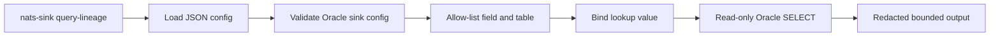

# Lineage Query Helpers

Lineage query helpers are read-only tools for inspecting records that
`nats-sinks` has already persisted. They help operators, auditors, incident
responders, and platform teams answer questions such as:

- Which stored records share this `mission_id`?
- Which records were caused by a specific upstream event?
- Which persisted events refer to a specific `track_id` or `tasking_id`?
- Which row was stored for a specific NATS message ID?

The helpers are deliberately separate from sink processing. They do not connect
to NATS, do not fetch JetStream messages, do not ACK or NAK anything, do not
write to Oracle, and do not change idempotency state. They query already
persisted data only.

## Current Destination Scope

The first supported destination is Oracle Database, including Oracle Database
running on-premises and Oracle Autonomous Database on OCI when the normal
Oracle sink configuration is valid for that environment.

File sink records also contain enough JSON metadata to reconstruct lineage with
external tools such as `jq`, Python, or a SIEM ingestion pipeline. A native file
lineage helper is not part of the current release.

## Supported Query Fields

The Oracle helper uses a strict allow list. Operators cannot provide arbitrary
SQL, arbitrary JSON paths, arbitrary column expressions, or raw query
fragments.

| Field | Source | Notes |
| --- | --- | --- |
| `correlation_id` | `MISSION_METADATA_JSON.$.correlation_id` | Application or mission correlation identifier. |
| `causation_id` | `MISSION_METADATA_JSON.$.causation_id` | Identifier of the event or command that caused the stored event. |
| `mission_id` | `MISSION_METADATA_JSON.$.mission_id` | Mission or operational context identifier. |
| `tasking_id` | `MISSION_METADATA_JSON.$.tasking_id` | Tasking identifier used by the producing system. |
| `track_id` | `MISSION_METADATA_JSON.$.track_id` | Track or object identifier used by the producing system. |
| `message_id` | configured `message_id` column | NATS message ID or configured idempotency message ID. |
| `subject` | configured `subject` column | Exact NATS subject value stored by the sink. |

The helper intentionally does not query payload fields by default. Payloads may
be encrypted, large, classified, compartmented, or unrelated to lineage. Use
mission metadata for lineage keys that need to be searched after persistence.

## Safety Model



The helper applies these controls:

- only Oracle sink configurations are accepted,
- queried tables must be `sink.table` or one of `sink.table_routes[].table`,
- queried fields must be one of the supported fields listed above,
- lookup values must be non-empty, bounded, and free of control characters,
- result limits must be between `1` and `1000`,
- SQL values are passed as bind variables,
- table and column identifiers are validated with the same Oracle identifier
  allow list used by the write path,
- payload output is omitted by default, and
- full metadata JSON is not printed by default.

## CLI Usage

Dry-run first. Dry-run output shows the generated SQL and bind names without
printing the lookup value.

```bash
nats-sink query-lineage examples/oracle-jetstream/config.json \
  --field mission_id \
  --value MISSION-ALPHA \
  --limit 10 \
  --format json \
  --dry-run
```

Example output:

```json
{
  "field": "mission_id",
  "table": "NATS_SINK_EVENTS",
  "limit": 10,
  "payload_included": false,
  "binds": ["lineage_value"],
  "sql": "select STREAM_NAME as stream_name, STREAM_SEQUENCE as stream_sequence, SUBJECT as subject, MESSAGE_ID as message_id, PRIORITY as priority, CLASSIFICATION as classification, LABELS as labels, MESSAGE_CREATED_AT_EPOCH_NS as message_created_at_epoch_ns, RECEIVED_AT_EPOCH_NS as received_at_epoch_ns, STORED_AT_EPOCH_NS as stored_at_epoch_ns, MISSION_METADATA_JSON as mission_metadata_json from NATS_SINK_EVENTS where json_value(MISSION_METADATA_JSON, '$.mission_id') = :lineage_value order by RECEIVED_AT_EPOCH_NS nulls last, STREAM_SEQUENCE nulls last fetch first 10 rows only"
}
```

Run the query when the Oracle credentials and network path are available:

```bash
nats-sink query-lineage /etc/nats-sinks/oracle.json \
  --field mission_id \
  --value MISSION-ALPHA \
  --limit 25
```

Example text output:

```text
Lineage query result
field=mission_id
table=NATS_SINK_EVENTS
limit=25
records=2
1. stream=MISSION sequence=42 subject=mission.sensor.track message_id=msg-42 priority=urgent classification=NATO SECRET labels=track;watch-floor received_at_epoch_ns=1778926620000000000 mission_metadata_keys=correlation_id,mission_id,track_id payload=omitted
2. stream=MISSION sequence=43 subject=mission.sensor.track message_id=msg-43 priority=normal classification=NATO SECRET labels=track;fusion received_at_epoch_ns=1778926630000000000 mission_metadata_keys=causation_id,correlation_id,mission_id,track_id payload=omitted
```

Use JSON output for scripts:

```bash
nats-sink query-lineage /etc/nats-sinks/oracle.json \
  --field correlation_id \
  --value CORR-2026-001 \
  --limit 50 \
  --format json
```

Example JSON output:

```json
{
  "field": "correlation_id",
  "table": "NATS_SINK_EVENTS",
  "limit": 50,
  "record_count": 1,
  "payload_included": false,
  "records": [
    {
      "stream_name": "MISSION",
      "stream_sequence": 42,
      "subject": "mission.sensor.track",
      "message_id": "msg-42",
      "priority": "urgent",
      "classification": "NATO SECRET",
      "labels": "track;watch-floor",
      "message_created_at_epoch_ns": 1778926530000000000,
      "received_at_epoch_ns": 1778926620000000000,
      "stored_at_epoch_ns": 1778926680000000000,
      "mission_metadata_keys": ["correlation_id", "mission_id", "track_id"],
      "payload_included": false
    }
  ]
}
```

## Querying Routed Tables

When the Oracle sink uses `table_routes`, the lineage helper can query a routed
table only when that table appears in the configuration.

```json
{
  "sink": {
    "type": "oracle",
    "table": "NATS_EVENTS_DEFAULT",
    "table_routes": [
      {
        "subject": "mission.secret.>",
        "table": "NATS_EVENTS_SECRET"
      }
    ]
  }
}
```

Query the routed table:

```bash
nats-sink query-lineage /etc/nats-sinks/oracle.json \
  --table NATS_EVENTS_SECRET \
  --field track_id \
  --value TRACK-9001 \
  --limit 20
```

If `--table` names a table outside the configured sink table and route table
allow list, the command fails closed.

## Parameterized Oracle Example

The generated Oracle query uses a bind variable for the lookup value. For a
`mission_id` lookup, the relevant WHERE clause is shaped like this:

```sql
where json_value(MISSION_METADATA_JSON, '$.mission_id') = :lineage_value
```

The result limit is validated as an integer before it is interpolated:

```sql
fetch first 50 rows only
```

Oracle does not allow bind variables for table names, column names, or JSON
path expressions. nats-sinks therefore accepts those values only from validated
configuration and a fixed field allow list.

## Payload Output

Payloads are omitted by default:

```text
payload=omitted
```

The helper supports `--include-payload` for controlled local investigation, but
operators should treat that flag as sensitive. It may print encrypted payload
envelopes or clear-text payload values depending on the sink configuration and
message content. Do not use it in shared terminals, CI logs, tickets, GitHub
issues, or public documentation.

## Authorization Responsibilities

The helper is read-only at the application level, but the database account must
also be least-privileged. Production deployments should use a dedicated account
or role that can `SELECT` only the approved nats-sinks event tables required for
lineage investigation.

Example grant pattern:

```sql
grant select on APP_SCHEMA.NATS_SINK_EVENTS to NATS_SINK_LINEAGE_READER;
grant select on APP_SCHEMA.NATS_EVENTS_SECRET to NATS_SINK_LINEAGE_READER;
```

Do not run lineage queries as a table owner or administrative account unless
that is required by a controlled break-glass procedure.

## Limitations

- The current helper supports Oracle only.
- It performs exact matches, not full-text search or fuzzy matching.
- It does not traverse graph relationships automatically; it returns bounded
  matching rows that operators or scripts can inspect.
- It does not decrypt payloads.
- It does not authorize individual mission identifiers. Authorization remains
  the responsibility of the database account, operating environment, and
  mission system using the helper.
