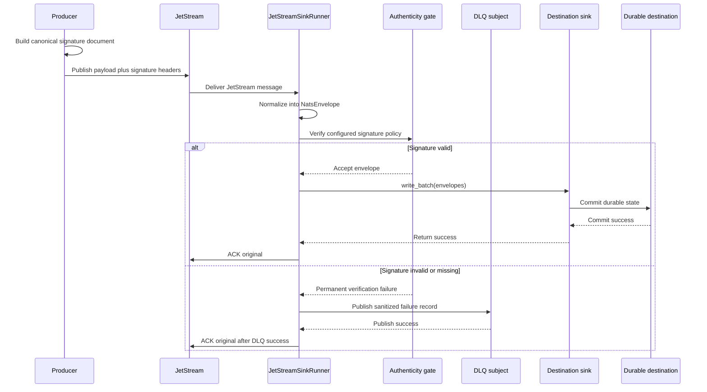

# Message Authenticity

Message authenticity verification is an optional core runtime gate that checks
whether a NATS message body and selected metadata fields were signed by an
approved producer before the message reaches any sink.

This feature is destination-neutral. Oracle, file, spool, and future sinks do
not implement their own signature checks for the normal runtime path. The core
runner verifies the message first. Only verified messages are passed to
`sink.write_batch(...)`.

The core rule still applies:

> Commit first. ACK last. Design for redelivery.

If authenticity verification rejects a message, the message is treated as a
permanent pre-sink validation failure. When a DLQ is configured, the original
JetStream message is acknowledged only after the DLQ publish succeeds. If DLQ
publication fails, the original message remains unacknowledged and eligible for
redelivery.

## What This Solves

NATS authentication, NATS authorization, and TLS are connection-level controls.
They protect access to the broker and the transport channel. They do not prove
that a particular message body was created by the expected producer, and they
do not protect against compromised internal publishers, poisoned test clients,
or messages replayed from an unexpected system.

Message authenticity adds a producer-level check:

- the producer signs a canonical representation of the payload and selected
  metadata,
- the producer sends the algorithm, key identifier, and signature as NATS
  headers,
- the nats-sinks core verifies the signature before optional payload
  encryption, custody hashing, policy checks, priority lanes, or sink writes,
- rejected messages never reach Oracle, file, spool, or future sinks.

For mission-support and sensor-driven data fabrics, this helps distinguish
broker access from event provenance. A NATS account may be allowed to publish
to a subject, but a deployment can still require signed messages before
persisting events that enter an operational evidence trail.

## What This Does Not Solve

Message authenticity is not a replacement for:

- NATS account authentication,
- NATS subject permissions,
- TLS with certificate verification,
- destination authorization,
- payload encryption,
- tamper-evident custody hashes,
- end-to-end business authorization,
- operator review of keys and producer identity.

It also does not make delivery exactly once. nats-sinks still provides
at-least-once delivery with commit-then-acknowledge processing and idempotent
sink support.

## Processing Order

Authenticity verification runs after the raw message has been normalized into a
`NatsEnvelope` and before any destination write.



## Supported Algorithms

The first implementation supports two allow-listed algorithms:

| Algorithm | Config value | Key material | Typical use |
| --- | --- | --- | --- |
| HMAC-SHA256 | `hmac-sha256` | Shared secret key, base64 encoded. | Simple controlled environments where producer and sink runtime can share a high-entropy secret. |
| Ed25519 | `ed25519` | Public verification key, base64 encoded. | Environments where producers keep private signing keys and the sink runtime should hold only public verification material. |

HMAC verification uses constant-time comparison through the Python standard
library. Ed25519 verification uses the optional `cryptography` package.

Install the crypto extra before enabling Ed25519, or before using other
features that require the same optional crypto dependency:

```bash
pip install "nats-sinks[crypto]"
```

## Required Headers

By default, producers send these NATS headers:

| Header | Default name | Description |
| --- | --- | --- |
| Algorithm | `Nats-Sinks-Authenticity-Algorithm` | Signature algorithm. Current values are `hmac-sha256` or `ed25519`. |
| Key identifier | `Nats-Sinks-Authenticity-Key-Id` | Non-secret identifier for the verification key. |
| Signature | `Nats-Sinks-Authenticity-Signature` | Base64 encoded signature bytes. |

Header names are configurable when a deployment has an existing header naming
standard. Header values are treated as untrusted input, bounded, and never
logged in full.

## Canonical Signed Document

Producers and consumers sign the same deterministic JSON document. The payload
bytes are not copied into the signed document. Instead, the document contains a
SHA-256 hash of the exact message body plus selected normalized metadata.

The canonical document shape is:

```json
{
  "algorithm": "hmac-sha256",
  "key_id": "producer-key-2026-05",
  "metadata": {
    "message_id": "example-message-id",
    "subject": "mission.sensor.track"
  },
  "payload_sha256": "8c8f0d4f8c2b1a9d4f9c7b8a1d2e3f405060708090a0b0c0d0e0f00112233445",
  "schema": "nats_sinks.message_authenticity.v1",
  "version": 1
}
```

The JSON is rendered with sorted keys, compact separators, UTF-8 encoding, and
no non-standard JSON constants. This gives producers and consumers a stable
byte sequence to sign.

The default signed metadata fields are:

- `subject`,
- `message_id`.

Optional signed metadata fields are:

- `priority`,
- `classification`,
- `labels`,
- `mission_metadata`,
- `security_labels`.

Only allow-listed field names are accepted. Do not include values that a
downstream system may legitimately rewrite before the consumer sees them.

## Basic Configuration

Enable authenticity verification with a rule that covers all consumed subjects:

```json
{
  "message_authenticity": {
    "enabled": true,
    "unmatched_subject_action": "reject",
    "rules": [
      {
        "subject": ">",
        "algorithm": "hmac-sha256",
        "key_id": "producer-key-2026-05",
        "key_b64_env": "NATS_SINKS_AUTHENTICITY_KEY_B64",
        "signed_fields": ["subject", "message_id"]
      }
    ]
  }
}
```

The direct `key_b64` field exists for throwaway tests, but production
configuration should use `key_b64_env` or deployment bootstrap logic that reads
from an approved secret store. The effective-config CLI redacts key material.

## Subject-Specific Rules

Rules are evaluated in order. The first matching subject pattern wins. This is
the same NATS wildcard model used elsewhere in the project: literal tokens
match themselves, `*` matches exactly one token, and final `>` matches
remaining tokens.

```json
{
  "message_authenticity": {
    "enabled": true,
    "unmatched_subject_action": "reject",
    "rules": [
      {
        "subject": "mission.restricted.>",
        "algorithm": "ed25519",
        "key_id": "mission-producer-ed25519-2026-05",
        "key_b64_env": "NATS_SINKS_MISSION_ED25519_PUBLIC_KEY_B64",
        "signed_fields": [
          "subject",
          "message_id",
          "priority",
          "classification",
          "labels",
          "mission_metadata"
        ]
      },
      {
        "subject": "public.telemetry.>",
        "enabled": false
      }
    ]
  }
}
```

Disabled rules are explicit exemptions. Use them sparingly and keep them near
the top of a rule set only when the exception is intentional and reviewed.

## Unmatched Subject Behavior

The secure default is:

```json
{
  "message_authenticity": {
    "unmatched_subject_action": "reject"
  }
}
```

With this setting, a message whose subject matches no authenticity rule is
rejected before sink delivery. This prevents a new subject family from being
stored without an explicit verification decision.

Development or staged migrations may use:

```json
{
  "message_authenticity": {
    "unmatched_subject_action": "allow"
  }
}
```

Use this only when the deployment has another control that explains why
unsigned subjects are acceptable.

## Producer Example For HMAC-SHA256

Python producers can use the public helper to sign the exact canonical content
that the consumer verifies.

```python
import base64
import os

from nats_sinks import NatsEnvelope, hmac_sha256_signature_b64

key = base64.b64decode(os.environ["NATS_SINKS_AUTHENTICITY_KEY_B64"])
key_id = "producer-key-2026-05"

envelope = NatsEnvelope(
    subject="mission.sensor.track",
    data=b'{"track_id":"T-1001","quality":"synthetic"}',
    headers={"Nats-Msg-Id": "example-message-id"},
    stream=None,
    consumer=None,
    stream_sequence=None,
    consumer_sequence=None,
    timestamp=None,
    message_id="example-message-id",
    redelivered=None,
    pending=None,
)

signature = hmac_sha256_signature_b64(
    envelope,
    key=key,
    key_id=key_id,
    signed_fields=("subject", "message_id"),
)

headers = {
    "Nats-Msg-Id": "example-message-id",
    "Nats-Sinks-Authenticity-Algorithm": "hmac-sha256",
    "Nats-Sinks-Authenticity-Key-Id": key_id,
    "Nats-Sinks-Authenticity-Signature": signature,
}
```

The example uses synthetic data and placeholder identifiers. Do not place live
keys, live subjects, mission identifiers, IP addresses, or service locations in
public examples.

## Failure Behavior

The runner rejects a message before sink delivery when:

- the matching rule requires verification and the algorithm header is missing,
- the algorithm header does not match the configured rule,
- the key identifier header is missing,
- the key identifier does not match the configured rule,
- the signature header is missing,
- the signature is malformed,
- the signature does not verify against the canonical document,
- the subject is unmatched while `unmatched_subject_action` is `reject`.

Failure reasons are sanitized reason codes. They do not include signature
bytes, key material, payload bytes, or full header values.

When DLQ is configured:

1. The message is normalized.
2. Authenticity verification rejects it.
3. The original message is published to the DLQ with sanitized failure context.
4. The original JetStream message is ACKed only after DLQ publication succeeds.

When DLQ publication fails, the original message is not ACKed and remains
eligible for redelivery.

## Metrics

Authenticity verification emits aggregate metrics:

| Metric suffix | Meaning |
| --- | --- |
| `message_authenticity_messages_passed_total` | Messages accepted by authenticity verification. |
| `message_authenticity_messages_rejected_total` | Messages rejected before sink delivery. |
| `message_authenticity_batches_passed_total` | Batches with at least one accepted message. |
| `message_authenticity_batches_rejected_total` | Batches with at least one rejected message. |
| `message_authenticity_evaluation_errors_total` | Unexpected evaluator failures that left messages redeliverable. |

These metrics are aggregate-only. They do not export signatures, keys,
payloads, or raw header values.

## Security Notes

Use message authenticity as one layer in a broader control set:

- keep NATS authentication and authorization enabled,
- verify TLS certificates for network transport,
- rotate signing keys with explicit key identifiers,
- keep private signing keys outside the sink runtime,
- load shared HMAC keys from runtime secret material rather than JSON files,
- use Ed25519 when the sink runtime should hold only public verification keys,
- keep signed field sets stable and documented,
- reject unmatched subjects unless a reviewed migration plan says otherwise,
- monitor DLQ counts and authenticity rejection metrics.

Do not use message authenticity to hide data. Use payload encryption for
stored-body confidentiality and destination access controls for metadata,
rows, files, and operational records.

