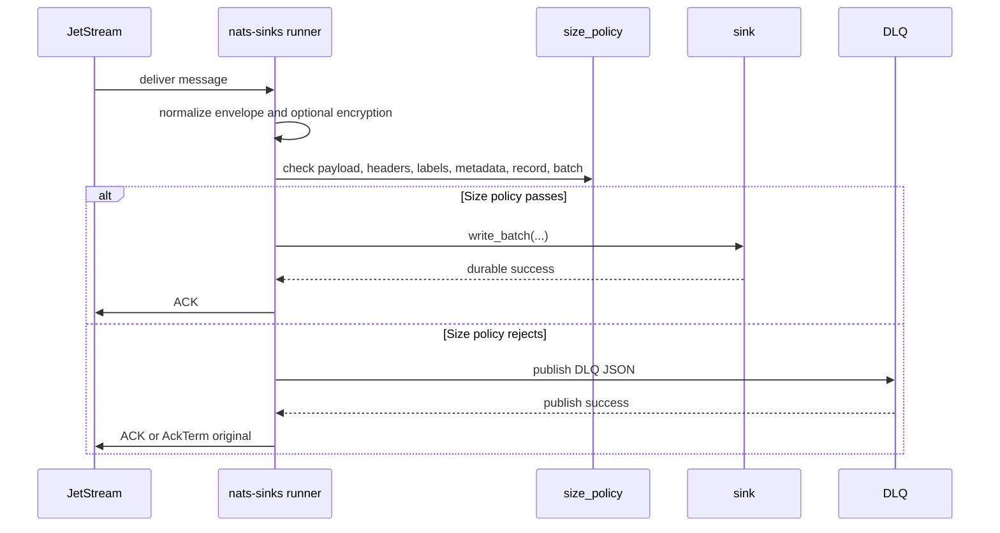

# Message Sizing

This page covers generic NATS message sizing and how nats-sinks stores subjects
and payloads.

Two values matter for most users: the subject and the payload. The subject is
the routing name that NATS uses to decide who should receive a message. The
payload is the message body. `nats-sinks` stores both, but it treats them
differently because they serve different purposes.

## NATS Subjects

NATS subjects are routing names, not payload containers. The NATS subject
documentation says there is no hard subject-size limit, but recommends keeping
subjects to a reasonable number of tokens, for example a maximum of 16 tokens
and fewer than 256 characters.

NATS server configuration also has `max_control_line`, which includes the
subject in protocol control lines. The server documentation lists a default of
4 KB.

Practical guidance:

- keep subjects short and semantic,
- put business payload in the message body,
- put small routing metadata in headers when needed,
- avoid encoding large JSON or business objects in the subject.

For mission-oriented subject designs, avoid putting sensitive unit names,
platform identifiers, operation names, or other protected context directly into
subjects unless that subject taxonomy is approved for the environment. Subjects
are routing metadata and may be visible in logs, monitoring tools, file paths,
and database metadata columns.

## NATS Payloads

Payload size is governed by NATS server `max_payload`. NATS documentation lists
1 MB as the default and allows increasing it up to 64 MB, while recommending
more conservative operational limits.

Large payload guidance:

- measure the largest legitimate payload,
- configure `max_payload` deliberately,
- test memory and latency under realistic batch sizes,
- avoid logging payloads,
- consider chunking or object storage for very large business documents.

When payloads contain operational reports, imagery references, sensor-derived
records, or encrypted mission text, treat size limits as part of the interface
contract. Producers and sink operators should agree on whether large content
belongs directly in NATS, in an object store referenced by NATS, or in a
separate domain-specific transfer path.

## nats-sinks Behavior

`NatsEnvelope.subject` is a Python string and is not truncated by the framework.
`NatsEnvelope.data` is bytes. By default, the framework preserves compatibility
and relies on NATS server/client limits plus destination-specific constraints.
Deployments that need a stricter application contract can enable the generic
`size_policy` gate.

When `size_policy.enabled` is `true`, the runner validates the sink-bound
payload and metadata after normalization and optional payload encryption, but
before any sink write. The same policy protects Oracle, file, and future sinks.
A rejected message never reaches a sink. If DLQ is configured, the message is
published to DLQ and the original JetStream message is ACKed only after DLQ
publication succeeds.



The size policy currently supports these bounds:

| Field | What It Limits |
| --- | --- |
| `max_payload_bytes` | Sink-bound payload bytes. If encryption is enabled, this is the encrypted payload envelope. |
| `max_header_count` | Number of normalized headers. |
| `max_header_name_bytes` | Largest single header name after UTF-8 encoding. |
| `max_header_value_bytes` | Largest single header value after UTF-8 encoding. |
| `max_headers_bytes` | Combined header-name and header-value bytes. |
| `max_label_count` | Number of normalized labels. |
| `max_label_bytes` | Largest single label after UTF-8 encoding. |
| `max_labels_bytes` | Combined label bytes. |
| `max_mission_metadata_bytes` | Compact JSON size of mission metadata. |
| `max_standard_metadata_bytes` | Compact JSON size of the standard nats-sinks metadata document. |
| `max_normalized_record_bytes` | Approximate payload-plus-standard-metadata size. |
| `max_batch_messages` | Number of messages accepted in one already-fetched batch. |

Example:

```json
{
  "size_policy": {
    "enabled": true,
    "max_payload_bytes": 1048576,
    "max_header_count": 32,
    "max_header_value_bytes": 2048,
    "max_headers_bytes": 16384,
    "max_label_count": 12,
    "max_label_bytes": 64,
    "max_mission_metadata_bytes": 4096,
    "max_standard_metadata_bytes": 65536,
    "max_normalized_record_bytes": 1179648,
    "max_batch_messages": 256
  }
}
```

Operators should tune these values against producer contracts, NATS
`max_payload`, `delivery.batch_size`, destination column or file-size policy,
and memory budgets. In mission-support environments, size policy is often part
of the interface control document: sensor reports, weapon-system status
events, audit observations, and encrypted payloads should have explicit
maximum sizes before they enter a persistent custody path.

Destination schemas are responsible for storing subject and payload safely.

## Destination Storage Guidance

Destination schemas should not introduce accidental subject bottlenecks. If a
relational sink stores subjects in a fixed-length character column, size that
column deliberately against your subject policy and NATS `max_control_line`.
If the backend supports a large text type, that is often a safer default for
subjects.

Payload storage depends on the sink. JSON-capable sinks should use the
standard nats-sinks payload envelope for non-JSON bodies. Binary or object
storage sinks may choose a backend-native representation, but they should
document size limits, encoding, and duplicate handling.

Oracle-specific subject and payload column guidance is documented in
[Oracle Sink](oracle-sink.md).

## References

- [NATS Subject-Based Messaging](https://docs.nats.io/nats-concepts/subjects)
- [NATS Publish-Subscribe Message Size](https://docs.nats.io/nats-concepts/core-nats/pubsub)
- [NATS Server Configuration Limits](https://docs.nats.io/running-a-nats-service/configuration)
