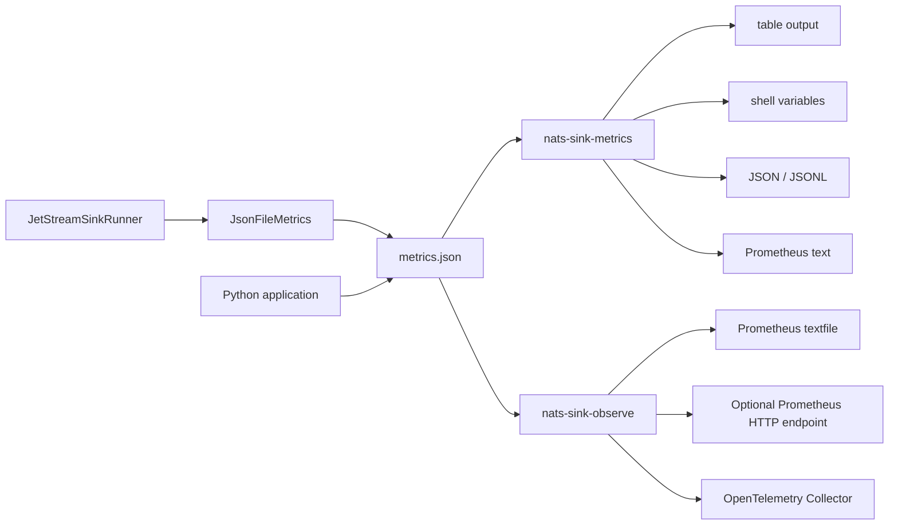

# Metrics

`nats-sinks` includes a small metrics layer for operators and developers who
need to understand how a sink process is behaving. Metrics are intentionally
destination-neutral: Oracle, file, and future sinks share the same core
counters, gauges, observations, and Python hooks.

The current release provides a dependency-free local snapshot recorder and a
standalone inspection command:

```bash
nats-sink-metrics show .local/nats-sinks/metrics.json
```

For controlled external sharing, use the separate observability CLI:

```bash
nats-sink-observe init-prometheus-policy \
  /etc/nats-sinks/config.json \
  /etc/nats-sinks/observability.prometheus.json
```

This command is separate from `nats-sink`. The `nats-sink` command runs and
manages sink processing. The `nats-sink-metrics` command reads a local JSON
metrics snapshot and renders it in human-readable or script-friendly formats.
It never connects to NATS, Oracle, the file sink directory, or any future
destination backend.

The `nats-sink-observe` command owns external sharing. It can render a
Prometheus textfile for node_exporter, run an optional native Prometheus HTTP
endpoint, or export approved metrics to an OpenTelemetry Collector through
OTLP/HTTP JSON. These connectors are disabled by default and require an
explicit allow-list policy before real metrics are shared.

## Why Metrics Matter

Reliable message movement is easier to operate when the runtime exposes what
it is doing. Metrics help answer practical questions:

- is the runner fetching messages from JetStream,
- are messages reaching the sink,
- is the sink returning durable success,
- are messages being ACKed only after durable success,
- are temporary or permanent failures increasing,
- is the DLQ being used,
- is the destination write stage getting slower,
- has the sink stopped making progress.

For defence, public-sector, and mission-support deployments, metrics are part
of the operational picture. They should show service health and throughput
without revealing sensitive payloads, credentials, private subjects, or
classified operational content.

## Architecture

The built-in snapshot path is deliberately local and simple:



The runner emits metric suffixes such as `messages_fetched_total`. A recorder
stores or exports those values. `JsonFileMetrics` writes a compact local JSON
document that the metrics CLI can read. Larger deployments can implement the
same `MetricsRecorder` protocol and send values to Prometheus, OpenTelemetry,
StatsD, or a platform-native telemetry service.

Metrics are observational only. They must never change ACK ordering, inspect
plaintext payloads, mutate envelopes, or decide whether a message is successful.

External sharing should go through the observability policy layer described in
[Observability](observability.md). The policy layer is intentionally separate
from the runner and sinks so the main delivery process and any monitoring
connector can run as different services with different permissions.

The metrics snapshot is intentionally aggregate-only today. It does not include
per-subject labels or per-subject series. Subject-aware observability has been
evaluated for future work, but it needs explicit subject-family policy,
cardinality caps, and certification tests before it can be enabled. See
[Subject-Aware Observability Evaluation](subject-aware-observability-evaluation.md).

## Enabling The Snapshot Recorder

Add `metrics.snapshot_file` to the same JSON config used by `nats-sink run`:

```json
{
  "metrics": {
    "enabled": true,
    "namespace": "nats_sinks",
    "snapshot_file": ".local/nats-sinks/metrics.json",
    "event_freshness_enabled": true,
    "event_stale_after_seconds": 300,
    "event_future_skew_tolerance_seconds": 5
  }
}
```

When `metrics.enabled` is `true` and `metrics.snapshot_file` is set, the CLI
uses `JsonFileMetrics` and keeps the snapshot updated while the sink process
runs. If metrics are disabled, or no snapshot file is configured, the CLI uses
a no-op recorder and no metrics file is written.

`JsonFileMetrics` creates parent directories when needed and writes the final
snapshot atomically with owner-readable and owner-writable permissions. This is
useful for local service scripts and systemd checks because readers should
never see a half-written JSON document.

## Snapshot Shape

A metrics snapshot is UTF-8 JSON with a small, versioned schema:

```json
{
  "schema": "nats_sinks.metrics.snapshot.v1",
  "namespace": "nats_sinks",
  "generated_at_epoch_seconds": 1779280000.0,
  "counters": {
    "messages_fetched_total": 256,
    "messages_prepared_total": 256,
    "messages_written_total": 256,
    "messages_acked_total": 256,
    "messages_terminated_total": 0,
    "sink_batches_written_total": 4
  },
  "gauges": {
    "current_batch_messages": 64,
    "last_sink_success_epoch_seconds": 1779280000.0
  },
  "observations": {
    "sink_batch_write_seconds": {
      "count": 4,
      "sum": 3.684471,
      "min": 0.812345,
      "max": 1.034210,
      "last": 0.901234
    }
  }
}
```

Observations are summarized instead of storing raw arrays. This keeps the
snapshot bounded and avoids writing unbounded timing history to disk.

The snapshot should not contain secrets or payload bodies. It can still reveal
operational tempo, failure rates, and batch sizes, so store it in a local path
with appropriate filesystem permissions.

## Event Freshness And Staleness Metrics

Event freshness metrics show how old a message was when the runner received it
and how old it was after the sink reported durable success. This is useful when
operators need to distinguish a healthy high-volume backlog replay from a
fresh operational feed, or when delayed sensor or platform telemetry must be
investigated without reading message bodies.

Freshness is resolved in this order:

1. A valid `Nats-Time-Stamp` header supplied by the publisher.
2. The JetStream server timestamp exposed by `nats-py` metadata.
3. No creation timestamp, recorded as a missing-timestamp counter.

Malformed `Nats-Time-Stamp` values are counted and then fall back to the
JetStream timestamp when one is available. Future-dated timestamps are accepted
as observations, not rejected. The runner records positive source clock skew,
clamps negative age observations to zero, and increments a future-timestamp
counter when the skew exceeds `metrics.event_future_skew_tolerance_seconds`.

The freshness metrics are:

| Metric suffix | Type | Meaning |
| --- | --- | --- |
| `event_age_at_receive_seconds` | observation | Event age when the runner received the message. |
| `event_age_at_store_seconds` | observation | Event age after the sink reported durable success. |
| `events_stale_at_receive_total` | counter | Events older than `metrics.event_stale_after_seconds` at receive time. |
| `events_stale_at_store_total` | counter | Events older than `metrics.event_stale_after_seconds` after durable sink success. |
| `event_creation_timestamp_missing_total` | counter | Messages without a usable publisher or JetStream creation timestamp. |
| `event_creation_timestamp_malformed_total` | counter | Messages with a malformed publisher timestamp header. |
| `event_creation_timestamp_future_total` | counter | Messages beyond the configured future-skew tolerance. |
| `event_source_clock_skew_seconds` | observation | Positive clock skew seconds for future-dated events. |

These metrics are observational only. They do not change ACK behavior, do not
reject stale events, and do not affect DLQ routing. The commit-then-acknowledge
rule remains unchanged: the sink must report durable success before the runner
ACKs JetStream.

Example shell inspection:

```bash
nats-sink-metrics show .local/nats-sinks/metrics.json \
  --format shell \
  --metric "event_*" \
  --metric "events_*"
```

Example output:

```text
EVENT_AGE_AT_RECEIVE_SECONDS_COUNT=256
EVENT_AGE_AT_RECEIVE_SECONDS_MAX=12.428
EVENT_AGE_AT_RECEIVE_SECONDS_SUM=972.511
EVENT_AGE_AT_STORE_SECONDS_COUNT=256
EVENTS_STALE_AT_RECEIVE_TOTAL=3
EVENTS_STALE_AT_STORE_TOTAL=4
EVENT_CREATION_TIMESTAMP_MISSING_TOTAL=0
EVENT_CREATION_TIMESTAMP_MALFORMED_TOTAL=1
EVENT_CREATION_TIMESTAMP_FUTURE_TOTAL=0
```

For Prometheus or OTLP export, keep freshness sharing explicitly allow-listed:

```json
{
  "enabled": true,
  "allowed_metric_patterns": ["event_*", "events_*"],
  "include_observations": true,
  "prometheus": {
    "enabled": true
  }
}
```

Freshness metrics intentionally do not include labels for subject, stream,
source system, sensor, table, sink name, or hostname. Those values can be
sensitive and can create unbounded cardinality. Use aggregate counters first,
then investigate individual records through approved operational tooling when a
metric indicates delayed, missing, malformed, or skewed event timestamps.

## Message Authenticity Metrics

When `message_authenticity.enabled` is true, the core runtime records aggregate
verification metrics before any sink write. These counters help operators see
whether signed traffic is flowing, whether producers are missing required
headers, and whether a signature policy is rejecting messages. They do not
export signatures, key material, payload bytes, or raw header values.

| Metric suffix | Type | Meaning |
| --- | --- | --- |
| `message_authenticity_messages_passed_total` | counter | Messages accepted by message authenticity verification. |
| `message_authenticity_messages_rejected_total` | counter | Messages rejected before sink delivery. |
| `message_authenticity_batches_passed_total` | counter | Batches with at least one accepted message. |
| `message_authenticity_batches_rejected_total` | counter | Batches with at least one rejected message. |
| `message_authenticity_evaluation_errors_total` | counter | Unexpected evaluator failures that left messages redeliverable. |

Example shell inspection:

```bash
nats-sink-metrics show .local/nats-sinks/metrics.json \
  --format shell \
  --metric "message_authenticity_*"
```

Example output:

```text
MESSAGE_AUTHENTICITY_MESSAGES_PASSED_TOTAL=250
MESSAGE_AUTHENTICITY_MESSAGES_REJECTED_TOTAL=6
MESSAGE_AUTHENTICITY_BATCHES_PASSED_TOTAL=4
MESSAGE_AUTHENTICITY_BATCHES_REJECTED_TOTAL=1
MESSAGE_AUTHENTICITY_EVALUATION_ERRORS_TOTAL=0
```

These metrics are useful in controlled mission networks because a sudden
increase in rejected signed messages can indicate a producer deployment
mistake, stale key material, replayed traffic, or an attempted injection into a
trusted event stream. Keep any external sharing behind an explicit
observability policy allow list.

## CLI Commands

The metrics CLI provides three commands:

| Command | Purpose |
| --- | --- |
| `nats-sink-metrics show SNAPSHOT` | Show all or selected metrics in table, JSON, JSONL, shell, Prometheus, or names format. |
| `nats-sink-metrics get SNAPSHOT METRIC` | Print a single metric value for shell scripts. |
| `nats-sink-metrics describe` | List the metric names emitted by the framework. |

The observability CLI provides policy and connector commands:

| Command | Purpose |
| --- | --- |
| `nats-sink-observe init-prometheus-policy CONFIG POLICY` | Generate a disabled observability policy from runtime config. |
| `nats-sink-observe validate-policy POLICY` | Validate sharing policy before enabling a connector. |
| `nats-sink-observe show-effective-policy POLICY` | Show policy JSON or a summary for review. |
| `nats-sink-observe list-metrics` | List metric names that may be added to an allow list. |
| `nats-sink-observe list-subjects POLICY` | List subject hints discovered from config without exporting them. |
| `nats-sink-observe prometheus-textfile SNAPSHOT POLICY` | Render policy-filtered Prometheus textfile output. |
| `nats-sink-observe prometheus-http SNAPSHOT POLICY` | Run or dry-run the optional native Prometheus HTTP endpoint. |
| `nats-sink-observe otlp-export SNAPSHOT POLICY` | Dry-run or send policy-approved metrics to an OpenTelemetry Collector through OTLP/HTTP JSON. |

The global version flag is available too:

```bash
nats-sink-metrics --version
```

Example output:

```text
0.3.0
```

## Table Output

The default `show` output is intended for humans:

```bash
nats-sink-metrics show .local/nats-sinks/metrics.json
```

Example output:

```text
KIND         METRIC                            VALUE  DESCRIPTION
counter      messages_acked_total                256  Messages acknowledged to JetStream after durable success or DLQ success.
counter      messages_fetched_total              256  Raw JetStream messages fetched by the pull consumer.
counter      messages_prepared_total             256  Messages converted into envelopes and transformed by core policies.
counter      messages_written_total              256  Messages reported durable by the destination sink.
counter      sink_batches_written_total            4  Batches that returned durable success from sink.write_batch.
gauge        current_batch_messages               64  Number of messages in the active batch currently being processed.
observation  sink_batch_write_seconds.count        4  Elapsed seconds spent inside sink.write_batch for successful batches.
observation  sink_batch_write_seconds.sum    3.684471  Elapsed seconds spent inside sink.write_batch for successful batches.
```

Legacy compatibility metric aliases are hidden by default. Add
`--include-legacy` if you are migrating an older local dashboard.

## Shell Output

Use shell output when a script needs to source or parse values:

```bash
nats-sink-metrics show .local/nats-sinks/metrics.json \
  --format shell \
  --kind counter \
  --metric "messages_*"
```

Example output:

```text
MESSAGES_ACKED_TOTAL=256
MESSAGES_DLQ_TOTAL=0
MESSAGES_FAILED_TOTAL=0
MESSAGES_FETCHED_TOTAL=256
MESSAGES_NACKED_TOTAL=0
MESSAGES_PREPARED_TOTAL=256
MESSAGES_TERMINATED_TOTAL=0
MESSAGES_WRITTEN_TOTAL=256
```

A simple health gate can use `get`:

```bash
failed=$(nats-sink-metrics get .local/nats-sinks/metrics.json messages_failed_total --default 0)
dlq=$(nats-sink-metrics get .local/nats-sinks/metrics.json messages_dlq_total --default 0)

if [ "$failed" -gt 0 ] || [ "$dlq" -gt 0 ]; then
  echo "nats-sinks has failed or DLQ messages"
  exit 2
fi
```

`get` exits with code `4` when the metric is missing and no `--default` value
is supplied. This makes missing metrics visible in strict scripts.

## Terminal Acknowledgement Metrics

Terminal acknowledgement metrics are emitted only when a permanent failure is
published to DLQ and `dead_letter.ack_term_after_publish` is enabled. They are
separate from normal ACK metrics because `AckTerm` means "stop redelivery after
terminal failure handling", not "the sink successfully wrote the message".

Confirmed ACK metrics are not emitted yet because the runtime does not yet
expose a confirmed ACK option. The evaluated future metrics are documented in
[Acknowledgement Confirmation Evaluation](acknowledgement-confirmation.md).
Those future metrics should remain separate from ordinary ACK counters so an
operator can distinguish "ACK sent" from "ACK confirmation received".

InProgress metrics are also not emitted yet because the runtime does not yet
send progress signals. The evaluated future metrics are documented in
[InProgress Evaluation](in-progress-evaluation.md). Those future metrics should
distinguish "work is still active" from "work is successful" so dashboards do
not accidentally treat progress as durable completion.

```bash
nats-sink-metrics show .local/nats-sinks/metrics.json --metric "*term*"
```

Example output:

```text
KIND         METRIC                       VALUE  DESCRIPTION
counter      messages_terminated_total       3  Messages terminally acknowledged to JetStream after successful DLQ publication.
counter      term_errors_total               0  Messages whose terminal acknowledgement failed after successful DLQ publication.
observation  message_term_seconds.count      1  Elapsed seconds spent sending terminal acknowledgements after DLQ publication.
```

Use these metrics together with `messages_dlq_total`. A terminal
acknowledgement without a corresponding DLQ publication would indicate a bug or
an unsafe custom integration.

## JetStream Advisory Metrics

JetStream advisory metrics are emitted only when `advisories.enabled` is true.
The observer subscribes to selected `$JS.EVENT.ADVISORY...` subjects and turns
supported advisory types into aggregate counters. It does not expose stream
names, consumer names, subjects, sequence numbers, message IDs, or advisory
payload fields as metric labels.

```bash
nats-sink-metrics show .local/nats-sinks/metrics.json --metric "jetstream_advisory*"
```

Example table output:

```text
KIND     METRIC                                             VALUE  DESCRIPTION
counter  jetstream_advisories_received_total                    4  JetStream advisory messages accepted by the optional advisory monitor.
counter  jetstream_advisory_max_deliver_total                   2  JetStream max-deliver advisories observed without exposing stream or consumer names.
counter  jetstream_advisory_terminated_total                    1  JetStream terminal-ack advisories observed without exposing stream or consumer names.
counter  jetstream_advisory_parse_errors_total                  0  JetStream advisory messages rejected by safe JSON parsing and validation.
```

These counters are operational signals only. They do not cause DLQ
publication, ACK, NAK, terminal acknowledgement, retry, or sink writes. Use
them to correlate server-side delivery conditions with sink-side counters such
as `messages_failed_total`, `messages_dlq_total`, and
`messages_nacked_total`.

For configuration and permission guidance, read
[Configuration](configuration.md#advisories) and
[NATS Least-Privilege Permissions](nats-permissions.md).

## Pre-Sink Policy Metrics

Pre-sink policy metrics are emitted only when `pre_sink_policy.enabled` is
true. They are aggregate by design. The runner does not expose subjects,
priority values, classification values, labels, mission metadata keys, message
IDs, table names, file paths, or payload fields as metric labels.

```bash
nats-sink-metrics show .local/nats-sinks/metrics.json --metric "policy_*"
```

Example table output:

```text
KIND     METRIC                            VALUE  DESCRIPTION
counter  policy_batches_passed_total          18  Batches whose messages all passed pre-sink policy evaluation.
counter  policy_batches_rejected_total         2  Batches with at least one message rejected by pre-sink policy evaluation.
counter  policy_messages_passed_total       1150  Messages accepted by pre-sink policy evaluation.
counter  policy_messages_rejected_total        3  Messages rejected by pre-sink policy evaluation before any sink write.
counter  policy_evaluation_errors_total        0  Messages affected by unexpected pre-sink policy evaluation errors.
```

Use these counters with `messages_failed_total` and `messages_dlq_total`.
A policy rejection is a permanent validation failure. The rejected message does
not reach the sink. When DLQ is enabled, the original JetStream message is
ACKed or terminally acknowledged only after DLQ publication succeeds.

For configuration details, read
[Configuration](configuration.md#pre_sink_policy).

## Size Policy Metrics

Size policy metrics are emitted only when `size_policy.enabled` is true. They
show aggregate pass and rejection counts without exporting payloads, header
values, labels, mission metadata values, subjects, table names, file paths, or
other sensitive operational detail.

```bash
nats-sink-metrics show .local/nats-sinks/metrics.json --metric "size_policy_*"
```

Example table output:

```text
KIND     METRIC                               VALUE  DESCRIPTION
counter  size_policy_batches_passed_total        24  Batches with at least one message accepted by the core size policy.
counter  size_policy_batches_rejected_total       1  Batches with at least one message rejected by the core size policy.
counter  size_policy_messages_passed_total     1536  Messages accepted by the core size policy before sink delivery.
counter  size_policy_messages_rejected_total      4  Messages rejected by the core size policy before sink delivery.
counter  size_policy_evaluation_errors_total      0  Messages left redeliverable because size-policy evaluation failed unexpectedly.
```

Use these counters with `messages_failed_total` and `messages_dlq_total`.
A size-policy rejection is a permanent validation failure. The rejected message
does not reach the sink. When DLQ is enabled, the original JetStream message is
ACKed or terminally acknowledged only after DLQ publication succeeds.

For configuration and tuning details, read
[Configuration](configuration.md#size_policy) and
[Message Sizing](message-sizing.md).

## Priority Lane Metrics

Priority lane metrics are emitted only when `delivery.priority_lanes.enabled`
is true. They are deliberately aggregate. The core does not expose subject
names, priority values, classification values, labels, message IDs, stream
sequence numbers, or payload fields as metric labels.

```bash
nats-sink-metrics show .local/nats-sinks/metrics.json --metric "priority_lane_*"
```

Example table output:

```text
KIND     METRIC                         VALUE  DESCRIPTION
counter  priority_lane_batches_total       12  Batches ordered by enabled priority-lane scheduling.
counter  priority_lane_defaulted_total     41  Messages routed to the default priority lane because priority was missing or unknown.
counter  priority_lane_messages_total     768  Messages evaluated by priority-lane scheduling without exposing subjects.
counter  priority_lane_rejected_total       0  Messages rejected because priority metadata violated the priority-lane policy.
```

The active-lane gauge shows how many configured lanes were represented in the
current scheduled batch:

```bash
nats-sink-metrics get \
  .local/nats-sinks/metrics.json \
  current_priority_lanes_active \
  --default 0
```

Priority lane metrics are useful for answering operational questions such as:

- whether priority scheduling is actually being exercised,
- whether many messages are missing priority and falling back to the default
  lane,
- whether strict priority validation is rejecting malformed or spoofed values,
- whether a mixed-priority backlog is present.

For the scheduling model and configuration details, read
[Priority-Aware Processing Lanes](priority-lanes.md).

## Oracle Duplicate And Conflict Metrics

Oracle duplicate/conflict metrics are emitted by `OracleSink` when a write path
can prove that a duplicate or conflict happened. They are intentionally
low-cardinality counters: they do not include table names, subjects, message
IDs, classification values, labels, payload text, or Oracle constraint names.

These counters are operational evidence only. They do not change
commit-then-acknowledge behavior. A safely ignored duplicate in `insert_ignore`
mode is still durable success because the idempotency key already exists in
Oracle. The core runner may ACK after `OracleSink.write_batch(...)` returns
success.

The Oracle-specific counters are:

| Metric suffix | Meaning |
| --- | --- |
| `oracle_conflicts_total` | Oracle write conflicts observed by `OracleSink`, such as `ORA-00001` duplicate-key conflicts. |
| `oracle_duplicates_total` | Rows identified as duplicate prior processing through an idempotent Oracle write path. |
| `oracle_duplicate_ignored_total` | Duplicate rows safely ignored by `insert_ignore` mode. |
| `oracle_duplicate_noop_total` | Duplicate rows safely left unchanged by `merge` with `merge_update_columns: []`. |
| `oracle_merge_rows_total` | Rows committed through Oracle `merge` mode. |
| `oracle_merge_outcome_unknown_total` | `merge` rows where Oracle did not reliably expose whether the row was inserted or matched. |

For `insert_ignore`, nats-sinks generates an Oracle `merge` that inserts only
when the idempotency key is not already present. When Oracle reports that fewer
rows were affected than attempted, the difference is counted as ignored
duplicates. If Oracle raises `ORA-00001` and the sink is in `insert_ignore`
mode, the conflict is counted and then treated as a safe duplicate success.

For `merge`, Oracle updates matching rows and inserts missing rows. The current
execution path does not reliably expose per-row "inserted versus matched"
counts across driver versions when updates are enabled, so nats-sinks records
`oracle_merge_outcome_unknown_total` instead of guessing. If `merge` is
configured with `merge_update_columns: []`, matched rows are left unchanged; in
that no-update mode a lower affected-row count can be reported as
`oracle_duplicate_noop_total` and included in `oracle_duplicates_total`.

Show Oracle duplicate and conflict counters:

```bash
nats-sink-metrics show .local/nats-sinks/metrics.json --metric "oracle_*"
```

Example table output:

```text
KIND     METRIC                           VALUE  DESCRIPTION
counter  oracle_conflicts_total               1  Oracle write conflicts observed by OracleSink, such as duplicate-key conflicts.
counter  oracle_duplicate_ignored_total       7  Oracle duplicate rows safely ignored by insert_ignore mode.
counter  oracle_duplicate_noop_total          3  Oracle duplicate rows safely left unchanged by merge mode with no update columns.
counter  oracle_duplicates_total             10  Oracle rows identified as duplicate prior processing through idempotent handling.
counter  oracle_merge_outcome_unknown_total  64  Oracle merge rows where insert-versus-match outcome is not reliably exposed.
counter  oracle_merge_rows_total             64  Oracle rows committed through merge mode.
```

Use shell output in service scripts:

```bash
nats-sink-metrics show .local/nats-sinks/metrics.json \
  --format shell \
  --metric "oracle_*"
```

Example shell output:

```text
ORACLE_CONFLICTS_TOTAL=1
ORACLE_DUPLICATE_IGNORED_TOTAL=7
ORACLE_DUPLICATE_NOOP_TOTAL=3
ORACLE_DUPLICATES_TOTAL=10
ORACLE_MERGE_OUTCOME_UNKNOWN_TOTAL=64
ORACLE_MERGE_ROWS_TOTAL=64
```

Read one value with a safe default:

```bash
duplicates=$(nats-sink-metrics get \
  .local/nats-sinks/metrics.json \
  oracle_duplicates_total \
  --default 0)

echo "Oracle duplicate rows observed: $duplicates"
```

Python applications can read the same snapshot:

```python
from nats_sinks import load_metrics_snapshot, metric_rows_from_snapshot

snapshot = load_metrics_snapshot(".local/nats-sinks/metrics.json")
rows = metric_rows_from_snapshot(snapshot)
oracle_rows = [row for row in rows if row.name.startswith("oracle_")]

for row in oracle_rows:
    print(row.name, row.value)
```

## JSON Output

Use JSON output for tools that want one structured document:

```bash
nats-sink-metrics show .local/nats-sinks/metrics.json --format json --kind counter
```

Example output:

```json
{
  "generated_at_epoch_seconds": 1779280000.0,
  "metrics": [
    {
      "description": "Raw JetStream messages fetched by the pull consumer.",
      "kind": "counter",
      "name": "messages_fetched_total",
      "stat": null,
      "value": 256.0
    }
  ],
  "namespace": "nats_sinks",
  "schema": "nats_sinks.metrics.snapshot.v1"
}
```

Use JSONL when you want one metric per line:

```bash
nats-sink-metrics show .local/nats-sinks/metrics.json \
  --format jsonl \
  --kind observation \
  --metric "sink_batch_write_seconds.*"
```

Example output:

```json
{"description": "Elapsed seconds spent inside sink.write_batch for successful batches.", "kind": "observation", "name": "sink_batch_write_seconds.count", "stat": "count", "value": 4.0}
{"description": "Elapsed seconds spent inside sink.write_batch for successful batches.", "kind": "observation", "name": "sink_batch_write_seconds.sum", "stat": "sum", "value": 3.684471}
{"description": "Elapsed seconds spent inside sink.write_batch for successful batches.", "kind": "observation", "name": "sink_batch_write_seconds.max", "stat": "max", "value": 1.03421}
```

## Prometheus Text Output

The snapshot CLI can render Prometheus text format for simple textfile
collectors:

```bash
nats-sink-metrics show .local/nats-sinks/metrics.json \
  --format prometheus \
  > /var/lib/node_exporter/textfile_collector/nats_sinks.prom
```

Example output:

```text
# HELP nats_sinks_messages_fetched_total Raw JetStream messages fetched by the pull consumer.
# TYPE nats_sinks_messages_fetched_total counter
nats_sinks_messages_fetched_total 256
# HELP nats_sinks_sink_batch_write_seconds Elapsed seconds spent inside sink.write_batch for successful batches.
# TYPE nats_sinks_sink_batch_write_seconds summary
nats_sinks_sink_batch_write_seconds_count 4
nats_sinks_sink_batch_write_seconds_sum 3.684471
```

This is a convenience format. It is not a full Prometheus exporter and does not
open an HTTP endpoint.

For service deployments, prefer the policy-controlled connector documented in
the Observability section's [Prometheus Integration](prometheus.md) sub-page:

```bash
nats-sink-observe prometheus-textfile \
  /var/lib/nats-sink/metrics.json \
  /etc/nats-sinks/observability.prometheus.json \
  --output /var/lib/node_exporter/textfile_collector/nats_sinks.prom
```

The `nats-sink-observe` path is safer for production because it defaults to no
sharing, applies allow and deny lists, supports staleness checks, and can run
as a separate Linux service.

You can override the exported namespace for Prometheus output:

```bash
nats-sink-metrics show .local/nats-sinks/metrics.json \
  --format prometheus \
  --namespace mission_ops
```

## OpenTelemetry OTLP Export

The observability CLI can also export the same policy-approved metric rows to
an OpenTelemetry Collector through OTLP/HTTP JSON:

```bash
nats-sink-observe otlp-export \
  /var/lib/nats-sink/metrics.json \
  /etc/nats-sinks/observability.prometheus.json \
  --dry-run
```

Example dry-run output:

```json
{"resourceMetrics":[{"resource":{"attributes":[{"key":"service.name","value":{"stringValue":"nats-sinks"}},{"key":"nats_sinks.namespace","value":{"stringValue":"nats_sinks"}}]},"scopeMetrics":[{"metrics":[{"description":"Raw JetStream messages fetched by the pull consumer.","name":"nats_sinks_messages_fetched_total","sum":{"aggregationTemporality":2,"dataPoints":[{"asDouble":256.0,"timeUnixNano":"1790000000000000000"}],"isMonotonic":true},"unit":"1"}],"scope":{"name":"nats-sinks.observability.otlp"}}]}]}
```

Live export remains disabled until the top-level observability policy and
`otlp.enabled` are both true. The connector uses explicit timeouts, bounded
retries, a maximum request size, and optional HTTP headers sourced from
environment variables. See [OpenTelemetry OTLP Integration](otlp.md) for the
full policy reference and service examples.

## Names And Descriptions

List metric names:

```bash
nats-sink-metrics describe --format names
```

Example output:

```text
messages_fetched_total
messages_prepared_total
messages_written_total
messages_acked_total
messages_terminated_total
messages_nacked_total
messages_failed_total
messages_dlq_total
batches_fetched_total
nats_fetch_seconds
message_mapping_seconds
sink_batches_written_total
sink_batch_write_seconds
oracle_execute_seconds
oracle_commit_seconds
message_ack_seconds
message_term_seconds
retry_backoff_delay_seconds
sink_write_errors_total
message_normalization_errors_total
payload_encryption_errors_total
dlq_publish_errors_total
ack_errors_total
term_errors_total
nats_connection_disconnected_total
nats_connection_reconnected_total
nats_connection_closed_total
nats_discovered_servers_total
nats_async_errors_total
last_sink_success_epoch_seconds
current_batch_messages
```

Use the default table form to see descriptions:

```bash
nats-sink-metrics describe
```

## Staleness Checks

Service scripts often need to know whether a process is still updating its
snapshot. `--stale-after-seconds` fails when the snapshot is older than the
provided limit:

```bash
nats-sink-metrics show .local/nats-sinks/metrics.json --stale-after-seconds 60
```

Example stale output:

```text
Metrics snapshot is stale: age=141.8s limit=60.0s
```

Exit codes:

| Exit code | Meaning |
| --- | --- |
| `0` | Command succeeded. |
| `2` | Snapshot or display validation failed. |
| `3` | Snapshot is stale and `--allow-stale` was not used. |
| `4` | `get` could not find the metric and no default was provided. |

Use `--allow-stale` when you want a warning but still want to print the
snapshot:

```bash
nats-sink-metrics show .local/nats-sinks/metrics.json \
  --stale-after-seconds 60 \
  --allow-stale
```

## Sorting And Filtering

The `show` command supports filters that are useful in shell scripts and
operations dashboards:

```bash
nats-sink-metrics show .local/nats-sinks/metrics.json --kind counter
nats-sink-metrics show .local/nats-sinks/metrics.json --metric "*error*" --metric "*failed*"
nats-sink-metrics show .local/nats-sinks/metrics.json --sort value --reverse
nats-sink-metrics show .local/nats-sinks/metrics.json --format names --kind gauge
```

`--metric` uses shell-style glob matching against flattened metric row names.
Observation rows include their statistic, for example
`sink_batch_write_seconds.count` and `sink_batch_write_seconds.sum`.

## Python Hooks

Applications can use the same metrics hooks directly:

```python
from nats_sinks import JsonFileMetrics, JetStreamSinkRunner
from nats_sinks.file import FileSink

metrics = JsonFileMetrics(".local/nats-sinks/metrics.json", namespace="nats_sinks")
sink = FileSink(directory=".local/file-sink/events")

runner = JetStreamSinkRunner(
    nats_url="nats://localhost:4222",
    stream="ORDERS",
    consumer="orders-file-sink",
    subject="orders.*",
    sink=sink,
    metrics=metrics,
)

await runner.run()
```

When embedding `OracleSink` directly, pass the same recorder to both the sink
and the runner so Oracle duplicate/conflict counters and core delivery counters
land in one snapshot:

```python
from nats_sinks import JsonFileMetrics, JetStreamSinkRunner
from nats_sinks.oracle import OracleSink

metrics = JsonFileMetrics(".local/nats-sinks/metrics.json", namespace="nats_sinks")
sink = OracleSink(
    dsn="localhost:1521/FREEPDB1",
    user="app_user",
    password_env="ORACLE_PASSWORD",
    table="NATS_SINK_EVENTS",
    mode="insert_ignore",
    metrics=metrics,
)

runner = JetStreamSinkRunner(
    nats_url="nats://localhost:4222",
    stream="ORDERS",
    consumer="orders-oracle-sink",
    subject="orders.*",
    sink=sink,
    metrics=metrics,
)

await runner.run()
```

Read a snapshot from another Python process:

```python
from nats_sinks import load_metrics_snapshot, metric_rows_from_snapshot

snapshot = load_metrics_snapshot(".local/nats-sinks/metrics.json")
rows = metric_rows_from_snapshot(snapshot)

for row in rows:
    print(row.kind, row.name, row.value)
```

Use `InMemoryMetrics` for deterministic unit tests:

```python
from nats_sinks import InMemoryMetrics, MetricNames

metrics = InMemoryMetrics()
metrics.increment(MetricNames.MESSAGES_FETCHED_TOTAL, 1)

assert metrics.counters[MetricNames.MESSAGES_FETCHED_TOTAL] == 1
```

## Security And Privacy

Metrics snapshots intentionally do not include message bodies, decrypted
payloads, passwords, tokens, private keys, Oracle connection strings, NATS
credential files, or CA certificate contents. Keep it that way when adding new
recorders or exporters.

Follow these rules:

- do not add high-cardinality labels such as message IDs or stream sequence
  values to generic metrics,
- do not emit classification values, free-form labels, subjects, or payload
  fields as unbounded metric labels,
- keep snapshot files under an operator-controlled path,
- keep snapshots out of git,
- treat stale snapshots as an operational warning,
- ensure metrics failures never cause early ACKs or skipped sink commits.

The snapshot reader validates JSON structure, rejects duplicate object keys,
requires the expected schema, bounds file size to 1 MiB, and accepts only
finite numeric metric values. Snapshot writing also rejects non-finite values
such as `NaN`, `Infinity`, and `-Infinity` so local diagnostics and Prometheus
exports always start from standards-compliant JSON. This keeps command-line
inspection predictable even when the snapshot file is damaged or replaced by an
unexpected file.

## Metric Reference

The preferred metric suffixes are:

| Metric suffix | Type | Meaning |
| --- | --- | --- |
| `messages_fetched_total` | counter | Raw JetStream messages fetched by the pull consumer. |
| `messages_prepared_total` | counter | Messages converted into envelopes and transformed by core policies. |
| `messages_written_total` | counter | Messages reported durable by the destination sink. |
| `messages_acked_total` | counter | Messages acknowledged to JetStream after durable success or DLQ success. |
| `messages_terminated_total` | counter | Messages terminally acknowledged to JetStream after successful DLQ publication. |
| `messages_nacked_total` | counter | Messages negatively acknowledged after retryable failures. |
| `messages_failed_total` | counter | Messages that entered a failure path before ACK. |
| `messages_dlq_total` | counter | Messages published to a configured dead-letter subject. |
| `batches_fetched_total` | counter | Non-empty batches fetched from JetStream. |
| `nats_fetch_seconds` | observation | Seconds spent waiting for JetStream pull fetch calls. |
| `message_mapping_seconds` | observation | Seconds spent converting raw NATS messages into internal envelopes. |
| `sink_batches_written_total` | counter | Batches that returned durable success from `sink.write_batch(...)`. |
| `sink_batch_write_seconds` | observation | Seconds spent inside `sink.write_batch(...)` for successful batches. |
| `oracle_execute_seconds` | observation | Seconds spent executing Oracle batch write statements before commit. |
| `oracle_commit_seconds` | observation | Seconds spent committing Oracle transactions. |
| `message_ack_seconds` | observation | Seconds spent ACKing JetStream messages after durable success. |
| `message_term_seconds` | observation | Seconds spent sending terminal acknowledgements after DLQ publication. |
| `retry_backoff_delay_seconds` | observation | Retry delay seconds selected before delayed NAK on retryable failures. |
| `sink_write_errors_total` | counter | Sink write failures raised before durable success. |
| `message_normalization_errors_total` | counter | Raw NATS messages that failed envelope normalization. |
| `payload_encryption_errors_total` | counter | Messages that failed core payload encryption before sink delivery. |
| `dlq_publish_errors_total` | counter | Messages whose DLQ publication failed before original ACK. |
| `ack_errors_total` | counter | Messages whose JetStream ACK failed after durable success. |
| `term_errors_total` | counter | Messages whose terminal acknowledgement failed after successful DLQ publication. |
| `policy_messages_passed_total` | counter | Messages accepted by pre-sink policy evaluation. |
| `policy_messages_rejected_total` | counter | Messages rejected by pre-sink policy evaluation before any sink write. |
| `policy_batches_passed_total` | counter | Batches whose messages all passed pre-sink policy evaluation. |
| `policy_batches_rejected_total` | counter | Batches with at least one message rejected by pre-sink policy evaluation. |
| `policy_evaluation_errors_total` | counter | Messages affected by unexpected pre-sink policy evaluation errors. |
| `size_policy_messages_passed_total` | counter | Messages accepted by the core size policy before sink delivery. |
| `size_policy_messages_rejected_total` | counter | Messages rejected by the core size policy before sink delivery. |
| `size_policy_batches_passed_total` | counter | Batches with at least one message accepted by the core size policy. |
| `size_policy_batches_rejected_total` | counter | Batches with at least one message rejected by the core size policy. |
| `size_policy_evaluation_errors_total` | counter | Messages affected by unexpected size-policy evaluation errors. |
| `event_age_at_receive_seconds` | observation | Event age in seconds when the runner received the message. |
| `event_age_at_store_seconds` | observation | Event age in seconds after the sink reported durable success. |
| `events_stale_at_receive_total` | counter | Events older than the configured stale threshold at receive time. |
| `events_stale_at_store_total` | counter | Events older than the configured stale threshold after durable sink success. |
| `event_creation_timestamp_missing_total` | counter | Messages without a usable publisher or JetStream creation timestamp. |
| `event_creation_timestamp_malformed_total` | counter | Messages with a malformed publisher creation timestamp header. |
| `event_creation_timestamp_future_total` | counter | Messages whose creation timestamp is beyond the configured future-skew tolerance. |
| `event_source_clock_skew_seconds` | observation | Positive source clock skew seconds observed for future-dated messages. |
| `nats_connection_disconnected_total` | counter | NATS client disconnect events observed by the runner. |
| `nats_connection_reconnected_total` | counter | NATS client reconnect events observed by the runner. |
| `nats_connection_closed_total` | counter | NATS client closed events observed by the runner. |
| `nats_discovered_servers_total` | counter | NATS discovered-server events observed by the runner. |
| `nats_async_errors_total` | counter | NATS asynchronous error callback events observed by the runner. |
| `jetstream_advisories_received_total` | counter | JetStream advisory messages accepted by the optional advisory monitor. |
| `jetstream_advisories_filtered_total` | counter | JetStream advisory messages ignored because they did not match allowed subjects. |
| `jetstream_advisory_parse_errors_total` | counter | JetStream advisory messages rejected by safe JSON parsing and validation. |
| `jetstream_advisory_unsupported_total` | counter | JetStream advisory messages observed with unsupported advisory kinds. |
| `jetstream_advisory_max_deliver_total` | counter | JetStream max-deliver advisories observed without exposing stream or consumer names. |
| `jetstream_advisory_nak_total` | counter | JetStream NAK advisories observed without exposing stream or consumer names. |
| `jetstream_advisory_terminated_total` | counter | JetStream terminal-ack advisories observed without exposing stream or consumer names. |
| `jetstream_advisory_stream_quorum_lost_total` | counter | JetStream stream quorum-lost advisories observed as aggregate events. |
| `jetstream_advisory_consumer_quorum_lost_total` | counter | JetStream consumer quorum-lost advisories observed as aggregate events. |
| `jetstream_advisory_stream_leader_elected_total` | counter | JetStream stream leader-election advisories observed as aggregate events. |
| `jetstream_advisory_consumer_leader_elected_total` | counter | JetStream consumer leader-election advisories observed as aggregate events. |
| `jetstream_advisory_stream_action_total` | counter | JetStream stream action advisories observed as aggregate events. |
| `jetstream_advisory_consumer_action_total` | counter | JetStream consumer action advisories observed as aggregate events. |
| `jetstream_advisory_api_audit_total` | counter | JetStream API audit advisories observed as aggregate events. |
| `priority_lane_batches_total` | counter | Batches ordered by enabled priority-lane scheduling. |
| `priority_lane_messages_total` | counter | Messages evaluated by priority-lane scheduling without exposing subjects. |
| `priority_lane_defaulted_total` | counter | Messages routed to the default priority lane because priority was missing or unknown. |
| `priority_lane_rejected_total` | counter | Messages rejected because priority metadata violated the priority-lane policy. |
| `current_priority_lanes_active` | gauge | Number of configured priority lanes represented in the active scheduled batch. |
| `oracle_conflicts_total` | counter | Oracle write conflicts observed by OracleSink, such as duplicate-key conflicts. |
| `oracle_duplicates_total` | counter | Oracle rows identified as duplicate prior processing through idempotent handling. |
| `oracle_duplicate_ignored_total` | counter | Oracle duplicate rows safely ignored by `insert_ignore` mode. |
| `oracle_duplicate_noop_total` | counter | Oracle duplicate rows safely left unchanged by `merge` mode with no update columns. |
| `oracle_merge_rows_total` | counter | Oracle rows committed through `merge` mode. |
| `oracle_merge_outcome_unknown_total` | counter | Oracle merge rows where insert-versus-match outcome is not reliably exposed. |
| `last_sink_success_epoch_seconds` | gauge | Unix epoch seconds for the latest durable sink success followed by ACK. |
| `current_batch_messages` | gauge | Number of messages in the active batch currently being processed. |

Legacy aliases remain available with `--include-legacy`:

| Legacy suffix | Preferred suffix |
| --- | --- |
| `messages_received_total` | `messages_prepared_total` |
| `batches_written_total` | `sink_batches_written_total` |
| `batch_write_seconds` | `sink_batch_write_seconds` |
| `last_success_timestamp` | `last_sink_success_epoch_seconds` |
| `current_batch_size` | `current_batch_messages` |
