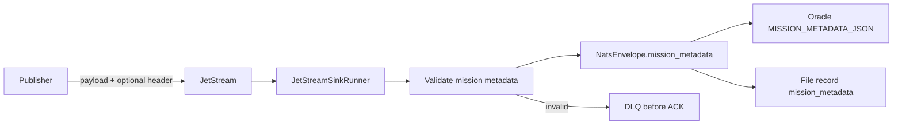
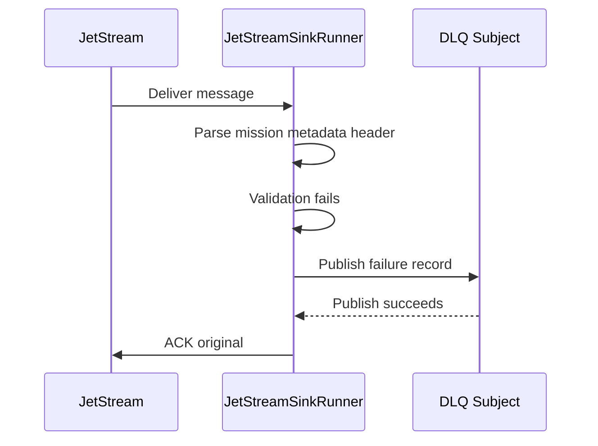

# Mission Metadata

Mission metadata is an optional core feature for carrying richer event context
beside the NATS payload. It is designed for mission-oriented deployments, but
it is not defence-only. The same mechanism can describe industrial telemetry,
critical infrastructure events, operational reporting, logistics movements,
security monitoring, or any workflow where messages need a small, validated
context object that should travel consistently to every sink.

The feature is disabled by default. When enabled, the core runtime resolves a
validated JSON object before a sink receives the message. Oracle can store the
object in a configurable JSON column, the file sink includes it in the emitted
JSON record, and future sinks should preserve the same object where their
destination contract supports structured metadata.



## Why It Exists

Fixed columns are useful for stable framework-wide metadata such as
`priority`, `classification`, and `labels`. They become a poor fit when each
deployment wants different context fields: mission identifiers, operation
identifiers, platform IDs, source-system IDs, track IDs, correlation IDs,
confidence values, releasability markers, domain labels, or use-case-specific
phase markers such as F2T2EA.

Mission metadata solves that by providing one generic JSON object:

- the core validates it once,
- every sink sees the same normalized object,
- Oracle stores it as one JSON value instead of many fixed columns,
- file sink records include the same object,
- invalid metadata follows normal permanent-failure handling.

## Configuration

Mission metadata is configured at the top level of the JSON config file:

```json
{
  "mission_metadata": {
    "enabled": true,
    "header": "Nats-Sinks-Mission-Metadata",
    "max_bytes": 8192,
    "allowed_profiles": ["mission-event-v1"],
    "default": {
      "profile": "mission-event-v1",
      "profile_version": 1,
      "origin_domain": "operations"
    },
    "rules": [
      {
        "subject": "mission.synthetic.>",
        "metadata": {
          "profile": "mission-event-v1",
          "profile_version": 1,
          "origin_domain": "synthetic-test",
          "source_system": "local-harness"
        }
      }
    ]
  }
}
```

| Field | Required | Default | Valid values | Description |
| --- | --- | --- | --- | --- |
| `enabled` | no | `false` | `true` or `false` | Turns mission metadata parsing on. Disabled runners ignore the configured header. |
| `header` | no | `Nats-Sinks-Mission-Metadata` | Non-empty header name without control characters. | Header containing a JSON object supplied by the publisher. |
| `max_bytes` | no | `8192` | Integer from `1` to `262144`. | Maximum canonical JSON size accepted for one metadata object. |
| `allowed_profiles` | no | `[]` | List of non-empty strings. | Optional allow-list. When set, metadata must contain a `profile` value from this list. |
| `default` | no | `null` | JSON object or `null`. | Global metadata object used when the header is absent and no subject rule matches. |
| `rules` | no | `[]` | Ordered list of subject rules. | Subject-aware defaults. First matching rule wins when the header is absent. |

Rule fields:

| Field | Required | Default | Valid values | Description |
| --- | --- | --- | --- | --- |
| `subject` | yes | none | NATS subject pattern, for example `mission.*` or `mission.>`. | Pattern matched against the message subject. |
| `metadata` | yes | none | JSON object or `null`. | Metadata default for matching subjects. `null` explicitly clears the global default. |

## Publisher Header Example

Publishers can provide mission metadata directly through the configured header:

```bash
nats pub mission.synthetic.sensor.track.0001 '{"event_id":"SYN-0001"}' \
  -H 'Nats-Sinks-Mission-Metadata: {"profile":"mission-event-v1","profile_version":1,"mission_id":"SYN-MISSION-001","f2t2ea_phase":"track","source_system":"synthetic-sensor"}'
```

Header values are authoritative. If the header is present and empty, the
message receives no mission metadata even when defaults are configured. This
allows publishers to explicitly say that no mission context applies.

## Validation Rules

Mission metadata is treated as untrusted input:

- the root value must be a JSON object,
- duplicate JSON keys are rejected,
- non-standard JSON constants such as `NaN`, `Infinity`, and `-Infinity` are
  rejected at the parser boundary,
- object keys must start with a letter and contain only letters, numbers,
  underscores, dots, colons, or hyphens,
- secret-looking key names such as `password`, `token`, `secret`,
  `private_key`, `credential`, or `key_material` are rejected,
- strings, arrays, objects, nesting depth, integer range, and total serialized
  size are bounded,
- control characters in keys and strings are rejected,
- non-finite numbers are rejected,
- configured `allowed_profiles` fail closed.

Malformed mission metadata is a permanent validation failure. If a DLQ is
configured, the runner publishes the message to the DLQ and ACKs the original
only after DLQ publication succeeds. If DLQ publication fails, the original is
not ACKed and remains eligible for redelivery.



## Oracle Storage

Oracle stores mission metadata in the `MISSION_METADATA_JSON` column by default.
The column name is configurable through `sink.columns.mission_metadata`.

Recommended column:

```sql
mission_metadata_json json
```

Example row value:

```json
{
  "profile": "mission-event-v1",
  "profile_version": 1,
  "mission_id": "SYN-MISSION-001",
  "operation_id": "SYN-OP-ALPHA",
  "f2t2ea_phase": "track",
  "source_system": "synthetic-sensor",
  "source_confidence": 0.91,
  "releasability": ["NATO", "mission-partner"]
}
```

The generic `METADATA_JSON` document also includes the same object under its
`mission_metadata` field so operators can inspect one complete framework
metadata snapshot.

## File Sink Output

The file sink writes mission metadata as a top-level field in each output
record:

```json
{
  "schema": "nats_sinks.file.message.v1",
  "subject": "mission.synthetic.sensor.track.0001",
  "priority": "immediate",
  "classification": "NATO SECRET",
  "labels": "synthetic;mission-test;f2t2ea-example",
  "labels_list": ["synthetic", "mission-test", "f2t2ea-example"],
  "mission_metadata": {
    "profile": "mission-event-v1",
    "profile_version": 1,
    "mission_id": "SYN-MISSION-001",
    "f2t2ea_phase": "track"
  },
  "payload": {
    "event_id": "SYN-0001"
  }
}
```

When mission metadata is absent, the file sink writes JSON `null` in the
top-level `mission_metadata` field and under `metadata.mission_metadata`.

## Relationship To Priority, Classification, And Labels

Mission metadata does not replace `priority`, `classification`, or `labels`.
Those fields remain small, stable, framework-wide fields with dedicated storage
in Oracle and file sink output. Mission metadata is for richer context that may
vary between deployments or use-case families.

Recommended split:

| Need | Use |
| --- | --- |
| Routing urgency, queue attention, operator priority | `message_metadata.priority` |
| Information marking such as `NATO SECRET` or `internal` | `message_metadata.classification` |
| Small searchable tags | `message_metadata.labels` |
| Mission, operation, platform, sensor, track, confidence, releasability, or phase context | `mission_metadata` |

## Defence Use Cases

The defence examples in this repository use mission metadata for synthetic,
metadata-only lifecycle tagging. See
[F2T2EA Event Phase Tagging](use-cases/defence/f2t2ea-event-phase-tagging.md)
for a detailed blueprint.

The feature is not a targeting system, fire-control system, weapons-release
mechanism, rules-of-engagement engine, or autonomous decision layer. It is a
data custody mechanism for preserving event context with clear validation,
storage, and redelivery semantics.
