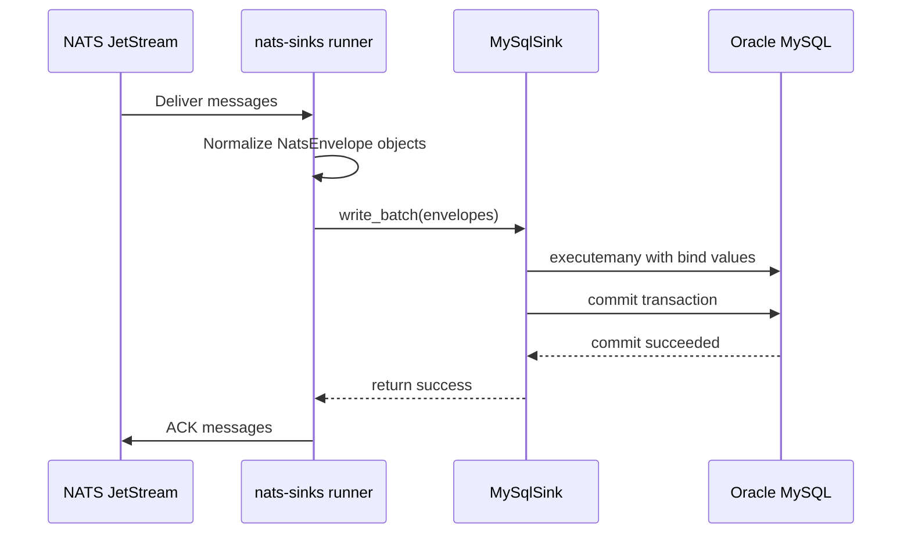

# Oracle MySQL Sink

The Oracle MySQL sink writes normalized NATS JetStream messages into Oracle
MySQL tables. It is a first-party sink beside the Oracle Database, file, and
edge spool sinks, and it follows the same safety rule: the core runner ACKs a
JetStream message only after the sink has reported durable success.

For Oracle MySQL, durable success means the batch write completed and the
Oracle MySQL transaction committed. If the write or commit fails, the sink
raises a framework error and the core runner leaves the source message eligible
for redelivery or DLQ handling according to the configured delivery policy.

The public import path is:

```python
from nats_sinks.mysql import MySqlSink
```

Install the optional Oracle MySQL dependency when you use this sink:

```bash
python -m pip install "nats-sinks[mysql]"
```

## When To Use It

Use the Oracle MySQL sink when a JetStream stream should be persisted into an
Oracle MySQL database or Oracle MySQL HeatWave deployment using relational
tables, JSON columns, transaction commits, and idempotent writes.

Good fits include:

- operational event custody where Oracle MySQL is the approved relational
  destination;
- mission-support event stores that need priority, classification, labels,
  mission metadata, and security label profile columns;
- local or containerized Oracle MySQL development for sink certification;
- deployments that want Oracle-family sink behavior without using Oracle
  Database.

The sink does not provide exactly-once delivery. It provides at-least-once
delivery with idempotent write modes. Redelivery can happen after worker
restarts, NATS reconnects, database outages, commit failures, or DLQ failures.
Configure an idempotency key and a compatible database constraint so duplicate
processing is safe.

## Runtime Flow



## Minimal Configuration

```json
{
  "nats": {
    "url": "nats://localhost:4222",
    "stream": "ORDERS",
    "consumer": "mysql-orders-sink",
    "subject": "orders.*"
  },
  "sink": {
    "type": "mysql",
    "host": "127.0.0.1",
    "port": 3306,
    "database": "nats_sinks",
    "user": "nats_sinks_app",
    "password_env": "NATS_SINKS_MYSQL_PASSWORD",
    "table": "NATS_SINK_EVENTS",
    "mode": "upsert",
    "auto_create": false
  }
}
```

Production deployments should normally keep `auto_create` disabled and manage
tables through migrations or DBA-controlled change processes. Enable
`auto_create` only for local tests, disposable environments, or tightly
controlled first-run setup.

## Configuration Reference

| Field | Required | Default | Valid values | Description |
| --- | --- | --- | --- | --- |
| `type` | yes | `mysql` | `mysql` | Selects the Oracle MySQL sink. |
| `host` | no | `127.0.0.1` | Non-empty hostname or IP literal. | Oracle MySQL server host. Do not place credentials in this field. |
| `port` | no | `3306` | `1` to `65535`. | Oracle MySQL TCP port. |
| `database` | yes | none | Non-empty database name. | Database/schema used for sink tables. |
| `user` | yes | none | Non-empty user name. | Runtime database account. Use least privilege. |
| `password` | no | none | String. | Inline password for tests only. Prefer `password_env`. |
| `password_env` | no | none | Environment variable name. | Runtime environment variable that contains the password. Required when `password` is not set. |
| `connection_timeout` | no | `10.0` | Positive seconds. | Timeout passed to Oracle MySQL Connector/Python. |
| `ssl_ca` | no | none | Local file path. | CA certificate used to verify Oracle MySQL TLS certificates, including self-signed lab CAs. |
| `ssl_cert` | no | none | Local file path. | Optional client certificate for mutual TLS. Requires `ssl_key`. |
| `ssl_key` | no | none | Local file path. | Optional client private key for mutual TLS. Requires `ssl_cert`. |
| `ssl_verify_identity` | no | `true` | `true` or `false`. | Enables hostname identity verification when TLS trust material is configured. Keep enabled in production. |
| `ssl_disabled` | no | `false` | `true` or `false`. | Disables Oracle MySQL TLS options. Cannot be combined with certificate fields. |
| `table` | no | `NATS_SINK_EVENTS` | Strict Oracle MySQL identifier or `database.table`. | Default destination table. |
| `table_routes` | no | `[]` | List of route objects. | Optional subject-to-table routing rules. First match wins. |
| `mode` | no | `upsert` | `upsert`, `insert_ignore`, `insert`, `append`. | Write mode. Prefer `upsert` or `insert_ignore` for idempotency. |
| `upsert_update_columns` | no | `null` | `null`, `[]`, or list of mapped column names. | Controls which non-key columns are updated when an `upsert` sees an existing key. `null` updates all non-key columns. `[]` leaves existing rows unchanged. |
| `auto_create` | no | `false` | `true` or `false`. | Creates recommended tables at startup when explicitly enabled. |
| `payload_mode` | no | `json_or_envelope` | `json_or_envelope`, `json_only`, `text_envelope`, `bytes_envelope`. | Controls how message bodies are normalized before storage in JSON columns. |
| `payload_column` | no | none | Strict identifier. | Legacy shortcut for overriding `columns.payload`. |
| `headers_column` | no | none | Strict identifier. | Legacy shortcut for overriding `columns.headers`. |
| `columns` | no | Default mapping. | Column mapping object. | Maps normalized row fields to Oracle MySQL columns. |
| `idempotency` | no | Stream sequence. | Idempotency object. | Defines duplicate-detection strategy and key columns. |
| `pool_name` | no | Driver generated. | String accepted by connector. | Optional Oracle MySQL Connector/Python pool name. |
| `pool_size` | no | `4` | `1` to `32`. | Connection pool size. |

## Write Modes

| Mode | SQL Pattern | Idempotent By Default | Notes |
| --- | --- | --- | --- |
| `upsert` | `INSERT ... ON DUPLICATE KEY UPDATE ...` | Yes, when key columns are constrained. | Recommended default. Can update all non-key columns, selected columns, or no columns. |
| `insert_ignore` | `INSERT IGNORE ...` | Yes, when key columns are constrained. | Treats duplicates as prior success. Useful when stored rows must not change after first commit. |
| `insert` | `INSERT ...` | No. | Duplicate keys become permanent errors unless handled by DLQ. |
| `append` | `INSERT ...` | No. | Available for append-only tables. Redelivery can create duplicate rows unless schema or downstream logic handles it. |

`upsert_update_columns` is meaningful only with `mode: "upsert"`:

```json
{
  "sink": {
    "type": "mysql",
    "mode": "upsert",
    "upsert_update_columns": ["PAYLOAD_JSON", "METADATA_JSON"]
  }
}
```

Use an empty list to make duplicate redelivery a no-op:

```json
{
  "sink": {
    "type": "mysql",
    "mode": "upsert",
    "upsert_update_columns": []
  }
}
```

## Idempotency

The default idempotency strategy uses JetStream stream name and stream
sequence:

```json
{
  "sink": {
    "type": "mysql",
    "idempotency": {
      "strategy": "stream_sequence",
      "columns": ["STREAM_NAME", "STREAM_SEQUENCE"]
    }
  }
}
```

Other strategies are available when publishers provide stable identifiers:

```json
{
  "sink": {
    "type": "mysql",
    "idempotency": {
      "strategy": "message_id",
      "columns": ["MESSAGE_ID"]
    }
  }
}
```

```json
{
  "sink": {
    "type": "mysql",
    "idempotency": {
      "strategy": "payload_field",
      "payload_field": "event_id",
      "columns": ["MESSAGE_ID"]
    }
  }
}
```

For `upsert` and `insert_ignore`, the configured key columns must have a
primary key or unique constraint in Oracle MySQL. Without that constraint,
Oracle MySQL has no duplicate boundary to enforce.

## Subject-To-Table Routing

One Oracle MySQL sink can write different subject families to different
tables. Routes use NATS subject patterns where `*` matches one token and `>`
matches the remaining tokens as the final token.

```json
{
  "sink": {
    "type": "mysql",
    "host": "127.0.0.1",
    "database": "nats_sinks",
    "user": "nats_sinks_app",
    "password_env": "NATS_SINKS_MYSQL_PASSWORD",
    "table": "NATS_SINK_EVENTS",
    "table_routes": [
      {
        "subject": "ops.restricted.>",
        "table": "NATS_SINK_RESTRICTED_EVENTS",
        "upsert_update_columns": []
      }
    ]
  }
}
```

Route-specific idempotency can also be configured:

```json
{
  "subject": "ops.business-keyed.>",
  "table": "NATS_SINK_BUSINESS_EVENTS",
  "idempotency": {
    "strategy": "payload_field",
    "payload_field": "event_id",
    "columns": ["MESSAGE_ID"]
  }
}
```

Routes that point to the same table must not disagree about idempotency or
upsert update behavior. The sink rejects conflicting policies during
configuration validation so duplicate handling remains predictable.

## Recommended Table

The recommended default table shape is:

```sql
create table if not exists `NATS_SINK_EVENTS` (
    `STREAM_NAME` varchar(255) not null,
    `STREAM_SEQUENCE` bigint not null,
    `SUBJECT` text not null,
    `MESSAGE_ID` varchar(512),
    `PRIORITY` text,
    `CLASSIFICATION` text,
    `LABELS` text,
    `RECEIVED_AT` timestamp(6) not null default current_timestamp(6),
    `MESSAGE_CREATED_AT_EPOCH_NS` bigint,
    `JETSTREAM_TIMESTAMP_EPOCH_NS` bigint,
    `RECEIVED_AT_EPOCH_NS` bigint not null,
    `STORED_AT_EPOCH_NS` bigint not null,
    `PAYLOAD_JSON` json,
    `HEADERS_JSON` json,
    `METADATA_JSON` json,
    `MISSION_METADATA_JSON` json,
    `SECURITY_LABELS_JSON` json,
    constraint `NATS_SINK_EVENTS_pk` primary key (`STREAM_NAME`, `STREAM_SEQUENCE`)
)
```

The table stores:

- the JetStream stream and sequence used by the default idempotency key;
- the original subject;
- optional NATS message ID;
- normalized `priority`, `classification`, and semicolon-separated `labels`;
- nanosecond epoch timestamps for creation, JetStream time, receive time, and
  store time;
- normalized payload JSON;
- headers JSON;
- full metadata JSON;
- optional mission metadata JSON;
- optional security label profile JSON.

## Payload Storage

Oracle MySQL JSON columns receive the same normalized payload contract used by
Oracle Database and the file sink.

Valid JSON is stored as JSON:

```json
{"event_id":"EVT-1001","status":"accepted"}
```

Non-JSON text is wrapped:

```json
{
  "_nats_sinks": {
    "payload_encoding": "utf-8",
    "payload_format": "text",
    "schema": "nats_sinks.payload_envelope.v1",
    "size_bytes": 28
  },
  "payload": "encrypted-text:v1:ciphertext"
}
```

Empty payloads are also valid and are stored as a JSON envelope with
`size_bytes: 0`. This matters for encrypted or opaque payloads where the sink
cannot know whether decrypted content will later be JSON.

## Example Stored Row

With payload encryption enabled in the core and message metadata supplied by
headers or defaults, a stored row may look like this:

| Column | Example Value |
| --- | --- |
| `STREAM_NAME` | `OPS` |
| `STREAM_SEQUENCE` | `1024` |
| `SUBJECT` | `ops.restricted.sensor` |
| `MESSAGE_ID` | `event-1024` |
| `PRIORITY` | `urgent` |
| `CLASSIFICATION` | `NATO SECRET` |
| `LABELS` | `sensor;mission-thread-alpha` |
| `PAYLOAD_JSON` | `{"_nats_sinks_encryption":{"algorithm":"aes-256-gcm","key_id":"runtime-key-v1",...},"ciphertext_b64":"..."}` |
| `MISSION_METADATA_JSON` | `{"profile":"mission-event-v1","f2t2ea_phase":"track","mission_id":"SYN-MISSION-001"}` |
| `SECURITY_LABELS_JSON` | `{"profile":"nats-sinks-security-labels-v1","releasability":["NATO"],"policy_id":"example-policy"}` |

The encrypted payload body stays encrypted in Oracle MySQL. Metadata remains
available for routing, audit, lineage, and retention decisions according to
local policy.

## TLS

Use `ssl_ca` when Oracle MySQL uses a private or self-signed CA:

```json
{
  "sink": {
    "type": "mysql",
    "host": "oracle-mysql.example.internal",
    "port": 3306,
    "database": "nats_sinks",
    "user": "nats_sinks_app",
    "password_env": "NATS_SINKS_MYSQL_PASSWORD",
    "ssl_ca": "/etc/nats-sinks/mysql/ca.pem",
    "ssl_verify_identity": true
  }
}
```

Mutual TLS can also provide a client certificate and key:

```json
{
  "sink": {
    "type": "mysql",
    "host": "oracle-mysql.example.internal",
    "database": "nats_sinks",
    "user": "nats_sinks_app",
    "password_env": "NATS_SINKS_MYSQL_PASSWORD",
    "ssl_ca": "/etc/nats-sinks/mysql/ca.pem",
    "ssl_cert": "/etc/nats-sinks/mysql/client-cert.pem",
    "ssl_key": "/etc/nats-sinks/mysql/client-key.pem"
  }
}
```

Keep `ssl_verify_identity` enabled in production. Disable TLS checks only in
isolated local test environments where the risk is understood and documented.

## Least-Privilege Account

Create a dedicated Oracle MySQL account for the sink. The runtime user should
not have administrative privileges, global privileges, or destructive DDL
rights in production.

Example for a pre-created table:

```sql
create database if not exists nats_sinks;

create user if not exists 'nats_sinks_app'@'%' identified by 'replace-at-runtime';

grant select, insert, update
on nats_sinks.NATS_SINK_EVENTS
to 'nats_sinks_app'@'%';
```

For a controlled bootstrap environment with `auto_create: true`, grant only the
minimum table creation privilege for the target database and remove it after
tables are created:

```sql
grant create, select, insert, update
on nats_sinks.*
to 'nats_sinks_app'@'%';
```

Do not grant `drop`, `delete`, `alter`, `grant option`, or server
administration privileges to the runtime sink account unless a separate
reviewed operational process requires it.

## Local Container E2E Test

A tracked starter configuration is available at
`examples/oracle-mysql-basic/config.json`. Validate it with:

```bash
export ORACLE_MYSQL_PASSWORD=example
nats-sink validate examples/oracle-mysql-basic/config.json
```

The repository includes a short-lived Oracle MySQL test database container
based on Oracle Linux 9 slim. Use it to run the sink e2e test without keeping
long-lived local database credentials:

```bash
python scripts/run-mysql-sink-e2e.py
```

Expected sanitized output:

```text
Oracle MySQL sink container e2e test passed.
```

The runner:

1. Builds the local Oracle MySQL test image.
2. Generates fresh root and application passwords.
3. Starts a new loopback-only container on a random port.
4. Runs `tests/integration/test_mysql_sink.py`.
5. Verifies routed writes, metadata persistence, non-JSON payload wrapping,
   empty payload handling, no-op duplicate redelivery, and Oracle MySQL
   duplicate metrics.
6. Removes the container, volume, and generated secret files by default.

Keep artifacts only for local diagnosis:

```bash
python scripts/run-mysql-sink-e2e.py --preserve-artifacts
```

Preserved artifacts live under `.local/` and should be removed after
inspection.

## Troubleshooting

| Symptom | Likely Cause | Guidance |
| --- | --- | --- |
| `install nats-sinks[mysql] to use MySqlSink` | Optional driver is not installed. | Install the `mysql` extra in the runtime environment. |
| Authentication failed | Wrong user, password environment variable, database, or TLS settings. | Verify secret injection and grants. Do not print passwords in logs. |
| Table is not available | Missing table, wrong database, or missing privileges. | Create the table through migrations or enable `auto_create` for controlled tests. |
| Unknown column or invalid JSON | Table shape does not match the configured column mapping. | Recreate or migrate the table to the recommended DDL. |
| Duplicate key with `insert` or `append` | Redelivery hit an existing key. | Use `upsert` or `insert_ignore` for idempotent production flows. |

## Security Notes

- Treat every message payload, subject, and header as untrusted input.
- Keep passwords out of JSON files by using `password_env`.
- Keep TLS verification enabled for production deployments.
- Avoid logging payloads, headers, local certificate paths, or generated test
  credentials.
- Use strict database grants and separate migration identities from runtime
  sink identities.
- Keep table and column names allow-listed. The sink validates identifiers and
  uses bind parameters for values.
