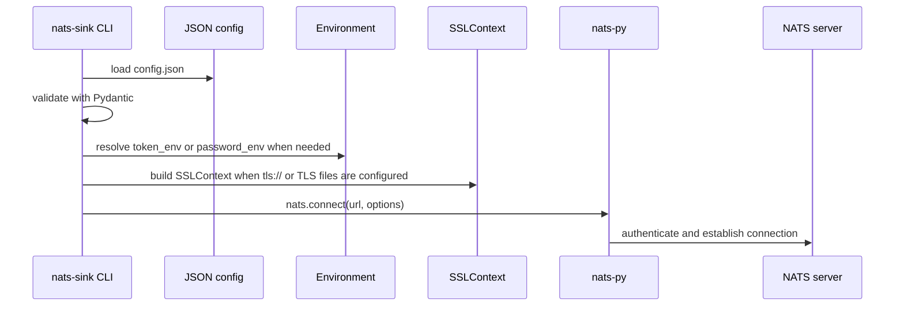
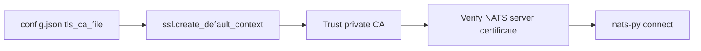
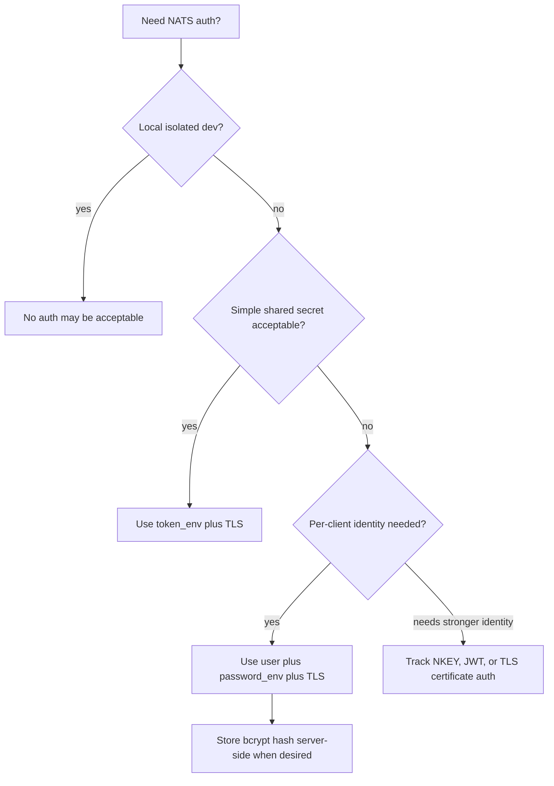

# NATS Connections And Authentication

This page documents how `nats-sinks` connects to a NATS server and how current
authentication settings are represented in JSON configuration.

The implementation uses `nats-py` connection options under the hood. The CLI
loads JSON, redacts secrets for display, resolves secret environment variables
only when opening a connection, then passes the resulting options to
`nats.connect`.

In controlled mission and defence networks, connection policy is often as
important as application code. Keep NATS authentication, TLS trust, account
layout, and subject permissions aligned with the classification and operational
domains carried by the stream.

## Supported In This Release

The current release supports these production-use connection patterns:

- unauthenticated local development connections,
- token authentication with `token` or `token_env`,
- plain username/password authentication with `user` and `password` or
  `password_env`,
- server-side bcrypted username/password credentials, using the same client
  configuration as plain username/password,
- TLS server verification with a local CA file, including private or
  self-signed NATS server CAs,
- optional TLS client certificate/key transport settings passed through to
  `nats-py`.

Advanced identity models such as TLS certificate authentication policy, NKEY
challenge authentication, and decentralized JWT authentication/authorization are
tracked on the roadmap for deeper certification and documentation.

## Connection Flow



The resolved token or password is never included in redacted config output. If
the required environment variable is missing, startup fails before the runner
begins consuming messages.

## Local Development Without Authentication

For local-only development:

```json
{
  "nats": {
    "url": "nats://localhost:4222",
    "stream": "ORDERS",
    "consumer": "oracle-orders-sink",
    "subject": "orders.*"
  }
}
```

This is appropriate for a developer machine or isolated test environment. It is
not recommended for production.

## Token Authentication

Token authentication uses a single shared secret. Prefer `token_env` so the
secret is injected by the service manager, container platform, or secret store.

```json
{
  "nats": {
    "url": "tls://nats.example.com:4222",
    "stream": "ORDERS",
    "consumer": "oracle-orders-sink",
    "subject": "orders.*",
    "token_env": "NATS_TOKEN",
    "tls_ca_file": "/etc/nats/certs/ca.crt"
  }
}
```

Then configure the environment:

```bash
export NATS_TOKEN='example-client-token'
```

Direct `token` values are supported for tests and disposable local examples, but
should not be committed to repository files.

## Plain Username/Password Authentication

Plain username/password authentication uses `user` plus either `password_env` or
`password`.

```json
{
  "nats": {
    "url": "tls://nats.example.com:4222",
    "stream": "ORDERS",
    "consumer": "oracle-orders-sink",
    "subject": "orders.*",
    "user": "orders_sink",
    "password_env": "NATS_PASSWORD",
    "tls_ca_file": "/etc/nats/certs/ca.crt"
  }
}
```

Then configure the environment:

```bash
export NATS_PASSWORD='example-client-password'
```

Use TLS for username/password authentication in production. Without TLS, the
client credential can be exposed to the network path.

## Bcrypted Username/Password Credentials

NATS can store bcrypted passwords in the server configuration. This protects the
server-side configuration file from storing clear-text passwords.

The client configuration is unchanged: `nats-sinks` still sends the clear-text
client password to the server, and the server verifies it against the bcrypt
hash.

```json
{
  "nats": {
    "url": "tls://nats.example.com:4222",
    "stream": "ORDERS",
    "consumer": "oracle-orders-sink",
    "subject": "orders.*",
    "user": "orders_sink",
    "password_env": "NATS_PASSWORD",
    "tls_ca_file": "/etc/nats/certs/ca.crt"
  }
}
```

A server-side configuration might contain a bcrypt hash similar to:

```text
authorization {
  users = [
    {
      user: "orders_sink"
      password: "$2a$11$..."
    }
  ]
}
```

Do not put the bcrypt hash in the `nats-sinks` client config. The hash belongs
on the NATS server. The client receives the clear-text password through
`NATS_PASSWORD`, and TLS protects that secret in transit.

## TLS With A Local CA Certificate

Private NATS deployments often use a private CA or self-signed development CA.
Configure `tls_ca_file` with the local CA certificate and use a `tls://` URL:

```json
{
  "nats": {
    "url": "tls://nats.internal.example:4222",
    "stream": "ORDERS",
    "consumer": "oracle-orders-sink",
    "subject": "orders.*",
    "token_env": "NATS_TOKEN",
    "tls_ca_file": "/etc/nats/certs/root-ca.crt",
    "tls_verify": true
  }
}
```

The CLI builds an `ssl.SSLContext` with that CA file:



Keep `tls_verify` set to `true` in production. Setting `tls_verify` to `false`
disables hostname and certificate verification and should be limited to
short-lived local development experiments.

For private mission networks, prefer importing the relevant CA certificate into
the service configuration over weakening TLS verification. A local CA is a
normal pattern for internal infrastructure; disabling verification should not
become the workaround for certificate lifecycle issues.

## Optional Client Certificate Files

The config model includes:

```json
{
  "nats": {
    "tls_cert_file": "/etc/nats/certs/client.crt",
    "tls_key_file": "/etc/nats/private/client.key"
  }
}
```

When present, the CLI loads the certificate chain into the Python SSL context
and passes it to `nats-py`. Full TLS certificate identity mapping and
authorization guidance is not yet certified as a `nats-sinks` production auth
mode; it is tracked on the roadmap.

## Secret Redaction

`nats-sink show-effective-config` redacts:

- `password`,
- `password_env`,
- `token`,
- `token_env`,
- `credentials`,
- `creds`,
- URLs containing embedded credentials.

Prefer this pattern for services:

```text
/etc/nats-sinks/config.json       non-secret runtime config
/etc/nats-sinks/nats-sink.env     secret environment variables
```

## Authentication Decision Guide



## Current Field Reference

| Field | Purpose | Secret? | Recommendation |
| --- | --- | --- | --- |
| `nats.url` | NATS server URL. Use `tls://` for TLS. | Sometimes | Do not embed credentials in URLs. |
| `nats.user` | Username for username/password auth. | Usually no | Use with `password_env`. |
| `nats.password` | Direct client password. | Yes | Avoid outside disposable local tests. |
| `nats.password_env` | Environment variable containing the client password. | Env var name only | Preferred for username/password auth. |
| `nats.token` | Direct client token. | Yes | Avoid outside disposable local tests. |
| `nats.token_env` | Environment variable containing the client token. | Env var name only | Preferred for token auth. |
| `nats.tls_ca_file` | Local CA certificate used to verify the NATS server. | No | Use for private or self-signed CAs. |
| `nats.tls_verify` | Enables certificate and hostname verification. | No | Keep `true` in production. |
| `nats.tls_cert_file` | Optional client certificate chain. | No, but sensitive operationally | Roadmap for certified cert auth. |
| `nats.tls_key_file` | Optional client private key file. | Yes | Protect file permissions carefully. |

## Live Connection Probe

The repository includes a tracked manual probe script:

```text
scripts/nats-live-probe.py
```

The script intentionally has no hardcoded server, username, password, token, or
CA certificate. Put real runtime material under `.local/`, which is ignored by
git.

Prepare local files:

```bash
mkdir -p .local/nats-live
chmod 700 .local/nats-live

# Save your local CA certificate here:
$EDITOR .local/nats-live/ca.crt

# Save local secrets here:
cat > .local/nats-live/nats-sink.env <<'EOF'
NATS_PASSWORD=replace-with-test-password
EOF

chmod 600 .local/nats-live/ca.crt .local/nats-live/nats-sink.env
```

Subscribe without publishing:

```bash
python scripts/nats-live-probe.py \
  --server tls://nats.example.com:4222 \
  --user example_user \
  --password-env NATS_PASSWORD \
  --env-file .local/nats-live/nats-sink.env \
  --ca-file .local/nats-live/ca.crt \
  --subject example.test.subject
```

Publish and receive a test message:

```bash
python scripts/nats-live-probe.py \
  --server tls://nats.example.com:4222 \
  --user example_user \
  --password-env NATS_PASSWORD \
  --env-file .local/nats-live/nats-sink.env \
  --ca-file .local/nats-live/ca.crt \
  --subject example.test.subject \
  --publish \
  --message '{"probe":"nats-sinks","kind":"live-test"}'
```

The probe prints connection status, subscription status, publish status, and
received payload size. It does not print payload content unless
`--print-payload` is explicitly set.

For a compact walkthrough, see the tracked
[live NATS probe example](https://github.com/ProjectCuillin/nats-sinks/tree/main/examples/nats-live).

## References

- [NATS Authentication](https://docs.nats.io/running-a-nats-service/configuration/securing_nats/auth_intro)
- [NATS Token Authentication](https://docs.nats.io/running-a-nats-service/configuration/securing_nats/auth_intro/tokens)
- [NATS TLS](https://docs.nats.io/using-nats/developer/connecting/tls)
- [NATS NKEY Authentication](https://docs.nats.io/running-a-nats-service/configuration/securing_nats/auth_intro/nkey_auth)
- [NATS Decentralized JWT Authentication/Authorization](https://docs.nats.io/running-a-nats-service/configuration/securing_nats/auth_intro/jwt)
