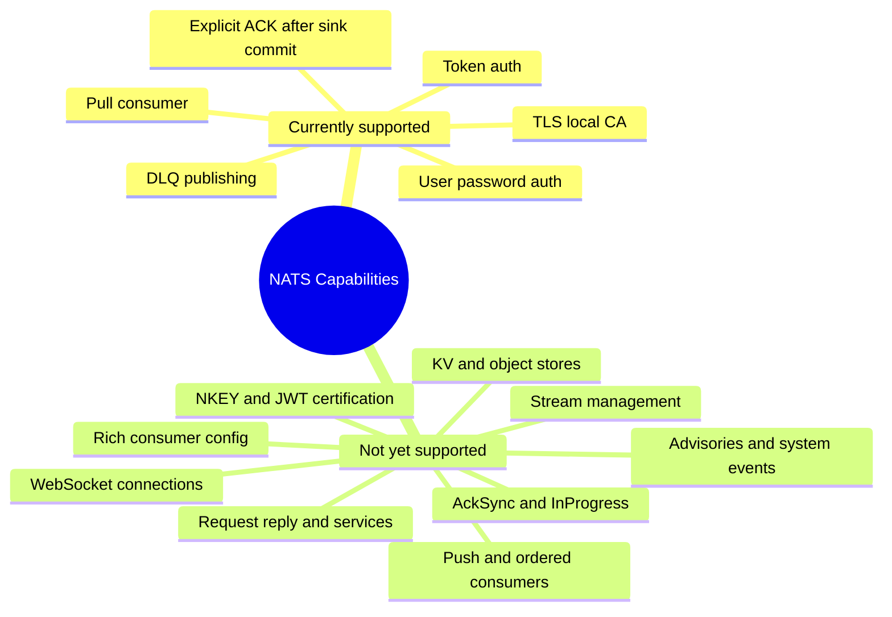

# NATS Feature Gap Analysis

This page compares capabilities documented by NATS with the current scope of
`nats-sinks`. It is not a criticism of the project. `nats-sinks` is deliberately
focused on one job: at-least-once delivery from JetStream to external
destinations with commit-then-acknowledge processing and idempotent sink
support.

NATS is a broad platform. Many NATS features are server-side topology,
administration, publishing, request/reply, or storage features that are adjacent
to, but not required for, the current JetStream sink runner.

For new readers, this page is a roadmap aid. It helps explain why a feature may
exist in NATS but not yet appear in `nats-sinks`. The table entries distinguish
between features that are intentionally out of scope, features that should be
managed by NATS operators, and features that are good candidates for future
certified support in the sink framework.

## Current Scope

`nats-sinks` currently supports:

- pull-based JetStream consumption,
- one stream, one consumer, and one configured subject filter per runner,
- durable or ephemeral pull subscription selection,
- bounded batch fetches,
- normalized `NatsEnvelope` objects,
- commit-then-acknowledge processing,
- NAK or leave-unacked temporary failure handling,
- DLQ publication for permanent failures,
- Oracle as the first production database sink,
- local files as the first production filesystem sink,
- NATS token and username/password authentication,
- TLS server verification with a local CA file,
- multiple NATS seed URLs,
- reconnect tuning and NATS connection event metrics,
- pass-through fields for NATS credentials and NKEY seed files, not yet
  certified as production auth modes.

## High-Level Gap Map

## Connection And Authentication Gaps

NATS supports multiple connection URLs for clustered deployments, WebSocket
connections, reconnection tuning, connection event callbacks, NKEY challenge
authentication, decentralized JWT authentication/authorization, TLS certificate
identity, subject-level authorization, accounts, exports, and imports.

Current gap details:

| NATS capability | NATS support | Current `nats-sinks` status | Suggested priority |
| --- | --- | --- | --- |
| Multiple seed URLs for clusters | NATS clients can connect with multiple seed URLs. | Supported through `nats.urls`, which is passed to `nats-py` as `servers`. | Implemented |
| Reconnect tuning | NATS clients expose reconnect wait, max reconnects, buffers, ping behavior, and event callbacks. | Supported through JSON fields for reconnect enablement, connect timeout, reconnect wait, maximum reconnect attempts, ping settings, pending bytes, and drain timeout. | Implemented |
| Connection event metrics | NATS clients can report disconnect, reconnect, closed, discovered server, and async error events. | Runner wraps `nats-py` callbacks and records connection event metrics while preserving user-supplied callbacks. | Implemented |
| WebSocket connections | NATS URLs can use `ws://` for WebSocket connections. | Not documented, tested, or exposed with WebSocket-specific options. | Phase 3 |
| TLS certificate identity auth | NATS can use client certificate/key material and server-side TLS verification. | Client cert/key can be loaded into the SSL context, but production certificate-auth guidance and tests are not certified. | Phase 2 |
| NKEY challenge auth | NATS supports challenge-response auth using Ed25519 NKEYs. | `nkey_seed_file` exists as pass-through config, but this is not documented or tested as certified support. | Phase 2 |
| Decentralized JWT auth | NATS supports operator/account/user JWT auth with credentials files and resolvers. | `creds_file` exists as pass-through config, but JWT workflows are not certified or documented deeply. | Phase 2 |
| Accounts, exports, imports, permissions | NATS supports account isolation and subject-level permissions. | Least-privilege runtime, DLQ, management, and advisory permission templates are documented. Account export/import designs remain server-side operator policy. | Implemented for runtime templates; deeper account design remains Phase 2 |
| Auth callouts | NATS supports auth callout extensions. | Server-side feature; not supported or documented for sink deployments. | Phase 3 |

## JetStream Consumer Gaps

NATS JetStream consumers support durable and ephemeral consumers, pull and push
delivery, ordered consumers, multiple deliver policies, ACK policies, ACK wait,
maximum delivery attempts, backoff, maximum ACK pending, replay policy,
server-side filtering, headers-only delivery, metadata, replicas, and memory
storage for consumer state.

Current gap details:

| NATS capability | NATS support | Current `nats-sinks` status | Suggested priority |
| --- | --- | --- | --- |
| Explicit consumer creation/update | Consumers have a rich server-side configuration model. | Runner uses `pull_subscribe`; it does not create or reconcile consumer config. | Phase 2 |
| AckWait | Controls when unacked messages redeliver. | Not configurable in JSON; users must manage consumer externally. | Phase 2 |
| MaxDeliver | Controls maximum redelivery attempts before advisories. | `delivery.max_retries` bounds active delayed NAK attempts, but it is not reconciled with server `MaxDeliver`. | Phase 2 |
| BackOff | Server-side redelivery backoff sequence. | Local delayed NAK backoff supports fixed, linear, exponential, cap, and jitter controls; server-side backoff config is not managed. | Phase 2 |
| MaxAckPending | Server-side flow control for outstanding unacked messages. | `batch_size` bounds fetches, but consumer `MaxAckPending` is not configured. | Phase 2 |
| DeliverPolicy | Start at all, new, last, sequence, time, or last-per-subject. | Not exposed; external consumer setup required. | Phase 2 |
| Multiple FilterSubjects | Consumers can filter on multiple subjects. | Single `nats.subject` only. Oracle table routing happens after delivery. | Phase 2 |
| HeadersOnly delivery | Consumers can deliver only headers and expose the omitted body size through a NATS header. | Evaluated in [Headers-Only Delivery Evaluation](headers-only-delivery.md). Current code safely handles empty payloads, but explicit headers-only support is split into consumer configuration, payload-presence metadata, and sink or DLQ certification backlog items. | Phase 2 |
| Consumer metadata | Consumers support user metadata. | Not exposed. | Phase 3 |
| Push consumers | NATS supports push delivery to a subject, optional queue-style deliver groups, `MaxAckPending`, FlowControl, and IdleHeartbeat. | Evaluated in [Push Consumer Evaluation](push-consumer-evaluation.md). Not enabled in runtime; follow-up work is split into capability/config guardrails, an opt-in bounded push runner mode, and push delivery-contract certification tests. Pull remains the default. | Phase 3 |
| Ordered consumers | NATS supports ordered consumers for inspection and analysis workflows. | Evaluated in [Ordered Consumer Evaluation](ordered-consumer-evaluation.md). Not enabled in runtime; follow-up work is split into client compatibility checks, a read-only inspection CLI, and durable replay-to-sinks guidance that keeps production writes on durable pull consumers. | Phase 3 |
| Queue-style push subscriptions | Push delivery can use queue groups. | Not supported. Pull consumers are preferred for sink work. | Phase 3 |
| Consumer replicas and memory storage | Consumer state can have replica and memory options. | Not exposed. | Phase 3 |

## JetStream ACK And Redelivery Gaps

NATS supports several acknowledgement variants: normal ACK, double ACK
(`AckSync` in client APIs), NAK, in-progress, term, and next-message ACK
behavior for pull consumers.

Current gap details:

| NATS capability | NATS support | Current `nats-sinks` status | Suggested priority |
| --- | --- | --- | --- |
| Double ACK / AckSync | Client can wait for the server to confirm receipt of the ACK. | Evaluated in [Acknowledgement Confirmation Evaluation](acknowledgement-confirmation.md). Runner still uses ordinary ACK by default; implementation work is split into optional confirmed ACK, DLQ confirmation, and metrics or runbook backlog items. | Phase 2 |
| In-progress ACK | Extends `AckWait` while long processing continues. | Evaluated in [InProgress Evaluation](in-progress-evaluation.md). Runner does not send progress signals today; implementation work is split into AckWait guardrails, optional runtime heartbeat, and metrics or runbook backlog items. | Phase 2 |
| Term ACK | Stops redelivery without marking successful processing. | Supported as explicit `dead_letter.ack_term_after_publish` policy only after DLQ publication succeeds. Disabled by default. | Implemented |
| AckAll | ACK one message and implicitly ACK earlier messages. | Intentionally unsupported because commit-then-ack requires explicit per-message safety. | Not planned |
| AckNone | Server treats delivery as success without client ACK. | Intentionally unsupported because it violates commit-then-ack. | Not planned |
| AckNext | ACK and request more messages in one protocol operation. | Not planned unless scope changes. The runner fetches batches explicitly so ACK, backpressure, timeout, and retry behavior stay separately testable. | Not planned |

## JetStream Stream Management Gaps

NATS streams support retention policies, discard policies, storage type,
replicas, maximum message limits, maximum age, duplicate windows, subject
transforms, republish, mirrors, sources, rollups, compression, metadata,
placement, direct get, and newer options such as per-message TTL or atomic
publish.

Current gap details:

| NATS capability | NATS support | Current `nats-sinks` status | Suggested priority |
| --- | --- | --- | --- |
| Stream creation and reconciliation | Streams have rich configuration. | Not managed by `nats-sinks`; users create streams externally. | Phase 2 |
| Retention and discard policies | Limits, interest, and work-queue retention are server-side stream options. | Not managed or validated. | Phase 2 |
| Duplicate window | Streams can deduplicate publisher writes by `Nats-Msg-Id`. | Consumed `Nats-Msg-Id` can be used for sink idempotency, but publisher dedupe windows are not managed. | Phase 2 |
| Mirrors and sources | Streams can replicate from other streams. | Not managed by the runner; topology considerations and idempotency impacts are documented. | Guidance implemented; management remains Phase 3 |
| Subject transforms | NATS can transform subjects at stream ingress, source, mirror, or republish boundaries. | Not managed by the runner; documentation explains that sink routing sees the delivered subject. | Guidance implemented; management remains Phase 3 |
| RePublish | Streams can republish stored messages to another subject. | Not managed. Documentation separates server-side RePublish from sink DLQ publishing. | Guidance implemented; management remains Phase 3 |
| Stream compression | File streams can use compression. | Not managed. Documentation explains that server-side stream compression is transparent to the runner. | Guidance implemented; management remains Phase 3 |
| Stream metadata and placement | Streams can carry metadata and placement preferences. | Not managed. Documentation explains operational, latency, and per-message metadata boundaries. | Guidance implemented; management remains Phase 3 |
| Per-message TTL, schedules, counters, atomic publish | Newer stream capabilities exist in recent NATS versions. | Out of scope for the sink runner. | Phase 3 |

## Core NATS Feature Gaps

`nats-sinks` is not intended to be a general-purpose Core NATS framework. NATS
supports capabilities that are important but outside the sink-runner contract.

| NATS capability | NATS support | Current `nats-sinks` status | Suggested priority |
| --- | --- | --- | --- |
| Core NATS pub/sub runtime | Core NATS supports at-most-once pub/sub. | Only a manual live probe script uses core subscribe/publish. The sink runner is JetStream-focused. | Not planned |
| Queue groups | Core NATS can load-balance subscribers with queue groups. | Not supported in runtime. Pull consumers are the sink scaling mechanism. | Not planned |
| Request/reply | NATS supports request/reply and no-responder behavior. | Out of scope for sink writes. | Not planned |
| NATS services framework | NATS supports service-style request/reply abstractions. | Out of scope. | Not planned |
| No-echo subscriptions | Clients can disable echo of their own messages. | Not exposed in JSON. | Phase 3 |

## JetStream Data Abstraction Gaps

JetStream also enables data abstractions beyond streams and consumers.

| NATS capability | NATS support | Current `nats-sinks` status | Suggested priority |
| --- | --- | --- | --- |
| Key/Value store | JetStream supports buckets with put/get/delete/watch/history and atomic update operations. | Not supported. | Not planned unless a sink needs it |
| Object store | JetStream supports object buckets and chunked object transfer. | Not supported. | Not planned unless a sink needs it |

## Observability And Operations Gaps

NATS exposes server monitoring endpoints, system events, and JetStream
advisories. These can help operators understand redeliveries, maximum-delivery
events, API activity, stream changes, and consumer changes.

| NATS capability | NATS support | Current `nats-sinks` status | Suggested priority |
| --- | --- | --- | --- |
| JetStream advisories | `$JS.EVENT.ADVISORY.>` publishes operational events such as stream and consumer actions. | Not consumed or surfaced by `nats-sinks`. | Phase 2 |
| MaxDeliver advisory handling | NATS emits advisories when messages hit maximum delivery attempts. | Not integrated; DLQ is driven by sink exceptions, not server advisories. | Phase 2 |
| Server monitoring endpoints | NATS exposes monitoring such as `/jsz` and `/healthz`. | Implemented as a separate disabled-by-default `nats-sink-observe` connector with explicit endpoint and field allow lists. The delivery worker still does not poll server monitoring endpoints. | Implemented for selected fields |
| Reconnect/disconnect metrics | Client libraries expose connection event callbacks. | Runner records disconnect, reconnect, close, discovered-server, and async-error callback metrics. | Implemented |
| Prometheus/OpenTelemetry export | NATS and application metrics can be exported externally. | Basic counters, gauges, timing observations, a local JSON snapshot, `nats-sink-metrics`, policy-controlled Prometheus textfile export, and an optional native Prometheus HTTP endpoint exist. OpenTelemetry is not shipped yet. | Phase 2 for OpenTelemetry |

## Design Notes

Some gaps should remain intentional:

- `AckNone` and early ACK behavior conflict with commit-then-acknowledge.
- Core NATS queue groups and request/reply are not destination sink semantics.
- Stream and server topology management may belong in infrastructure-as-code
  rather than inside the sink process. The current documentation gives
  deployment-design guidance without making the sink worker a stream
  management tool.
- Ordered consumers are useful for inspection and replay, but they do not match
  the durable destination-write model.
- Push consumers may be supportable later, but only as an explicit manual-ACK
  runner mode with bounded in-flight work, flow-control handling, and shutdown
  tests.

Other gaps are good candidates for future work:

- certified credentials-file, NKEY, and JWT workflows,
- explicit consumer configuration and reconciliation,
- optional confirmed ACK support, ACK confirmation metrics, optional
  `InProgress` heartbeat support, and InProgress guardrails,
- push-consumer capability/config guardrails, opt-in push runner mode, and
  push delivery-contract certification tests,
- read-only ordered-consumer inspection tooling and durable replay-to-sinks
  guidance,
- multi-subject filters,
- JetStream advisory consumption beyond the documented read-only advisory
  permission template.
- broader NATS server monitoring field recipes, if operators need more
  documented field selections in addition to the current explicit allow-list
  connector.

## Source References

- [NATS Connecting](https://docs.nats.io/using-nats/developer/connecting)
- [NATS Automatic Reconnections](https://docs.nats.io/using-nats/developer/connecting/reconnect)
- [NATS TLS](https://docs.nats.io/using-nats/developer/connecting/tls)
- [NATS Authentication](https://docs.nats.io/running-a-nats-service/configuration/securing_nats/auth_intro)
- [NATS Authorization](https://docs.nats.io/running-a-nats-service/configuration/securing_nats/authorization)
- [NATS NKEY Authentication](https://docs.nats.io/running-a-nats-service/configuration/securing_nats/auth_intro/nkey_auth)
- [NATS Decentralized JWT Authentication/Authorization](https://docs.nats.io/running-a-nats-service/configuration/securing_nats/auth_intro/jwt)
- [JetStream Consumers](https://docs.nats.io/nats-concepts/jetstream/consumers)
- [nats.py message acknowledgement methods](https://nats-io.github.io/nats.py/_modules/nats/aio/msg.html)
- [JetStream Streams](https://docs.nats.io/nats-concepts/jetstream/streams)
- [JetStream Model Deep Dive](https://docs.nats.io/using-nats/developer/develop_jetstream/model_deep_dive)
- [NATS Subject Mapping And Partitioning](https://docs.nats.io/nats-concepts/subject_mapping)
- [JetStream Key/Value Store](https://docs.nats.io/nats-concepts/jetstream/key-value-store)
- [JetStream Object Store](https://docs.nats.io/nats-concepts/jetstream/obj_store)
- [Monitoring JetStream](https://docs.nats.io/running-a-nats-service/nats_admin/monitoring/monitoring_jetstream)
